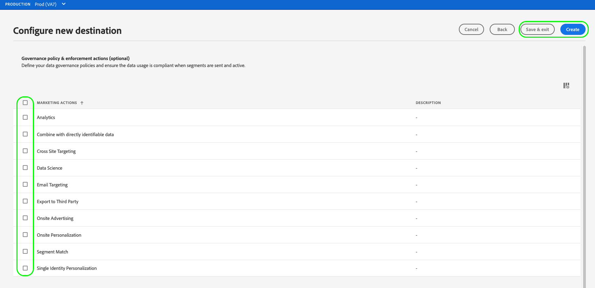

# Skapa en ny målanslutning

>[!IMPORTANT]
> 
>* Om du vill ansluta till ett mål behöver du behörigheterna **[!UICONTROL View Destinations]** och **[!UICONTROL Manage Destinations]** [åtkomstkontroll](/help/access-control/home.md#permissions). Läs [åtkomstkontrollsöversikten](/help/access-control/ui/overview.md) eller kontakta produktadministratören för att få den behörighet som krävs.
>* Om du vill ansluta till ett mål som har stöd för datauppsättningsexport behöver du behörigheterna **[!UICONTROL View Destinations]** och **[!UICONTROL Manage and Activate Dataset Destinations]** [åtkomstkontroll](/help/access-control/home.md#permissions). Läs [åtkomstkontrollsöversikten](/help/access-control/ui/overview.md) eller kontakta produktadministratören för att få den behörighet som krävs.

## Översikt {#overview}

Innan du kan skicka målgruppsdata till ett mål måste du skapa en anslutning till målplattformen. I den här artikeln beskrivs hur du konfigurerar en ny målanslutning, som du sedan kan aktivera målgrupper för eller exportera datauppsättningar med Adobe Experience Platform användargränssnitt.

## Hitta önskat mål i katalogen {#setup}

1. Gå till **[!UICONTROL Connections]** > **[!UICONTROL Destinations]** och välj fliken **[!UICONTROL Catalog]**.

   

2. Målkorten i katalogen kan ha olika åtgärdskontroller, beroende på om du har en befintlig anslutning till målet och om destinationerna stöder aktivering av målgrupper, export av datamängder eller båda. Du kan se någon av följande kontroller för målkort:

   * **[!UICONTROL Set up]**. En anslutning måste först konfigureras till det här målet innan du kan aktivera målgrupper eller exportera datauppsättningar.
   * **[!UICONTROL Activate]**. En anslutning har redan konfigurerats till det här målet. Detta mål stöder målgruppsaktivering och datauppsättningsexport.
   * **[!UICONTROL Activate audiences]**. En anslutning har redan konfigurerats till det här målet. Målet stöder endast målgruppsaktivering.

   Mer information om skillnaden mellan dessa kontroller finns i avsnittet [Katalog](../ui/destinations-workspace.md#catalog) i dokumentationen för målarbetsytan.

   Välj antingen **[!UICONTROL Set up]**, **[!UICONTROL Activate]** eller **[!UICONTROL Activate audiences]**, beroende på vilken kontroll som är tillgänglig för dig.

   

   

3. Om du valde **[!UICONTROL Set up]** går du till nästa steg och [autentiserar](#authenticate) till målet.

   Om du valde **[!UICONTROL Activate]**, **[!UICONTROL Activate audiences]** eller **[!UICONTROL Export datasets]** kan du nu se en lista över befintliga målanslutningar.

   Välj **[!UICONTROL Configure new destination]** om du vill upprätta en ny anslutning till målet.

   

## Autentisera till mål {#authenticate}

>[!CONTEXTUALHELP]
>id="platform_destinations_account_name"
>title="Kontonamn"
>abstract="Ange ett namn som gör det enklare att identifiera det här destinationskontot i framtiden. Detta är särskilt användbart om du har flera anslutningar till samma måltyp."

Det första steget när du ansluter till ett mål är att autentisera till målplattformen.

Beroende på vilket mål du ansluter till kan du komma till målpartnersidan för att autentisera, eller så kan du bli ombedd att ange autentiseringsuppgifter direkt i Experience Platform-arbetsflödet. Nedan visas ett exempel på nödvändiga indata för autentisering till ett [!DNL Amazon S3]-mål. Detaljerade instruktioner om nödvändiga indata finns på varje måldokumentationssida (se t.ex. autentiseringsavsnittet för [[!DNL Amazon S3]](/help/destinations/catalog/cloud-storage/amazon-s3.md#authenticate) och för [[!DNL Facebook]](/help/destinations/catalog/social/facebook.md#authenticate)).

**[!DNL Amazon S3]obligatoriska och valfria autentiseringsparametrar**

## Ställ in anslutningsparametrar {#set-up-connection-parameters}

Om du redan har konfigurerat autentisering för målet kan du fortsätta med det befintliga kontot eller skapa ett nytt konto.

Beroende på vilket mål du ansluter till kan du behöva ange olika typer av anslutningsparametrar. Om du till exempel ansluter till ett [!DNL Amazon S3]-mål ombeds du ange information om [!DNL Amazon S3]-bucket och mappsökvägen där filerna ska placeras. Nedan visas två exempel på obligatoriska indata för ett [!DNL Amazon S3]-mål och ett [!DNL Trade Desk]-mål. Detaljerade instruktioner om vilka indata som krävs finns på varje måldokumentationssida.

>[!IMPORTANT]
>
>Bilderna nedan används endast som illustrationer. Målanslutningsinformationen varierar mellan olika mål. Mer information om anslutningsinformationen för ditt mål finns i avsnittet **Anslut till målet** på varje [målkatalogsida](../catalog/overview.md) (till exempel [[!DNL Google Customer Match]](../catalog/advertising/google-customer-match.md#connect), [[!DNL Trade Desk]](/help/destinations/catalog/advertising/tradedesk.md#connect) eller [[!DNL Amazon S3]](/help/destinations/catalog/cloud-storage/amazon-s3.md#destination-details)).

**[!DNL Amazon S3]obligatoriska och valfria indataparametrar**

**[!DNL The Trade Desk]obligatoriska och valfria indataparametrar**

### Ange formateringsalternativ för exporterade filer {#file-formatting-and-compression-options}

För filbaserade mål kan du konfigurera olika inställningar för hur de exporterade filerna formateras och komprimeras. Mer information om alla tillgängliga formaterings- och komprimeringsalternativ finns i självstudiekursen [Konfigurera filformateringsalternativ för filbaserade mål](/help/destinations/ui/batch-destinations-file-formatting-options.md).

### Ställ in målanslutning för målgruppsaktivering, kontoaktivering, potentiell kundaktivering eller datauppsättningsexport {#segment-activation-or-dataset-exports}

Vissa filbaserade mål stöder målgruppsaktivering för kända kunder, kontokunder eller potentiella kunder samt export av datauppsättningar. För dessa mål kan du välja om du vill skapa en anslutning som gör att du kan [aktivera målgrupper](/help/destinations/ui/activate-batch-profile-destinations.md), [konton](/help/destinations/ui/activate-account-audiences.md), [prospects](/help/destinations/ui/activate-prospect-audiences.md) eller [exportera datauppsättningar](/help/destinations/ui/export-datasets.md).

>[!WARNING]
>
>När du exporterar datauppsättningar bör du tänka på att export till JSON-filer endast stöds i komprimerat läge. Exportera till [!DNL Parquet] filer stöds i komprimerat och okomprimerat läge.

### Aktivera destinationsaviseringar {#enable-alerts}

1. (Valfritt) Välj de aviseringar om måldataflöde som du vill prenumerera på. Du kan prenumerera på varningar när du skapar ett dataflöde för att få varningsmeddelanden om status, om det lyckades eller om det inte gick att köra ditt flöde. De tillgängliga varningarna skiljer sig åt beroende på måltypen (filbaserad eller direktuppspelad) som du ansluter till. Läs [Prenumerera på destinationsaviseringar i sitt sammanhang](alerts.md) om du vill ha mer information om måldataflödesaviseringar.

   

2. Välj **[!UICONTROL Next]**.

   

## Välj marknadsföringsåtgärder {#select-marketing-actions}

1. Välj de marknadsföringsåtgärder som gäller för de data som du vill exportera till målet. Marknadsföringsåtgärder anger för vilken metod data ska exporteras till målet. Du kan välja bland Adobe-definierade marknadsföringsåtgärder eller skapa en egen marknadsföringsåtgärd. Mer information om marknadsföringsåtgärder finns i översikten [över dataanvändningsprinciper](../../data-governance/policies/overview.md).

   

2. Välj **[!UICONTROL Save & Exit]** om du vill spara målkonfigurationen eller välj **[!UICONTROL Next]** om du vill fortsätta till målgruppsdataflödet [aktivering](activation-overview.md).

## Nästa steg {#next-steps}

Genom att läsa det här dokumentet har du lärt dig hur du använder användargränssnittet i Experience Platform för att upprätta en anslutning till ett mål. Som en påminnelse varierar de tillgängliga och obligatoriska anslutningsparametrarna från mål till mål. Du bör även läsa måldokumentationssidan i [målkatalogen](/help/destinations/catalog/overview.md) för specifik information om nödvändiga indata och tillgängliga alternativ per måltyp.

Därefter kan du fortsätta med att [aktivera målgrupper](/help/destinations/ui/activation-overview.md) eller [exportera datauppsättningar](/help/destinations/ui/export-datasets.md) till ditt mål.