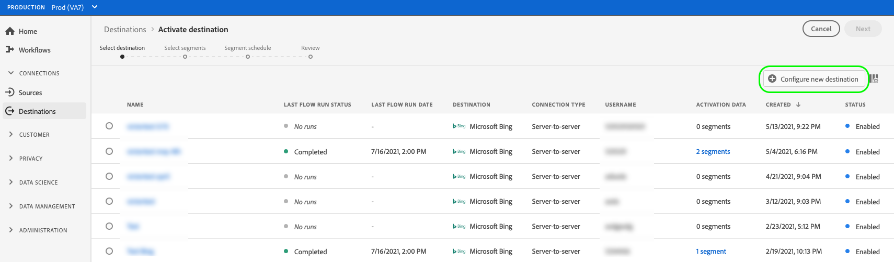

# Skapa en ny målanslutning

>[!IMPORTANT]
> 
>* Om du vill ansluta till ett mål behöver du **[!UICONTROL Manage Destinations]** [behörighet för åtkomstkontroll](/help/access-control/home.md#permissions). Läs [åtkomstkontroll - översikt](/help/access-control/ui/overview.md) eller kontakta produktadministratören för att få de behörigheter som krävs.
>* Om du vill ansluta till ett mål som stöder datauppsättningsexport måste du ha **[!UICONTROL Manage and Activate Dataset Destinations]** [behörighet för åtkomstkontroll](/help/access-control/home.md#permissions). Läs [åtkomstkontroll - översikt](/help/access-control/ui/overview.md) eller kontakta produktadministratören för att få de behörigheter som krävs.

## Översikt {#overview}

Innan du kan skicka målgruppsdata till ett mål måste du skapa en anslutning till målplattformen. I den här artikeln beskrivs hur du konfigurerar en ny målanslutning, som du sedan kan aktivera målgrupper för eller exportera datauppsättningar med Adobe Experience Platform användargränssnitt.

## Hitta önskat mål i katalogen {#setup}

1. Gå till **[!UICONTROL Connections]** > **[!UICONTROL Destinations]** och väljer **[!UICONTROL Catalog]** -fliken.

   

2. Målkorten i katalogen kan ha olika åtgärdskontroller, beroende på om du har en befintlig anslutning till målet och om destinationerna stöder aktivering av målgrupper, export av datamängder eller båda. Du kan se någon av följande kontroller för målkort:

   * **[!UICONTROL Set up]**. En anslutning måste först konfigureras till det här målet innan du kan aktivera målgrupper eller exportera datauppsättningar.
   * **[!UICONTROL Activate]**. En anslutning har redan konfigurerats till det här målet. Detta mål stöder målgruppsaktivering och datauppsättningsexport.
   * **[!UICONTROL Activate audiences]**. En anslutning har redan konfigurerats till det här målet. Målet stöder endast målgruppsaktivering.

   Mer information om skillnaden mellan dessa kontroller finns i [Katalog](../ui/destinations-workspace.md#catalog) i dokumentationen för målarbetsytan.

   Välj antingen **[!UICONTROL Set up]**, **[!UICONTROL Activate]**, eller **[!UICONTROL Activate audiences]**, beroende på vilken kontroll som är tillgänglig.

   

   

3. Om du valde **[!UICONTROL Set up]** går du vidare till nästa steg, till [autentisera](#authenticate) till målet.

   Om du valde **[!UICONTROL Activate]**, **[!UICONTROL Activate audiences]**, eller **[!UICONTROL Export datasets]** kan du nu se en lista över befintliga målanslutningar.

   Välj **[!UICONTROL Configure new destination]** för att upprätta en ny anslutning till målet.

   

## Autentisera till mål {#authenticate}

Det första steget när du ansluter till ett mål är att autentisera till målplattformen.

Beroende på vilket mål du ansluter till kan du komma till målpartnersidan för att autentisera, eller så kan du bli ombedd att ange autentiseringsuppgifter direkt i plattformsarbetsflödet. Nedan visas ett exempel på den inmatning som krävs för att autentisera en [!DNL Amazon S3] mål. Detaljerade instruktioner om vad som krävs finns på varje måldokumentationssida (se t.ex. autentiseringsavsnittet för [[!DNL Amazon S3]](/help/destinations/catalog/cloud-storage/amazon-s3.md#authenticate) och for [[!DNL Facebook]](/help/destinations/catalog/social/facebook.md#authenticate)).

**[!DNL Amazon S3]obligatoriska och valfria autentiseringsparametrar**

## Ställ in anslutningsparametrar {#set-up-connection-parameters}

Om du redan har konfigurerat autentisering för målet kan du fortsätta med det befintliga kontot eller skapa ett nytt konto.

Beroende på vilket mål du ansluter till kan du behöva ange olika typer av anslutningsparametrar. Vid anslutning till en [!DNL Amazon S3] mål uppmanas du att ange information om [!DNL Amazon S3] namn och mappsökväg där filerna ska placeras. Nedan visas två exempel på obligatoriska indata för en [!DNL Amazon S3] mål och en [!DNL Trade Desk] mål. Detaljerade instruktioner om vilka indata som krävs finns på varje måldokumentationssida.

>[!IMPORTANT]
>
>Bilderna nedan används endast som illustrationer. Målanslutningsinformationen varierar mellan olika mål. Mer information om anslutningsinformation för ditt mål finns i **Anslut till målet** i varje [målkatalog](../catalog/overview.md) sida (till exempel [[!DNL Google Customer Match]](../catalog/advertising/google-customer-match.md#connect), [[!DNL Trade Desk]](/help/destinations/catalog/advertising/tradedesk.md#connect), eller [[!DNL Amazon S3]](/help/destinations/catalog/cloud-storage/amazon-s3.md#destination-details)).

**[!DNL Amazon S3]obligatoriska och valfria indataparametrar**

**[!DNL The Trade Desk]obligatoriska och valfria indataparametrar**

### Ange formateringsalternativ för exporterade filer {#file-formatting-and-compression-options}

För filbaserade mål kan du konfigurera olika inställningar för hur de exporterade filerna formateras och komprimeras. Mer information om alla tillgängliga formaterings- och komprimeringsalternativ finns i [Konfigurera filformateringsalternativ för filbaserade mål, genomgång](/help/destinations/ui/batch-destinations-file-formatting-options.md).

### Ställ in målanslutning för målgruppsaktivering, kontoaktivering, potentiell kundaktivering eller datauppsättningsexport {#segment-activation-or-dataset-exports}

Vissa filbaserade mål stöder målgruppsaktivering för kända kunder, kontokunder eller potentiella kunder samt export av datauppsättningar. För dessa mål kan du välja om du vill skapa en anslutning som gör att du kan [aktivera målgrupper](/help/destinations/ui/activate-batch-profile-destinations.md), [konton](/help/destinations/ui/activate-account-audiences.md), [prospects](/help/destinations/ui/activate-prospect-audiences.md), eller [exportera datamängder](/help/destinations/ui/export-datasets.md).

>[!WARNING]
>
>När du exporterar datauppsättningar bör du tänka på att export till JSON-filer endast stöds i komprimerat läge. Exporterar till [!DNL Parquet] filer stöds i komprimerat och okomprimerat läge.

### Aktivera destinationsaviseringar {#enable-alerts}

1. (Valfritt) Välj de aviseringar om måldataflöde som du vill prenumerera på. Du kan prenumerera på varningar när du skapar ett dataflöde för att få varningsmeddelanden om status, om det lyckades eller om det inte gick att köra ditt flöde. De tillgängliga varningarna skiljer sig åt beroende på måltypen (filbaserad eller direktuppspelad) som du ansluter till. Läs [Prenumerera på aviseringar om destinationer i sitt sammanhang](alerts.md) om du vill ha detaljerad information om varningar om måldataflöde.

   

2. Välj **[!UICONTROL Next]**.

   

## Välj marknadsföringsåtgärder {#select-marketing-actions}

1. Välj de marknadsföringsåtgärder som gäller för de data som du vill exportera till målet. Marknadsföringsåtgärder anger för vilken metod data ska exporteras till målet. Du kan välja bland Adobe-definierade marknadsföringsåtgärder eller skapa en egen marknadsföringsåtgärd. Mer information om marknadsföringsåtgärder finns i [dataanvändningsprinciper - översikt](../../data-governance/policies/overview.md) sida.

   

2. Välj **[!UICONTROL Save & Exit]** för att spara målkonfigurationen, eller välj **[!UICONTROL Next]** för att gå vidare till målgruppsdata [aktiveringsflöde](activation-overview.md).

## Nästa steg {#next-steps}

Genom att läsa det här dokumentet har du lärt dig hur du använder användargränssnittet i Experience Platform för att upprätta en anslutning till ett mål. Som en påminnelse varierar de tillgängliga och obligatoriska anslutningsparametrarna från mål till mål. Du bör även läsa sidan med måldokumentationen i [målkatalog](/help/destinations/catalog/overview.md) för specifik information om nödvändiga indata och tillgängliga alternativ per måltyp.

Sedan kan du fortsätta till [aktivera målgrupper](/help/destinations/ui/activation-overview.md) eller [exportera datauppsättningar](/help/destinations/ui/export-datasets.md) till destinationen.