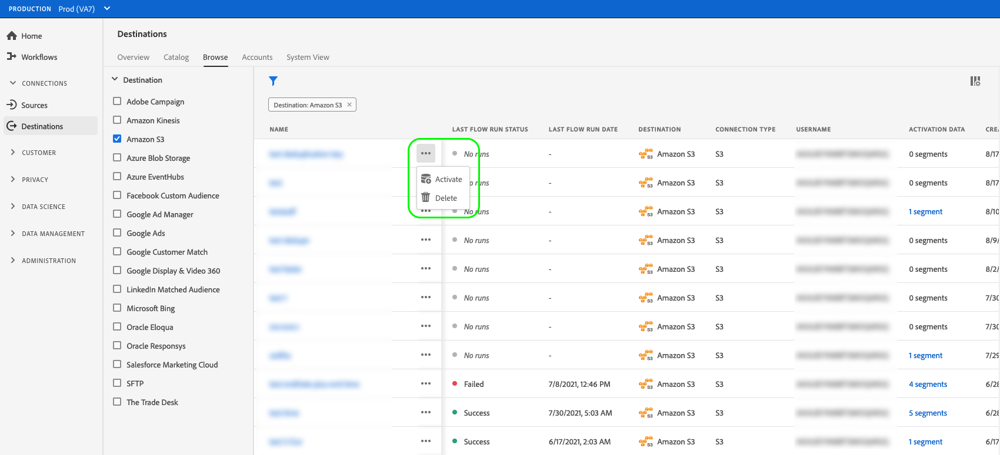

# Ta bort mål {#delete-destinations}

## Översikt {#overview}

I Adobe Experience Platform användargränssnitt kan du ta bort befintliga anslutningar till mål.

Om du tar bort ett mål tas alla befintliga dataflöden till det målet bort. Alla segment som aktiveras för de mål som du tar bort mappas inte innan dataflödet tas bort.

Det finns två sätt att ta bort mål från [!DNL Platform] [!DNL UI]. Ni kan:

* [Ta bort mål från  [!UICONTROL Browse] fliken](#delete-browse-tab)
* [Ta bort mål från sidan med målinformation](#delete-destination-details-page)

## Ta bort mål från fliken Bläddra{#delete-browse-tab}

Följ stegen nedan för att ta bort ett mål från fliken [!UICONTROL Browse].

1. Logga in på användargränssnittet [Experience Platform och välj **[!UICONTROL Destinations]** i det vänstra navigeringsfältet. ](https://platform.adobe.com/) Om du vill visa dina befintliga mål väljer du **[!UICONTROL Browse]** i det övre huvudet.

   

2. Välj filterikonen  uppe till vänster för att öppna sorteringspanelen. På sorteringspanelen finns en lista med alla mål. Du kan markera mer än ett mål i listan om du vill visa ett filtrerat urval av dataflöden som är kopplade till det valda målet.

   

3. Markera knappen  **[!UICONTROL Delete]** i kolumnen **[!UICONTROL Platform]** om du vill ta bort ett befintligt mål.
   

4. Välj **[!UICONTROL Delete]** för att bekräfta borttagningen av målet.

   

## Ta bort mål från målinformationssidan{#delete-destination-details-page}

Följ stegen nedan för att ta bort ett mål från sidan med målinformation.

1. Logga in på användargränssnittet [Experience Platform och välj **[!UICONTROL Destinations]** i det vänstra navigeringsfältet. ](https://platform.adobe.com/) Om du vill visa dina befintliga mål väljer du **[!UICONTROL Browse]** i det övre huvudet.

   

2. Välj filterikonen  uppe till vänster för att öppna sorteringspanelen. På sorteringspanelen finns en lista med alla mål. Du kan markera mer än ett mål i listan om du vill visa ett filtrerat urval av dataflöden som är kopplade till det valda målet.

   

3. Markera namnet på målet som du vill ta bort.

   

   * Om målet har befintliga dataflöden öppnas fliken [!UICONTROL Dataflow runs].

      

   * Om målet inte har några befintliga dataflöden kommer du till en tom sida där du kan börja aktivera målgrupper.

      

4. Välj **[!UICONTROL Delete]** i den högra listen.

   

5. Välj **[!UICONTROL Delete]** i bekräftelsedialogrutan för att ta bort målet.

   

   >[!NOTE]
   >
   >Beroende på serverinläsningen kan det ta några minuter för [!DNL Platform] att ta bort målet.