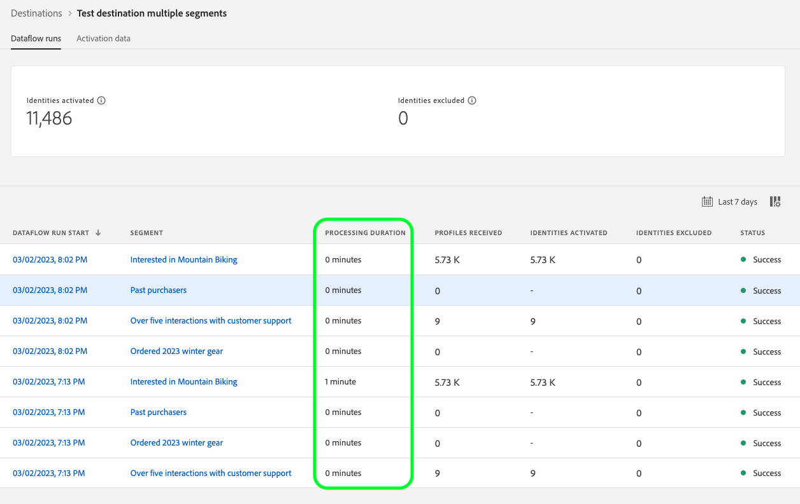
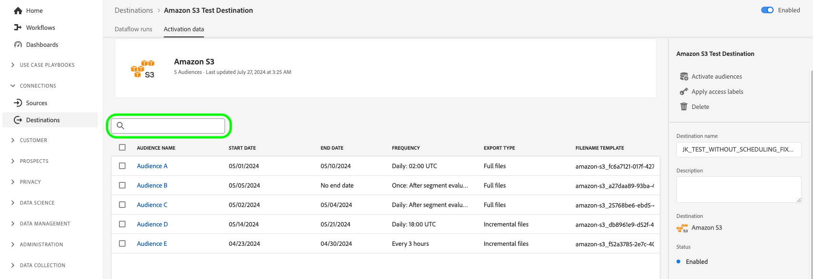

# Visa målinformation

## Översikt {#overview}

I Adobe Experience Platform användargränssnitt kan du visa och övervaka attributen och aktiviteterna för dina mål. Dessa uppgifter omfattar målets namn och ID, kontroller för att aktivera eller inaktivera destinationer och mycket annat. Detaljerna innehåller även mått för aktiverade profilposter, aktiverade identiteter, misslyckade och exkluderade identiteter samt en historik över dataflöden.

>[!NOTE]
>
>Målinformationssidan är en del av arbetsytan [!UICONTROL Destinations] i [!DNL Experience Platform] [!DNL UI]. Mer information finns i [[!UICONTROL Destinations]-arbetsytans översikt](./destinations-workspace.md).

## Visa målinformation {#view-details}

Följ stegen nedan för att visa mer information om ett befintligt mål. Du kan ta reda på mål-ID:t för ett mål, den användare som skapade målet, när det skapades och annan information.

1. Logga in på [Experience Platform-gränssnittet](https://platform.adobe.com/) och välj **[!UICONTROL Destinations]** i det vänstra navigeringsfältet. Välj **[!UICONTROL Browse]** i det övre huvudet för att visa dina befintliga mål.

   

2. Välj filterikonen  längst upp till vänster för att öppna sorteringspanelen. På sorteringspanelen finns en lista med alla mål. Du kan markera mer än ett mål i listan om du vill visa ett filtrerat urval av dataflöden som är kopplade till det valda målet.

   

3. Markera den rad i målet som du vill visa mer information om. Då visas en högerkant med information om målet, inklusive mål-ID, användaren som skapade målanslutningen och annan information.

   

4. Du kan också visa annan information om målet genom att välja *namnet på målet* som du vill visa.

   

5. Målets informationssida visas i den högra listen med de tillgängliga kontrollerna.

   

## Höger räl {#right-rail}

Den högra listen visar grundläggande information om det valda målet.

Följande tabell omfattar de kontroller och den information som tillhandahålls av den högra spåret:

| Höger rälsartikel | Beskrivning |
| --- | --- |
| [!UICONTROL Activate audiences] | Välj den här kontrollen om du vill redigera vilka målgrupper som mappas till målet, uppdatera exportscheman eller lägga till och ta bort mappade attribut och identiteter. Mer information finns i guiderna om [aktivering av målgruppsdata till målgrupper som direktuppspelar målplatser](./activate-segment-streaming-destinations.md), [aktivering av målgruppsdata till gruppprofilbaserade mål](./activate-batch-profile-destinations.md) och [aktivering av målgruppsdata till direktuppspelande profilbaserade mål](./activate-streaming-profile-destinations.md). |
| [!UICONTROL Delete] | Gör att du kan ta bort det här dataflödet och ta bort mappar för de målgrupper som tidigare aktiverats, om det finns några. |
| [!UICONTROL Destination name] | Det här fältet kan redigeras för att uppdatera målets namn. |
| [!UICONTROL Description] | Det här fältet kan redigeras för att uppdatera eller lägga till en valfri beskrivning till målet. |
| [!UICONTROL Destination] | Representerar målplattformen som målgrupperna skickas till. Mer information finns i [målkatalogen](../catalog/overview.md). |
| [!UICONTROL Status] | Anger om målet är aktiverat eller inaktiverat. |
| [!UICONTROL Marketing actions] | Anger de marknadsföringsåtgärder (användningsfall) som gäller för den här destinationen i datastyrningssyfte. |
| [!UICONTROL Category] | Anger måltypen. Mer information finns i [målkatalogen](../catalog/overview.md). |
| [!UICONTROL Connection type] | Anger det formulär som era målgrupper skickas till. Möjliga värden är [!UICONTROL Cookie] och [!UICONTROL Profile-based]. |
| [!UICONTROL Frequency] | Anger hur ofta målgrupperna skickas till målet. Möjliga värden är [!UICONTROL Streaming] och [!UICONTROL Batch]. |
| [!UICONTROL Identity] | Representerar det identitetsnamnutrymme som accepteras av målet, till exempel `GAID`, `IDFA` eller `email`. Mer information om godkända identitetsnamnutrymmen finns i [översikten över identitetsnamnrymden](../../identity-service/features/namespaces.md). |
| [!UICONTROL Created by] | Anger den användare som skapade det här målet. |
| [!UICONTROL Created] | Anger UTC-datum/tid när det här målet skapades. |

{style="table-layout:auto"}

## [!UICONTROL Enabled]/[!UICONTROL Disabled] växla {#enabled-disabled-toggle}

Du kan använda växlingsknappen **[!UICONTROL Enabled]/[!UICONTROL Disabled]** för att starta och pausa all dataexport till målet.

## [!UICONTROL Dataflow runs] {#dataflow-runs}

Fliken [!UICONTROL Dataflow runs] innehåller mätdata om dataflödet som körs till målgrupper och direktuppspelning. Mer information och måttdefinitioner finns i [Övervaka dataflöden](monitor-dataflows.md).

>[!NOTE]
>
>* Funktionen för målövervakning stöds för närvarande för alla mål i Experience Platform *förutom* för [Adobe Target](/help/destinations/catalog/personalization/adobe-target-connection.md), [Anpassad personalisering](/help/destinations/catalog/personalization/custom-personalization.md) och [Experience Cloud-målgrupper](/help/destinations/catalog/adobe/experience-cloud-audiences.md).
>* För [Amazon Kinesis](/help/destinations/catalog/cloud-storage/amazon-kinesis.md), [ Azure Event Hubs](/help/destinations/catalog/cloud-storage/azure-event-hubs.md) och [HTTP API](/help/destinations/catalog/streaming/http-destination.md) uppskattas de mått som är relaterade till identiteter som har uteslutits, misslyckats och aktiverats. Högre volymer av aktiveringsdata leder till större noggrannhet i mätvärdena.

### Varaktighet för dataflöde {#dataflow-runs-duration}

Det finns en skillnad i hur länge dataflödet visas mellan direktuppspelning och filbaserade mål.

### Strömmande mål {#streaming}

Även om **[!UICONTROL Processing duration]** som anges för det flesta direktuppspelade dataflöde körs i cirka fyra timmar, vilket visas i bilden nedan, är den faktiska bearbetningstiden för dataflödeskörningar mycket kortare. Dataflödets körningsfönster är fortfarande öppna längre om Experience Platform behöver göra nya anrop till målet och se även till att det inte missar några senare data för samma tidsfönster.

Mer information finns i avsnittet om [dataflöde som körs på direktuppspelningsmål](/help/dataflows/ui/monitor-destinations.md#dataflow-runs-for-streaming-destinations) i övervakningsdokumentationen.

### Filbaserade mål {#file-based}

För dataflöde som körs till filbaserade mål beror **[!UICONTROL Processing duration]** på storleken på de data som exporteras och systeminläsningen. Observera också att dataflödet går till filbaserade mål uppdelas per målgrupp.

Mer information finns i avsnittet om [dataflöde som körs till batchbaserade (filbaserade) mål ](/help/dataflows/ui/monitor-destinations.md#dataflow-runs-for-batch-destinations) i övervakningsdokumentationen.

## [!UICONTROL Activation data] {#activation-data}

Fliken **[!UICONTROL Activation data]** visar en lista över målgrupper som har mappats till målet, inklusive startdatum och slutdatum (om tillämpligt) samt annan relevant information för dataexporten, till exempel exporttyp, schema och frekvens. Om du vill visa information om en viss målgrupp väljer du namnet i listan.

>[!TIP]
>
>Om du vill visa och redigera information om de attribut och identiteter som är mappade till ett mål väljer du **[!UICONTROL Activate audiences]** i den [högra listen](#right-rail).

>[!BEGINSHADEBOX]

Fliken **[!UICONTROL Activation data]** för ett filbaserat mål.

>[!ENDSHADEBOX]

>[!BEGINSHADEBOX]

Fliken **[!UICONTROL Activation data]** för ett mål för direktuppspelning.

>[!ENDSHADEBOX]

### Filtrera aktiverade målgrupper {#filter-audiences}

Om du vill filtrera igenom listan med målgrupper som har aktiverats för ett mål anger du ett målgruppsnamn i sökrutan. Listan över målgrupper uppdateras automatiskt med sökresultaten.

### Ta bort flera målgrupper från aktiveringsflöden {#bulk-remove}

Om du vill ta bort flera målgrupper från befintliga aktiveringsflöden markerar du målgrupperna och väljer sedan **[!UICONTROL Remove audiences]**.

### Exportera flera filer on demand till batchmål {#bulk-export}

Du kan [exportera flera filer på begäran](../ui/export-file-now.md) från sidan **[!UICONTROL Activation data]**. För att göra detta väljer du de målgrupper som du vill exportera filer för on-demand och väljer kontrollen **[!UICONTROL Export file now]** för att utlösa en engångs export som levererar en fil för varje vald målgrupp till din gruppdestination.

### Redigera aktiveringsscheman för flera målgrupper som exporterats till batchdestinationer {#bulk-edit-schedule}

Om du vill redigera det befintliga aktiveringsschemat för flera målgrupper samtidigt markerar du önskade målgrupper och väljer sedan **[!UICONTROL Edit schedule]**. Mer information om hur du definierar eller redigerar ett exportschema finns i avsnittet [Schemalägg målgruppsexport](../ui/activate-batch-profile-destinations.md#scheduling).

>[!NOTE]
>
>Mer information om hur du utforskar informationssidan för en målgrupp finns i [Översikt över målportalen](../../segmentation/ui/audience-portal.md#segment-details).

### Redigera filnamn för flera målgrupper som exporterats till gruppmål {#bulk-edit-file-names}

Om du vill redigera de exporterade filnamnen för flera målgrupper samtidigt markerar du önskade målgrupper och väljer sedan **[!UICONTROL Edit file name]**. Mer information om hur du definierar eller redigerar ett filnamn finns i avsnittet om hur du [konfigurerar filnamn](../ui/activate-batch-profile-destinations.md#configure-file-names).

