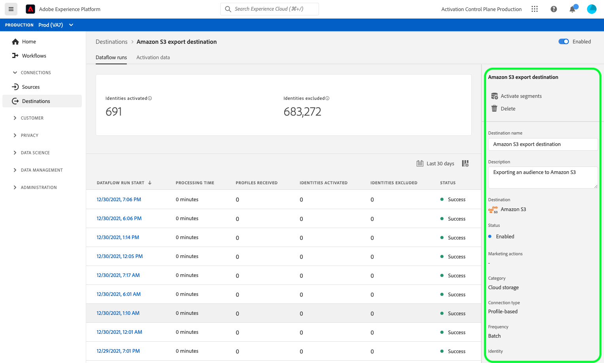

# Visa målinformation

## Översikt {#overview}

I Adobe Experience Platform användargränssnitt kan du visa och övervaka attributen och aktiviteterna för dina mål. Dessa uppgifter omfattar målets namn och ID, kontroller för att aktivera eller inaktivera destinationer och mycket annat. Detaljer för batchdestinationer omfattar även mått för aktiverade profilposter och en historik över dataflöden.

>[!NOTE]
>
>Målinformationssidan är en del av arbetsytan [!UICONTROL Destinations] i [!DNL Platform] [!DNL UI]. Mer information finns i översikten [[!UICONTROL Destinations] för arbetsytan](./destinations-workspace.md).

## Visa målinformation {#view-details}

Följ stegen nedan för att visa mer information om ett befintligt mål.

1. Logga in på användargränssnittet [Experience Platform och välj **[!UICONTROL Destinations]** i det vänstra navigeringsfältet. ](https://platform.adobe.com/) Välj **[!UICONTROL Browse]** i den övre rubriken för att visa dina befintliga mål.

   

1. Välj filterikonen  uppe till vänster för att öppna sorteringspanelen. På sorteringspanelen finns en lista med alla mål. Du kan markera mer än ett mål i listan om du vill visa ett filtrerat urval av dataflöden som är kopplade till det valda målet.

   

1. Markera namnet på målet som du vill visa.

   

1. Målets informationssida visas med de tillgängliga kontrollerna. Om du visar information om ett batchmål visas även en kontrollpanel.

   

## Höger räl

Den högra listen visar grundläggande information om det valda målet.

Följande tabell omfattar de kontroller och den information som tillhandahålls av den högra spåret:

| Höger rälsartikel | Beskrivning |
| --- | --- |
| [!UICONTROL Activate] | Välj den här kontrollen om du vill redigera vilka segment som mappas till målet. Mer information finns i guiden [aktivera segment till ett mål](./activate-destinations.md). |
| [!UICONTROL Delete] | Gör att du kan ta bort det här dataflödet och ta bort mappningar för segment som tidigare har aktiverats, om det finns några. |
| [!UICONTROL Destination name] | Det här fältet kan redigeras för att uppdatera målets namn. |
| [!UICONTROL Description] | Det här fältet kan redigeras för att uppdatera eller lägga till en valfri beskrivning till målet. |
| [!UICONTROL Destination] | Representerar målplattformen som målgrupperna skickas till. Mer information finns i [målkatalogen](../catalog/overview.md). |
| [!UICONTROL Status] | Anger om målet är aktiverat eller inaktiverat. |
| [!UICONTROL Marketing actions] | Anger de marknadsföringsåtgärder (användningsfall) som gäller för den här destinationen i datastyrningssyfte. |
| [!UICONTROL Category] | Anger måltypen. Mer information finns i [målkatalogen](../catalog/overview.md). |
| [!UICONTROL Connection type] | Anger det formulär som era målgrupper skickas till. Möjliga värden är [!UICONTROL Cookie] och [!UICONTROL Profile-based]. |
| [!UICONTROL Frequency] | Anger hur ofta målgrupperna skickas till målet. Möjliga värden är [!UICONTROL Streaming] och [!UICONTROL Batch]. |
| [!UICONTROL Identity] | Representerar det identitetsnamnutrymme som accepteras av målet, till exempel `GAID`, `IDFA` eller `email`. Mer information om godkända ID-namnutrymmen finns i [översikten över identitetsnamnrymden](../../identity-service/namespaces.md). |
| [!UICONTROL Created by] | Anger den användare som skapade det här målet. |
| [!UICONTROL Created] | Anger UTC-datum/tid när det här målet skapades. |

{style=&quot;table-layout:auto&quot;}

## [!UICONTROL Enabled]/[!UICONTROL Disabled] toggle

Du kan använda alternativet **[!UICONTROL Enabled]/[!UICONTROL Disabled]** för att starta och pausa all dataexport till målet.

## [!UICONTROL Dataflow runs]

Fliken [!UICONTROL Dataflow runs] innehåller mätdata för dataflödet som körs till batchdestinationer. Mer information finns i [Övervaka dataflöden](monitor-dataflows.md).

## [!UICONTROL Activation data] {#activation-data}

På fliken [!UICONTROL Activation data] visas en lista med segment som har mappats till målet, inklusive startdatum och slutdatum (om tillämpligt). Om du vill visa information om ett visst segment väljer du dess namn i listan.

>[!NOTE]
>
>Mer information om hur du utforskar informationssidan för ett segment finns i [Översikt över segmenteringsgränssnittet](../../segmentation/ui/overview.md#segment-details).
