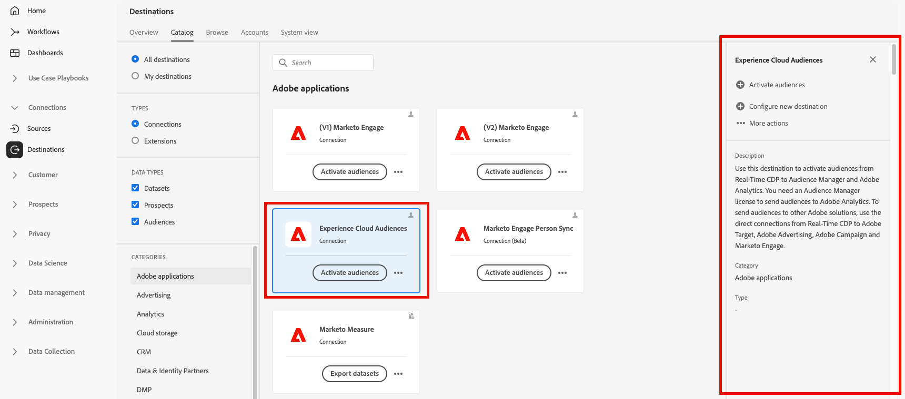

# Översikt över arbetsytan Destinationer {#destinations-workspace}

I Adobe Experience Platform väljer du **[!UICONTROL Destinations]** i det vänstra navigeringsfältet för att komma åt arbetsytan [!UICONTROL Destinations].

Arbetsytan [!UICONTROL Destinations] består av fyra avsnitt, [!UICONTROL Catalog], [!UICONTROL Browse], [!UICONTROL Accounts] och [!UICONTROL System View], som beskrivs i avsnitten nedan.

## [!UICONTROL Catalog] {#catalog}

På fliken **[!UICONTROL Catalog]** visas en lista med alla mål som är tillgängliga i Platform som du kan skicka data till.

I användargränssnittet för plattformen finns ett antal sök- och filteralternativ på målkatalogsidan:

* Använd sökfunktionen på sidan för att hitta ett specifikt mål.
* Filtrera mål med kontrollen [!UICONTROL Categories].
* Växla mellan [!UICONTROL All destinations] och [!UICONTROL My destinations]. När **[!UICONTROL All destinations]** är markerat visas alla tillgängliga plattformsmål. När **[!UICONTROL My destinations]** är markerat kan du bara se de mål som du har upprättat en anslutning till.
* Välj om du vill visa **[!UICONTROL Connections]** och/eller **[!UICONTROL Extensions]**. Mer information om skillnaden mellan de två kategorierna finns i [Måltyper och kategorier](../destination-types.md).

Målkorten innehåller antingen en **[!UICONTROL Configure]**- eller en **[!UICONTROL Activate]**-kontroll och en sekundär kontroll som visar fler alternativ. Dessa beskrivs nedan:

| Kontroll | Beskrivning |
---------|----------
| [!UICONTROL Configure] | Gör att du kan skapa en anslutning till målet. |
| [!UICONTROL Activate] | När du har upprättat en anslutning till målet kan du aktivera segment. |
| [!UICONTROL View account] | Visa konton som du har anslutit för ett mål. |
| [!UICONTROL View dataflows] | Visa dataaktiveringsflödena som finns för ett mål. |
| [!UICONTROL View documentation] | Öppnar en länk till dokumentationssidan för det specifika målet, för mer information och för att hjälpa dig att konfigurera det. |

Välj ett målkort i katalogen för att öppna den högra listen.  Här visas en beskrivning av målet. Högerspåret har samma kontroller som beskrivs i tabellen ovan, samt en beskrivning av destinationen och en indikation på destinationskategori och typ.

Mer information om målkategorier och information om varje mål finns i [målkatalogen](../catalog/overview.md) och [måltyper och målkategorier](../destination-types.md).

## [!UICONTROL Accounts] {#accounts}

På fliken **[!UICONTROL Accounts]** kan du lära dig mer om anslutningar som du har upprättat med olika mål. Se tabellen nedan för all information du kan få på varje mål:

>[!TIP]
>
>Använd knappen  i kolumnen **[!UICONTROL Platform]** för att skapa en ny målanslutning för det kontot.

| Element | Beskrivning |
---------|----------
| [!UICONTROL Platform] | Det mål som du har konfigurerat anslutningen för. |
| [!UICONTROL Connection Type] | Representerar anslutningstypen för din lagringsbucket eller destination. <ul><li>För e-postmarknadsföringsmål: Kan vara S3 eller FTP.</li><li>För reklamdestinationer i realtid: Server-till-server</li><li>För molnlagringsmål för Amazon S3: Åtkomstnyckel </li><li>För SFTP-molnlagringsmål: Grundläggande autentisering för SFTP</li></ul> |
| [!UICONTROL Username] | Användarnamnet som du valde i [guiden för anslutningsmål](../catalog/email-marketing/overview.md#connect-destination). |
| [!UICONTROL Destinations] | Representerar antalet unika lyckade målflöden som är kopplade till grundläggande information som skapats för ett mål. |
| [!UICONTROL Authorized] | Det datum då anslutningen till det här målet auktoriserades. |

Dessutom kan du redigera eller uppdatera din kontoinformation. Välj knappen  i kolumnen **[!UICONTROL Platform]** om du vill redigera kontoinformationen.

För konton som använder en `OAuth2`-anslutningstyp kan du välja **[!UICONTROL Reconnect OAuth]** för att förnya dina kontoinloggningsuppgifter.

För konton som använder en `Access Key`- eller `ConnectionString`-anslutningstyp kan du redigera din kontoautentiseringsinformation, inklusive information som åtkomst-ID, hemliga nycklar eller anslutningssträngar.

När du är klar med redigeringen av din kontoinformation väljer du **[!UICONTROL Save]** för att slutföra uppdateringen.

## [!UICONTROL Browse] {#browse}

På fliken **[!UICONTROL Browse]** visas de mål som du har upprättat en anslutning till. Destinationer med växeln **[!UICONTROL Enabled]** aktiverad anger målet som aktivt och vice versa. Du kan också visa de mål där data flödar genom att välja **[!UICONTROL Segments]** > **[!UICONTROL Browse]** och välja ett segment som ska inspekteras. Se tabellen nedan för all information som finns för varje mål på fliken Bläddra:

>[!TIP]
>
>Använd knappen  i kolumnen **[!UICONTROL Name]** för att aktivera ytterligare segment för det målet.

| Element | Beskrivning |
---------|----------
| Namn | Namnet som du angav för aktiveringsflödet till den här destinationen. |
| [!UICONTROL Destination] | Målplattformen som du valde för aktiveringsflödet. |
| [!UICONTROL Connection Type] | Representerar anslutningstypen för din lagringsbucket eller destination. <ul><li>För e-postmarknadsföringsmål: Kan vara S3 eller FTP.</li><li>För reklamdestinationer i realtid: Server-till-server</li></ul> |
| [!UICONTROL Username] | De kontoautentiseringsuppgifter som du har valt för målflödet. |
| [!UICONTROL Activation Data] | Anger antalet segment som aktiveras till det här målet. Välj den här kontrollen om du vill veta mer om de aktiverade segmenten. Se [Aktiveringsdata](/help/destinations/ui/destination-details-page.md#activation-data) på sidan med målinformation för mer information om de aktiverade segmenten. |
| [!UICONTROL Created] | Datum och UTC-tid när aktiveringsflödet till målet skapades. |
| [!UICONTROL Status] | `Active` eller `Inactive`. Anger om data för närvarande aktiveras till det här målet. Mer information om hur du redigerar status finns i [Inaktivera aktivering](./activate-destinations.md#disable-activation). |

Klicka på en målrad för att visa mer information om målet i den högra listen.

Markera målnamnet om du vill visa information om de segment som har aktiverats för det här målet. Klicka på **[!UICONTROL Edit activation]** om du vill ändra eller lägga till i de segment som skickas till det här målet.

## [!UICONTROL System View] {#system-view}

På fliken **[!UICONTROL System View]** visas en grafisk representation av de aktiveringsflöden som du har konfigurerat i Adobe Experience Platform.

Välj något av de mål som visas på sidan och tryck på **[!UICONTROL View flows]** för att se information om alla anslutningar som du har konfigurerat för varje mål.

