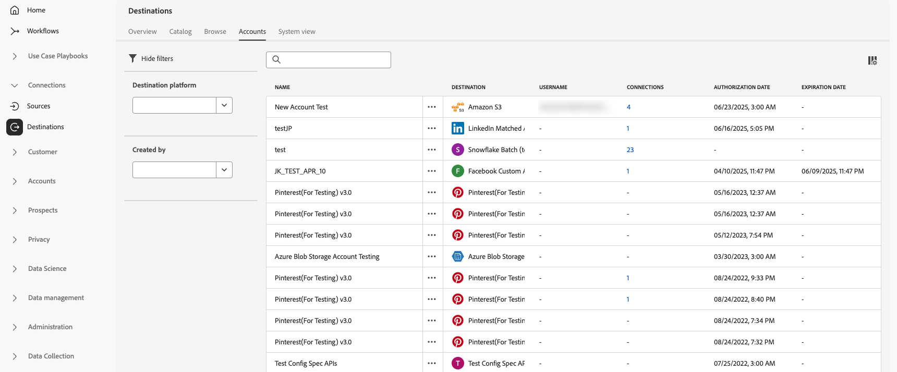

# Arbetsytan Destinationer {#destinations-workspace}

I Adobe Experience Platform väljer du **[!UICONTROL Destinations]** i det vänstra navigeringsfältet för att komma åt arbetsytan i [!UICONTROL Destinations].

Arbetsytan [!UICONTROL Destinations] består av fem avsnitt, [!UICONTROL Overview], [!UICONTROL Catalog], [!UICONTROL Browse], [!UICONTROL Accounts] och [!UICONTROL System View], som beskrivs i avsnitten nedan.

## [!UICONTROL Overview] {#overview}

Fliken **[!UICONTROL Overview]** visar kontrollpanelen [!UICONTROL Destinations] med nyckelmått för organisationens måldata. Mer information finns i [[!UICONTROL Destinations]-handboken för instrumentpanelen ](../../dashboards/guides/destinations.md).

>[!NOTE]
>
>Om din organisation är ny för Experience Platform och ännu inte har aktiva mål visas inte kontrollpanelen [!UICONTROL Destinations] och fliken [!UICONTROL Overview]. Om du i stället väljer [!UICONTROL Destinations] i den vänstra navigeringen visas fliken [[!UICONTROL Catalog] ](#catalog).

## [!UICONTROL Catalog] {#catalog}

Fliken **[!UICONTROL Catalog]** visar en lista över alla mål som är tillgängliga i [!DNL Experience Platform] och som du kan skicka data till.

Användargränssnittet [!DNL Experience Platform] innehåller flera sök- och filteralternativ på målkatalogsidan:

* Använd sökfunktionen på sidan för att hitta ett specifikt mål.
* Filtrera mål med kontrollen **[!UICONTROL Categories]**.
* Växla mellan **[!UICONTROL All destinations]** och **[!UICONTROL My destinations]**. När du väljer **[!UICONTROL All destinations]** visas alla tillgängliga [!DNL Experience Platform]-mål. När du väljer **[!UICONTROL My destinations]** kan du bara se de mål som du har upprättat en anslutning med.
* Välj detta om du vill visa typerna **[!UICONTROL Connections]** och/eller **[!UICONTROL Extensions]**. Läs [Måltyper och kategorier](../destination-types.md) om du vill veta skillnaden mellan de två kategorierna.
* Filtrera tillgängliga mål baserat på deras [datatyp](/help/destinations/destination-sdk/functionality/destination-configuration/audience-data-type.md) som stöds. Välj mellan målgrupper, målgrupper, potentiella kunder eller datauppsättningsexporter.

Målkorten innehåller alternativ för primär och sekundär kontroll. De primära kontrollerna är [!UICONTROL Set up], [!UICONTROL Activate], [!UICONTROL Activate audiences] eller [!UICONTROL Export datasets]. De sekundära kontrollerna tillåter visningsalternativ. Dessa kontroller beskrivs nedan:

| Kontroll | Beskrivning |
|---------|----------|
| [!UICONTROL Set up] | Gör att du kan skapa en anslutning till målet. |
| [!UICONTROL Activate] | När du har upprättat en anslutning till målet kan du aktivera målgrupper eller exportera datauppsättningar till det här målet. |
| [!UICONTROL Activate audiences] | När du har upprättat en anslutning till målet kan du aktivera målgrupper till det här målet. |
| [!UICONTROL Export datasets] | När du har upprättat en anslutning till målet kan du exportera datauppsättningar till det här målet. |
| [!UICONTROL View account] | Visa konton som du har anslutit för ett mål. |
| [!UICONTROL View dataflows] | Visa dataaktiveringsflödena som finns för ett mål. |
| [!UICONTROL View documentation] | Öppnar en länk till dokumentationssidan för det specifika målet, för mer information och för att hjälpa dig att konfigurera det. |

{style="table-layout:auto"}

Välj ett målkort i katalogen för att öppna den högra listen. Här visas en beskrivning av målet. Högerspåret har samma kontroller som beskrivs i tabellen ovan, inklusive en beskrivning av destinationen och en indikation på destinationskategori och typ.

Mer information om målkategorier och information om varje mål finns i [målkatalogen](../catalog/overview.md) och [måltyperna och -kategorierna](../destination-types.md).

## [!UICONTROL Browse] {#browse}

Fliken **[!UICONTROL Browse]** visar de mål som du har upprättat en anslutning till.

>[!TIP]
>
> Börja med [sökfältet](#search-browse) för att hitta specifika dataflöden och använd sedan [sidofältsfiltren](#filter-options-browse) för att begränsa dina resultat ytterligare.

Destinationer med växeln **[!UICONTROL Enabled/Disabled]** aktiverad anger målet som **[!UICONTROL Enabled]** respektive **[!UICONTROL Disabled]**. Du kan också visa de mål där data flödar genom att välja **[!UICONTROL Audiences]** > **[!UICONTROL Browse]** och välja en målgrupp att inspektera.

>[!TIP]
>
> 
> 
> * Markera ellipsen (`...`) i kolumnen [!UICONTROL Name] och använd kontrollen  **[!UICONTROL Activate audiences]** för att exportera målgrupper eller datauppsättningar till det målet.
> * Markera ellipsen (`...`) i kolumnen [!UICONTROL Name] och använd kontrollen **[!UICONTROL Edit destination]**för att redigera befintliga målanslutningar. Mer information finns i självstudiekursen [Redigera mål](/help/destinations/ui/edit-destination.md).
> * Markera ellipsen (`...`) i kolumnen [!UICONTROL Name] och använd kontrollen  **[!UICONTROL Edit marketing actions]** för att [ändra marknadsföringsåtgärderna](/help/destinations/ui/edit-activation.md#edit-marketing-actions) för det valda målet.
> * Markera ellipsen (`...`) i kolumnen [!UICONTROL Name] och använd kontrollen  **[!UICONTROL Delete]** för att [ta bort](delete-destinations.md) en befintlig anslutning till ett mål.
> * Markera ellipsen (`...`) i kolumnen [!UICONTROL Name] och använd kontrollen  **[!UICONTROL View in monitoring]** för att visa aktiveringsinformation för det här målet på kontrollpanelen [för övervakning](/help/dataflows/ui/monitor-destinations.md#monitoring-destinations-dashboard).
> * Markera ellipsen (`...`) i kolumnen [!UICONTROL Name] och använd kontrollen  **[!UICONTROL Subscribe to alerts]** för att prenumerera på aviseringar om måldataflöde. Du kan prenumerera på aviseringar för att få meddelanden om status, lyckade eller misslyckade flödeskörningar. Se [Prenumerera på destinationsvarningar i sitt sammanhang](alerts.md) om du vill ha mer information om måldataflödesvarningar.
> * Markera ellipsen (`...`) i kolumnen [!UICONTROL Name] och använd kontrollen  **[!UICONTROL Manage tags]** för att lägga till eller ta bort taggar från ett mål. Mer information om hur du använder taggar finns i avsnittet [Hantera måltaggar](#manage-tags).

Se tabellen nedan för all information som anges för varje mål på fliken [!UICONTROL Browse].

| Element | Beskrivning |
|---------|----------|
| Namn | Namnet som du angav för aktiveringsflödet till den här destinationen. |
| Datatyp | Den typ av data som stöds av målanslutningen. Datatyper som stöds: <ul><li>**[!UICONTROL Customers]**</li><li>**[!UICONTROL Prospects]**</li><li>**[!UICONTROL Accounts]**</li><li>**[!UICONTROL Datasets]**</li></ul> |
| [!UICONTROL Last Dataflow Run Status] | Status för den senaste dataflödeskörningen. Mer information om dataflödeskörningar finns i [Visa målinformation](destination-details-page.md). |
| [!UICONTROL Last Dataflow Run Date] | Tid och datum då den senaste dataflödeskörningen inträffade. Markera kolumnrubriken för att komma åt sorteringsalternativen (**[!UICONTROL Sort Ascending]**, **[!UICONTROL Sort Descending]**). Mer information om dataflödeskörningar finns i [Visa målinformation](destination-details-page.md). |
| [!UICONTROL Destination] | Målplattformen som du valde för aktiveringsflödet. |
| [!UICONTROL Account Expiration Date] | Det datum då anslutningsauktoriseringen till det här målet upphör.   En varningsikon  visas före förfallodatumet så att du får ett meddelande om att anslutningen kommer att upphöra och kan behöva förnyas. Dataflöden till utgångna anslutningar stoppas och du måste autentisera igen för att kunna återuppta aktiveringsarbetsflödena.  **Viktigt**: Den här kolumnen är för närvarande bara tillgänglig för [Pinterest](../catalog/advertising/pinterest.md)-, [LinkedIn](../catalog/social/linkedin.md)- och [LinkedIn Matched Audiences](../catalog/social/linkedin-b2b.md) -anslutningar.   {width="100" zoomable="yes" alt="Screenshot showing the account expiration warning icon and expiration date in the Browse tab."} |
| [!UICONTROL Username] | De kontoautentiseringsuppgifter som du har valt för målflödet. |
| [!UICONTROL Activation Data] | Anger antalet målgrupper som aktiveras till det här målet. Välj den här kontrollen om du vill veta mer om de aktiverade målgrupperna. Mer information om aktiverade målgrupper finns på sidan [Aktiveringsdata](/help/destinations/ui/destination-details-page.md#activation-data) i målinformationssidan. |
| [!UICONTROL Created] | Datum och tid då aktiveringsflödet till målet skapades. Välj uppåt-/nedåtpilen för att sortera aktiveringsflödena efter det senaste först eller det äldsta först. |
| [!UICONTROL Modified] | Datum och tid då aktiveringsflödet till målet senast ändrades. |
| [!UICONTROL Status] | `Enabled` eller `Disabled`. Anger om data aktiveras till det här målet. |
| [!UICONTROL Access labels] | Visar alla åtkomstetiketter som har lagts till i måldataflödet. Läs mer om att [använda åtkomstetiketter i måldataflöden](/help/access-control/abac/apply-access-labels-destinations.md). |
| [!UICONTROL Tags] | Visar alla taggar som har lagts till i måldataflödet. Använd taggar för att ordna och kategorisera dataflödena för enklare hantering. |

Klicka på en målrad för att visa mer information om målet i den högra listen, t.ex. mål-ID, beskrivning, antal aktiva målgrupper med mera.

Välj målnamnet för att visa information om målgrupper som har aktiverats för det här målet. Klicka på **[!UICONTROL Edit destination]** om du vill [ändra målinställningarna](/help/destinations/ui/edit-destination.md) eller **[!UICONTROL Activate audiences]** om du vill lägga till nya målgrupper i dataflödet.

### Filtrera dataflöden på fliken Bläddra {#filter-browse}

Fliken **[!UICONTROL Browse]** innehåller förbättrade filtrerings- och sökfunktioner som hjälper dig att snabbt hitta och hantera måldataflöden. Använd vänster sidofält för att tillämpa filter och sökfältet för att hitta specifika dataflöden efter namn.

### Sökfunktionalitet {#search-browse}

Använd sökfältet högst upp i tabellen för att snabbt hitta dataflöden efter namn. När du skriver filtreras resultatet automatiskt så att endast matchande dataflöden visas.

>[!NOTE]
>
> När du söker efter dataflöden med sökrutan kan resultatet innehålla dataflöden som [användaretiketterna](/help/access-control/abac/apply-access-labels-destinations.md) hindrar dig från att se. Detta beteende kommer att korrigeras i en framtida uppdatering. Om du väljer sådana dataflöden visas inte informationen i rätt spår och användare som inte har tillgång till de nödvändiga etiketterna kan inte göra några ändringar som att mappa målgrupper till dataflödet eller redigera dess schema.

### Filteralternativ {#filter-options-browse}

Använd filtren i den vänstra sidlisten för att begränsa sökningen.

* **[!UICONTROL Destination platform]**: Filtrera data efter specifika målplattformar (t.ex. [!DNL Amazon S3], [!DNL Facebook Custom Audience], [!DNL LinkedIn Matched Audience] osv.). Du kan välja flera plattformar samtidigt.
* **[!UICONTROL Has any tag]**: Filtrera dataflöden som har tilldelats särskilda taggar. På så sätt kan du ordna och söka efter dataflöden baserat på din egen taggning.
* **[!UICONTROL Status]**: Filtrera dataflöden efter användningsstatus:
   * **[!UICONTROL Enabled]**: Visar endast aktiva dataflöden
   * **[!UICONTROL Disabled]**: Visar endast inaktiva dataflöden
* **[!UICONTROL Account name]**: Filtrera dataflöden efter det associerade kontonamnet. Detta hjälper dig att hitta alla dataflöden som är kopplade till ett visst målkonto.
* **[!UICONTROL Created]**: Filtrera dataflöden efter den användare som skapade dem. Använd det här filtret för att hitta dataflöden som skapats av specifika teammedlemmar.
* **[!UICONTROL Modified by]**: Filtrera dataflöden efter den användare som senast ändrade dem. Använd det här filtret för att identifiera de senaste ändringarna som gjorts av specifika användare.
* **[!UICONTROL Creation date]**: Filtrera data efter när de skapades med ett datumintervall:
   * **[!UICONTROL Start date]**: Ange början på datumintervallet
   * **[!UICONTROL End date]**: Ange datumintervallets slut
* **[!UICONTROL Modified date]**: Filtrera data efter ändringsdatum med ett datumintervall:
   * **[!UICONTROL Start date]**: Ange början på datumintervallet
   * **[!UICONTROL End date]**: Ange datumintervallets slut

### Aktiva filter {#active-filters-browse}

När du använder filter visas de som taggar under sökfältet.

Där kan du:

* Visa alla aktiva filter
* Ta bort enskilda filter genom att klicka på ikonen `X` för varje filtertagg
* Rensa alla filter samtidigt med alternativet **[!UICONTROL Clear all]**

### Hantera måltaggar {#manage-tags}

Taggar hjälper dig att ordna och kategorisera måldataflödena för enklare hantering. Du kan lägga till och ta bort taggar från enskilda dataflöden för att gruppera dem efter dina affärsbehov.

Om du vill lägga till en tagg i ett dataflöde markerar du ellipsen (`...`) i kolumnen **[!UICONTROL Name]** och väljer **[!UICONTROL Manage tags]** på snabbmenyn.
Skriv namnet på en ny tagg i fältet **[!UICONTROL Tags]** och välj **[!UICONTROL Save]** för att tillämpa ändringarna.

Om du vill ta bort en tagg från ett dataflöde markerar du ellipsen (`...`) i kolumnen **[!UICONTROL Name]**, väljer **[!UICONTROL Manage tags]** på snabbmenyn och väljer sedan ikonen `X` för den tagg som du vill ta bort.

### Bästa praxis för taggning {#tag-best-practices}

Se till att måldataflödena är ordnade, enkla att hitta och hanterbara genom att följa riktlinjerna för taggning nedan.

* **Använd beskrivande namn**: Skapa taggar som tydligt anger syftet eller kategorin för dataflödet (t.ex.&quot;Marknadsföringskampanjer&quot;,&quot;Kundlagring&quot;,&quot;Säsongskampanjer&quot;)
* **Var konsekvent**: Använd en konsekvent namnkonvention i hela organisationen
* **Behåll det enkelt**: Undvik att skapa för många taggar eftersom det kan göra filtreringen mindre effektiv
* **Använd hierarkiska taggar**: Överväg att använda prefix för att gruppera relaterade taggar (t.ex. &quot;Campaign-Q4&quot;, &quot;Campaign-Q1&quot;)

## [!UICONTROL Accounts] {#accounts}

Fliken **[!UICONTROL Accounts]** visar information om anslutningar som du har upprättat med olika destinationer och gör att du kan uppdatera eller ta bort befintlig kontoinformation. Se tabellen nedan för all information som du kan få för varje destinationskonto.

>[!TIP]
>
> * Markera ellipsen (`...`) i kolumnen [!UICONTROL Platform] och använd kontrollen **[!UICONTROL Activate]**/**[!UICONTROL Activate audiences]**/**[!UICONTROL Export datasets]**för att exportera målgrupper eller datauppsättningar till det målet.
> * Markera ellipsen (`...`) i kolumnen [!UICONTROL Platform] och använd kontrollen **[!UICONTROL Edit details]**för att [uppdatera](update-accounts.md) informationen för ett befintligt målkonto.
> * Markera ellipsen (`...`) i kolumnen [!UICONTROL Platform] och använd kontrollen **[!UICONTROL Delete]**för att [ta bort](delete-destination-account.md) ett befintligt målkonto.

| Element | Beskrivning |
|---|---|
| [!UICONTROL Name] | Namnet som du tilldelade målkontot när [konfigurerade](connect-destination.md#authenticate) målet. Markera kolumnrubriken för att komma åt sorteringsalternativen (**[!UICONTROL Sort Ascending]**, **[!UICONTROL Sort Descending]**). |
| [!UICONTROL Destination] | Målkopplingen som du har konfigurerat anslutningen för. |
| [!UICONTROL Connection Type] | Representerar kontoanslutningstypen för din lagringsbucket eller destination. Beroende på målet är autentiseringsalternativen: <ul><li>För e-postmarknadsföringsmål: Kan vara S3, FTP eller Azure Blob.</li><li>För reklamdestinationer i realtid: server till server</li><li>För Amazon S3-molnlagringsmål: Åtkomstnyckel </li><li>För SFTP-molnlagringsmål: Grundläggande autentisering för SFTP</li><li>OAuth 1- eller OAuth 2-autentisering</li><li>Autentisering av innehavartoken</li></ul> |
| [!UICONTROL Username] | Användarnamnet som du valde i [målarbetsflödet för anslutning](../catalog/email-marketing/overview.md#connect-destination). |
| [!UICONTROL Connections] | Representerar antalet unika slutförda måldataflöden som är kopplade till grundläggande information som skapats för ett mål. |
| [!UICONTROL Authorization date] | Det datum då anslutningen till det här målet auktoriserades. |
| [!UICONTROL Expiration date] | Det datum då anslutningsauktoriseringen till det här målet upphör.   En varningsikon  visas före förfallodatumet för att du ska få ett meddelande om att anslutningen kommer att upphöra att gälla och kan behöva förnyas. Dataflöden till utgångna anslutningar stoppas och du måste autentisera igen för att kunna återuppta aktiveringsarbetsflödena.  **Viktigt**: Den här kolumnen är för närvarande bara tillgänglig för [Pinterest](../catalog/advertising/pinterest.md), [LinkedIn](../catalog/social/linkedin.md) och [LinkedIn Matched Audiences](../catalog/social/linkedin-b2b.md) -anslutningar.   {width="100" zoomable="yes"} |

{style="table-layout:auto"}

### Filterkonton {#filter-accounts}

Fliken **[!UICONTROL Accounts]** innehåller förbättrade filtrerings- och sökfunktioner som hjälper dig att snabbt hitta och hantera målkonton. Använd vänster sidofält för att tillämpa filter och sökfältet för att hitta specifika konton efter namn.

#### Sök efter konton {#search-accounts}

Använd sökfältet högst upp i tabellen för att snabbt hitta konton efter namn. När du skriver filtreras resultatet automatiskt så att endast matchande konton visas.

#### Filteralternativ {#filter-options-accounts}

Använd filtren i den vänstra sidlisten för att begränsa sökningen.

* **[!UICONTROL Destination platform]**: Filtrera konton efter särskilda målplattformar (till exempel: [!DNL Microsoft Bing], [!DNL Amazon S3], [!DNL Facebook Custom Audiences], [!DNL LinkedIn Matched Audiences] och så vidare). Du kan välja flera plattformar samtidigt.
* **[!UICONTROL Created by]**: Filtrera konton efter den användare som skapade dem. Använd det här filtret för att hitta konton som skapats av specifika teammedlemmar.

#### Aktiva filter {#active-filters-accounts}

När du använder filter visas de som taggar under sökfältet.

Där kan du:

* Visa alla aktiva filter
* Ta bort enskilda filter genom att klicka på ikonen `X` för varje filtertagg
* Rensa alla filter samtidigt med alternativet **[!UICONTROL Clear all]**

## [!UICONTROL System View] {#system-view}

På fliken **[!UICONTROL System View]** visas en grafisk representation av de aktiveringsflöden som du har konfigurerat i Adobe Experience Platform.

Välj något av de mål som visas på sidan och klicka på **[!UICONTROL View dataflows]** för att visa information om alla anslutningar som du har konfigurerat för varje mål.

