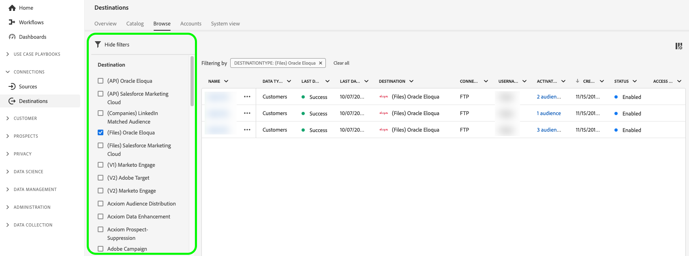

# Redigera aktiveringsdataflöden {#edit-activation-flows}

I Adobe Experience Platform kan du redigera olika komponenter i befintliga aktiveringsdataflöden till mål, t.ex. exporterade målgrupper och profilattribut, exportfrekvens, om aktiveringsdataflödet är aktiverat eller inaktiverat, med mera.

## Redigera dataflöden {#edit-dataflows}

Följ stegen nedan för att redigera befintliga aktiveringsdataflöden:

1. Logga in på [Experience Platform UI](https://platform.adobe.com/) och markera **[!UICONTROL Destinations]** i det vänstra navigeringsfältet. Välj **[!UICONTROL Browse]** i det övre sidhuvudet för att visa befintliga måldataflöden.

   

2. Markera filterikonen  längst upp till vänster för att öppna sorteringspanelen. På sorteringspanelen finns en lista med alla mål. Du kan markera mer än ett mål i listan om du vill visa ett filtrerat urval av dataflöden som är kopplade till det valda målet.

   

3. Välj namnet på måldataflödet som du vill redigera.

   

4. The **[!UICONTROL Dataflow runs]** målsidan visas med de tillgängliga kontrollerna. Nu kan du redigera flera komponenter i måldataflödet:

   * Välj **[!UICONTROL Activate audiences]** till höger för att ändra vilka målgrupper eller profilattribut som ska skickas till målet. Den här åtgärden tar dig till aktiveringsarbetsflödet, som skiljer sig åt beroende på måltyp. Mer information finns i stödlinjerna för:
      * [aktivera målgruppsdata till målgruppsdirektuppspelningsmål](./activate-segment-streaming-destinations.md) (t.ex. Facebook eller Twitter)
      * [aktivera målgruppsdata till batchprofilbaserade mål](./activate-batch-profile-destinations.md) (t.ex. Amazon S3 eller Oracle Eloqua)
      * [aktivera målgruppsdata för direktuppspelning av profilbaserade mål](./activate-streaming-profile-destinations.md) (till exempel HTTP API eller Amazon Kinesis).

   * Dessutom kan du redigera namnet och beskrivningen för måldataflödet.
   * Du kan använda **[!UICONTROL Enabled]/[!UICONTROL Disabled]** växla för att starta och pausa all dataexport till målet.

   

## Nästa steg {#next-steps}

Genom att följa den här självstudiekursen har du använt **[!UICONTROL destinations]** arbetsyta för att uppdatera befintliga måldataflöden.

Mer information om destinationer finns i [destinationer, översikt](../catalog/overview.md).
