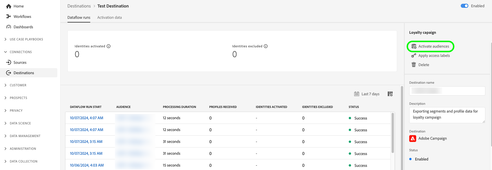

# Redigera aktiveringsdataflöden {#edit-activation-flows}

I Adobe Experience Platform kan du konfigurera olika komponenter i befintliga aktiveringsdataflöden till mål, som:

* [Aktivera eller inaktivera ](#enable-disable-dataflows) aktiveringsdataflöden
* [Lägg till ytterligare målgrupper](#add-audiences) i aktiveringsdataflöden
* [Redigera mappade attribut och identiteter](#edit-mapped-attributes)
* [Redigera aktiveringsschema och exportfrekvens](#edit-schedule-frequency)
* [Lägg till ytterligare datauppsättningar](#add-datasets) i aktiveringsarbetsflödet
* [Redigera marknadsföringsåtgärder](#edit-marketing-actions) för dina aktiveringsdataflöden
* [Använd åtkomstetiketter](#apply-access-labels) på exporterade data
* [Redigera namn och beskrivningar](#edit-names-descriptions) för aktiveringsdataflödena

## Bläddra bland aktiveringsdataflöden {#browse-activation-dataflows}

Följ stegen nedan för att bläddra bland dina befintliga aktiveringsdataflöden och identifiera det som du vill redigera.

1. Logga in på [Experience Platform-gränssnittet](https://platform.adobe.com/) och välj **[!UICONTROL Destinations]** i det vänstra navigeringsfältet. Välj **[!UICONTROL Browse]** i den övre rubriken om du vill visa befintliga måldataflöden.

   

2. Välj filterikonen  längst upp till vänster för att öppna sorteringspanelen. På sorteringspanelen finns en lista med alla mål. Du kan markera mer än ett mål i listan om du vill visa ett filtrerat urval av dataflöden som är kopplade till det valda målet.

   

3. Välj namnet på måldataflödet som du vill redigera.

   

4. Målsidan **[!UICONTROL Dataflow runs]** visas med de tillgängliga kontrollerna. Beroende på måltypen kan du utföra olika dataflödesåtgärder. Se nästa avsnitt för varje dataflödesåtgärd som stöds.

## Aktivera eller inaktivera aktiveringsdataflöden {#enable-disable-dataflows}

Använd växlingsknappen **[!UICONTROL Enabled]/[!UICONTROL Disabled]** för att starta eller pausa all dataexport till målet.

## Lägga till målgrupper i ett aktiveringsdataflöde {#add-audiences}

Välj **[!UICONTROL Activate audiences]** i den högra listen för att ändra vilka målgrupper som ska skickas till målet. Den här åtgärden tar dig till aktiveringsarbetsflödet.

I steget **[!UICONTROL Select audiences]** i aktiveringsarbetsflödet kan du ta bort befintliga målgrupper eller lägga till nya målgrupper i aktiveringsarbetsflödet.

Arbetsflödet för aktivering skiljer sig något beroende på måltyp. Mer information om aktiveringsarbetsflöden för respektive måltyp finns i följande handböcker:

* [Aktivera målgrupper för direktuppspelningsmål](./activate-segment-streaming-destinations.md) (till exempel Facebook eller Twitter);
* [Aktivera målgrupper för att batchprofilera exportmål](./activate-batch-profile-destinations.md) (till exempel Amazon S3 eller Oracle Eloqua);
* [Aktivera målgrupper för att direktuppspela profilexportmål](./activate-streaming-profile-destinations.md) (till exempel HTTP API eller Amazon Kinesis).

## Redigera aktiveringsschema och exportfrekvens {#edit-schedule-frequency}

Välj **[!UICONTROL Activate audiences]** i den högra listen. Den här åtgärden tar dig till aktiveringsarbetsflödet.

Välj steget **[!UICONTROL Scheduling]** i aktiveringsarbetsflödet för att redigera aktiveringsschemat och exportfrekvensen för ditt dataflöde. I det här steget kan du konfigurera hur ofta data exporteras till målet.

I **[!UICONTROL Scheduling]**-steget i aktiveringsarbetsflödet kan du:
* Justera exportfrekvensen.
* Ange eller ändra start- och slutdatum för aktiveringsdataflödet, med mera.

Vilka schemaläggningsåtgärder du kan utföra varierar något beroende på måltyp. Mer information om aktiveringsarbetsflöden för respektive måltyp finns i följande handböcker:

* [Aktivera målgrupper för direktuppspelningsmål](./activate-segment-streaming-destinations.md) (till exempel Facebook eller Twitter);
* [Aktivera målgrupper för att batchprofilera exportmål](./activate-batch-profile-destinations.md) (till exempel Amazon S3 eller Oracle Eloqua);
* [Aktivera målgrupper för att direktuppspela profilexportmål](./activate-streaming-profile-destinations.md) (till exempel HTTP API eller Amazon Kinesis).

## Redigera mappade attribut och identiteter {#edit-mapped-attributes}

Välj **[!UICONTROL Activate audiences]** i den högra listen. Den här åtgärden tar dig till aktiveringsarbetsflödet.

Välj steget **[!UICONTROL Mapping]** i aktiveringsarbetsflödet om du vill redigera mappade attribut och identiteter för aktiveringsdataflödet. På så sätt kan du justera vilka profilattribut och identiteter som ska exporteras till målet.

I **[!UICONTROL Mapping]**-steget i aktiveringsarbetsflödet kan du:

* Lägg till nya attribut eller identiteter i mappningen.
* Ta bort befintliga attribut eller identiteter från mappningen.
* Justera mappningsordningen för att definiera kolumnordningen i exporterade filer.

Arbetsflödet för aktivering skiljer sig något beroende på måltyp. Mer information om aktiveringsarbetsflöden för respektive måltyp finns i följande handböcker:

* [Aktivera målgrupper för direktuppspelningsmål](./activate-segment-streaming-destinations.md) (till exempel Facebook eller Twitter);
* [Aktivera målgrupper för att batchprofilera exportmål](./activate-batch-profile-destinations.md) (till exempel Amazon S3 eller Oracle Eloqua);
* [Aktivera målgrupper för att direktuppspela profilexportmål](./activate-streaming-profile-destinations.md) (till exempel HTTP API eller Amazon Kinesis).

## Lägga till datauppsättningar i ett aktiveringsdataflöde {#add-datasets}

Välj **[!UICONTROL Export datasets]** i den högra listen för att välja ytterligare datauppsättningar att exportera till ditt mål. Det här alternativet tar dig till arbetsflödet för [datauppsättningsexport](export-datasets.md).

>[!NOTE]
>
>Det här alternativet är bara synligt för [mål som stöder datauppsättningsexport](export-datasets.md#supported-destinations).

## [!BADGE Beta]{type=Informative} Redigera marknadsföringsåtgärder {#edit-marketing-actions}

>[!NOTE]
>
>Den här funktionen finns för närvarande i **beta**. Kontakta din Adobe-representant om du vill få åtkomst till den.

Du kan lägga till eller ta bort marknadsföringsåtgärder som du ställer in när du ansluter till målet från början.

Välj **[!UICONTROL Edit marketing actions]** i den högra listen för att öppna skärmen för val av marknadsföringsåtgärder.

Välj tillämpliga marknadsföringsåtgärder och välj sedan **[!UICONTROL Save]** för att tillämpa ändringarna.

## Använd åtkomstetiketter {#apply-access-labels}

Välj **[!UICONTROL Apply access labels]** om du vill redigera dataanvändningsetiketterna för exporterade data. Mer information finns i [dokumentationen om dataanvändningsetiketter](../../data-governance/labels/overview.md).

## Redigera namn och beskrivningar för aktiveringsdataflöde {#edit-names-descriptions}

Använd fälten **[!UICONTROL Destination name]** och **[!UICONTROL Description]** för att redigera aktiveringsdataflödets namn och beskrivning.

## Nästa steg {#next-steps}

Genom att följa den här självstudiekursen har du använt arbetsytan **[!UICONTROL destinations]** för att uppdatera befintliga måldataflöden.

Mer information om mål finns i [målöversikten](../catalog/overview.md).
