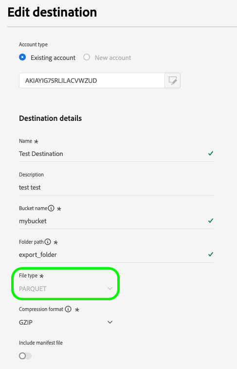
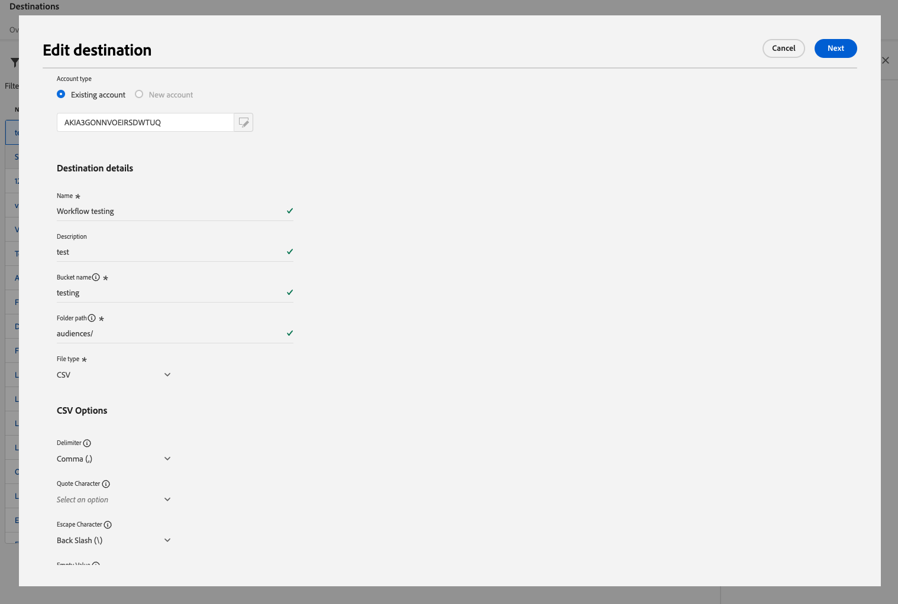
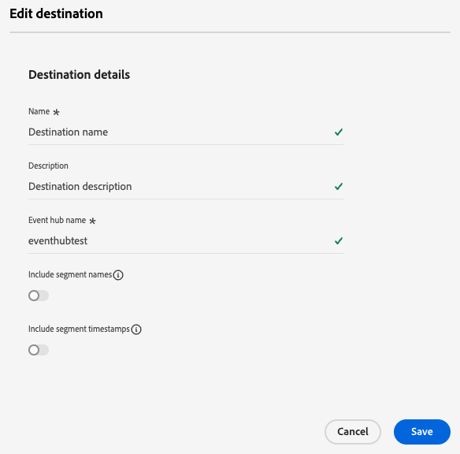
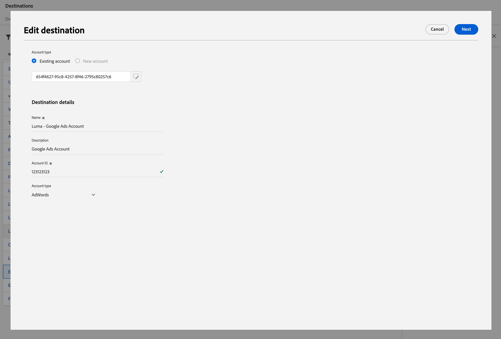

# Redigera mål

Lär dig hur du redigerar olika komponenter i en befintlig målanslutning, bland annat hur du uppdaterar inloggningsuppgifter, exporterar plats och mycket mer med hjälp av användargränssnittet i Experience Platform.

>[!NOTE]
>
> Redigeringsåtgärderna som beskrivs i den här självstudiekursen stöds även via API-åtgärder. Läs självstudiekursen om hur du [redigerar mål i API](/help/destinations/api/edit-destination.md) om du vill ha mer information.

## Förutsättningar {#prerequisites}

Om du vill redigera målanslutningar måste du ha **[!UICONTROL Manage Destinations]** [åtkomstkontrollbehörighet](/help/access-control/home.md#permissions). Läs [åtkomstkontrollsöversikten](/help/access-control/ui/overview.md) eller kontakta produktadministratören för att få den behörighet som krävs.

## Redigera målanslutningar {#edit}

Så här redigerar du olika komponenter i en befintlig målanslutning:

1. Navigera till **[!UICONTROL Destinations]** > **[!UICONTROL Browse]**.
2. Välj önskat mål som du vill redigera.
3. Markera ellipsen (`...`) i kolumnen [!UICONTROL Name] och använd kontrollen **[!UICONTROL Edit destination]**&#x200B;för att redigera befintliga målanslutningar.
4. Redigera önskade inställningar i det modala fönstret. Välj **[!UICONTROL Save]** när du är klar.

I redigeringsfönstret kan du uppdatera alla inställningar som du konfigurerade när du först anslöt till målet. Dessa inställningar skiljer sig åt beroende på vilken målplattform du uppdaterar.

Beroende på hur målet har konfigurerats kan vissa fält vara skrivskyddade och inte kunna redigeras. Om du vill ändra värdet för skrivskyddade fält måste du [skapa en ny målanslutning](../ui/connect-destination.md) med de nya fältvärdena.

Nedan visas några exempel på inställningar som du kan uppdatera för [Amazon S3](../catalog/cloud-storage/amazon-s3.md), [Azure Event Hubs](../catalog/cloud-storage/azure-event-hubs.md) och [Google Ads](../catalog/advertising/google-ads-destination.md) -destinationer.

  
  
  

>[!SUCCESS]
>
>Inställningarna för målanslutningen har uppdaterats.

## Andra redigeringsalternativ {#other-editing-options}

Genom att använda Experience Platform gränssnitt eller API:t för Flow Service kan du redigera olika målkonfigurationer, vilket beskrivs i länkarna nedan:

| Använda användargränssnittet i Experience Platform | Använda API:t för Flow Service |
|---------|----------|
| Redigera målanslutningar (den här sidan) | [Redigera målanslutningskomponenter (lagringsplats och andra komponenter)](/help/destinations/api/edit-destination.md#patch-target-connection) |
| [Redigera konton](/help/destinations/ui/update-accounts.md) | [Redigera basanslutningskomponenter (autentiseringsparametrar och andra komponenter)](/help/destinations/api/edit-destination.md#patch-base-connection) |
| [Redigera aktiveringsdataflöden](/help/destinations/ui/edit-activation.md) | [Uppdatera måldataflöden](/help/destinations/api/update-destination-dataflows.md) |

## Nästa steg {#next-steps}

Genom att följa den här självstudiekursen har du använt arbetsytan **[!UICONTROL destinations]** för att uppdatera befintliga målanslutningar.

Mer information om mål finns i [målöversikten](../catalog/overview.md).
