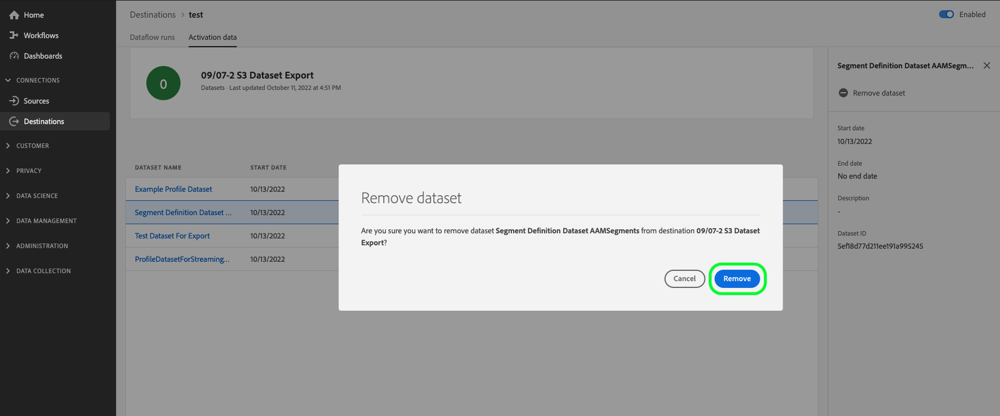

# Exportera datauppsättningar till molnlagringsmål

>[!AVAILABILITY]
>
>* Den här funktionaliteten är tillgänglig för kunder som har köpt Real-Time CDP Prime- eller Ultimate-paketet, Adobe Journey Optimizer eller Customer Journey Analytics. Kontakta din Adobe-representant om du vill ha mer information.

I den här artikeln förklaras det arbetsflöde som krävs för att exportera [datauppsättningar](/help/catalog/datasets/overview.md) från Adobe Experience Platform till den molnlagringsplats som du föredrar, till exempel [!DNL Amazon S3], SFTP-platser eller [!DNL Google Cloud Storage] med hjälp av användargränssnittet i Experience Platform.

Du kan också använda API:erna för Experience Platform för att exportera datauppsättningar. Mer information finns i [API-självstudiekursen för exportdatamängder](/help/destinations/api/export-datasets.md).

## Tillgängliga datauppsättningar för export {#datasets-to-export}

De datauppsättningar som du kan exportera varierar beroende på Experience Platform (Real-Time CDP, Adobe Journey Optimizer), nivån (Prime eller Ultimate) och eventuella tillägg som du har köpt (till exempel Data Distiller).

Använd tabellen nedan för att förstå vilka datamängdstyper du kan exportera beroende på ditt program, produktnivå och eventuella köpta tillägg:

<table>
<thead>
  <tr>
    <th>Program/tillägg</th>
    <th>Nivå</th>
    <th>Tillgängliga datauppsättningar för export</th>
  </tr>
</thead>
<tbody>
  <tr>
    <td rowspan="2">Real-Time CDP</td>
    <td>Prime</td>
    <td>Data för profil- och upplevelsehändelser som har skapats i användargränssnittet i Experience Platform efter att ha inhämtat eller samlat in data via Sources, Web SDK, Mobile SDK, Analytics Data Connector och Audience Manager.</td>
  </tr>
  <tr>
    <td>Ultimate</td>
    <td><ul><li>Data för profil- och upplevelsehändelser som har skapats i användargränssnittet i Experience Platform efter att ha inhämtat eller samlat in data via Sources, Web SDK, Mobile SDK, Analytics Data Connector och Audience Manager.</li><li> <a href="https://experienceleague.adobe.com/docs/experience-platform/dashboards/query.html#profile-attribute-datasets">Systemgenererad data för ögonblicksbild av profil</a>.</li></td>
  </tr>
  <tr>
    <td rowspan="2">Adobe Journey Optimizer</td>
    <td>Prime</td>
    <td>Mer information finns i dokumentationen för <a href="https://experienceleague.adobe.com/docs/journey-optimizer/using/data-management/datasets/export-datasets.html#datasets"> Adobe Journey Optimizer</a>.</td>
  </tr>
  <tr>
    <td>Ultimate</td>
    <td>Mer information finns i dokumentationen för <a href="https://experienceleague.adobe.com/docs/journey-optimizer/using/data-management/datasets/export-datasets.html#datasets"> Adobe Journey Optimizer</a>.</td>
  </tr>
  <tr>
    <td>Customer Journey Analytics</td>
    <td>Alla</td>
    <td> Data för profil- och upplevelsehändelser som har skapats i användargränssnittet i Experience Platform efter att ha inhämtat eller samlat in data via Sources, Web SDK, Mobile SDK, Analytics Data Connector och Audience Manager.</td>
  </tr>
  <tr>
    <td>Data Distiller</td>
    <td>Data Distiller (tillägg)</td>
    <td>Härledda datauppsättningar som skapats med frågetjänsten.</td>
  </tr>
</tbody>
</table>

## Videosjälvstudiekurs {#video-tutorial}

I videon nedan finns en komplett förklaring av arbetsflödet som beskrivs på den här sidan, fördelar med att använda exportdatauppsättningsfunktionen samt några förslag på användningsområden.

>[!VIDEO](https://video.tv.adobe.com/v/3424392/)

## Mål som stöds {#supported-destinations}

För närvarande kan du exportera datauppsättningar till molnlagringsmål som markeras i skärmbilden och visas nedan.

* [[!DNL Azure Data Lake Storage Gen2]](../../destinations/catalog/cloud-storage/adls-gen2.md)
* [[!DNL Data Landing Zone]](../../destinations/catalog/cloud-storage/data-landing-zone.md)
* [[!DNL Google Cloud Storage]](../../destinations/catalog/cloud-storage/google-cloud-storage.md)
* [[!DNL Amazon S3]](../../destinations/catalog/cloud-storage/amazon-s3.md#changelog)
* [[!DNL Azure Blob]](../../destinations/catalog/cloud-storage/azure-blob.md#changelog)
* [[!DNL SFTP]](../../destinations/catalog/cloud-storage/sftp.md#changelog)

## När målgrupper ska aktiveras eller datauppsättningar exporteras {#when-to-activate-audiences-or-activate-datasets}

Vissa filbaserade mål i Experience Platform-katalogen stöder både målgruppsaktivering och datauppsättningsexport.

* Överväg att aktivera målgrupper när ni vill att era data ska struktureras i profiler grupperade efter målgruppsintressen eller kvalifikationer.
* Du kan också överväga att exportera datauppsättningar när du vill exportera rådatauppsättningar, som inte grupperas eller struktureras efter målgruppsintressen eller kvalifikationer. Du kan använda dessa data för rapportering, datavetenskapliga arbetsflöden och många andra användningsområden. Som administratör, datatekniker eller analytiker kan du till exempel exportera data från Experience Platform för synkronisering med ditt datalager, använda i BI-analysverktyg, externa XML-verktyg i molnet eller lagra i ditt system för långsiktig lagring.

Det här dokumentet innehåller all information som behövs för att exportera datauppsättningar. Om du vill aktivera *målgrupper* för molnlagring eller e-postmarknadsföringsmål läser du [Aktivera målgruppsdata för att batchprofilera exportmål](/help/destinations/ui/activate-batch-profile-destinations.md).

## Förhandskrav {#prerequisites}

Om du vill exportera datauppsättningar till molnlagringsmål måste du ha [anslutit till ett mål](./connect-destination.md). Om du inte redan har gjort det går du till [målkatalogen](../catalog/overview.md), bläddrar bland de mål som stöds och konfigurerar det mål som du vill använda.

### Nödvändiga behörigheter {#permissions}

Om du vill exportera datauppsättningar behöver du behörigheterna **[!UICONTROL View Destinations]**, **[!UICONTROL View Datasets]** och **[!UICONTROL Manage and Activate Dataset Destinations]** [åtkomstkontroll](/help/access-control/home.md#permissions). Läs [åtkomstkontrollsöversikten](/help/access-control/ui/overview.md) eller kontakta produktadministratören för att få den behörighet som krävs.

Bläddra i målkatalogen för att kontrollera att du har de behörigheter som krävs för att exportera datauppsättningar och att målet har stöd för att exportera datauppsättningar. Om ett mål har en **[!UICONTROL Activate]**- eller **[!UICONTROL Export datasets]**-kontroll har du rätt behörighet.

## Välj mål {#select-destination}

Följ instruktionerna för att välja ett mål där du kan exportera datauppsättningar:

1. Gå till **[!UICONTROL Connections > Destinations]** och välj fliken **[!UICONTROL Catalog]**.

   

1. Välj **[!UICONTROL Activate]** eller **[!UICONTROL Export datasets]** på kortet som motsvarar målet som du vill exportera datauppsättningar till.

   

1. Välj **[!UICONTROL Data type Datasets]** och välj den målanslutning som du vill exportera datauppsättningar till. Välj sedan **[!UICONTROL Next]**.

>[!TIP]
> 
>Om du vill konfigurera ett nytt mål för att exportera datauppsättningar väljer du **[!UICONTROL Configure new destination]** för att aktivera arbetsflödet [Anslut till mål](/help/destinations/ui/connect-destination.md).

1. Vyn **[!UICONTROL Select datasets]** visas. Gå till nästa avsnitt för att [välja dina datauppsättningar](#select-datasets) för export.

## Välj datauppsättningar {#select-datasets}

Använd kryssrutorna till vänster om datauppsättningsnamnen för att markera de datauppsättningar som du vill exportera till målet och välj sedan **[!UICONTROL Next]**.

## Schemalägg datauppsättningsexport {#scheduling}

>[!CONTEXTUALHELP]
>id="platform_destinations_activate_datasets_exportoptions"
>title="Filexportalternativ för datauppsättningar"
>abstract="Välj **Exportera inkrementella filer** om du bara vill exportera data som har lagts till i datauppsättningen sedan den senaste exporten.   Den första stegvisa filexporten innehåller alla data i datauppsättningen, vilket fungerar som en bakgrundsfyllning. Framtida inkrementella filer innehåller endast de data som har lagts till i datauppsättningen sedan den första exporten.   Välj **Exportera hela filer** om du vill exportera det fullständiga medlemskapet för varje datauppsättning vid varje export. "

>[!CONTEXTUALHELP]
>id="dataset_dataflow_needs_schedule_end_date_header"
>title="Uppdatera slutdatumet för det här dataflödet"
>abstract="Uppdatera slutdatumet för det här dataflödet"

>[!CONTEXTUALHELP]
>id="dataset_dataflow_needs_schedule_end_date_body"
>title="Uppdatera slutdatumet för det här dataflödet"
>abstract="På grund av de senaste uppdateringarna av det här målet krävs ett slutdatum för dataflödet. Adobe har angett standardslutdatumet till 1 maj 2025. Uppdatera till önskat slutdatum, annars avbryts dataexporten på standarddatumet."

Använd steget **[!UICONTROL Scheduling]** för att:

* Ange ett startdatum och ett slutdatum samt en exportgräns för datauppsättningsexporter.
* Konfigurera om de exporterade datauppsättningsfilerna ska exportera hela datamängdens medlemskap eller bara stegvisa ändringar av medlemskapet för varje exportförekomst.
* Anpassa mappsökvägen på lagringsplatsen där datauppsättningar ska exporteras. Läs mer om hur du [redigerar sökvägen till exportmappen](#edit-folder-path).

Använd kontrollen **[!UICONTROL Edit schedule]** på sidan om du vill redigera exportavslut och välja om du vill exportera fullständiga eller stegvisa filer.

Alternativet **[!UICONTROL Export incremental files]** är markerat som standard. Detta utlöser en export av en eller flera filer som representerar en fullständig ögonblicksbild av datauppsättningen. Efterföljande filer är inkrementella tillägg till datauppsättningen sedan föregående export. Du kan också välja **[!UICONTROL Export full files]**. I det här fallet väljer du frekvensen **[!UICONTROL Once]** för en engångs fullständig export av datauppsättningen.

>[!IMPORTANT]
>
>Den första stegvisa filexporten innehåller alla befintliga data i datauppsättningen och fungerar som en bakgrundsfyllning. Exporten kan innehålla en eller flera filer.

1. Använd **[!UICONTROL Frequency]**-väljaren för att välja exportfrekvens:

   * **[!UICONTROL Daily]**: Schemalägg inkrementell filexport en gång om dagen, varje dag, vid den tidpunkt du anger.
   * **[!UICONTROL Hourly]**: Schemalägg stegvis filexport var 3, 6, 8 eller 12:e timme.

2. Använd väljaren **[!UICONTROL Time]** för att välja tidpunkten på dagen, i formatet [!DNL UTC], när exporten ska ske.

3. Använd **[!UICONTROL Date]**-väljaren för att välja intervallet när exporten ska äga rum.

4. Välj **[!UICONTROL Save]** om du vill spara schemat och fortsätta till steget **[!UICONTROL Review]**.

>[!NOTE]
> 
>För datauppsättningsexporter har filnamnen en förinställning, standardformat, som inte kan ändras. Mer information och exempel på exporterade filer finns i avsnittet [Verifiera datauppsättningsexport](#verify).

## Redigera mappsökväg {#edit-folder-path}

>[!CONTEXTUALHELP]
>id="destinations_folder_name_template"
>title="Redigera mappsökväg"
>abstract="Använd flera angivna makron för att anpassa mappsökvägen där datauppsättningen exporteras."

>[!CONTEXTUALHELP]
>id="destinations_folder_name_template_preview"
>title="Förhandsgranskning av sökväg för datauppsättningsmapp"
>abstract="Få en förhandsgranskning av mappstrukturen som skapas på lagringsplatsen baserat på de makron som du har lagt till i det här fönstret."

Välj **[!UICONTROL Edit folder path]** om du vill anpassa mappstrukturen på lagringsplatsen där exporterade datauppsättningar placeras.

Du kan använda flera tillgängliga makron för att anpassa ett mappnamn. Dubbelklicka på ett makro för att lägga till det i mappsökvägen och använd `/` mellan makrona för att separera mapparna.

När du har valt makron kan du se en förhandsvisning av mappstrukturen som kommer att skapas på lagringsplatsen. Den första nivån i mappstrukturen representerar **[!UICONTROL Folder path]** som du angav när du [anslöt till målet](/help/destinations/ui/connect-destination.md##set-up-connection-parameters) för att exportera datamängder.

## Granska {#review}

På sidan **[!UICONTROL Review]** kan du se en sammanfattning av ditt val. Välj **[!UICONTROL Cancel]** om du vill dela upp flödet, **[!UICONTROL Back]** om du vill ändra inställningarna eller **[!UICONTROL Finish]** om du vill bekräfta ditt val och börja exportera datauppsättningar till målet.

## Verifiera datauppsättningsexport {#verify}

När du exporterar datauppsättningar skapar Experience Platform en eller flera `.json`- eller `.parquet`-filer på den lagringsplats som du angav. Förvänta dig att nya filer ska placeras på din lagringsplats enligt det exportschema som du angav.

Experience Platform skapar en mappstruktur på den lagringsplats du angav, där den sparar de exporterade datauppsättningsfilerna. Standardmönstret för mappexport visas nedan, men du kan [anpassa mappstrukturen med dina favoritmakron](#edit-folder-path).

>[!TIP]
> 
>Den första nivån i den här mappstrukturen - `folder-name-you-provided` - representerar **[!UICONTROL Folder path]** som du angav när du [anslöt till målet](/help/destinations/ui/connect-destination.md##set-up-connection-parameters) för att exportera datauppsättningar.

`folder-name-you-provided/datasetID/exportTime=YYYYMMDDHHMM`

Standardfilnamnet genereras slumpmässigt och säkerställer att de exporterade filnamnen är unika.

### Exempeldatauppsättningsfiler {#sample-files}

De här filerna finns i din lagringsplats, vilket är en bekräftelse på att exporten lyckades. Om du vill veta hur de exporterade filerna är strukturerade kan du hämta ett exempel på filen [.parquet ](../assets/common/part-00000-tid-253136349007858095-a93bcf2e-d8c5-4dd6-8619-5c662e261097-672704-1-c000.parquet) eller [.json ](../assets/common/part-00000-tid-4172098795867639101-0b8c5520-9999-4cff-bdf5-1f32c8c47cb9-451986-1-c000.json).

#### Komprimerade datauppsättningsfiler {#compressed-dataset-files}

I [anslut till målarbetsflödet](/help/destinations/ui/connect-destination.md#file-formatting-and-compression-options) kan du välja vilka exporterade datauppsättningsfiler som ska komprimeras, vilket visas nedan:

Observera skillnaden i filformat mellan de två filtyperna när de komprimeras:

* När du exporterar komprimerade JSON-filer är det exporterade filformatet `json.gz`. Formatet för den exporterade JSON-filen är NDJSON, som är standardformatet för utbyte i big data-ekosystemet. Adobe rekommenderar att du använder en NDJSON-kompatibel klient för att läsa de exporterade filerna.
* Vid export av komprimerade parquet-filer är det exporterade filformatet `gz.parquet`

Exportera till JSON-filer stöds *endast i komprimerat läge*. Export till Parquet-filer stöds i komprimerat och okomprimerat läge.

## Ta bort datauppsättningar från mål {#remove-dataset}

Följ stegen nedan för att ta bort datauppsättningar från ett befintligt dataflöde:

1. Logga in på [Experience Platform-gränssnittet](https://experience.adobe.com/platform/) och välj **[!UICONTROL Destinations]** i det vänstra navigeringsfältet. Välj **[!UICONTROL Browse]** i den övre rubriken om du vill visa befintliga måldataflöden.

   

   >[!TIP]
   > 
   >Välj filterikonen  längst upp till vänster för att öppna sorteringspanelen. På sorteringspanelen finns en lista med alla mål. Du kan markera mer än ett mål i listan om du vill visa ett filtrerat urval av dataflöden som är kopplade till det valda målet.

2. I kolumnen **[!UICONTROL Activation data]** väljer du datauppsättningskontrollen för att visa alla datauppsättningar som är mappade till det här exportdataflödet.

   

3. Målsidan **[!UICONTROL Activation data]** visas. Använd kryssrutorna till vänster i datauppsättningslistan för att markera de datauppsättningar som du vill ta bort och markera sedan **[!UICONTROL Remove datasets]** i den högra listen för att utlösa en bekräftelsedialogruta för att ta bort datauppsättningen.

   

4. I bekräftelsedialogrutan väljer du **[!UICONTROL Remove]** för att omedelbart ta bort datauppsättningen från exporter till målet.

   

## Exportberättiganden för datauppsättning {#licensing-entitlement}

Läs produktbeskrivningsdokumenten för att ta reda på hur mycket data du har rätt att exportera för varje Experience Platform-program, per år. Du kan till exempel visa Real-Time CDP produktbeskrivning [här](https://helpx.adobe.com/legal/product-descriptions/real-time-customer-data-platform-b2c-edition-prime-and-ultimate-packages.html).

Observera att dataexporträttigheterna för olika program inte är additiva. Det innebär att om du köper Real-Time CDP Ultimate och Adobe Journey Optimizer Ultimate blir behörigheten för profilexport det större av de två berättigandena enligt produktbeskrivningarna. Volymberättigandena beräknas genom att man räknar ut det totala antalet licensierade profiler och multiplicerar med 500 kB för Real-Time CDP Prime eller 700 kB för Real-Time CDP Ultimate för att avgöra hur mycket data ni har rätt till.

Om du å andra sidan har köpt tillägg som Data Distiller, representerar dataexportgränsen som du är berättigad till summan av produktnivån och tillägget.

Du kan visa och spåra din profilexport mot avtalsgränserna på kontrollpanelen för [licensanvändning](/help/landing/license-usage-and-guardrails/license-usage-dashboard.md).

## Kända begränsningar {#known-limitations}

Tänk på följande begränsningar för den allmänna tillgänglighetsreleasen för datauppsättningsexporter:

* För närvarande kan du bara exportera inkrementella filer och ett slutdatum kan inte väljas för datauppsättningsexporter.
* Experience Platform kan exportera flera filer även för små datauppsättningar. Datauppsättningsexport är utformad för system-till-system-integration och optimerad för prestanda. Därför går det inte att anpassa antalet exporterade filer.
* Det går för närvarande inte att anpassa exporterade filnamn.
* Datauppsättningar som skapas via API är för närvarande inte tillgängliga för export.
* Gränssnittet blockerar för närvarande inte dig från att ta bort en datauppsättning som exporteras till ett mål. Ta inte bort datauppsättningar som exporteras till destinationer. [Ta bort datauppsättningen](#remove-dataset) från ett måldataflöde innan du tar bort den.
* Övervakningsmåtten för datauppsättningsexport är för närvarande blandade med siffrorna för profilexporter, så de återspeglar inte de verkliga exportnumren.
* Data med en tidsstämpel som är äldre än 365 dagar exkluderas från datauppsättningsexporter. Mer information finns i [skyddsutkast för schemalagda datauppsättningsexporter](/help/destinations/guardrails.md#guardrails-for-scheduled-dataset-exports)

## Vanliga frågor {#faq}

**Kan vi generera en fil utan en mapp om vi bara sparar på `/` som mappsökväg? Om vi inte behöver någon mappsökväg, hur genereras filer med duplicerade namn i en mapp eller på en plats?**

+++
Från och med versionen från september 2024 är det möjligt att anpassa mappnamnet och till och med använda `/` för att exportera filer för alla datauppsättningar i samma mapp. Adobe rekommenderar inte detta för mål som exporterar flera datauppsättningar eftersom systemgenererade filnamn som tillhör olika datauppsättningar kommer att blandas i samma mapp.
+++

**Kan du dirigera manifestfilen till en mapp och datafiler till en annan mapp?**

+++
Nej, det går inte att kopiera manifestfilen till en annan plats.
+++

**Kan vi styra sekvensering och timing för filleverans?**

+++
Det finns alternativ för att schemalägga exporten. Det finns inga alternativ för att fördröja eller sekvensera kopian av filerna. De kopieras till din lagringsplats så snart de har skapats.
+++

**Vilka format är tillgängliga för manifestfilen?**

+++
Manifestfilen har formatet .json.
+++

**Finns det API-tillgänglighet för manifestfilen?**

+++
Det finns inget API tillgängligt för manifestfilen, men det innehåller en lista över filer som innehåller exporten.
+++

**Kan vi lägga till ytterligare information i manifestfilen (dvs. antal poster)? Om så är fallet, hur?**

+++
Det finns ingen möjlighet att lägga till ytterligare information i manifestfilen. Antalet poster är tillgängligt via entiteten `flowRun` (kan frågas via API). Läs mer om övervakning av destinationer.
+++

**Hur delas datafiler? Hur många poster per fil?**

+++
Datafiler delas upp enligt standardpartitionen i datavjön i Experience Platform. Större datauppsättningar har ett större antal partitioner. Standardpartitioneringen kan inte konfigureras av användaren eftersom den är optimerad för läsning.
+++

**Kan vi ange ett tröskelvärde (antal poster per fil)?**

+++
Nej, det är inte möjligt.
+++

**Hur skickar vi om en datauppsättning om den första sändningen inte fungerar?**

+++
Försök utförs automatiskt för de flesta typer av systemfel.
+++