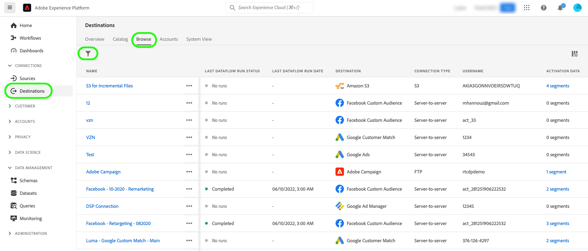

# Exportera filer on demand till gruppmål med hjälp av användargränssnittet i Experience Platform

>[!IMPORTANT]
> 
>För att aktivera data behöver du behörigheterna **[!UICONTROL View Destinations]**, **[!UICONTROL Activate Destinations]**, **[!UICONTROL View Profiles]** och **[!UICONTROL View Segments]** [åtkomstkontroll](/help/access-control/home.md#permissions). Läs [åtkomstkontrollsöversikten](/help/access-control/ui/overview.md) eller kontakta produktadministratören för att få den behörighet som krävs.

## **[!UICONTROL Export file now]** översikt {#overview}

>[!CONTEXTUALHELP]
>id="platform_destinations_activationchaining_activatenow"
>title="Exportera filen nu"
>abstract="Välj den här kontrollen om du vill leverera en fullständig filexport utöver tidigare schemalagda exporter. Filexporten utlöses omedelbart och det senaste resultatet från segmentering i Experience Platform plockas upp."

I den här artikeln beskrivs hur du använder användargränssnittet i Experience Platform för att exportera filer på begäran till batchmål som [molnlagring](/help/destinations/catalog/cloud-storage/overview.md) och [e-postmarknadsföring](/help/destinations/catalog/email-marketing/overview.md) .

Kontrollen **[!UICONTROL Export file now]** gör att du kan exportera en fullständig fil utan att avbryta det aktuella exportschemat för en tidigare schemalagd målgrupp. Denna export sker utöver tidigare schemalagd export och ändrar inte exportfrekvensen för målgruppen. Filexporten utlöses omedelbart och det senaste resultatet från segmentering i Experience Platform plockas upp.

Du kan också använda Experience Platform API:er för detta ändamål. Läs om hur du [aktiverar målgrupper på begäran till batchmål via API:t för ad hoc-aktivering](/help/destinations/api/ad-hoc-activation-api.md).

## Förhandskrav {#prerequisites}

Om du vill exportera filer på begäran till gruppmål måste du ha [anslutit till ett mål](./connect-destination.md). Om du inte redan har gjort det går du till [målkatalogen](../catalog/overview.md), bläddrar bland de mål som stöds och konfigurerar det mål som du vill använda.

## Så här exporterar du filer on demand {#how-to-export-files-on-demand}

1. Gå till **[!UICONTROL Connections > Destinations]**, välj fliken **[!UICONTROL Browse]** och filtersymbolen för att visa befintliga anslutningar till önskade gruppmål.

   

2. Välj önskad målanslutning för att inspektera det befintliga dataflödet till målet.

   

3. Välj fliken **[!UICONTROL Activation data]** och markera de målgrupper som du vill exportera filer för on demand och välj kontrollen **[!UICONTROL Export file now]** för att utlösa en engångs export som levererar en fil för varje vald målgrupp till din gruppdestination.

   

4. Välj **[!UICONTROL Yes]** för att bekräfta och utlösa filexporten.

   

5. Ett bekräftelsemeddelande visas med information om att filexporten har startats.

   

6. Du kan också växla till fliken **[!UICONTROL Dataflow runs]** för att bekräfta att filexporten har startats.

## Överväganden {#considerations}

Tänk på följande när du använder kontrollen **[!UICONTROL Export file now]**:

* **[!UICONTROL Export file now]** fungerar bara för målgrupper vars schema i gruppaktiveringsdataflödet överlappar det aktuella datumet. Detta inkluderar målgrupper med scheman som inte har något slutdatum (exportfrekvens **[!UICONTROL Once]**) eller där slutdatumet ännu inte har passerats.
* När du lägger till en målgrupp i ett befintligt dataflöde väntar du i minst 15 minuter tills kontrollen **[!UICONTROL Export file now]** används.
* Om du ändrar en målgrupps sammanfogningsprincip, eller om du skapar en målgrupp som använder en ny sammanfogningsprincip, väntar du 24 timmar tills kontrollen **[!UICONTROL Export file now]** används.

## Felmeddelanden i användargränssnittet {#ui-error-messages}

När du använder kontrollen **[!UICONTROL Export file now]** kan du få något av de felmeddelanden som visas nedan. Granska tabellen för att förstå hur de ska adresseras när de visas.

| Felmeddelande | Upplösning |
|---------|----------|
| Kör redan för målgrupp `segment ID` för order `dataflow ID` med körnings-ID `flow run ID` | Det här felmeddelandet indikerar att ett ad hoc-aktiveringsflöde pågår för en viss målgrupp. Vänta tills jobbet är klart innan aktiveringsjobbet aktiveras igen. |
| Målgrupperna `<segment name>` är inte en del av det här dataflödet eller ligger utanför schemaintervallet. | Det här felmeddelandet anger att de målgrupper du har valt att aktivera inte är mappade till dataflödet eller att aktiveringsschemat som har konfigurerats för målgrupperna antingen har upphört att gälla eller inte har startats ännu. Kontrollera om målgruppen verkligen är mappad till dataflödet och kontrollera att målgruppens aktiveringsplan överlappar dagens datum. |

## Relaterad information {#related-information}

* [Aktivera målgrupper för batchdestinationer on-demand med hjälp av Experience Platform API:er](/help/destinations/api/ad-hoc-activation-api.md)
* [Aktivera målgruppsdata för att batchprofilera exportmål](/help/destinations/ui/activate-batch-profile-destinations.md)
