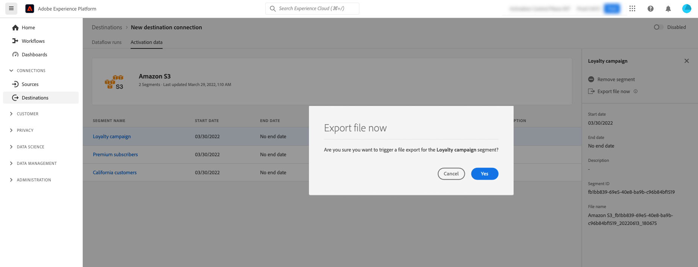

# (Beta) Exportera filer on demand till gruppmål med hjälp av användargränssnittet i Experience Platform

>[!IMPORTANT]
>
>The **[!UICONTROL Export file now]** i Adobe Experience Platform finns för närvarande i Beta. Dokumentationen och funktionerna kan komma att ändras.
>Kontakta din Adobe-representant för att få tillgång till den här funktionen.

>[!IMPORTANT]
> 
>Om du vill aktivera data måste du ha **[!UICONTROL Manage Destinations]**, **[!UICONTROL Activate Destinations]**, **[!UICONTROL View Profiles]** och **[!UICONTROL View Segments]** [behörigheter för åtkomstkontroll](/help/access-control/home.md#permissions). Läs [åtkomstkontroll - översikt](/help/access-control/ui/overview.md) eller kontakta produktadministratören för att få de behörigheter som krävs.

## **[!UICONTROL Export file now]** översikt {#overview}

>[!CONTEXTUALHELP]
>id="platform_destinations_activationchaining_activatenow"
>title="Exportera filen nu"
>abstract="Välj den här kontrollen om du vill leverera en fullständig filexport utöver tidigare schemalagda exporter. Filexporten utlöses omedelbart och det senaste resultatet från segmentering i Experience Platform hämtas."

I den här artikeln beskrivs hur du använder användargränssnittet i Experience Platform för att exportera filer on demand till gruppmål som [molnlagring](/help/destinations/catalog/cloud-storage/overview.md) och [e-postmarknadsföring](/help/destinations/catalog/email-marketing/overview.md) destinationer.

The **[!UICONTROL Export file now]** Med -kontrollen kan du exportera en fullständig fil utan att avbryta det aktuella exportschemat för ett tidigare schemalagt segment. Denna export sker utöver tidigare schemalagd export och ändrar inte segmentets exportfrekvens. Filexporten utlöses omedelbart och det senaste resultatet från segmentering i Experience Platform hämtas.

Du kan också använda Experience Platform API:er för detta ändamål. Läs om [aktivera målgruppssegment on-demand till batchdestinationer via ad hoc-aktiverings-API](/help/destinations/api/ad-hoc-activation-api.md).

## Förutsättningar {#prerequisites}

Om du vill exportera filer on demand till gruppmål måste du ha lyckats [ansluten till ett mål](./connect-destination.md). Om du inte redan har gjort det går du till [målkatalog](../catalog/overview.md), bläddra bland de mål som stöds och konfigurera det mål som du vill använda.

## Så här exporterar du filer on demand {#how-to-export-files-on-demand}

1. Gå till **[!UICONTROL Connections > Destinations]** väljer du **[!UICONTROL Browse]** och filtersymbolen för att visa befintliga anslutningar till önskade gruppmål.

   

2. Välj önskad målanslutning för att inspektera det befintliga dataflödet till målet.

   

3. Välj **[!UICONTROL Activation data]** och markera det segment som du vill exportera en fil till och från **[!UICONTROL Export file now]** -kontroll för att aktivera en engångs-export som levererar en fil till batchdestinationen.

   >[!IMPORTANT]
   >
   >Det går för närvarande inte att markera flera segment för att exportera flera filer samtidigt vid behov i användargränssnittet. Använd [ad hoc-aktiverings-API](/help/destinations/api/ad-hoc-activation-api.md) för det ändamålet.

   

4. Välj **[!UICONTROL Yes]** för att bekräfta och utlösa filexporten.

   

5. Ett bekräftelsemeddelande visas med information om att filexporten har startats.

   

6. Du kan också växla till **[!UICONTROL Dataflow runs]** för att bekräfta att filexporten har startats.

## Överväganden {#considerations}

Tänk på följande när du använder **[!UICONTROL Export file now]** kontroll:

* **[!UICONTROL Export file now]** fungerar bara för segment vars schema i gruppaktiveringsdataflödet överlappar dagens datum. Detta inkluderar segment med scheman som inte har något slutdatum (exportfrekvensen **[!UICONTROL Once]**) eller om slutdatumet ännu inte har passerats.
* När du lägger till ett segment i ett befintligt dataflöde ska du vänta i minst 15 minuter tills du använder **[!UICONTROL Export file now]** kontroll.
* Om du ändrar ett segments kopplingsprofil, eller om du skapar ett segment som använder en ny kopplingsprofil, väntar du 24 timmar tills du använder **[!UICONTROL Export file now]** kontroll.

## Felmeddelanden i användargränssnittet {#ui-error-messages}

När du använder **[!UICONTROL Export file now]** kan du stöta på något av de felmeddelanden som visas nedan. Granska tabellen för att förstå hur de ska adresseras när de visas.

| Felmeddelande | Upplösning |
|---------|----------|
| Kör redan för segment `segment ID` för order `dataflow ID` med körnings-ID `flow run ID` | Det här felmeddelandet anger att ett ad hoc-aktiveringsflöde pågår för ett segment. Vänta tills jobbet är klart innan aktiveringsjobbet aktiveras igen. |
| Segment `<segment name>` är inte en del av detta dataflöde eller ligger utanför schemaintervallet! | Det här felmeddelandet anger att de segment som du har valt att aktivera inte är mappade till dataflödet eller att aktiveringsschemat som har konfigurerats för segmenten har upphört att gälla eller inte har startats ännu. Kontrollera om segmentet verkligen är mappat till dataflödet och kontrollera att segmentaktiveringsplanen överlappar dagens datum. |

## Relaterad information {#related-information}

* [Aktivera målgruppssegment för batchdestinationer on-demand med hjälp av Experience Platform API:er](/help/destinations/api/ad-hoc-activation-api.md)
* [Aktivera målgruppsdata för att batchprofilera exportmål](/help/destinations/ui/activate-batch-profile-destinations.md)
