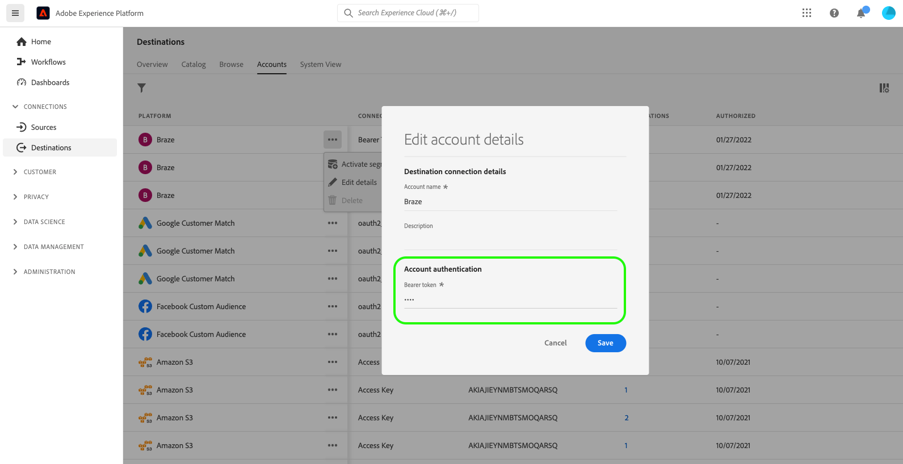

# Uppdatera destinationskonton

## Översikt {#overview}

Fliken **[!UICONTROL Accounts]** innehåller information om de anslutningar du har upprättat med olika mål. Se [Kontoöversikten](../ui/destinations-workspace.md#accounts) för all information du kan få om varje målkonto.

I den här självstudiekursen beskrivs stegen för att uppdatera information om destinationskonton med hjälp av användargränssnittet i Experience Platform.

Du kan uppdatera informationen för destinationskontot för att uppdatera och återautentisera autentiseringsuppgifter för aktuella eller utgångna konton för mål som du använder för närvarande. OAuth- och bearer-tokens har vanligtvis begränsad livstid, beroende på målplattformen. När dessa variabler förfaller kan du uppdatera dem i det arbetsflöde som beskrivs nedan. I det här arbetsflödet kan du gå igenom OAuth-arbetsflödet eller infoga en token igen. På samma sätt kan du uppdatera autentiseringsuppgifter om ett lösenord eller en användaråtkomst har ändrats i den underordnade plattformen.

För gruppmål kan du uppdatera åtkomsten eller den hemliga nyckeln, om något av dessa har ändrats. Om du dessutom vill kryptera filer som flyttas framåt kan du infoga en offentlig RSA-nyckel så krypteras de exporterade filerna vidare.

## Uppdatera konton {#update}

Följ stegen nedan för att uppdatera anslutningsinformationen till befintliga mål.

1. Logga in på [Experience Platform-gränssnittet](https://platform.adobe.com/) och välj **[!UICONTROL Destinations]** i det vänstra navigeringsfältet. Välj **[!UICONTROL Accounts]** i den övre rubriken om du vill visa dina befintliga konton.

   

2. Välj filterikonen  längst upp till vänster för att öppna sorteringspanelen. På sorteringspanelen finns en lista med alla mål. Du kan markera mer än ett mål i listan om du vill se ett filtrerat urval konton som är associerade med de valda målen.

   

3. Markera ellipserna (`...`) bredvid namnet på kontot som du vill uppdatera. En popup-panel visas med alternativ för **[!UICONTROL Activate audiences]**, **[!UICONTROL Edit details]** och **[!UICONTROL Delete]** kontot. Klicka på knappen  **[!UICONTROL Edit details]** om du vill redigera kontoinformationen.

   

4. Ange dina uppdaterade kontoinloggningsuppgifter.

   * För konton som använder en `OAuth1`- eller `OAuth2`-anslutningstyp väljer du **[!UICONTROL Reconnect OAuth]** för att förnya dina kontoinloggningsuppgifter. Du kan även uppdatera namnet och beskrivningen för ditt konto.

   

   * För konton som använder en `Access Key`- eller `ConnectionString`-anslutningstyp kan du redigera din kontoautentiseringsinformation, inklusive information som åtkomst-ID, hemliga nycklar eller anslutningssträngar. Du kan även uppdatera namnet och beskrivningen för ditt konto.

   

   * För konton som använder en `Bearer token`-anslutningstyp kan du vid behov ange en ny innehavartoken. Du kan även uppdatera namnet och beskrivningen för ditt konto.

   

   * För konton som använder en `Server to server`-anslutningstyp kan du uppdatera namnet och beskrivningen för ditt konto.

   

5. Välj **[!UICONTROL Save]** för att slutföra uppdateringen av kontoinformationen.

## Nästa steg

Genom att följa den här självstudiekursen har du använt arbetsytan **[!UICONTROL destinations]** för att uppdatera befintliga konton.

Mer information om mål finns i [målöversikten](../catalog/overview.md).