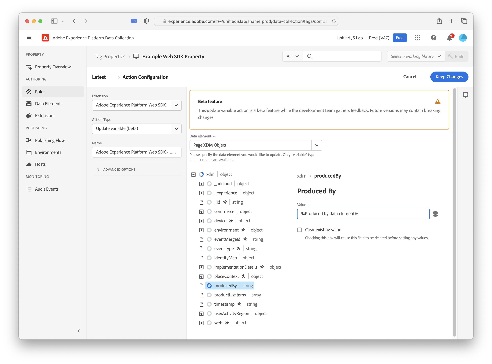

# Åtgärdstyper

När du har konfigurerat [Adobe Experience Platform Web SDK-taggtillägg](web-sdk-extension-configuration.md)måste du konfigurera åtgärdstyperna.

Den här sidan beskriver de åtgärdstyper som stöds av [Adobe Experience Platform Web SDK-taggtillägg](web-sdk-extension-configuration.md).

## Skicka händelse {#send-event}

Skickar en händelse till Adobe [!DNL Experience Platform] så att Adobe Experience Platform kan samla in de data ni skickar och agera utifrån dessa. Markera en instans (om du har fler än en). Alla data som du vill skicka kan skickas i **[!UICONTROL XDM Data]** fält. Använd ett JSON-objekt som överensstämmer med XDM-schemats struktur. Objektet kan antingen skapas på sidan eller via en **[!UICONTROL Custom Code]** **[!UICONTROL Data Element]**.

Det finns några andra fält i åtgärdstypen Skicka händelse som också kan vara användbara beroende på implementeringen. Observera att alla dessa fält är valfria.

- **Typ:** I det här fältet kan du ange en händelsetyp som ska registreras i XDM-schemat. Se [dokumentation](https://experienceleague.adobe.com/docs/experience-platform/edge/fundamentals/tracking-events.html?lang=en#using-the-sendbeacon-api) om du vill ha mer information om standardhändelsetyperna.
- **Data:** Data som inte matchar ett XDM-schema kan skickas med det här fältet. Det här fältet är användbart om du försöker uppdatera en Adobe Target-profil eller skicka Target Recommendations-attribut. Se exempel i vår [dokumentation](https://experienceleague.adobe.com/docs/experience-platform/edge/fundamentals/tracking-events.html?lang=en).<!--- **Merge ID:** If you would like to specify a merge ID for your event, you can do so in this field. Please note that the solutions downstream are not able to merge your event data at this time. -->
- **Datauppsättnings-ID:** Om du behöver skicka data till en annan datauppsättning än den som du angav i din datastream, kan du ange detta datauppsättnings-ID här.
- **Dokumentet tas bort:** Om du vill vara säker på att händelserna når servern även om användaren navigerar bort från sidan, ska du kontrollera **[!UICONTROL Document will unload]** kryssrutan. Detta gör att händelser kan nå servern, men svaren ignoreras.
- **Återge beslut om visuell personalisering:** Om du vill återge anpassat innehåll på sidan ska du kontrollera **[!UICONTROL Render visual personalization decisions]** kryssrutan. Du kan också ange beslutsomfattningar och/eller ytor om det behövs. Se [personaliseringsdokumentation](../personalization/rendering-personalization-content.md#automatically-rendering-content) om du vill ha mer information om återgivning av anpassat innehåll.

## Ange samtycke {#set-consent}

När du har fått ditt samtycke från din användare måste du meddela Adobe Experience Platform Web SDK genom att använda åtgärdstypen &quot;Ange samtycke&quot;. För närvarande stöds två typer av standarder: &quot;Adobe&quot; och &quot;IAB TCF.&quot; Se [Stöd för inställningar för kundsamtycke](../consent/supporting-consent.md). När du använder Adobe version 2.0 stöds bara ett dataelementvärde. Du måste skapa ett dataelement som matchar det godkända objektet.

I den här åtgärden får du även ett valfritt fält där du kan inkludera en identitetskarta så att identiteter kan synkroniseras när du har fått ditt samtycke. Synkronisering är användbart när medgivandet har konfigurerats som Väntande eller Ut eftersom det är sannolikt det första anropet som utlöses.

## Uppdatera variabel {#update-variable}

>[!IMPORTANT]
>
>Detta är för närvarande en betafunktion som kan komma att ändras. Framtida versioner kan innehålla helt nya versioner.

Använd den här åtgärden om du vill ändra ett XDM-objekt som ett resultat av en händelse. Den här åtgärden är avsedd att skapa ett objekt som senare kan refereras från en **[!UICONTROL Send event]** för att spela in XDM-händelseobjektet.

För att kunna använda den här åtgärdstypen måste du ha definierat en [variabel](data-element-types.md#variable) dataelement. När du väljer ett variabeldataelement att ändra visas en redigerare som liknar redigeraren för [XDM-objekt](data-element-types.md#xdm-object) dataelement.

Det XDM-schema som används för redigeraren är det schema som har valts på [!UICONTROL variable] dataelement. Du kan ange en eller flera egenskaper för objektet genom att klicka på en av egenskaperna i trädet till vänster och sedan ändra värdet till höger. I skärmbilden nedan ställs egenskapen produceradAv in på dataelementet&quot;Producerad av dataelement&quot;.

Det finns vissa skillnader mellan redigeraren i uppdateringen av variabelåtgärden och redigeraren i XDM-objektdataelementet. Först har uppdateringsvariabelåtgärden ett rotnivåobjekt med namnet&quot;xdm&quot;. Om du klickar på det här objektet kan du ange ett dataelement som ska användas för att ställa in hela objektet. För det andra har åtgärden för att uppdatera variabeln kryssrutor för att rensa data från xdm-objektet. Klicka på en av egenskaperna till vänster och markera sedan kryssrutan till höger för att ta bort värdet. Detta rensar det aktuella värdet innan du anger värden för variabeln.

## Nästa steg {#next-steps}

När du har läst den här artikeln bör du ha en bättre förståelse för hur du konfigurerar dina åtgärder. Läs om hur du [konfigurera dina dataelementtyper](data-element-types.md).
