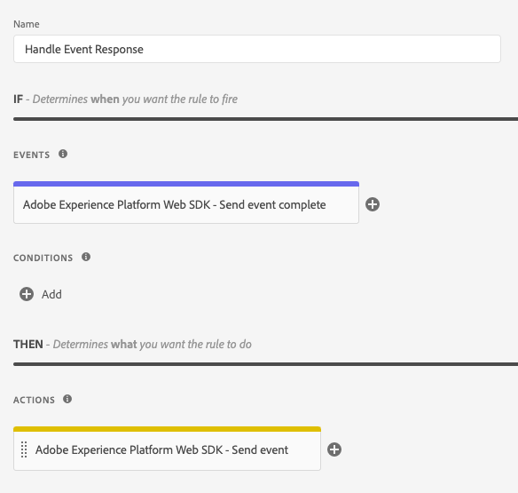

# Händelsetyper

Den här sidan beskriver de Adobe Experience Platform-händelsetyper som finns i taggtillägget Adobe Experience Platform Web SDK. De här används för att [skapa regler](https://experienceleague.adobe.com/docs/platform-learn/data-collection/tags/build-rules.html) och ska inte blandas ihop med [`eventType` fält i XDM](https://experienceleague.adobe.com/docs/experience-platform/edge/fundamentals/tracking-events.html).

## [!UICONTROL Send event complete]

Vanligtvis har din egenskap en eller flera regler med [[!UICONTROL Send event] åtgärd](action-types.md#send-event) för att skicka händelser till Adobe Experience Platform Edge Network. Varje gång en händelse skickas till Edge Network returneras ett svar till webbläsaren med användbara data. Utan [!UICONTROL Send event complete] händelsetyp, du skulle inte ha tillgång till dessa returnerade data.

Skapa en separat regel och lägg sedan till en [!UICONTROL Send event complete] till regeln. Den här regeln aktiveras varje gång ett lyckat svar tas emot från servern som ett resultat av en [!UICONTROL Send event] åtgärd.

När en [!UICONTROL Send event complete] -händelsen utlöser en regel och tillhandahåller data som returneras från servern som kan vara användbara för att utföra vissa åtgärder. Vanligtvis lägger du till en [!UICONTROL Custom code] åtgärd (från [!UICONTROL Core] till samma regel som innehåller [!UICONTROL Send event complete] -händelse. I [!UICONTROL Custom code] -åtgärd får din egen kod åtkomst till en variabel med namnet `event`. Detta `event` variabeln innehåller data som returneras från servern.

Din regel för att hantera data som returneras från Edge Network kan se ut ungefär så här:



Nedan visas några exempel på hur du utför vissa uppgifter med [!UICONTROL Custom code] åtgärd i den här regeln.

### Återge anpassat innehåll manuellt

I åtgärden Anpassad kod, som är en regel för att hantera svarsdata, kan du komma åt personaliseringsförslag som returnerats från servern. Om du vill göra det skriver du följande egen kod:

```javascript
var propositions = event.propositions;
```

If `event.propositions` finns, är det en matris som innehåller objekt för personalisering. Förslagen i arrayen bestäms till stor del av hur händelsen skickades till servern.

Anta att du inte har markerat [!UICONTROL Render decisions] kryssruta och inte har angett [!UICONTROL decision scopes] inuti [!UICONTROL Send event] åtgärd som ansvarar för att skicka händelsen.


I det här exemplet `propositions` arrayen innehåller bara förslag som är relaterade till händelsen som är berättigade för automatisk återgivning.

The `propositions` arrayen kan se ut ungefär som i det här exemplet:

```json
[
  {
    "id": "AT:eyJhY3Rpdml0eUlkIjoiMTI3MDE5IiwiZXhwZXJpZW5jZUlkIjoiMCJ9",
    "scope": "__view__",
    "items": [
      {
        "id": "11223344",
        "schema": "https://ns.adobe.com/personalization/dom-action",
        "data": {
          "content": "<h2 style=\"color: yellow\">An HTML proposition.</h2>",
          "selector": "#hero",
          "type": "setHtml"
        },
        "meta": {}
      }
    ],
    "renderAttempted": false
  },
  {
    "id": "AT:PyJhY3Rpdml0eUlkIjoiMTI3MDE5IiwiZXhwZXJpZW5jZUlkIjoiMCJ8",
    "scope": "__view__",
    "items": [
      {
        "id": "11223345",
        "schema": "https://ns.adobe.com/personalization/dom-action",
        "data": {
          "content": "<h2 style=\"color: yellow\">Another HTML proposition.</h2>",
          "selector": "#sidebar",
          "type": "setHtml"
        },
        "meta": {}
      }
    ],
    "renderAttempted": false
  }
]
```

När händelsen skickas [!UICONTROL Render decisions] kryssrutan har inte markerats, så SDK försökte inte återge innehåll automatiskt. SDK hämtade dock fortfarande automatiskt det innehåll som kan återges automatiskt och skickade det till dig för manuell återgivning om du vill göra det. Observera att varje förslagsobjekt har sin `renderAttempted` egenskap inställd på `false`.

Om du istället hade markerat [!UICONTROL Render decisions] när händelsen skickades skulle SDK ha försökt att återge alla förslag som är berättigade till automatisk återgivning. Därför får vart och ett av de föreslagna objekten sin `renderAttempted` egenskap inställd på `true`. Du behöver inte återge dessa förslag manuellt i det här fallet.

Hittills har du bara tittat på innehåll som är kvalificerat för automatisk återgivning (till exempel innehåll som har skapats i Adobe Target Visual Experience Composer). Så här hämtar du anpassat innehåll _not_ som kan återge automatiskt begär innehållet genom att tillhandahålla beslutsomfattningar med [!UICONTROL Decision scopes] i [!UICONTROL Send event] åtgärd. Ett omfång är en sträng som identifierar ett visst förslag som du vill hämta från servern.

The [!UICONTROL Send event] skulle se ut så här:


I det här exemplet, om förslag hittas på servern som matchar `salutation` eller `discount` omfång, returneras de och inkluderas i `propositions` array. Observera att alla förslag som kvalificerar sig för automatisk återgivning kommer att finnas med i `propositions` oavsett hur du konfigurerar [!UICONTROL Render decisions] eller [!UICONTROL Decision scopes] fälten i [!UICONTROL Send event] åtgärd. The `propositions` skulle i det här fallet se ut som i det här exemplet:

```json
[
  {
    "id": "AT:cZJhY3Rpdml0eUlkIjoiMTI3MDE5IiwiZXhwZXJpZW5jZUlkIjoiMCJ2",
    "scope": "salutation",
    "items": [
      {
        "schema": "https://ns.adobe.com/personalization/json-content-item",
        "data": {
          "id": "4433221",
          "content": {
            "salutation": "Welcome, esteemed visitor!"
          }
        },
        "meta": {}
      }
    ],
    "renderAttempted": false
  },
  {
    "id": "AT:FZJhY3Rpdml0eUlkIjoiMTI3MDE5IiwiZXhwZXJpZW5jZUlkIjoiMCJ0",
    "scope": "discount",
    "items": [
      {
        "schema": "https://ns.adobe.com/personalization/html-content-item",
        "data": {
          "id": "4433222",
          "content": "<div>50% off your order!</div>",
          "format": "text/html"
        },
        "meta": {}
      }
    ],
    "renderAttempted": false
  },
  {
    "id": "AT:eyJhY3Rpdml0eUlkIjoiMTI3MDE5IiwiZXhwZXJpZW5jZUlkIjoiMCJ9",
    "scope": "__view__",
    "items": [
      {
        "id": "11223344",
        "schema": "https://ns.adobe.com/personalization/dom-action",
        "data": {
          "content": "<h2 style=\"color: yellow\">An HTML proposition.</h2>",
          "selector": "#hero",
          "type": "setHtml"
        },
        "meta": {}
      }
    ],
    "renderAttempted": false
  },
  {
    "id": "AT:PyJhY3Rpdml0eUlkIjoiMTI3MDE5IiwiZXhwZXJpZW5jZUlkIjoiMCJ8",
    "scope": "__view__",
    "items": [
      {
        "id": "11223345",
        "schema": "https://ns.adobe.com/personalization/dom-action",
        "data": {
          "content": "<h2 style=\"color: yellow\">Another HTML proposition.</h2>",
          "selector": "#sidebar",
          "type": "setHtml"
        },
        "meta": {}
      }
    ],
    "renderAttempted": false
  }
]
```

Nu kan du återge offertinnehåll när du vill. I det här exemplet matchar förslaget `discount` omfånget är ett HTML-förslag som har skapats med Adobe Target formulärbaserade Experience Composer. Anta att du har ett element på sidan med ID:t för `daily-special` och vill återge innehållet från `discount` lägga in `daily-special` -element. Gör följande:

1. Extrahera förslag från `event` -objekt.
1. Slinga igenom varje förslag och leta efter det med omfånget `discount`.
1. Om du hittar ett förslag går du igenom varje objekt i utkastet och letar efter det objekt som innehåller HTML. (Det är bättre att kontrollera än att anta.)
1. Om du hittar ett objekt som innehåller innehåll från HTML kan du hitta `daily-special` -element på sidan och ersätt HTML med det anpassade innehållet.

Din egen kod i [!UICONTROL Custom code] kan se ut så här:

```javascript
var propositions = event.propositions;

var discountProposition;
if (propositions) {
  // Find the discount proposition, if it exists.
  for (var i = 0; i < propositions.length; i++) {
    var proposition = propositions[i]; 
    if (proposition.scope === "discount") {
      discountProposition = proposition;
      break;
    }
  }
}

var discountHtml;
if (discountProposition) {
  // Find the item from proposition that should be rendered.
  // Rather than assuming there a single item that has HTML
  // content, find the first item whose schema indicates
  // it contains HTML content.
  for (var j = 0; j < discountProposition.items.length; j++) {
    var discountPropositionItem = discountProposition.items[i]; 
    if (discountPropositionItem.schema === "https://ns.adobe.com/personalization/html-content-item") {
      discountHtml = discountPropositionItem.data.content;
      break;
    }
  }
}

if (discountHtml) {
  // Discount HTML exists. Time to render it.
  var dailySpecialElement = document.getElementById("daily-special");
  dailySpecialElement.innerHTML = discountHtml;
}
```

### Åtkomst till Adobe Target svarstoken

Personaliseringsinnehåll som returneras från Adobe Target innehåller [svarstoken](https://experienceleague.adobe.com/docs/target/using/administer/response-tokens.html), som är information om aktivitet, erbjudande, upplevelse, användarprofil, geoinformation med mera. Dessa uppgifter kan delas med verktyg från tredje part eller användas för felsökning. Svarstoken kan konfigureras i Adobe Target användargränssnitt.

I åtgärden Anpassad kod, som är en regel för att hantera svarsdata, kan du komma åt personaliseringsförslag som returnerats från servern. Om du vill göra det skriver du följande egen kod:

```javascript
var propositions = event.propositions;
```

If `event.propositions` finns, är det en matris som innehåller objekt för personalisering. Se [Återge anpassat innehåll manuellt](#manually-render-personalized-content) för mer information om innehållet i `result.propositions`.

Anta att du vill samla in alla aktivitetsnamn från alla utkast som automatiskt renderades av web SDK och överföra dem till en enda array. Du kan sedan skicka den enskilda arrayen till en tredje part. I det här fallet skriver du egen kod inuti [!UICONTROL Custom code] åtgärd till:

1. Extrahera förslag från `event` -objekt.
1. Slinga igenom varje förslag.
1. Avgör om SDK återgav förslaget.
1. I så fall gör du en slinga genom varje objekt i förslaget.
1. Hämta aktivitetsnamnet från `meta` -egenskap, som är ett objekt som innehåller svarstoken.
1. Placera aktivitetsnamnet i en array.
1. Skicka aktivitetsnamnen till en tredje part.

```javascript
var propositions = event.propositions;
if (propositions) {
  var activityNames = [];
  propositions.forEach(function(proposition) {
    if (proposition.renderAttempted) {
      proposition.items.forEach(function(item) {
        if (item.meta) {
          // item.meta contains the response tokens.
          var activityName = item.meta["activity.name"];
          // Ignore duplicates
          if (activityNames.indexOf(activityName) === -1) {
            activityNames.push(activityName);  
          }
        }
      });
    }
  });
  // Now that activity names are in an array,
  // you can send them to a third party or use
  // them in some other way.
}
```
