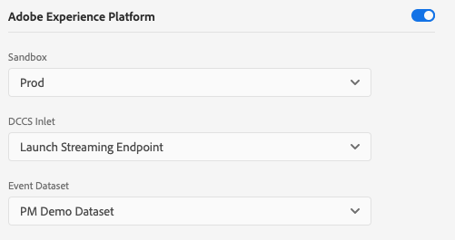
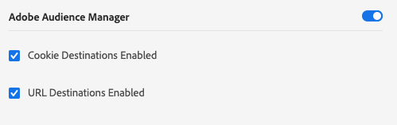

# Konfigurera ett datastream

Konfigurationen för Adobe Experience Platform Web SDK är uppdelad på två platser. [konfigurationskommandot](configuring-the-sdk.md) i SDK styr saker som måste hanteras på klienten, till exempel `edgeDomain`. Datastreams hanterar alla andra konfigurationer för SDK. När en begäran skickas till Adobe Experience Platform Edge Network används `edgeConfigId` för att referera till konfigurationen på serversidan. På så sätt kan du uppdatera konfigurationen utan att behöva göra kodändringar på webbplatsen.

Din organisation måste etableras för den här funktionen. Kontakta din Customer Success Manager (CSM) för att komma igång med tillåtelselista.

## Skapa en datastream-konfiguration

Datastreams kan skapas i användargränssnittet för datainsamling med hjälp av konfigurationsverktyget Datastream.

>[!NOTE]
>
>Konfigurationsverktyget för datastreams är tillgängligt för kunder på tillåtelselista oavsett om de använder Platform som tagghanterare eller inte. Dessutom kräver användare framkallningsbehörigheter. Mer information finns i artikeln [användarbehörigheter](../../tags/ui/administration/user-permissions.md) i taggdokumentationen.

Skapa en datastream genom att klicka på **[!UICONTROL New Datastream]** i skärmens övre högra del. När du har angett ett namn och en beskrivning ombeds du ange standardinställningarna för varje miljö. Tillgängliga inställningar anges nedan.

När du skapar en datastam skapas tre miljöer automatiskt med identiska inställningar. Dessa tre miljöer är *dev*, *stage* och *prod*. De matchar de tre standardmiljöerna för taggar. När du skapar ett taggbibliotek i en utvecklingsmiljö använder biblioteket automatiskt dev-miljön från din konfiguration. Du kan redigera inställningar i enskilda miljöer så mycket du vill.

Det ID som används i SDK som `edgeConfigId` är ett sammansatt ID som anger konfigurationen och miljön (till exempel `1c86778b-cdba-4684-9903-750e52912ad1:stage`). Om det inte finns någon miljö i det sammansatta ID:t (till exempel `stage` i föregående exempel) används produktionsmiljön.

Nedan visas de tillgängliga inställningarna för varje konfigurationsmiljö. De flesta avsnitt kan aktiveras eller inaktiveras. Inställningarna sparas men är inte aktiva när de är inaktiverade.

## [!UICONTROL Third Party ID] Inställningar

Avsnittet med tredje parts-ID är det enda avsnitt som alltid är aktivt. Det finns två tillgängliga inställningar: &quot;[!UICONTROL Third Party ID Sync Enabled]&quot; och &quot;[!UICONTROL Third Party ID Sync Container ID]&quot;.

### [!UICONTROL Third Party ID Sync Enabled]

Styr huruvida SDK utför identitetssynkroniseringar med tredjepartspartners eller inte.

### [!UICONTROL Third Party ID Sync Container ID]

ID-synkroniseringar kan grupperas i behållare så att olika ID-synkroniseringar kan köras vid olika tidpunkter. Detta styr vilken behållare för ID-synkronisering som körs för ett givet konfigurations-ID.

## Adobe Experience Platform-inställningar

Med inställningarna som anges här kan du skicka data till Adobe Experience Platform. Du bör bara aktivera det här avsnittet om du har köpt Adobe Experience Platform.

### [!UICONTROL Sandbox]

Sandlådor är platser i Adobe Experience Platform som gör att kunderna kan isolera sina data och implementeringar från varandra. Mer information om hur de fungerar finns i [dokumentationen till sandlådor](../../sandboxes/home.md).

### [!UICONTROL Streaming Inlet]

Ett inlopp för direktuppspelning är en HTTP-källa i Adobe Experience Platform. Dessa skapas under fliken [!UICONTROL Sources] i Adobe Experience Platform som ett HTTP-API.

### [!UICONTROL Event Dataset]

Datastreams har stöd för att skicka data till datauppsättningar som har ett schema av klassen [!UICONTROL Experience Event].

## Adobe Target-inställningar

Om du vill konfigurera Adobe Target måste du ange en klientkod. De andra fälten är valfria.

>[!NOTE]
>
>Organisationen som är associerad med klientkoden måste matcha organisationen där konfigurations-ID skapas.

### [!UICONTROL Client Code]

Unikt ID för ett målkonto. Du hittar detta genom att navigera till [!UICONTROL Adobe Target] > [!UICONTROL Setup]> [!UICONTROL Implementation] > [!UICONTROL edit settings] bredvid knappen [!UICONTROL download] för antingen [!UICONTROL at.js] eller [!UICONTROL mbox.js]

### [!UICONTROL Property Token]

[!DNL Target] låter kunderna styra behörigheter genom att använda egenskaper. Mer information finns i avsnittet [Enterprise Permissions](https://experienceleague.adobe.com/docs/target/using/administer/manage-users/enterprise/properties-overview.html) i [!DNL Target]-dokumentationen.

Egenskapstoken finns i [!UICONTROL Adobe Target] > [!UICONTROL setup] > [!UICONTROL Properties]

### [!UICONTROL Target Environment ID]

[Med ](https://experienceleague.adobe.com/docs/target/using/administer/hosts.html) Adobe Target kan du hantera implementeringen i alla utvecklingsfaser. Den här inställningen anger vilken miljö du ska använda för varje miljö.

Adobe rekommenderar att du anger detta på olika sätt för var och en av datastream-miljöerna `dev`, `stage` och `prod` för att hålla saker och ting enkla. Om du redan har definierat Adobe Target-miljöer kan du använda dessa.

## Adobe Audience Manager-inställningar

Allt som behövs för att skicka data till Adobe Audience Manager är att aktivera det här avsnittet. De andra inställningarna är valfria men rekommenderas.

### [!UICONTROL Cookie Destinations Enabled]

Tillåter SDK att dela segmentinformation via [Cookie-mål](https://experienceleague.adobe.com/docs/audience-manager/user-guide/features/destinations/custom-destinations/create-cookie-destination.html) från [!DNL Audience Manager].

### [!UICONTROL URL Destinations Enabled]

Tillåter SDK att dela segmentinformation via [URL-mål](https://experienceleague.adobe.com/docs/audience-manager/user-guide/features/destinations/custom-destinations/create-url-destination.html). Dessa konfigureras i [!DNL Audience Manager].

## Adobe Analytics-inställningar

Kontrollerar om data skickas till Adobe Analytics. Ytterligare information finns i [Analysöversikt](../data-collection/adobe-analytics/analytics-overview.md).

### [!UICONTROL Report Suite ID]

Rapportsviten finns i avsnittet Adobe Analytics Admin under [!UICONTROL Admin > ReportSuites]. Om flera rapportsviter anges kopieras data till varje rapportserie.
