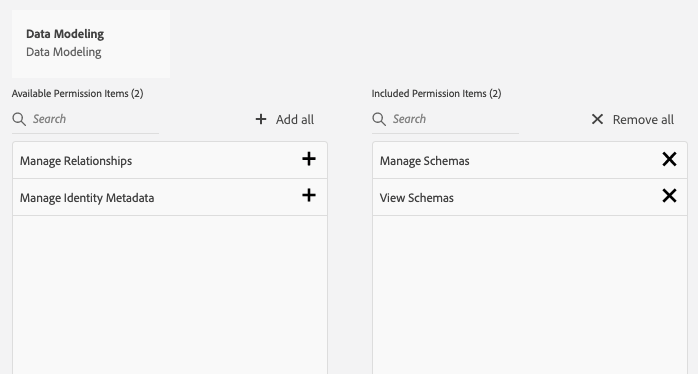

# Krav för att använda Adobe Experience Platform Web SDK

Om du vill använda Platform Web SDK måste du först:

- Låt din organisation tillhandahålla den här funktionen. (Det är kostnadsfritt att få tillgång till Platform Web SDK. Om du vill ha åtkomst kontaktar du din Customer Success Manager (CSM).)
- Vi rekommenderar att CNAME (1st-party domain) är aktiverat. Om du redan har en CNAME för Adobe Analytics bör du använda den. Testning under utveckling fungerar utan CNAME, men Adobe rekommenderar att du gör det innan du går till produktion. Även om en CNAME-implementering inte ger några fördelar när det gäller cookie-livstid kan den förhindra att vissa annonsblockerare och mindre vanliga webbläsare blockerar SDK-begäranden. I sådana fall kan användning av CNAME förhindra att datainsamlingen avbryts för användare som använder dessa verktyg.

>[!IMPORTANT]
>
>**Observera att från och med 11/10/20 har CNAME-implementeringar från första part en 7-dagars utgång på alla Safari-webbläsare och mobila iOS-enheter.**

- Var berättigad till Adobe Experience Platform. Om du inte har köpt Adobe Experience Platform ger Adobe dig tillgång till de tjänster du behöver för att använda SDK utan extra kostnad.
- Om din webbplats redan använder [Experience Cloud ID-tjänsten](https://experienceleague.adobe.com/docs/experience-platform/edge/identity/overview.html) på din webbplats, antingen via Visitor API eller Experience Cloud ID-tjänsttillägget i Adobe Experience Platform Launch, och du vill fortsätta använda den när du migrerar till Adobe Experience Platform Web SDK, måste du använda den senaste versionen av Visitor API eller Experience Cloud ID-tjänsttillägget. Mer information finns i [ID-migrering](https://experienceleague.adobe.com/docs/experience-platform/edge/identity/overview.html?lang=en#identity).

## Hantera behörigheter för Adobe Experience Platform Web SDK

Adobe Experience Platform kräver ingen speciell behörighet, men du måste ha behörighet [för att kunna skapa dina scheman i Adobe Experience Platform. ](https://experienceleague.adobe.com/docs/experience-platform/access-control/home.html?lang=en) De minimibehörigheter som någon behöver finns i kategorin Datamodellering och Identiteter.

I kategorin Datamodellering ger du användarna behörigheterna Hantera scheman och Visa scheman.

I kategorin Identity Management ger du användarna behörigheterna Hantera identitetsnamn och Visa identitetsnamnutrymmen.

