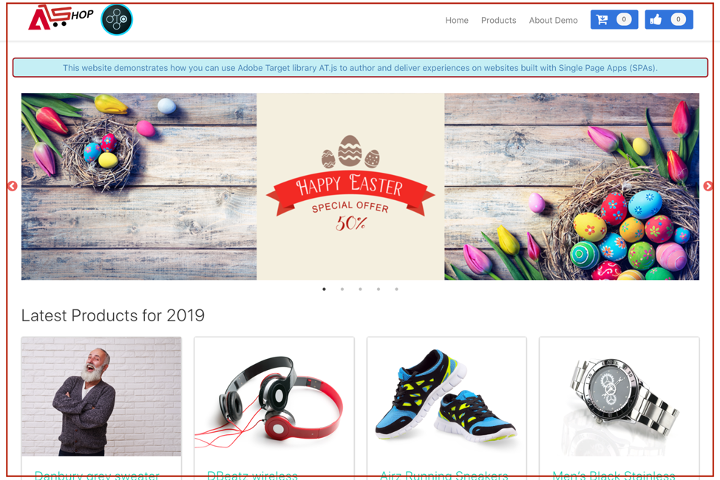
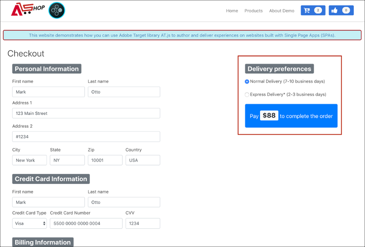
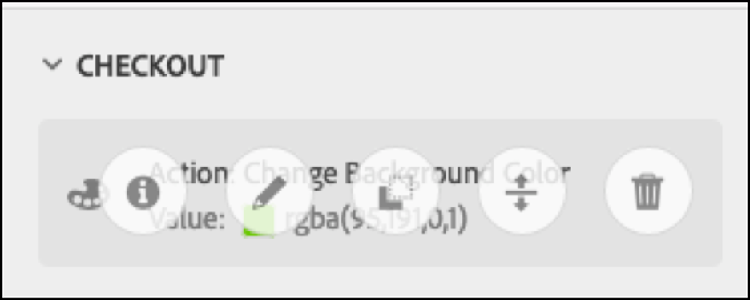

# Implementering av Single Page-program

Adobe Experience Platform Web SDK innehåller många funktioner som gör det möjligt för ditt företag att utföra personalisering på nästa generations klientteknik, som Single Page Applications (SPA).

Traditionella webbplatser arbetade på&quot;sida-till-sida&quot;-navigeringsmodeller, som annars kallas för flersidiga program, där webbplatsdesign var nära kopplad till webbadresser och övergångar mellan olika webbsidor kräver en sidladdning.

Moderna webbprogram, som Single Page-program, har i stället antagit en modell som möjliggör snabb användning av webbläsargränssnittsåtergivning, som ofta är oberoende av sidomladdning. De här upplevelserna kan triggas av kundinteraktioner som rullningar, klick och markörrörelser. I takt med att de moderna webbens paradigmer har utvecklats fungerar inte längre de traditionella generiska eventernas relevans, till exempel en sidladdning, för personalisering och experimenterande.


## Fördelar med Platform Web SDK för SPA

Nedan följer några fördelar med att använda Adobe Experience Platform Web SDK för Single Page-program:

* Möjlighet att cachelagra alla erbjudanden vid sidinläsning för att minska antalet serveranrop till ett enda serveranrop.
* Förbättra användarupplevelsen på webbplatsen avsevärt eftersom erbjudandena visas direkt via cachen utan fördröjning som introducerats av traditionella serveranrop.
* Med en enda kodrad och en gång-för-utvecklarkonfiguration kan marknadsförarna skapa och köra A/B- och Experience Targeting-aktiviteter (XT) via Visual Experience Composer (VEC) på era SPA.

## XDM-vyer och enkelsidiga program

Adobe Target VEC for SPA utnyttjar det nya konceptet Views: en logisk grupp visuella element som tillsammans utgör en SPA. Ett enda sidprogram kan därför betraktas som en övergång via Vyer, i stället för URL:er, baserat på användarinteraktioner. En vy kan vanligtvis representera en hel plats eller grupperade visuella element inom en plats.

För att ytterligare förklara vad Vyer är använder följande exempel en hypotetisk e-handelsplats online som implementerats i React för att utforska exempelvyer.

När du har navigerat till hemsidan befordrar en hjältebild en påskaffär samt de senaste produkterna på webbplatsen. I det här fallet kan en vy definieras för hela hemskärmen. Den här vyn kan helt enkelt kallas&quot;home&quot;.



När kunden blir mer intresserad av de produkter som företaget säljer bestämmer de sig för att klicka på länken **Produkter** . På samma sätt som hemsidan kan hela produktwebbplatsen definieras som en vy. Den här vyn kan heta&quot;products-all&quot;.


Eftersom en vy kan definieras som en hel webbplats eller som en grupp visuella element på en webbplats, kan de fyra produkter som visas på produktwebbplatsen grupperas och betraktas som en vy. Den här vyn kan heta &quot;products&quot;.


När kunden bestämmer sig för att klicka på knappen **Läs in mer** för att utforska fler produkter på webbplatsen ändras inte webbplatsens URL i det här fallet, men en vy kan skapas här för att representera endast den andra produktraden som visas. Vynamnet kan vara&quot;products-page-2&quot;.


Kunden bestämmer sig för att köpa några produkter från sajten och går vidare till kassan. På utcheckningssajten får kunden möjlighet att välja normal leverans eller expressleverans. En vy kan vara vilken grupp som helst av visuella element på en webbplats, så en vy kan skapas för leveransinställningar och kallas&quot;Leveransinställningar&quot;.



Begreppet Vyer kan utvidgas mycket mer än så. Detta är bara några exempel på vyer som kan definieras på en webbplats.

## Implementera XDM-vyer

XDM-vyer kan användas i Adobe Target för att marknadsförarna ska kunna köra A/B- och XT-tester på SPA via Visual Experience Composer. Detta kräver att du utför följande steg för att slutföra en engångsinstallation av en utvecklare:

1. Installera [Adobe Experience Platform Web SDK](../../fundamentals/installing-the-sdk.md)
2. Avgör alla XDM-vyer i Single Page-programmet som du vill anpassa.
3. När du har definierat XDM-vyerna implementerar du funktionen med `sendEvent()` inställningen `renderDecisions` `true` och motsvarande XDM-vy i Single Page-programmet för att kunna leverera AB- eller XT VEC-aktiviteter. XDM-vyn måste skickas `xdm.web.webPageDetails.viewName`. I det här steget kan marknadsförarna använda Visual Experience Composer för att starta A/B- och XT-tester för dessa XDM.

   ```javascript
   alloy("sendEvent",  { 
     "renderDecisions": true, 
     "xdm": { 
       "web": { 
         "webPageDetails": { 
            "viewName":"home" 
         }      
       } 
     } 
   });
   ```

>[!NOTE]
>
>Vid det första `sendEvent()` anropet hämtas och cachelagras alla XDM-vyer som ska återges för slutanvändaren. Efterföljande `sendEvent()` anrop med skickade XDM-vyer läses från cachen och återges utan ett serveranrop.

## `sendEvent()` funktionsexempel

I det här avsnittet beskrivs tre exempel på hur du anropar funktionen i React för en hypotetisk e-SPA. `sendEvent()`

### Exempel 1: Startsida för A/B-test

Marknadsföringsteamet vill köra A/B-tester på hela hemsidan.


För att köra A/B-tester på hela hemplatsen måste `sendEvent()` anropas med XDM `viewName` inställd på `home`:

```javascript
function onViewChange() { 
  
  var viewName = window.location.hash; // or use window.location.pathName if router works on path and not hash 

  viewName = viewName || 'home'; // view name cannot be empty 

  // Sanitize viewName to get rid of any trailing symbols derived from URL 

  if (viewName.startsWith('#') || viewName.startsWith('/')) { 
    viewName = viewName.substr(1); 
  }
   
  alloy("sendEvent",  { 
    "renderDecisions": true, 
    "xdm": { 
      "web": { 
        "webPageDetails": { 
          "viewName":"home" 
        } 
      } 
  }); 
} 

// react router v4 

const history = syncHistoryWithStore(createBrowserHistory(), store); 

history.listen(onViewChange); 

// react router v3 

<Router history={hashHistory} onUpdate={onViewChange} > 
```

### Exempel 2: Personaliserade produkter

Marknadsföringsteamet vill personalisera den andra produktraden genom att ändra prisetikettens färg till röd efter att användaren har klickat på **Läs in mer**.


```javascript
function onViewChange(viewName) { 

  alloy("sendEvent",  { 
    "renderDecisions": true, 
    "xdm": { 
       "web": { 
        "webPageDetails": { 
          "viewName": viewName
        }
      } 
    } 
  }); 
} 

class Products extends Component { 
  
  render() { 
    return ( 
      <button type="button" onClick={this.handleLoadMoreClicked}>Load more</button> 
    ); 
  } 

  handleLoadMoreClicked() { 
    var page = this.state.page + 1; // assuming page number is derived from component’s state 
    this.setState({page: page}); 
    onViewChange('PRODUCTS-PAGE-' + page); 
  } 

} 
```

### Exempel 3: Inställningar för A/B-testleverans

Marknadsföringsteamet vill köra ett A/B-test för att se om ändring av färgen på knappen från blå till röd när **expressleverans** är valt kan öka konverteringsgraden (i stället för att knappfärgen ska vara blå för båda leveransalternativen).


Om du vill anpassa innehållet på webbplatsen beroende på vilken leveransinställning som har valts, kan du skapa en vy för varje leveransinställning. När **Normal leverans** är markerat kan du ge vyn namnet&quot;checkout-normal&quot;. Om **Express Delivery** är markerat kan vyn heta &quot;checkout-express&quot;.

```javascript
function onViewChange(viewName) { 

  alloy("sendEvent",  { 
    "renderDecisions": true, 
    "xdm": { 
      "web": { 
        "webPageDetails": { 
          "viewName": viewName   
        }
      }
    }
  }); 
} 

class Checkout extends Component { 

  render() { 
    return ( 
      <div onChange={this.onDeliveryPreferenceChanged}> 
        <label> 
          <input type="radio" id="normal" name="deliveryPreference" value={"Normal Delivery"} defaultChecked={true}/> 
          <span> Normal Delivery (7-10 business days)</span> 
        </label> 
        <label> 
          <input type="radio" id="express" name="deliveryPreference" value={"Express Delivery"}/> 
          <span> Express Delivery* (2-3 business days)</span> 
        </label> 
      </div> 
    ); 
  } 

  onDeliveryPreferenceChanged(evt) { 
    var selectedPreferenceValue = evt.target.value; 
    onViewChange(selectedPreferenceValue); 
  } 

} 
```

## Använda Visual Experience Composer för en SPA

När du har definierat dina XDM-vyer och implementerat`sendEvent()` med de XDM-vyer som skickats in, kan VEC identifiera dessa vyer och låta användare skapa åtgärder och ändringar för A/B- eller XT-aktiviteter.

>[!NOTE]
>
>Om du vill använda Visual Experience Composer för SPA måste du installera [Adobe Target VEC Helper Chrome Extension](https://chrome.google.com/webstore/detail/adobe-target-vec-helper/ggjpideecfnbipkacplkhhaflkdjagak).

### Panelen Ändringar

På panelen Ändringar visas de åtgärder som har skapats för en viss vy. Alla åtgärder för en vy grupperas under den vyn.


### Åtgärder

Om du klickar på en åtgärd markeras elementet på platsen där den här åtgärden ska tillämpas. Varje VEC-åtgärd som skapas under en vy har följande ikoner: **Information**, **Redigera**, **Klona**, **Flytta** och **Ta bort**. Dessa ikoner förklaras närmare i följande tabell.



| Ikon | Beskrivning |
|---|---|
| Information | Visar information om åtgärden. |
| Redigera | Gör att du kan redigera åtgärdens egenskaper direkt. |
| Klona | Klona åtgärden till en eller flera vyer som finns på panelen Ändringar eller till en eller flera vyer som du har bläddrat till och navigerat till i VEC. Åtgärden behöver inte nödvändigtvis finnas på panelen Ändringar.<br/><br/>**Obs!** När en klonåtgärd har utförts måste du navigera till VEC via Browse (Visa i VEC) för att se om den klonade åtgärden var en giltig åtgärd. Om åtgärden inte kan tillämpas på vyn visas ett fel. |
| Flytta | Flyttar åtgärden till en sidinläsningshändelse eller någon annan vy som redan finns på panelen Ändringar.<br/><br/>**Sidinläsningshändelse:** Alla åtgärder som motsvarar sidans load-händelse tillämpas på den första sidinläsningen i webbprogrammet. <br/><br/>**Obs**! När du har flyttat måste du navigera till vyn i VEC via Browse för att se om flyttningen var en giltig åtgärd. Om åtgärden inte kan tillämpas på vyn visas ett fel. |
| Ta bort | Tar bort åtgärden. |

## Använda VEC för SPA exempel

I det här avsnittet beskrivs tre exempel på hur du använder Visual Experience Composer för att skapa åtgärder och ändringar för A/B- och XT-aktiviteter.

### Exempel 1: Uppdatera hemvyn

Tidigare i det här dokumentet definierades en vy med namnet&quot;home&quot; för hela hemsidan. Nu vill marknadsföringsteamet uppdatera vyn&quot;home&quot; på följande sätt:

* Ändra knapparna **Lägg till i kundvagn** och **gilla** till en ljusare del av blått. Detta bör inträffa vid sidinläsning eftersom det handlar om att ändra sidhuvudets komponenter.
* Ändra etiketten **Senaste produkter för 2019** till **Värdprodukter för 2019** och ändra textfärgen till lila.

Om du vill göra uppdateringarna i VEC väljer du **Disponera** och tillämpar ändringarna på hemvyn.


### Exempel 2: Ändra produktetiketter

I&quot;products-page-2&quot; View vill marknadsföringsteamet ändra **Price** -etiketten till **Sale Price** och ändra etikettfärgen till red.

Följande steg krävs för att göra uppdateringarna i VEC:

1. Välj **Bläddra** i VEC.
2. Välj **Produkter** i den översta navigeringen på webbplatsen.
3. Välj **Läs in mer** en gång för att visa den andra produktraden.
4. Välj **Disponera** i VEC.
5. Använd åtgärder för att ändra textetiketten till **Försäljningspris** och färgen till röd.


### Exempel 3: Anpassa format för leveransinställningar

Vyer kan definieras på en detaljnivå, till exempel ett läge eller ett alternativ från en alternativknapp. Tidigare i det här dokumentet har Vyer definierats för leveransinställningar,&quot;checkout-normal&quot; och&quot;checkout-express&quot;. Marknadsföringsteamet vill ändra knappfärgen till röd för vyn&quot;checkout-express&quot;.

Följande steg krävs för att göra uppdateringarna i VEC:

1. Välj **Bläddra** i VEC.
2. Lägg produkter i kundvagnen på sajten.
3. Välj kundvagnsikonen i webbplatsens övre högra hörn.
4. Välj **Checka ut din beställning**.
5. Välj **Express Delivery** -alternativknappen under **Delivery Preferences**.
6. Välj **Disponera** i VEC.
7. Ändra färg på knappen **Betala** till rött.

>[!NOTE]
>
>Vyn&quot;checkout-express&quot; visas inte på panelen Modifications (Ändringar) förrän alternativknappen **Express Delivery** är markerad. Detta beror på att`sendEvent()` funktionen körs när alternativknappen **Express Delivery** är markerad, och därför är VEC inte medveten om vyn &quot;checkout-express&quot; förrän alternativknappen är markerad.

