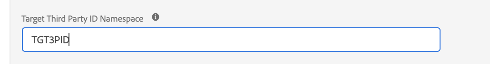

# Jämföra biblioteket at.js med Web SDK

## Översikt

I den här artikeln finns en översikt över skillnaderna mellan `at.js` bibliotek och Experience Platform Web SDK.

## Installera biblioteken

### Installera at.js

Vi låter våra kunder ladda ned biblioteket direkt från Adobe Experience Cloud på fliken Implementering. at.js-biblioteket är anpassat med inställningar som kunden har: clientCode, imsOrgId osv.

### Installera Web SDK

Den färdiga versionen finns på ett CDN. Du kan referera till biblioteket på CDN direkt på din sida eller hämta och lagra det på din egen infrastruktur. Den finns i minifierade och ominifierade format. Den ominiatyrversionen är användbar i felsökningssyfte.

URL-struktur: https://cdn1.adoberesources.net/alloy/[VERSION]/alloy.min.js OR alloy.js för den icke-minifierade versionen.

Exempel:

* Miniatyrbild: [https://cdn1.adoberesources.net/alloy/2.14.0/alloy.min.js](https://cdn1.adoberesources.net/alloy/2.14.0/alloy.min.js)
* Unminified: [https://cdn1.adoberesources.net/alloy/2.14.0/alloy.js](https://cdn1.adoberesources.net/alloy/2.14.0/alloy.js)

[Läs mer](../../fundamentals/installing-the-sdk.md)

## Konfigurera biblioteken

### Konfigurerar at.js

I slutet av varje at.js-fil hittar du ett avsnitt där vi instansierar och skickar ett inställningsobjekt. Det är anpassningsbart, och när vi laddar ned det fyller vi i avsnittet med aktuella kundinställningar.

```javascript
window.adobe.target.init(window, document, {
  "clientCode": "demo",
  "imsOrgId": "",
  "serverDomain": "localhost:5000",
  "timeout": 2000,
  "globalMboxName": "target-global-mbox",
  "version": "2.0.0",
  "defaultContentHiddenStyle": "visibility: hidden;",
  "defaultContentVisibleStyle": "visibility: visible;",
  "bodyHiddenStyle": "body {opacity: 0 !important}",
  "bodyHidingEnabled": true,
  "deviceIdLifetime": 63244800000,
  "sessionIdLifetime": 1860000,
  "selectorsPollingTimeout": 5000,
  "visitorApiTimeout": 2000,
  "overrideMboxEdgeServer": false,
  "overrideMboxEdgeServerTimeout": 1860000,
  "optoutEnabled": false,
  "optinEnabled": false,
  "secureOnly": false,
  "supplementalDataIdParamTimeout": 30,
  "authoringScriptUrl": "//cdn.tt.omtrdc.net/cdn/target-vec.js",
  "urlSizeLimit": 2048,
  "endpoint": "/rest/v1/delivery",
  "pageLoadEnabled": true,
  "viewsEnabled": true,
  "analyticsLogging": "server_side",
  "serverState": {},
  "decisioningMethod": "server-side",
  "legacyBrowserSupport":  false
});
```

[Läs mer](https://experienceleague.adobe.com/docs/target/using/implement-target/client-side/at-js-implementation/functions-overview/targetgobalsettings.html?lang=en)


### Konfigurera Web SDK

Konfigurationen för SDK görs med `configure` -kommando.

>[!IMPORTANT]
>
>`configure` är *alltid* det första kommandot anropades.

Exempel:

```javascript
alloy("configure", {
  "edgeConfigId": "ebebf826-a01f-4458-8cec-ef61de241c93",
  "orgId":"ADB3LETTERSANDNUMBERS@AdobeOrg"
});
```

Det finns många alternativ som kan anges under konfigurationen. Alla alternativ finns nedan, grupperade efter kategori.

[Läs mer](../../fundamentals/configuring-the-sdk.md)


## Hur man begär och automatiskt återger erbjudanden från Page Load Target

### Använda at.js

Använda at.js 2.x om du aktiverar inställningen `pageLoadEnabled`, kommer biblioteket att utlösa ett anrop till Target Edge med `execute -> pageLoad`. Om alla inställningar är inställda på standardvärden behövs ingen anpassad kodning. När at.js har lagts till på sidan och lästs in av webbläsaren körs ett Target Edge-anrop.

### Använda Web SDK

Innehåll som skapats i Adobe Target [Visual Experience Composer](https://experienceleague.adobe.com/docs/target/using/experiences/vec/visual-experience-composer.html) kan hämtas och återges automatiskt av SDK.

Om du vill begära och automatiskt återge erbjudanden från Target använder du `sendEvent` och ange `renderDecisions` alternativ till `true`. Om du gör det tvingas SDK att automatiskt återge allt anpassat innehåll som är kvalificerat för automatisk återgivning.

Exempel:

```javascript
alloy("sendEvent", {
  "renderDecisions": true,
  "xdm": {
    "commerce": {
      "order": {
        "purchaseID": "a8g784hjq1mnp3",
        "purchaseOrderNumber": "VAU3123",
        "currencyCode": "USD",
        "priceTotal": 999.98
      }
    }
  }
});
```

Experience Platform Web SDK skickar automatiskt ut ett meddelande med erbjudanden som kördes av WEB SDK. Det här är ett exempel på hur nyttolasten för en meddelandebegäran ser ut:

```json
{
  "events": [{
      "xdm": {
        "_experience": {
          "decisioning": {
            "propositions": [
              {
                "id": "AT:eyJhY3Rpdml0eUlkIjoiMTI3MDE5IiwiZXhwZXJpZW5jZUlkIjoiMCJ9",
                "scope": "cart",
                "scopeDetails": {
                  "decisionProvider": "TGT",
                  "activity": {
                    "id": "127019"
                  },
                  "experience": {
                    "id": "0"
                  },
                  "strategies": [
                    {
                      "step": "entry",
                      "algorithmID": "0",
                      "trafficType": "0"
                    },
                    {
                      "step": "display",
                      "algorithmID": "0",
                      "trafficType": "0"
                    }
                  ],
                  "characteristics": {
                    "eventToken": "bKMxJ8dCR1XlPfDCx+2vSGqipfsIHvVzTQxHolz2IpSCnQ9Y9OaLL2gsdrWQTvE54PwSz67rmXWmSnkXpSSS2Q=="
                  }
                }
              }
            ]
          }
        },
        "eventType": "display",
        "web": {
          "webPageDetails": {
            "viewName": "cart",
            "URL": "https://alloyio.com/personalizationSpa/cart"
          },
          "webReferrer": {
            "URL": ""
          }
        },
        "device": {
          "screenHeight": 800,
          "screenWidth": 1280,
          "screenOrientation": "landscape"
        },
        "environment": {
          "type": "browser",
          "browserDetails": {
            "viewportWidth": 1280,
            "viewportHeight": 284
          }
        },
        "placeContext": {
          "localTime": "2021-12-10T15:50:34.467+02:00",
          "localTimezoneOffset": -120
        },
        "timestamp": "2021-12-10T13:50:34.467Z",
        "implementationDetails": {
          "name": "https://ns.adobe.com/experience/alloy",
          "version": "2.6.2",
          "environment": "browser"
        }
      }
    }
  ]
}
```

[Läs mer](../rendering-personalization-content.md)

## Hur man begär och INTE automatiskt återger sidinläsningsmål

### Använda at.js

Det finns två sätt att ringa ett samtal till Target Edge som hämtar erbjudanden för sidinläsning.

Exempel 1:

```javascript
adobe.target.getOffer({
   mbox: "target-global-mbox", 
   success: console.log,
   error: console.error
});
```

Exempel 2:

```javascript
adobe.target.getOffers({
    request: {
      execute: {
        pageLoad: {}
    }
  }
})
.then(console.log)
.catch(console.error);
```

[Läs mer](https://experienceleague.adobe.com/docs/target/using/implement-target/client-side/at-js-implementation/functions-overview/cmp-atjs-functions.html?lang=en)

### Använda Web SDK

Kör en `sendEvent` kommando med ett särskilt omfång under `decisionScopes`: `__view__`. Vi använder det här omfånget som en signal för att hämta alla sidladdningsaktiviteter från Target och hämta alla vyer i förväg. Web SDK kommer även att försöka utvärdera alla VEC-vybaserade aktiviteter. Inaktivering av förhämtning av vy stöds för närvarande inte i Web SDK.

Om du vill få åtkomst till innehåll för personalisering kan du tillhandahålla en callback-funktion som anropas efter att SDK har fått ett lyckat svar från servern. Ditt återanrop är ett resultatobjekt som kan innehålla egenskapen propositioner som innehåller allt returnerat personaliseringsinnehåll.

Exempel:

```javascript
alloy("sendEvent", {
    xdm: {...},
    decisionScopes: ["__view__"]
  }).then(function(result) {
    if (result.propositions) {
      result.propositions.forEach(proposition => {
        proposition.items.forEach(item => {
          if (item.schema === HTML_SCHEMA) {
            // manually apply offer
            document.getElementById("form-based-offer-container").innerHTML =
              item.data.content;
            const executedPropositions = [
              {
                id: proposition.id,
                scope: proposition.scope,
                scopeDetails: proposition.scopeDetails
              }
            ];
          // manually send the display notification event, so that Target/Analytics impressions aare increased
            alloy("sendEvent",{
              "xdm": {
                "eventType": "decisioning.propositionDisplay",
                "_experience": {
                  "decisioning": {
                    "propositions": executedPropositions
                  }
                }
              }
            });
          }
        });
      });
    }
  });
```

[Läs mer](../rendering-personalization-content.md#manually-rendering-content)


## Hur man begär specifika formulärbaserade målmodeller


### Använda at.js

Du kan hämta formulärbaserade dispositionsaktiviteter med `getOffer` funktion:

Exempel 1:

```javascript
adobe.target.getOffer({
   mbox: "hero-banner", 
   success: console.log,
   error: console.error
});
```

Exempel 2:

```javascript
adobe.target.getOffers({
    request: {
      execute: {
        mboxes: [
        {
          index: 0,
          name: "hero-banner"
        }]
    }
  }
})
.then(console.log)
.catch(console.error);
```

[Läs mer](https://experienceleague.adobe.com/docs/target/using/implement-target/client-side/at-js-implementation/functions-overview/cmp-atjs-functions.html?lang=en)


### Använda Web SDK

Du kan hämta formulärbaserade dispositionsbaserade aktiviteter med `sendEvent` och skicka mbox-namnen under `decisionScopes` alternativ. The `sendEvent` -kommandot returnerar ett löfte som löses med ett objekt som innehåller de begärda aktiviteterna/förslagen: Det är så här `propositions` ser ut så här:

```javascript
[
  {
    "id": "AT:eyJhY3Rpdml0eUlkIjoiNDM0Njg5IiwiZXhwZXJpZW5jZUlkIjoiMCJ9",
    "scope": "hero-banner",
    "scopeDetails": {
      "decisionProvider": "TGT",
      "activity": {
        "id": "434689"
      },
      "experience": {
        "id": "0"
      },
      "strategies": [
        {
          "algorithmID": "0",
          "trafficType": "0"
        }
      ],
      "characteristics": {
        "eventToken": "2lTS5KA6gj4JuSjOdhqUhGqipfsIHvVzTQxHolz2IpTMromRrB5ztP5VMxjHbs7c6qPG9UF4rvQTJZniWgqbOw=="
      }
    },
    "items": [
      {
        "id": "1184844",
        "schema": "https://ns.adobe.com/personalization/html-content-item",
        "meta": {
          "geo.state": "bucuresti",
          "activity.id": "434689",
          "experience.id": "0",
          "activity.name": "a4t test form based activity",
          "offer.id": "1184844",
          "profile.tntId": "04608610399599289452943468926942466370-pybgfJ"
        },
        "data": {
          "id": "1184844",
          "format": "text/html",
          "content": "<div> analytics impressions </div>"
        }
      }
    ]
  },
  {
    "id": "AT:eyJhY3Rpdml0eUlkIjoiNDM0Njg5IiwiZXhwZXJpZW5jZUlkIjoiMCJ9",
    "scope": "hero-banner",
    "scopeDetails": {
      "decisionProvider": "TGT",
      "activity": {
        "id": "434689"
      },
      "characteristics": {
        "eventToken": "E0gb6q1+WyFW3FMbbQJmrg=="
      }
    },
    "items": [
      {
        "id": "434689",
        "schema": "https://ns.adobe.com/personalization/measurement",
        "data": {
          "type": "click",
          "format": "application/vnd.adobe.target.metric"
        }
      }
    ]
  }
]
```

Exempel:

```javascript
alloy("sendEvent", {
  xdm: { ...},
  decisionScopes: ["hero-banner"]
}).then(function (result) {
  var propositions = result.propositions;

  if (propositions) {
    // Find the discount proposition, if it exists.
    for (var i = 0; i < propositions.length; i++) {
      var proposition = propositions[i];
      for (var j = 0; j < proposition.items; j++) {
        var item = proposition.items[j];
        if (item.schema === HTML_SCHEMA) {
          // apply offer
          document.getElementById("form-based-offer-container").innerHTML =
            item.data.content;
          const executedPropositions = [
            {
              id: proposition.id,
              scope: proposition.scope,
              scopeDetails: proposition.scopeDetails
            }
          ];

          alloy("sendEvent", {
            "xdm": {
              "eventType": "decisioning.propositionDisplay",
              "_experience": {
                "decisioning": {
                  "propositions": executedPropositions
                }
              }
            }
          });
        }
      }
    }
  }
});
```

[Läs mer](../rendering-personalization-content.md#manually-rendering-content)

## Tillämpa Target-aktiviteterna

### Använda at.js

Du kan använda Target-aktiviteterna med `applyOffers` funktion: `adobe.target.applyOffer(options)`

Exempel:

```javascript
adobe.target.getOffers({...})
  .then(response => adobe.target.applyOffers({ response: response }))
  .then(() => console.log("Success"))
  .catch(error => console.log("Error", error));
```

Läs mer om `applyOffers` från [dedikerad dokumentation](https://experienceleague.adobe.com/docs/target/using/implement-target/client-side/at-js-implementation/functions-overview/adobe-target-applyoffers-atjs-2.html?lang=en).


### Använda Web SDK

Du kan använda Target-aktiviteterna med `applyPropositions` -kommando.

Exempel:

```javascript
alloy("applyPropositions", {
    propositions: [...]
});
```

Läs mer om `applyPropositions` från [dedikerad dokumentation](../../personalization/rendering-personalization-content.md#applypropositions).

## Spåra händelser

### Använda at.js

Du kan spåra händelser med hjälp av `trackEvent` funktion eller använda `sendNotifications`.

Den här funktionen utlöser en begäran om att rapportera användaråtgärder, till exempel klickningar och konverteringar. Den levererar inte någon verksamhet som svar.


**Exempel 1**

```javascript
adobe.target.trackEvent({ 
    "type": "click",
    "mbox": "some-mbox"
});
```

**Exempel 2**

```javascript
adobe.target.sendNotifications({ 
    request: {
       notifications: [{
          ...,
          mbox: {
            name: "some-mbox"
          },
          type: "click",
          ...
       }]
    }
});
```

[Läs mer](https://experienceleague.adobe.com/docs/target/using/implement-target/client-side/at-js-implementation/functions-overview/adobe-target-trackevent.html?lang=en)

### Använda Web SDK

Du kan spåra händelser och användaråtgärder genom att anropa `sendEvent` kommando, fylla i `_experience.decisioning.propositions` XDM-fältgrupp och inställning av `eventType` till ett av två värden:

* `decisioning.propositionDisplay`: Signalerar målaktivitetens återgivning.
* `decisioning.propositionInteract`: Signalerar en användarinteraktion med aktiviteten, som ett musklick.

The `_experience.decisioning.propositions` XDM-fältgruppen är en array med objekt. Egenskaperna för varje objekt hämtas från `result.propositions` som returneras i `sendEvent` kommando: `{ id, scope, scopeDetails }`

**Exempel 1 - Spåra en `decisioning.propositionDisplay` händelse efter återgivning av en aktivitet**

```javascript
alloy("sendEvent", {
  xdm: {},
  decisionScopes: ['discount']
}).then(function(result) {
  var propositions = result.propositions;

  var discountProposition;
  if (propositions) {
    // Find the discount proposition, if it exists.
    for (var i = 0; i < propositions.length; i++) {
      var proposition = propositions[i];
      if (proposition.scope === "discount") {
        discountProposition = proposition;
        break;
      }
    }
  }

  if (discountProposition) {
    // Find the item from proposition that should be rendered.
    // Rather than assuming there a single item that has HTML
    // content, find the first item whose schema indicates
    // it contains HTML content.
    for (var j = 0; j < discountProposition.items.length; j++) {
      var discountPropositionItem = discountProposition.items[i];
      if (discountPropositionItem.schema === "https://ns.adobe.com/personalization/html-content-item") {
        var discountHtml = discountPropositionItem.data.content;
        // Render the content
        var dailySpecialElement = document.getElementById("daily-special");
        dailySpecialElement.innerHTML = discountHtml;
        
        // For this example, we assume there is only a single place to update in the HTML.
        break;  
      }
    }
      // Send a "decisioning.propositionDisplay" event signaling that the proposition has been rendered.
    alloy("sendEvent", {
      xdm: {
        eventType: "decisioning.propositionDisplay",
        _experience: {
          decisioning: {
            propositions: [
              {
                id: discountProposition.id,
                scope: discountProposition.scope,
                scopeDetails: discountProposition.scopeDetails
              }
            ]
          }
        }
      }
    });
  }
});
```

**Exempel 2 - Spåra en `decisioning.propositionInteract` händelse efter att klickmätaren har inträffat**

```javascript
alloy("sendEvent", {
  xdm: { ...},
  decisionScopes: ["hero-banner"]
}).then(function (result) {
  var propositions = result.propositions;

  if (propositions) {
    // Find the discount proposition, if it exists.
    for (var i = 0; i < propositions.length; i++) {
      var proposition = propositions[i];
      for (var j = 0; j < proposition.items.length; j++) {
        var item = proposition.items[j];

        if (item.schema === "https://ns.adobe.com/personalization/measurement") {
          // add metric to the DOM element
          const button = document.getElementById("form-based-click-metric");

          button.addEventListener("click", event => {
            const executedPropositions = [
              {
                id: proposition.id,
                scope: proposition.scope,
                scopeDetails: proposition.scopeDetails
              }
            ];
            // send the click track event
            alloy("sendEvent", {
              "xdm": {
                "eventType": "decisioning.propositionInteract",
                "_experience": {
                  "decisioning": {
                    "propositions": executedPropositions
                  }
                }
              }
            });
          });
        }
      }
    }
  }
});
```

[Läs mer](../rendering-personalization-content.md#manually-rendering-content)

## Så här utlöser du en vyändring i ett enkelsidigt program

### Använda at.js

Använd `adobe.target.triggerView` funktion. Den här funktionen kan anropas när en ny sida läses in eller när en komponent på en sida återges på nytt. adobe.target.triggerView() ska implementeras för enkelsidiga program (SPA) för att använda Visual Experience Composer (VEC) för att skapa A/B-tester och XT-aktiviteter (Experience Targeting). Om adobe.target.triggerView() inte implementeras på platsen kan VEC inte användas för SPA.

**Exempel**

```javascript
adobe.target.triggerView("homeView")
```

[Läs mer](https://experienceleague.adobe.com/docs/target/using/implement-target/client-side/at-js-implementation/functions-overview/adobe-target-triggerview-atjs-2.html?lang=en)


### Använda Web SDK

Om du vill aktivera eller signera ett enda program anger du inställningen `web.webPageDetails.viewName` egenskapen under `xdm` alternativ för `sendEvent` -kommando. Web SDK kontrollerar visningscachen om det finns erbjudanden för `viewName` anges i `sendEvent` kommer att köra dem och skicka en händelse för visningsmeddelanden.

**Exempel**

```javascript
alloy("sendEvent", {
  renderDecisions: true,
  xdm:{
    web:{
      webPageDetails:{
        viewName: "homeView"
      }
    }
  }
});
```

[Läs mer](./spa-implementation.md#implementing-xdm-views)

## Så här använder du svarstoken

Personaliseringsinnehåll som returneras från Adobe Target innehåller [svarstoken](https://experienceleague.adobe.com/docs/target/using/administer/response-tokens.html), som är information om aktivitet, erbjudande, upplevelse, användarprofil, geoinformation med mera. Dessa uppgifter kan delas med verktyg från tredje part eller användas för felsökning. Svarstoken kan konfigureras i Adobe Target användargränssnitt.

### Använda at.js

Använd anpassade at.js-händelser för att lyssna efter Target-svaret och läsa svarstoken.

**Exempel**

```javascript
document.addEventListener(adobe.target.event.REQUEST_SUCCEEDED, function(e) { 
  console.log("Request succeeded", e.detail); 
}); 
```

[Läs mer](https://experienceleague.adobe.com/docs/target/using/administer/response-tokens.html?lang=en)


### Använda Web SDK

>[!IMPORTANT]
>
>Kontrollera att du använder Platform Web SDK version 2.6.0 eller senare.

Svarstoken returneras som en del av `propositions` som exponeras i resultatet av `sendEvent` -kommando. Varje förslag innehåller en array med `items`och varje objekt har `meta` objekt ifyllda med svarstoken om de är aktiverade i gränssnittet för måladministratörer. [Läs mer](https://experienceleague.adobe.com/docs/target/using/administer/response-tokens.html?lang=en)

**Exempel**

```javascript
alloy("sendEvent", {
    renderDecisions: true,
    xdm: {}
  }).then(function(result) {
    if (result.propositions) {
      // Format of result.propositions:
      /*
        [
            {
                "id": "",
                "scope": "",
                "items": [
                    {
                        "id": "",
                        "schema": "",
                        "data": {},
                        "meta": { // RESPONSE TOKENS
                            "activity.name": ...,
                            "offer.id": ...,
                            "profile.activeActivities": ...
                        }
                    }
                ],
                "scopeDetails": {}
                "renderAttempted": false
            }
        ]
      */
    }
  });
```

[Läs mer](./accessing-response-tokens.md)

## Hantera flimmer

### Använda at.js

Med at.js kan du hantera flimmer genom att ange `bodyHidingEnabled: true` så att at.js är den som tar hand om att fördölja de personaliserade behållarna innan den hämtar och tillämpar DOM-ändringarna.
Sidavsnitten som innehåller anpassat innehåll kan döljas i förväg genom att åsidosätta at.js `bodyHiddenStyle`.
Som standard `bodyHiddenStyle` döljer hela HTML `body`.
Båda inställningarna kan åsidosättas med `window.targetGlobalSettings`. `window.targetGlobalSettings` ska placeras före inläsning på .js.

### Använda Web SDK

Med hjälp av Web SDK kan kunden ställa in sin tidigare dolda stil i kommandot configure, som i exemplet nedan:

```javascript
alloy("configure", {
  edgeConfigId: "configurationId",
  orgId: "orgId@AdobeOrg",
  debugEnabled: true,
  prehidingStyle: "body { opacity: 0 !important }"
});
```

När du läser in ett asynkront Web SDK rekommenderar vi att följande utdrag matas in på sidan innan Web SDK matas in:

```html
<script>
  !function(e,a,n,t){
  if (a) return;
  var i=e.head;if(i){
  var o=e.createElement("style");
  o.id="alloy-prehiding",o.innerText=n,i.appendChild(o),
  setTimeout(function(){o.parentNode&&o.parentNode.removeChild(o)},t)}}
  (document, document.location.href.indexOf("adobe_authoring_enabled") !== -1, "body { opacity: 0 !important }", 3000);
</script>
```

## Hur hanteras A4T

### Använda at.js

Det finns två typer av A4T-loggning som stöds med at.js:

* Loggning på klientsidan för Analytics
* Analytics Server Side Logging

#### Loggning på klientsidan för Analytics

**Exempel 1: Använda global inställning för mål**

Loggning på klientsidan kan aktiveras med inställningar `analyticsLogging: client_side` i at.js-inställningarna eller genom att åsidosätta `window.targetglobalSettings` -objekt.
När det här alternativet är konfigurerat ser nyttolastens format ut så här:

```json
{
  "analytics": {
    "payload": {
      "pe": "tnt",
      "tnta": "167169:0:0|0|100,167169:0:0|2|100,167169:0:0|1|100"
    }
  }
}
```

Nyttolasten kan sedan vidarebefordras till Analytics via API:t för datainmatning.

Exempel 2: Konfigurera den i varje `getOffers` funktion:

```javascript
adobe.target.getOffers({
      request: {
        experienceCloud: {
          analytics: {
            logging: "client_side"
          }
        },
        prefetch: {
          mboxes: [{
            index: 0,
            name: "a1-serverside-xt"
          }]
        }
      }
    })
    .then(console.log)
```

Så här ser svarsnyttolasten ut:

```json
{
  "prefetch": {
    "mboxes": [{
      "index": 0,
      "name": "a1-serverside-xt",
      "options": [{
        "content": "",
        "type": "html",
        "eventToken": "n/K05qdH0MxsiyH4gX05/2qipfsIHvVzTQxHolz2IpSCnQ9Y9OaLL2gsdrWQTvE54PwSz67rmXWmSnkXpSSS2Q==",
        "responseTokens": {
          "profile.memberlevel": "0",
          "geo.city": "bucharest",
          "activity.id": "167169",
          "experience.name": "USA Experience",
          "geo.country": "romania"
        }
      }],
      "analytics": {
        "payload": {
          "pe": "tnt",
          "tnta": "167169:0:0|0|100,167169:0:0|2|100,167169:0:0|1|100"
        }
      }
    }]
  }
}
```

Analysens nyttolast (`tnta` token) bör ingå i Analytics-träffen med [API för datainfogning](https://github.com/AdobeDocs/analytics-1.4-apis/blob/master/docs/data-insertion-api/index.md).

#### Analytics Server Side Logging

Loggning på serversidan kan aktiveras genom inställning `analyticsLogging: server_side` i at.js-inställningarna eller genom att åsidosätta `window.targetglobalSettings` -objekt.
Data flödar sedan enligt följande:


[Läs mer](https://experienceleague.adobe.com/docs/target/using/integrate/a4t/a4timplementation.html?lang=en)

### Använda Web SDK

Web SDK har även stöd för:

* Loggning på klientsidan för Analytics
* Loggning på serversidan i Analytics

#### Loggning på klientsidan för Analytics

Loggning på klientsidan för Analytics är aktiverat när Adobe Analytics är inaktiverat för den DataStream-konfigurationen.


Kunden har tillgång till analystoken (`tnta`) som behöver delas med Analytics med [API för datainfogning](https://github.com/AdobeDocs/analytics-1.4-apis/blob/master/docs/data-insertion-api/index.md)
genom att kedja `sendEvent` och iterera genom den resulterande proposition-arrayen.

**Exempel**

```javascript
alloy("sendEvent", {
    "renderDecisions": true,
    "xdm": {
      "web": {
        "webPageDetails": {
          "name": "Home Page"
        }
      }
    }
  }
).then(function (results) {
  var analyticsPayloads = new Set();
  for (var i = 0; i < results.propositions.length; i++) {
    var proposition = results.propositions[i];
    var renderAttempted = proposition.renderAttempted;

    if (renderAttempted === true) {
      var analyticsPayload = getAnalyticsPayload(proposition);
      if (analyticsPayload !== undefined) {
        analyticsPayloads.add(analyticsPayload);
      }
    }
  }
  var analyticsPayloadsToken = concatenateAnalyticsPayloads(analyticsPayloads);
  // send the page view Analytics hit with collected Analytics payload using Data Insertion API
});
```

Här följer ett diagram som visar hur dataflöden när Analytics Client Side är aktiverat:


#### Analytics Server Side Logging

Loggning på analysserversidan aktiveras när Analytics är aktiverat för den DataStream-konfigurationen.


När loggning av analys på serversidan är aktiverat, måste A4T-nyttolasten delas med Analytics så att Analytics-rapporten visar korrekta visningar och konverteringar på Experience Edge-nivå, så att kunden inte behöver göra någon ytterligare bearbetning.

Så här flödar data in i våra system när loggning av serveranalys är aktiverat:


## Ange globala inställningar för mål

### Använda at.js

Du kan åsidosätta inställningarna i at.js-biblioteket med `window.targetGlobalSettings`i stället för att konfigurera inställningarna i gränssnittet för målstandard/Premium eller genom att använda REST API:er.

Åsidosättningen bör definieras innan at.js läses in eller i Administration > Implementering > Redigera at.js-inställningar > Kodinställningar > Bibliotekshuvud.

Exempel:

```javascript
window.targetGlobalSettings = {  
   timeout: 200, // using custom timeout  
   visitorApiTimeout: 500, // using custom API timeout  
   enabled: document.location.href.indexOf('https://www.adobe.com') >= 0 // enabled ONLY on adobe.com  
};
```

[Läs mer](https://experienceleague.adobe.com/docs/target/using/implement-target/client-side/at-js-implementation/functions-overview/targetgobalsettings.html?lang=en)

### Använda Web SDK

Den här funktionen stöds inte i Web SDK.

## Så här uppdaterar du attribut för målprofil

### Använda at.js

**Exempel 1**

```javascript
adobe.target.getOffer({
   mbox: "target-global-mbox",
   params: {
     "profile.name": "test",
     "profile.gender": "female"
   },
   success: console.log,
   error: console.error
});
```

**Exempel 2**

```javascript
adobe.target.getOffers({
    request: {
      execute: {
        pageLoad: {
          profileParameters: {
            name: "test",
            gender: "female"
          }
        }
    }
  }
})
.then(console.log)
.catch(console.error);
```

### Använda Web SDK

Om du vill uppdatera en målprofil använder du `sendEvent` och ange `data.__adobe.target` egenskap, prefixera nyckelnamn med `profile`.

**Exempel**

```javascript
alloy("sendEvent", {
  renderDecisions: true,
  data: {
    __adobe: {
      target: {
        "profile.gender": "female",
        "profile.age": 30
      }
    }
  }
});
```

## Hur använder jag Target Recommendations?

### Använda at.js

**Exempel 1**

```javascript
adobe.target.getOffer({
   mbox: "target-global-mbox",
   params: {
     "entity.name": "T-shirt",
     "entity.id": "1234"
   },
   success: console.log,
   error: console.error
});
```

**Exempel 2**

```javascript
adobe.target.getOffers({
    request: {
      execute: {
        pageLoad: {
          parameters: {
            "entity.name": "T-shirt",
            "entity.id": "1234"
          }
        }
    }
  }
})
.then(console.log)
.catch(console.error);
```

[Läs mer](https://experienceleague.adobe.com/docs/target/using/implement-target/client-side/at-js-implementation/functions-overview/adobe-target-getoffers-atjs-2.html?lang=en)


### Använda Web SDK

Om du vill skicka rekommendationsdata använder du `sendEvent` och ange `data.__adobe.target` egenskap, prefixera nyckelnamn med `entity`.

**Exempel**

```javascript
alloy("sendEvent", {
  renderDecisions: true,
  data: {
    __adobe: {
      target: {
        "entity.name": "T-shirt",
        "entity.id": "1234"
      }
    }
  }
});
```

## Hur använder jag ID:n från tredje part?

### Använda at.js

Med at.js finns det flera sätt att skicka `mbox3rdPartyId`, använda `getOffer` eller `getOffers`:

**Exempel 1**

```javascript
adobe.target.getOffer({
  mbox:"test",
  params:{
    "mbox3rdPartyId": "1234"
  },
  success: console.log,
  error: console.error
});
```

**Exempel 2**

```javascript
adobe.target.getOffers({
    request: {
      id:{
        thirdPartyId: "1234"
      },
      execute: {
        pageLoad: {}
    }
  }
})
.then(console.log)
.catch(console.error);
```

Eller så finns det ett sätt att konfigurera `mbox3rdPartyId` antingen `targetPageParams` eller `targetPageParamsAll`.
När du anger det `targetPageParams`, skickas den i förfrågningarna om `target-global-mbox` också känd som `pag-lLoad`.
Rekommendationen ska anges med `targetPageParamsAll` som det skickas i varje målbegäran.
Fördelen med att använda `targetPageParamsAll` är att du kan definiera `mbox3rdPartyId` på sidan en gång, vilket säkerställer att alla målförfrågningar har rätt `mbox3rdPartyId`.

```javascript
window.targetPageParamsAll = function() {
      return {
        "mbox3rdPartyId": "1234"
      };
    };
```

```javascript
window.targetPageParams = function() {
  return {
    "mbox3rdPartyId": "1234"
  };
};
```

[Läs mer](https://experienceleague.adobe.com/docs/target/using/implement-target/client-side/at-js-implementation/functions-overview/targetpageparams.html?lang=en)

### Använda Web SDK

Web SDK har stöd för tredjeparts-ID som mål. Det krävs dock några steg till. Innan vi ger oss in i lösningen bör vi prata lite om `identityMap`.
Med identitetskartan kan kunderna skicka flera identiteter. Alla identiteter har ett namn. Varje namnutrymme kan ha en eller flera identiteter. En viss identitet kan markeras som primär.
Med den här kunskapen i åtanke kan vi se vilka steg som krävs för att konfigurera web sdk så att det använder tredje parts-ID som mål.

1. Ange det namnutrymme som ska innehålla mål-ID:t för tredje part i dataströmskonfigurationsvyn:



1. Skicka identitetsnamnutrymmet i alla sendEvent-kommandon så här:

```javascript
alloy("sendEvent", {
  "renderDecisions": true,
  "xdm": {
    "identityMap": {
      "TGT3PID": [
        {
          "id": "1234",
          "primary": true
        }
      ]
    }
  }
});
```

## Hur anger jag egenskapstoken?

### Använda at.js

Med at.js finns det två sätt att konfigurera egenskapstoken, antingen med `targetPageParams` eller `targetPageParamsAll`. Använda `targetPageParams` lägger till egenskapstoken i `target-global-mbox` anrop, men med `targetPageParamsAll` lägger till token i alla målanrop:

**Exempel 1**

```javascript
   window.targetPageParamsAll = function() {
      return {
        "at_property": "1234"
      };
    };
```

**Exempel 2**

```javascript
window.targetPageParams = function() {
      return {
        "at_property": "1234"
      };
    };
```

### Använda Web SDK

Med Web SDK kan kunderna ställa in egenskapen på en högre nivå, när de ställer in dataströmskonfigurationen, under Adobe Target namnutrymme:

Det innebär att alla Target-anrop för den specifika dataströmskonfigurationen kommer att innehålla den egenskapstoken som anges.

## Hur förhämtar jag mbox-filer

### Använda at.js

Den här funktionen är bara tillgänglig i at.js 2.x. at.js 2.x har en ny funktion som heter `getOffers`. `getOffers` gör det möjligt för kunderna att förhämta innehåll för en eller flera mbox-filer. Här är ett exempel:

```javascript
adobe.target.getOffers({
    request: {
      prefetch: {
        mboxes: [{
          index: 0,
          name: "test-mbox",
          parameters: {
            ...
          },
          profileParameters: {
            ...
          }
        }]
    }
  }
})
.then(console.log)
.catch(console.error);
```

OBS! Vi rekommenderar att du alltid `mbox` i `mboxes` arrayen har ett eget index. Vanligtvis har den första mbox `index=0`, nästa `index=1`, osv.

### Använda Web SDK

Den här funktionen stöds för närvarande inte i Web SDK.

## Hur felsöker jag implementeringen av mitt mål?

### Använda at.js

At.js visar dessa felsökningsfunktioner:

* Inaktivera Mbox - Inaktivera Target från hämtning och återgivning för att kontrollera om sidan har brutits utan Target-interaktioner
* Mbox Debug - at.js loggar varje åtgärd
* Målspårning - med en mbox trace-token som genereras i Bullseye finns ett trace-objekt med information som ingår i beslutsprocessen under `window.___target_trace` object

Obs! Alla dessa felsökningsfunktioner är tillgängliga med förbättrade funktioner i [Adobe Experience Platform Debugger](https://chrome.google.com/webstore/detail/adobe-experience-platform/bfnnokhpnncpkdmbokanobigaccjkpob)

### Använda Web SDK

Du har flera felsökningsfunktioner när du använder Web SDK:

* Använda [Griffon](https://aep-sdks.gitbook.io/docs/beta/project-griffon)
* [Felsökning för Web SDK har aktiverats](../../../edge/fundamentals/debugging.md)
* Använd [Webbövervakningskopplingar för SDK](https://github.com/adobe/alloy/wiki/Monitoring-Hooks)
* Använd [Adobe Experience Platform Debugger](../../../debugger/home.md)
* Målspårning
