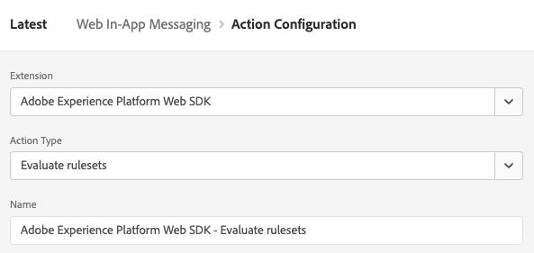

# Konfigurera stöd för webb-meddelanden i appen i Web SDK


Meddelanden i appen är meddelanden som du kan skicka till användare i ditt webbprogram och vägleda dem till specifika intressepunkter.

Du kan använda de här meddelandena för olika syften, till exempel för att marknadsföra nya funktioner, presentera specialerbjudanden eller för att underlätta användarnas introduktion.

Genom att använda meddelanden i appen kan ni effektivt interagera med era målgrupper och styra dem mot viktiga aspekter av er applikation.

>[!IMPORTANT]
>
>Web In-App Messaging är en [Adobe Journey Optimizer](https://experienceleague.adobe.com/docs/journey-optimizer/using/ajo-home.html) som använder Web SDK för att leverera personaliserat innehåll.
>
>Detaljerade instruktioner om hur du konfigurerar din kampanj för webb-meddelanden i appen finns i [Adobe Journey Optimizer-dokumentation](https://experienceleague.adobe.com/docs/journey-optimizer/using/in-app/create-in-app-web.html).


## Förutsättningar {#prerequisites}

### Tilläggsversion för Web SDK-tagg {#extension-version}

Meddelandefunktionen i appen kräver den senaste versionen av taggtillägget Web SDK.

### Konfigurera en CSP för webbmeddelanden i appen {#csp}

När du konfigurerar [Webb-meddelanden i appen](../personalization/web-in-app-messaging.md)måste du ta med följande direktiv i din CSP:

```
default-src  blob:;
```

Mer information om hur du konfigurerar en CSP finns i [dedikerad dokumentation](../fundamentals/configuring-a-csp.md).

## Konfigurera webb-meddelanden i appen med hjälp av taggtillägget Web SDK {#tag-extension}

Se [Konfigurationssida för SDK-taggtillägg](../../tags/extensions/client/web-sdk/web-sdk-extension-configuration.md) för att förstå var du hittar inställningarna som beskrivs nedan.

Efter att du har [installerat](../../tags/extensions/client/web-sdk/web-sdk-extension-configuration.md#install-the-web-sdk-tag-extension) följer du stegen nedan för att konfigurera tillägget för Web In-app Messaging i webbtillägget för SDK-taggen.

I **[!UICONTROL Personalization]** -avsnittet, kontrollera **[!UICONTROL Enable personalization storage]** alternativ. Med det här alternativet kan Web SDK hålla reda på vilka upplevelser användaren har sett över sidinläsningar.


Meddelanden i appen stöder två typer av utlösare:

* [Skicka data till plattform](#send-data-platform)
* [Manuellt utlösa meddelandena](#manual-trigger)

Se följande avsnitt för att konfigurera Web SDK-taggtillägget enligt de utlösare som du vill använda.

### Konfigurationssteg för **[!UICONTROL Send data to Platform]** trigger {#send-data-platform}

Välj taggegenskapen som innehåller ditt Web SDK-tillägg, och [skapa en ny regel](../../tags/ui/managing-resources/rules.md##create-a-rule) med följande inställningar:

1. **[!UICONTROL Extension]**: [!UICONTROL Core]
2. **[!UICONTROL Event Type]**: [!UICONTROL Library Loaded (Page Top)]

   

3. Välj **[!UICONTROL Keep Changes]** för att spara händelsekonfigurationen.

Sedan måste du lägga till en åtgärd i regeln som du skapade.

1. I [!DNL Actions] avsnitt, markera **[!UICONTROL Add]**.
   

2. Använd följande **[!UICONTROL Action]** inställningar:
   * **[!UICONTROL Extension]**: [!UICONTROL Adobe Experience Platform Web SDK]
   * **[!UICONTROL Action Type]**: [!UICONTROL Send event]

     

3. På skärmens högra sida, i **[!UICONTROL Personalization]** -sektion, aktivera **[!UICONTROL Render visual personalization decisions]** alternativ.
   

4. På skärmens högra sida, i **[!UICONTROL Decision context]** -avsnittet, definiera **[!UICONTROL Key]**/**[!UICONTROL Value]** par som du använde i din kampanjkonfiguration för att kvalificera dig för meddelandet i appen.
   

5. Välj **[!UICONTROL Keep Changes]** för att spara konfigurationen.


Sedan måste du lägga till den nyligen skapade regeln i taggegenskapsbiblioteket. För att göra detta, gå till **[!UICONTROL Publishing Flow]** och markera regeln som du skapade tidigare.


När du har lagt till regeln i biblioteket väljer du **[!UICONTROL Save & Build to Development]**.


Konfigurationsprocessen är nu slutförd och meddelandet är klart att visas för användarna.

### Konfigurationssteg för att använda manuella utlösare {#manual-trigger}

Välj taggegenskapen som innehåller ditt Web SDK-tillägg, och [skapa en ny regel](../../tags/ui/managing-resources/rules.md##create-a-rule) med följande inställningar:

1. **[!UICONTROL Extension]**: [!UICONTROL Core]
2. **[!UICONTROL Event Type]**: [!UICONTROL Click]
3. Ange utlösaren för ett specifikt element på sidan, identifieraren av en CSS-väljare som du väljer.

   


Sedan måste du lägga till en åtgärd i regeln som du skapade.

1. I [!DNL Actions] avsnitt, markera **[!UICONTROL Add]**.
   

2. Använd följande **[!UICONTROL Action]** inställningar:
   * **[!UICONTROL Extension]**: [!UICONTROL Adobe Experience Platform Web SDK]
   * **[!UICONTROL Action Type]**: [!UICONTROL Evaluate rulesets]

     

3. På skärmens högra sida aktiverar du **[!UICONTROL Render visual personalization decisions]** alternativ.
   


4. På skärmens högra sida, i **[!UICONTROL Decision context]** -avsnittet, definiera **[!UICONTROL Key]**/**[!UICONTROL Value]** par som du använde i din kampanjkonfiguration för att kvalificera dig för meddelandet i appen.
   

5. Välj **[!UICONTROL Keep Changes]** för att spara konfigurationen.

Sedan måste du lägga till den nyligen skapade regeln i taggegenskapsbiblioteket. För att göra detta, gå till **[!UICONTROL Publishing Flow]** och markera regeln som du skapade tidigare.


När du har lagt till regeln i biblioteket väljer du **[!UICONTROL Save & Build to Development]**.


Konfigurationsprocessen är nu slutförd och meddelandet är klart att visas för användarna.

## Konfigurera Web In-App Messaging med JavaScript-biblioteket för Web SDK {#js-library}

Ett alternativ till att använda taggtillägget Web SDK är att konfigurera Web In-App Messaging direkt från JavaScript-biblioteket för Web SDK.


Du kan visa webb-i-app-meddelanden från Adobe Journey Optimizer på två sätt.

### Metod 1: Hämta personaliseringsinnehåll automatiskt {#automatic}

Om du vill att Web SDK automatiskt ska hämta personaliseringsinnehållet på sidan ska du använda `sendEvent` som i exemplet nedan.

```js
  alloy("sendEvent", {
      renderDecisions: true,
      personalization: {
          surfaces: ['#welcome']
      }
  });
```

### Metod 2: Hämta personaliseringsinnehållet manuellt baserat på användaråtgärd {#manual}

Om du bara vill visa personaliseringsinnehållet efter att användaren har utfört en viss åtgärd använder du `evaluateRulesets` som i exemplet nedan.

I det här exemplet visas personaliseringsinnehållet när en användare klickar på **[!UICONTROL Buy Now]** på din webbplats.

```js
 alloy("evaluateRulesets", {
     renderDecisions: true,
     personalization: {
         decisionContext: {
             "userAction": "buy_now"
         }
     }
 });
```

### Konfigurera personaliseringslagring {#personalization-storage}

Du kan välja att visa meddelanden i appen för användarna ett visst antal gånger, eller varje gång de besöker en sida via `personalizationStorageEnabled` konfigurationsalternativ.

I [Web SDK-konfiguration](../fundamentals/configuring-the-sdk.md) ange `personalizationStorageEnabled` efter behov:

* `personalizationStorageEnabled: true` utlöser meddelandet i appen med den frekvens som du definierade i [Adobe Journey Optimizer - kampanj](https://experienceleague.adobe.com/docs/journey-optimizer/using/in-app/create-in-app-web.html#configure-inapp).
* `personalizationStorageEnabled: false` utlöser meddelandet i appen vid varje sidinläsning.