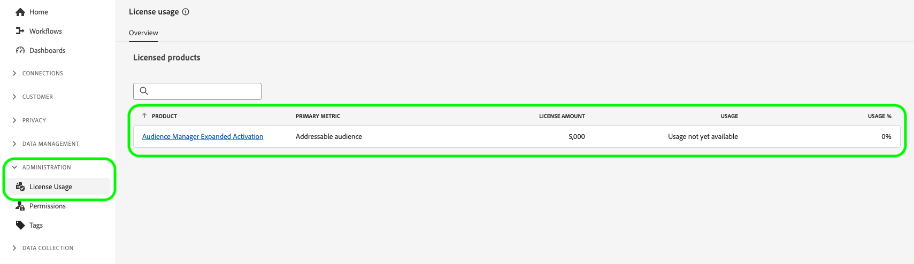

# Kontoadministration

Om du vill importera målgrupper från Audience Manager och aktivera dem för sociala medier och annonser måste du först skapa ett utökat användarkonto för aktivering och tilldela kontot rätt behörighetsroll.

På den här sidan beskrivs hur du skapar ett användarkonto i Admin Console och tilldelar rätt behörigheter för utökad aktivering.

## Skapa användarkonton {#create-users}

Innan du kan använda [!DNL Audience Manager Expanded Activation]måste du skapa ett användarkonto.

Skapa ett användarkonto för [!DNL Expanded Activation]följer du instruktionerna för att hantera användare från [Adobe Admin Console](https://helpx.adobe.com/enterprise/using/manage-users-individually.html) dokumentation.

## Lägg till användare i behörighetsrollen {#permissions}

När du har skapat ett användarkonto måste du lägga till det i [!DNL Expanded Activation] behörighetsroll, i [!DNL Expanded Activation] användargränssnitt.

Gå till **[!UICONTROL Administration]** -> **[!UICONTROL Permissions]** -> **[!UICONTROL Roles]** och väljer **[!UICONTROL Expanded Activation Default Role]**.

Gå till **[!UICONTROL Users]** och markera **[!UICONTROL Add Users]**.

Markera den nyskapade användaren i listan och välj **[!UICONTROL Save]**.

Användarkontot har nu skapats och tilldelats till rätt roll. Nu kan du komma åt **[!UICONTROL Expanded Activation]** användargränssnitt.

## Övervaka licensanvändning {#license-usage}

Dina [!DNL Audience Manager Expanded Activation] kontraktet anger maximalt antal hashkodade e-postmeddelanden som du kan importera till ditt konto.

Du kan hitta den här informationen genom att gå till **[!UICONTROL Administration]** -> **[!UICONTROL License Usage]** sida.

På den här sidan hittar du följande information:

* **[!UICONTROL Product]**: Den Adobe-produkt du har licens för. Det här kommer alltid att **[!UICONTROL Audience Manager Expanded Activation]**.
* **[!UICONTROL Primary metric]**: Namnet på det mätvärde som spåras för användning. Det här kommer alltid att **[!UICONTROL Addressable audience]**.
* **[!UICONTROL License amount]**: Maximalt antal hash-kodade e-postmeddelanden som du har licens att importera.

  >[!TIP]
  >
  >Du har hashat e-postmeddelanden genom [Audience Manager-källanslutning](../sources/connectors/adobe-applications/audience-manager.md). Läs dokumentationen om [aktivera målgrupper](activate-audiences.md) för mer information.

* **[!UICONTROL Usage]**: antalet hash-kodade e-postmeddelanden som du har kapslat.
* **[!UICONTROL Usage %]**: den procentandel av licensbeloppet som du har använt.

Mer information om licensanvändning i Experience Platform finns i [dokumentation om licensanvändning](../dashboards/guides/license-usage.md).

## Nästa steg {#next-steps}

Nu när du har konfigurerat minst ett användarkonto med rätt åtkomst till utökad aktivering kan du börja använda kontot för att [aktivera målgrupper](activate-audiences.md).
