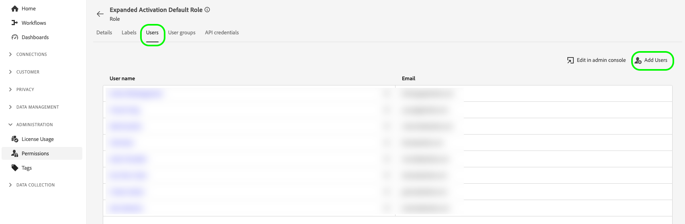

# Kontoadministration

Om du vill importera målgrupper från Audience Manager och aktivera dem för sociala medier och annonser måste du först skapa ett utökat användarkonto för aktivering och tilldela kontot rätt behörighetsroll.

På den här sidan beskrivs hur du skapar ett användarkonto i Admin Console och tilldelar rätt behörigheter för utökad aktivering.

## Skapa användarkonton {#create-users}

Du måste skapa ett användarkonto innan du kan använda [!DNL Audience Manager Expanded Activation].

Om du vill skapa ett användarkonto för [!DNL Expanded Activation] följer du anvisningarna om hur du hanterar användare i [Adobe Admin Console](https://helpx.adobe.com/enterprise/using/manage-users-individually.html) -dokumentationen.

## Lägg till användare i behörighetsrollen {#permissions}

När du har skapat ett användarkonto måste du lägga till det i behörighetsrollen [!DNL Expanded Activation] i användargränssnittet för [!DNL Expanded Activation].

Gå till **[!UICONTROL Administration]** -> **[!UICONTROL Permissions]** -> **[!UICONTROL Roles]** och välj **[!UICONTROL Expanded Activation Default Role]**.

Gå till fliken **[!UICONTROL Users]** och välj **[!UICONTROL Add Users]**.

Markera den nyskapade användaren i listan och välj **[!UICONTROL Save]**.

Användarkontot har nu skapats och tilldelats till rätt roll. Det går nu att komma åt användargränssnittet **[!UICONTROL Expanded Activation]**.

## Övervaka licensanvändning {#license-usage}

Ditt [!DNL Audience Manager Expanded Activation]-kontrakt anger det maximala antalet hash-kodade e-postmeddelanden som du kan importera till ditt konto.

Du kan hitta den här informationen genom att gå till sidan **[!UICONTROL Administration]** -> **[!UICONTROL License Usage]**.

På den här sidan hittar du följande information:

* **[!UICONTROL Product]**: Den Adobe-produkt som du har licens för. Det här kommer alltid att vara **[!UICONTROL Audience Manager Expanded Activation]**.
* **[!UICONTROL Primary metric]**: Namnet på det mätvärde som spåras för användning. Det här kommer alltid att vara **[!UICONTROL Addressable audience]**.
* **[!UICONTROL License amount]**: Det maximala antalet hash-kodade e-postmeddelanden som du har licens att importera.

  >[!TIP]
  >
  >Du skickade hashade e-postmeddelanden via [Audience Manager-källkopplingen](../sources/connectors/adobe-applications/audience-manager.md). Mer information finns i dokumentationen om [hur du aktiverar målgrupper](activate-audiences.md).

* **[!UICONTROL Usage]**: antalet hash-kodade e-postmeddelanden som du har kapslat.
* **[!UICONTROL Usage %]**: den procentandel av licensbeloppet som du har använt.

Mer information om licensanvändning i Experience Platform finns i [licensanvändningsdokumentationen](../dashboards/guides/license-usage.md).

## Nästa steg {#next-steps}

Nu när du har konfigurerat minst ett användarkonto med rätt åtkomst till utökad aktivering kan du börja använda kontot för att [aktivera målgrupper](activate-audiences.md).
