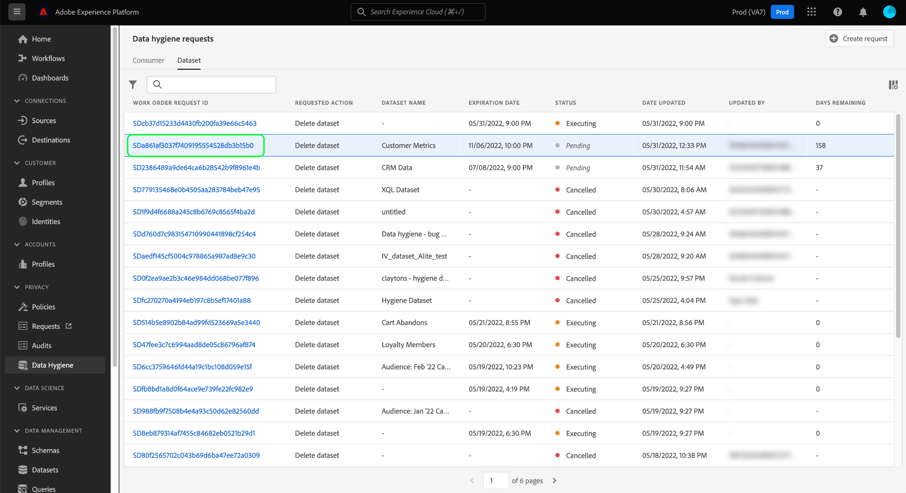

# Bläddra bland arbetsorder för datahygien {#browse-work-orders}

>[!CONTEXTUALHELP]
>id="platform_hygiene_workorders"
>title="ID för arbetsorder"
>abstract="När en begäran om datahygien skickas till systemet skapas en arbetsorder för att utföra den begärda uppgiften. En arbetsorder representerar med andra ord en specifik datahygienprocess, som omfattar dess aktuella status och andra relaterade detaljer. Varje arbetsorder tilldelas automatiskt ett eget unikt ID när den skapas."
>text="See the data hygiene UI guide to learn more."

>[!IMPORTANT]
>
>Datahygien i Adobe Experience Platform är för närvarande endast tillgänglig för organisationer som har köpt **Adobe Healthcare Shield** eller **Adobe Privacy &amp; Security Shield**.

När en begäran om datahygien skickas till systemet skapas en arbetsorder för att utföra den begärda uppgiften. En arbetsorder representerar en specifik datahygienprocess, t.ex. ett schemalagt utgångsdatum för datauppsättningen, som inkluderar dess aktuella status och andra relaterade detaljer.

Den här guiden beskriver hur du visar och hanterar befintliga arbetsorder i Adobe Experience Platform användargränssnitt.

## Visa och filtrera befintliga arbetsorder

När du först öppnar **[!UICONTROL Data Hygiene]** i användargränssnittet visas en lista över befintliga arbetsorder tillsammans med deras grundläggande information.

![Bilden visar [!UICONTROL Data Hygiene] arbetsytan i plattformsgränssnittet](../images/ui/browse/work-order-list.png)

I listan visas endast arbetsorder för en kategori i taget. Välj **[!UICONTROL Consumer]** om du vill visa en lista över postborttagningsuppgifter och **[!UICONTROL Dataset]** om du vill visa en lista över schemalagda förfallodatum för datauppsättningar.

![Bilden visar [!UICONTROL Dataset] tab](../images/ui/browse/dataset-tab.png)

Markera trattecknet () om du vill visa en lista med filter för de arbetsorder som visas.

Beroende på vilken typ av arbetsordning du visar finns det olika filteralternativ.

### Filter för postborttagning

Följande filter gäller för postborttagningsbegäranden:

| Filter | Beskrivning |
| --- | --- |
| [!UICONTROL Status] | Filtrera baserat på arbetsorderns aktuella status:<ul><li>**[!UICONTROL Completed]**: Jobbet har slutförts.</li><li>**[!UICONTROL Failed]**: Ett fel uppstod och jobbet kunde inte slutföras.</li><li>**[!UICONTROL Processing]**: Begäran har startats och bearbetas för närvarande.</li></ul> |
| [!UICONTROL Date created] | Filtrera baserat på när arbetsordern skapades. |
| [!UICONTROL Date updated] | Filtrera baserat på när arbetsordern senast uppdaterades. Skapanden räknas som uppdateringar. |

### Filter för datauppsättningens förfallodatum

Följande filter gäller för datauppsättningens förfallobegäranden:

| Filter | Beskrivning |
| --- | --- |
| [!UICONTROL Status] | Filtrera baserat på arbetsorderns aktuella status:<ul><li>**[!UICONTROL Completed]**: Jobbet har slutförts.</li><li>**[!UICONTROL Pending]**: Jobbet har skapats men har inte körts än. A [förfallobegäran för datauppsättning](./dataset-expiration.md) antar denna status före det schemalagda raderingsdatumet. När borttagningsdatumet har passerats uppdateras statusen till [!UICONTROL Executing] om inte jobbet har avbrutits i förväg.</li><li>**[!UICONTROL Executing]**: Datauppsättningens förfallobegäran har startats och bearbetas för närvarande.</li><li>**[!UICONTROL Cancelled]**: Jobbet har avbrutits som en del av en manuell användarbegäran.</li></ul> |
| [!UICONTROL Date created] | Filtrera baserat på när arbetsordern skapades. |
| [!UICONTROL Expiration date] | Förfrågningar om förfallodatum för filterdatauppsättningen baserat på det schemalagda raderingsdatumet för den aktuella datauppsättningen. |
| [!UICONTROL Date updated] | Filtrera baserat på när arbetsordern senast uppdaterades. Skapanden och förfallodatum räknas som uppdateringar. |

{style=&quot;table-layout:auto&quot;}

## Visa information om en arbetsorder {#view-details}

>[!CONTEXTUALHELP]
>id="platform_hygiene_statusbyservice"
>title="Status per tjänst"
>abstract="Förfrågningar om datahygien behandlas oberoende av olika Experience Platform-tjänster. I det här avsnittet beskrivs den aktuella bearbetningsstatusen för begäran för varje tjänst. Mer information finns i användargränssnittshandboken för datahygien."

>[!CONTEXTUALHELP]
>id="platform_hygiene_numberofidentities"
>title="Antal identiteter"
>abstract="Antalet identiteter vars poster har begärts att uppdateras eller tas bort som en del av den här arbetsordern. De identiteter som ingår i antalet kanske inte finns i de datauppsättningar som påverkas. Mer information finns i användargränssnittshandboken för datahygien."

>[!CONTEXTUALHELP]
>id="platform_hygiene_responsemessages"
>title="Spela in borttagningssvar"
>abstract="När en postborttagningsprocess får ett svar från systemet, visas dessa meddelanden under **[!UICONTROL Result]** -avsnitt. Om ett problem uppstår medan en arbetsorder bearbetas visas eventuella felmeddelanden i det här avsnittet som hjälper dig att felsöka problemet. Mer information finns i användargränssnittsguiden för datahygien."

Markera ID:t för en listad arbetsorder om du vill visa information om den.

Beroende på vilken typ av arbetsordning du har valt visas olika information och kontroller. Dessa beskrivs i avsnitten nedan.

### Information om radering av post {#record-delete}

Information om en begäran om radering av post inkluderar dess aktuella status och den tid som gått sedan begäran gjordes. Varje begäran innehåller även **[!UICONTROL Status by service]** som ger information om status för varje tjänst längre fram i kedjan som ingår i borttagningen. På den högra listen kan du använda kontroller för att uppdatera arbetsorderns namn och beskrivning.

### Information om förfallodatum för datauppsättning {#dataset-expiration}

Detaljsidan för en datauppsättnings förfallodatum innehåller information om dess grundläggande attribut, inklusive det schemalagda förfallodatumet på de dagar som återstår innan borttagningen sker. I den högra listen kan du använda kontroller för att redigera eller avbryta förfallotiden.

## Nästa steg

I den här guiden beskrivs hur du visar och hanterar befintliga arbetsbeställningar för datahygien i användargränssnittet för plattformen. Mer information om hur du skapar egna arbetsorder finns i följande dokumentation:

* [Hantera förfallodatum för datauppsättning](./dataset-expiration.md)
* [Hantera postborttagningar](./record-delete.md)
