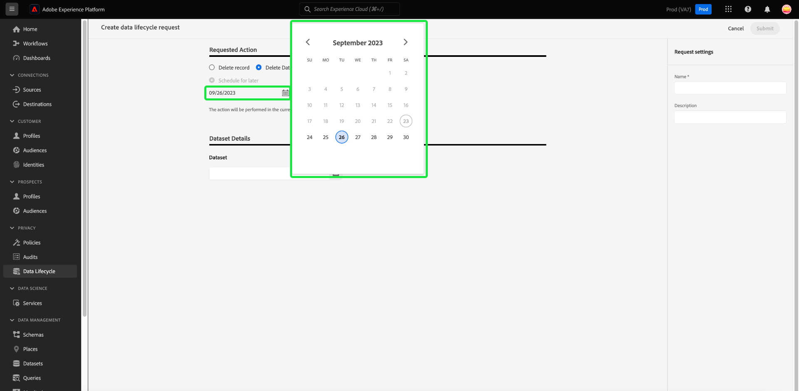

# Automatiska förfallodatum för datauppsättningar {#dataset-expiration}

>[!CONTEXTUALHELP]
>id="platform_privacyConsole_scheduleDatasetExpiration_description"
>title="Ta bort oönskade eller utgångna kundposter och datauppsättningar"
>abstract="<h2>Beskrivning</h2>
Om du vill hantera livscykeln för dina Experience Platform-data som inte har att göra med efterlevnad av gällande bestämmelser, kan du ta bort konsumentposter och schemalägga förfallodatum för datauppsättningar. Mer information om hur du skapar eller hanterar förfrågningar från registrerade personer finns i avsnittet om att uppfylla förfrågningar om personlig integritet.
"

The [[!UICONTROL Data Lifecycle] arbetsyta](./overview.md) i Adobe Experience Platform UI kan du schemalägga förfallotider för datauppsättningar. När en datauppsättning når sitt förfallodatum startar datasjön, identitetstjänsten och kundprofilen i realtid separata processer för att ta bort datauppsättningens innehåll från sina respektive tjänster. När data har tagits bort från alla tre tjänsterna markeras förfallotiden som slutförd.

>[!WARNING]
>
>Om en datauppsättning är inställd på att förfalla måste du manuellt ändra alla dataflöden som kan inhämta data till datauppsättningen så att dina efterföljande arbetsflöden inte påverkas negativt.

Det här dokumentet beskriver hur du schemalägger och automatiserar förfallodatum för datauppsättningar i plattformsgränssnittet.

>[!NOTE]
>
>Datamängdens förfallodatum tar för närvarande inte bort data från Adobe Experience Platform Edge Network. Det finns dock ingen möjlighet att data finns kvar i Edge Network när datauppsättningen har satts till att upphöra. Detta beror på att 15-dagars servicelicensavtalet för förfallodatum för datauppsättning överlappar den 14-dagarsperiod då data finns i Edge Network innan de tas bort.

## Schemalägg ett förfallodatum för datauppsättning {#schedule-dataset-expiration}

>[!CONTEXTUALHELP]
>id="platform_privacyConsole_scheduleDatasetExpiration_instructions"
>title="Instruktioner"
>abstract="<ul><li>Välj <a href="https://experienceleague.adobe.com/docs/experience-platform/hygiene/ui/overview.html">Datas livscykel</a> i den vänstra navigeringen väljer du <b>Skapa förfrågan</b>.</li><li>Om du vill ta bort poster:</li>   <li>Välj <b>Post</b>.</li>   <li>Välj en specifik datauppsättning att ta bort poster från eller välj alternativet att ta bort dem från alla datauppsättningar.</li>   <li>Ange identiteten på de konsumenter vars register ska raderas. Välj <b>Lägg till identitet</b> för att tillhandahålla identiteterna en i taget eller välja <b>Välj filer</b> om du vill överföra en JSON-fil med identiteter i stället.</li>   <li>Välj vid behov <b>Mall</b> för att visa det förväntade formatet för JSON-filen.</li><li>Se dokumentationen för instruktioner om du vill <a href="https://experienceleague.adobe.com/docs/experience-platform/hygiene/ui/dataset-expiration.html#schedule-dataset-expiration">schemats förfallodatum för datauppsättningar</a>.</li></ul>"

Om du vill skapa en förfrågan väljer du **[!UICONTROL Create request]** från huvudsidan på arbetsytan.

>[!IMPORTANT]
>
Användare av Real-Time CDP, Adobe Journey Optimizer och Customer Journey Analytics har 20 väntande arbetsorder för schemalagda datauppsättningar. Användare av hälso- och sjukvårdsskölden och skölden för skydd av privatlivet och privatlivet har 50 väntande schemalagda arbetsorder för förfallodatum. Det innebär att du kan ha 20 eller 50 datauppsättningar schemalagda att tas bort när som helst. Om du t.ex. har 20 schemalagda förfallodatum för datauppsättningar och en datauppsättning ska tas bort i morgon, kan du inte ange fler förfallodatum förrän den datauppsättningen har tagits bort.

![The [!UICONTROL Data Lifecycle] arbetsyta med [!UICONTROL Create request] markerad.](../images/ui/ttl/create-request-button.png)

Arbetsflödet för att skapa en begäran visas. Under [!UICONTROL Requested Action] avsnitt, markera **[!UICONTROL Delete Dataset]** för att uppdatera kontrollerna för förfalloschemaläggning av datauppsättningar.

![Arbetsflödet för att skapa begäran med [!UICONTROL Delete dataset] markerat alternativ.](../images/ui/ttl/dataset-selected.png)

### Välj ett datum och en datauppsättning {#select-date-and-dataset}

Under **[!UICONTROL Requested Action]** väljer du ett datum som du vill att datauppsättningen ska tas bort av. Du kan ange datumet manuellt (i formatet `mm/dd/yyyy`) eller välj kalenderikonen () för att välja datumet i en dialogruta.

Nästa, under **[!UICONTROL Dataset Details]**, markerar du databasikonen () för att öppna en dialogruta för val av datauppsättning. Välj en datauppsättning i listan som du vill tillämpa förfallodatumet på och välj sedan **[!UICONTROL Done]**.

![The [!UICONTROL Select dataset] dialogruta med en datauppsättning vald och [!UICONTROL Done] markerad.](../images/ui/ttl/select-dataset.png)

>[!NOTE]
>
Endast datauppsättningar som tillhör den aktuella sandlådan visas.

### Skicka begäran {#submit-request}

The [!UICONTROL Dataset Details] fyller i så att den primära identiteten och schemat för den valda datauppsättningen inkluderas. Under **[!UICONTROL Request settings]**, ange ett namn och en valfri beskrivning för begäran, följt av **[!UICONTROL Submit]**.

![En slutförd förfallobegäran för datauppsättning med [!UICONTROL Request settings] och [!UICONTROL Submit] markerad knapp.](../images/ui/ttl/submit.png)

A [!UICONTROL Confirm request] visas. Du ombeds bekräfta datauppsättningens namn och det datum då datauppsättningen ska tas bort av. Välj **[!UICONTROL Submit]** för att fortsätta.

När begäran har skickats skapas en arbetsorder och visas på huvudfliken i [!UICONTROL Data Lifecycle] arbetsyta. Härifrån kan du övervaka arbetsorderns status medan den bearbetar begäran.

>[!NOTE]
>
Se översiktsavsnittet i [tidslinjer och genomskinlighet](../home.md#dataset-expiration-transparency) om du vill ha information om hur datauppsättningens förfallodatum behandlas när de har körts.

## Redigera eller avbryta en förfallotid för en datauppsättning {#edit-or-cancel}

Om du vill redigera eller avbryta en förfallotid för en datauppsättning väljer du **[!UICONTROL Dataset]** på arbetsytans huvudsida och välj datauppsättningens förfallodatum i listan.

På informationssidan om datauppsättningens förfallodatum, visar den högra listen kontroller för att redigera eller avbryta den schemalagda borttagningen.

## Nästa steg

I det här dokumentet beskrivs hur du schemalägger förfallodatum för datauppsättningar i användargränssnittet i Experience Platform. Mer information om hur du utför andra datamängdsåtgärder i användargränssnittet finns i [överblick över användargränssnittet för datalängd](./overview.md).

Om du vill lära dig hur du schemalägger förfallodatum för datauppsättningar med API:t för datahygien kan du läsa [Slutpunktshandbok för datauppsättningens förfallodatum](../api/dataset-expiration.md).
