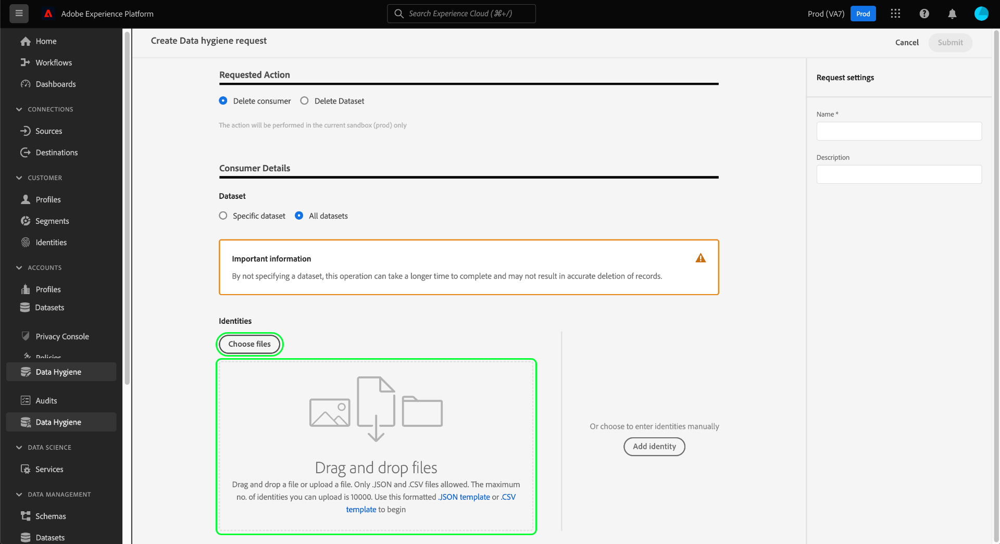
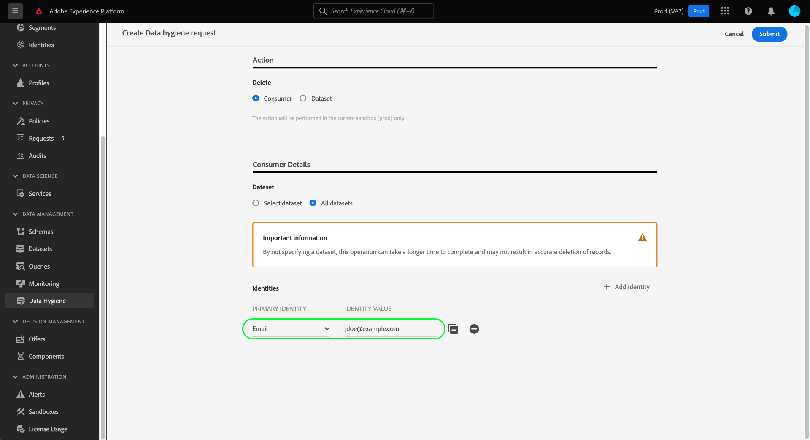

# Ta bort konsumentposter

>[!IMPORTANT]
>
>Begäran om att ta bort kunder är endast tillgänglig för organisationer som har köpt Adobe Healthcare Shield eller Privacy Shield.

The [[!UICONTROL Data Hygiene] arbetsyta](./overview.md) i Adobe Experience Platform UI kan du ta bort konsumentposter som ingår i identitetstjänsten och kundprofilen i realtid.

## Förutsättningar

Att ta bort konsumentposter kräver en fungerande förståelse för hur identitetsfält fungerar i Experience Platform. Du måste känna till de primära identitetsvärdena för de konsumenter vars poster du vill ta bort, beroende på vilken datauppsättning (eller vilka datauppsättningar) du tar bort dem från.

Mer information om identiteter i Platform finns i följande dokumentation:

* [Adobe Experience Platform Identity Service](../../identity-service/home.md): Överbryggar identiteter mellan enheter och system och länkar samman datauppsättningar baserat på de identitetsfält som definieras av XDM-scheman som de följer.
   * [Identitetsnamnutrymmen](../../identity-service/namespaces.md): Identitetsnamnutrymmen definierar de olika typerna av identitetsinformation som kan relateras till en person, och är en obligatorisk komponent för varje identitetsfält.
* [Kundprofil i realtid](../../profile/home.md): Använder konsument-identitetsdiagram för att tillhandahålla enhetliga konsumentprofiler baserade på aggregerade data från flera källor, som uppdateras i nära realtid.
* [Experience Data Model (XDM)](../../xdm/home.md): Tillhandahåller standarddefinitioner och -strukturer för plattformsdata genom användning av scheman. Alla plattformsdatauppsättningar följer ett specifikt XDM-schema, och schemat definierar vilka fält som är identiteter.
   * [Identitetsfält](../../xdm/ui/fields/identity.md): Lär dig hur ett identitetsfält definieras i ett XDM-schema.

## Skapa en ny begäran

Välj **[!UICONTROL Create request]** från huvudsidan på arbetsytan.

![Bilden visar [!UICONTROL Create request] knappen markeras](../images/ui/delete-consumer/create-request-button.png)

Dialogrutan där begäran skapas visas. Som standard är **[!UICONTROL Consumer]** alternativet är markerat under **[!UICONTROL Requested Action]** -avsnitt. Låt alternativet vara markerat.


## Välj datauppsättningar

Under **[!UICONTROL Consumer Details]** nästa steg är att avgöra om du vill ta bort konsumentdata från en enskild datauppsättning eller alla datauppsättningar.

Om du väljer **[!UICONTROL Select dataset]**, markerar du databasikonen () och en dialogruta visas där du kan välja önskad datauppsättning från listan.


Om du vill ta bort konsumentdata från alla datauppsättningar väljer du **[!UICONTROL All datasets]**.

![Bilden visar [!UICONTROL All datasets] valt alternativ](../images/ui/delete-consumer/all-datasets.png)

>[!NOTE]
>
>Markera **[!UICONTROL All datasets]** kan göra att borttagningsåtgärden tar längre tid och kanske inte resulterar i korrekt borttagning av poster.

## Ange konsumentidentiteter {#provide-consumer-identities}

>[!CONTEXTUALHELP]
>id="platform_hygiene_primaryidentity"
>title="Primär identitet"
>abstract="En primär identitet är ett attribut som kopplar en post till en konsumentprofil i Experience Platform. Det primära identitetsfältet för en datauppsättning definieras av det schema som datauppsättningen baseras på. I den här kolumnen måste du ange typen (eller namnutrymmet) för konsumentens primära identitet, till exempel `email` för e-postadresser och `ecid` för Experience Cloud ID. Mer information finns i användargränssnittsguiden för datahygien."

>[!CONTEXTUALHELP]
>id="platform_hygiene_identityvalue"
>title="Identitetsvärde"
>abstract="I den här kolumnen måste du ange värdet för konsumentens primära identitet, som måste motsvara identitetstypen som anges i den vänstra kolumnen. Om den primära identitetstypen är `email`ska värdet vara konsumentens e-postadress. Mer information finns i användargränssnittsguiden för datahygien."

När du tar bort konsumentdata måste du ange identitetsinformation så att systemet kan avgöra vilka poster som ska tas bort. För alla datauppsättningar i plattformen tas poster bort baserat på **primär identitet** fält som definieras av datauppsättningens schema.

Precis som alla identitetsfält i Platform består en primär identitet av två saker: a **type** (kallas ibland för ett id-namnutrymme) och en **value**. Identitetstypen ger kontext om hur fältet identifierar en konsument (t.ex. en e-postadress) och värdet representerar en konsuments specifika identitet för den typen (t.ex. `jdoe@example.com` för `email` identitetstyp).  Vanliga fält som används som identiteter är kontoinformation, enhets-ID och cookie-ID:n.

>[!TIP]
>
>Om du inte känner till den primära identiteten för en viss datauppsättning kan du hitta den i användargränssnittet för plattformen. I **[!UICONTROL Datasets]** väljer du datauppsättningen i listan. På informationssidan för datauppsättningen håller du pekaren över namnet på datasetens schema i den högra listen. Den primära identiteten visas tillsammans med schemanamnet och beskrivningen.
>
>

Om du tar bort konsumentposter från en enda datauppsättning måste alla identiteter som du anger ha samma typ, eftersom en datauppsättning bara kan ha en primär identitet. Om du tar bort från alla datauppsättningar kan du inkludera flera identitetstyper eftersom olika datauppsättningar kan ha olika primära identiteter.

Det finns två alternativ för att tillhandahålla konsumentidentiteter när du tar bort konsumentposter:

* [Överföra en JSON-fil](#upload-json)
* [Ange identitetsvärden manuellt](#manual-identity)

### Överföra en JSON-fil {#upload-json}

Om du vill överföra en JSON-fil kan du dra och släppa filen i området som innehåller informationen eller välja **[!UICONTROL Choose files]** för att bläddra och välja från din lokala katalog.



JSON-filen måste formateras som en array med objekt, där varje objekt representerar en konsumentidentitet.

```json
[
  {
    "namespaceCode": "email",
    "value": "jdoe@example.com"
  },
  {
    "namespaceCode": "email",
    "value": "san.gray@example.com"
  }
]
```

| Egenskap | Beskrivning |
| --- | --- |
| `namespaceCode` | Identitetstypen. |
| `value` | Konsumentens identitet som anges av typen. |

När filen har överförts kan du fortsätta [skicka förfrågan](#submit).

### Ange identiteter manuellt {#manual-identity}

Om du vill ange identiteter manuellt väljer du **[!UICONTROL Add identity]**.

![Bilden visar [!UICONTROL Add identity] knappen markeras](../images/ui/delete-consumer/add-identity.png)

Det visas kontroller som gör att du kan ange konsumentidentiteter en åt gången. Under **[!UICONTROL Primary Identity]** använder du listrutan för att välja identitetstyp. Under **[!UICONTROL Identity Value]**, anger det primära identitetsvärdet för konsumenten.



Om du vill lägga till fler identiteter väljer du plusikonen () bredvid en av raderna eller markera **[!UICONTROL Add identity]**.


## Skicka begäran (#submit)

När du är klar med att lägga till identiteter i begäran, under **[!UICONTROL Request settings]**, ange ett namn och en valfri beskrivning för begäran innan du väljer **[!UICONTROL Submit]**.

![Bilden visar [!UICONTROL Submit] knappen markeras](../images/ui/delete-consumer/submit.png)

Du ombeds bekräfta listan med identiteter vars data du vill ta bort. Välj **[!UICONTROL Submit]** för att bekräfta ditt val.


När begäran har skickats skapas en arbetsorder och visas på [!UICONTROL Consumer] -fliken i [!UICONTROL Data Hygiene] arbetsyta. Härifrån kan du övervaka arbetsorderns status medan den bearbetar begäran.

>[!NOTE]
>
>Se översiktsavsnittet i [tidslinjer och genomskinlighet](../home.md#consumer-delete-transparency) om du vill ha information om hur konsumentborttagningar bearbetas när de har körts.

## Nästa steg

I det här dokumentet beskrivs hur du tar bort konsumentposter i användargränssnittet för Experience Platform. Mer information om hur du utför andra datahygienuppgifter i användargränssnittet finns i [översikt över användargränssnittet för datahygien](./overview.md).

Mer information om hur du tar bort konsumentposter med hjälp av API:t för datahygien finns i [slutpunktsguide för arbetsorder](../api/workorder.md).
