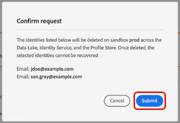

# Ta bort poster

The [[!UICONTROL Data Hygiene] arbetsyta](./overview.md) i Adobe Experience Platform UI kan du ta bort poster som ingår i identitetstjänsten och kundprofilen i realtid. Dessa poster kan knytas till enskilda konsumenter eller andra enheter som ingår i identitetsdiagrammet.

>[!IMPORTANT]
>
>Begäran om att radera poster är bara tillgänglig för organisationer som har köpt **Adobe Healthcare Shield**.
>
>
>Borttagning av poster ska användas för datarensning, borttagning av anonyma data eller datamängning. De är **not** som ska användas för förfrågningar om registrerade rättigheter (överensstämmelse) som rör sekretessbestämmelser som den allmänna dataskyddsförordningen (GDPR). För all användning av regelefterlevnad [Adobe Experience Platform Privacy Service](../../privacy-service/home.md) i stället.

## Förutsättningar

Att ta bort poster kräver en fungerande förståelse för hur identitetsfält fungerar i Experience Platform. Du måste känna till de primära identitetsvärdena för de entiteter vars poster du vill ta bort, beroende på vilken datamängd (eller vilka datamängder) du tar bort dem från.

Mer information om identiteter i Platform finns i följande dokumentation:

* [Adobe Experience Platform Identity Service](../../identity-service/home.md): Överbryggar identiteter mellan enheter och system, länkar samman datauppsättningar baserat på de identitetsfält som definieras av XDM-scheman som de följer.
   * [Identitetsnamnutrymmen](../../identity-service/namespaces.md): Identitetsnamnutrymmen definierar de olika typerna av identitetsinformation som kan relateras till en enskild person, och är en obligatorisk komponent för varje identitetsfält.
* [Kundprofil i realtid](../../profile/home.md): Använder identitetsdiagram för att tillhandahålla enhetliga konsumentprofiler baserade på aggregerade data från flera källor, som uppdateras i nära realtid.
* [Experience Data Model (XDM)](../../xdm/home.md): Tillhandahåller standarddefinitioner och -strukturer för plattformsdata genom användning av scheman. Alla plattformsdatauppsättningar följer ett specifikt XDM-schema, och schemat definierar vilka fält som är identiteter.
   * [Identitetsfält](../../xdm/ui/fields/identity.md): Lär dig hur ett identitetsfält definieras i ett XDM-schema.

## Skapa en ny begäran

För att starta processen väljer du **[!UICONTROL Create request]** från huvudsidan på arbetsytan.

![Bild som visar [!UICONTROL Create request] knapp som markeras](../images/ui/record-delete/create-request-button.png)

Dialogrutan där begäran skapas visas. Som standard är **[!UICONTROL Delete consumer]** alternativet är markerat under **[!UICONTROL Requested Action]** -avsnitt. Låt alternativet vara markerat.


## Välj datauppsättningar

Under **[!UICONTROL Consumer Details]** nästa steg är att avgöra om du vill ta bort poster från en enskild datauppsättning eller alla datauppsättningar.

Om du väljer **[!UICONTROL Select dataset]**, markerar du databasikonen () och en dialogruta visas där du kan välja önskad datauppsättning från listan.


Om du vill ta bort poster från alla datauppsättningar väljer du **[!UICONTROL All datasets]**.

![Bild som visar [!UICONTROL All datasets] valt alternativ](../images/ui/record-delete/all-datasets.png)

>[!NOTE]
>
>Markera **[!UICONTROL All datasets]** kan göra att borttagningsåtgärden tar längre tid och kanske inte resulterar i korrekt borttagning av poster.

## Ange identiteter {#provide-identities}

>[!CONTEXTUALHELP]
>id="platform_hygiene_primaryidentity"
>title="Primär identitet"
>abstract="En primär identitet är ett attribut som kopplar en post till en konsumentprofil i Experience Platform. Det primära identitetsfältet för en datauppsättning definieras av det schema som datauppsättningen baseras på. I den här kolumnen måste du ange typen (eller namnutrymmet) för postens primära identitet, till exempel `email` för mejladresser och `ecid` för Experience Cloud ID. Mer information finns i användargränssnittsguiden för datahygien."

>[!CONTEXTUALHELP]
>id="platform_hygiene_identityvalue"
>title="Identitetsvärde"
>abstract="I den här kolumnen måste du ange värdet för postens primära identitet, som måste motsvara identitetstypen som anges i den vänstra kolumnen. Om den primära identitetstypen är `email`ska värdet vara postens e-postadress. Mer information finns i användargränssnittsguiden för datahygien."

När du tar bort poster måste du ange identitetsinformation så att systemet kan avgöra vilka poster som ska tas bort. För alla datauppsättningar i plattformen tas poster bort baserat på **primär identitet** fält som definieras av datauppsättningens schema.

Precis som alla identitetsfält i Platform består en primär identitet av två saker: en **type** (kallas ibland för ett id-namnutrymme) och en **value**. Identitetstypen ger kontext om hur fältet identifierar en post (t.ex. en e-postadress) och värdet representerar en posts specifika identitet för den typen (t.ex. `jdoe@example.com` för `email` identitetstyp). Vanliga fält som används som identiteter är kontoinformation, enhets-ID och cookie-ID:n.

>[!TIP]
>
>Om du inte känner till den primära identiteten för en viss datauppsättning kan du hitta den i användargränssnittet för plattformen. I **[!UICONTROL Datasets]** väljer du den aktuella datauppsättningen i listan. På informationssidan för datauppsättningen håller du pekaren över namnet på datasetens schema i den högra listen. Den primära identiteten visas tillsammans med schemanamnet och beskrivningen.
>
>

Om du tar bort poster från en enskild datauppsättning måste alla identiteter som du anger ha samma typ, eftersom en datauppsättning bara kan ha en primär identitet. Om du tar bort från alla datauppsättningar kan du inkludera flera identitetstyper eftersom olika datauppsättningar kan ha olika primära identiteter.

Det finns två alternativ för att ange identiteter när du tar bort poster:

* [Överföra en JSON-fil](#upload-json)
* [Ange identitetsvärden manuellt](#manual-identity)

### Överföra en JSON-fil {#upload-json}

Om du vill överföra en JSON-fil kan du dra och släppa filen i området som innehåller informationen eller välja **[!UICONTROL Choose files]** för att bläddra och välja från din lokala katalog.


JSON-filen måste formateras som en array med objekt, där varje objekt representerar en identitet.

```json
[
  {
    "namespaceCode": "email",
    "value": "jdoe@example.com"
  },
  {
    "namespaceCode": "email",
    "value": "san.gray@example.com"
  }
]
```

| Egenskap | Beskrivning |
| --- | --- |
| `namespaceCode` | Identitetstypen. |
| `value` | Identitetsvärdet som anges av typen. |

När filen har överförts kan du fortsätta [skicka förfrågan](#submit).

### Ange identiteter manuellt {#manual-identity}

Om du vill ange identiteter manuellt väljer du **[!UICONTROL Add identity]**.

![Bild som visar [!UICONTROL Add identity] knapp som markeras](../images/ui/record-delete/add-identity.png)

Det visas kontroller som gör att du kan ange identiteter en åt gången. Under **[!UICONTROL Primary Identity]** använder du listrutan för att välja identitetstyp. Under **[!UICONTROL Identity Value]**, anger det primära identitetsvärdet för posten.


Om du vill lägga till fler identiteter väljer du plusikonen () bredvid en av raderna eller markera **[!UICONTROL Add identity]**.


## Skicka begäran (#submit)

När du är klar med att lägga till identiteter i begäran, under **[!UICONTROL Request settings]**, ange ett namn och en valfri beskrivning för begäran innan du väljer **[!UICONTROL Submit]**.

![Bild som visar [!UICONTROL Submit] knapp som markeras](../images/ui/record-delete/submit.png)

Du ombeds bekräfta listan med identiteter vars data du vill ta bort. Välj **[!UICONTROL Submit]** för att bekräfta ditt val.



När begäran har skickats skapas en arbetsorder och visas på [!UICONTROL Consumer] -fliken i [!UICONTROL Data Hygiene] arbetsyta. Härifrån kan du övervaka arbetsorderns status medan den bearbetar begäran.

>[!NOTE]
>
>Se översiktsavsnittet i [tidslinjer och genomskinlighet](../home.md#record-delete-transparency) om du vill ha information om hur postborttagningar bearbetas när de har körts.

## Nästa steg

I det här dokumentet beskrivs hur du tar bort poster i användargränssnittet för Experience Platform. Mer information om hur du utför andra datahygienuppgifter i användargränssnittet finns i [översikt över användargränssnittet för datahygien](./overview.md).

Mer information om hur du tar bort poster med API:t för datahygien finns i [slutpunktsguide för arbetsorder](../api/workorder.md).
