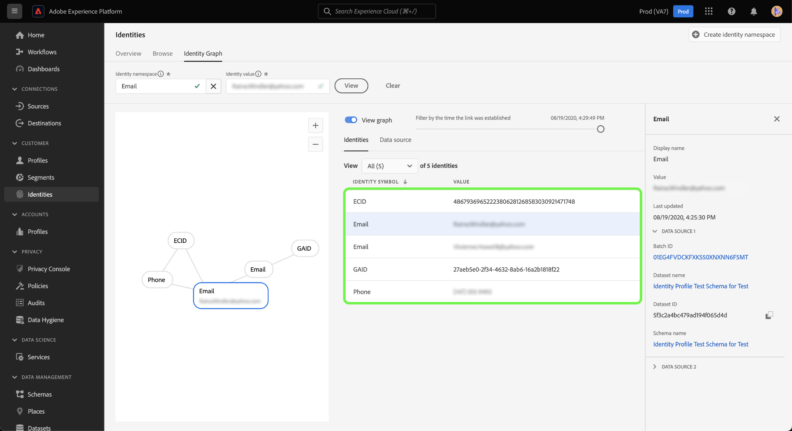
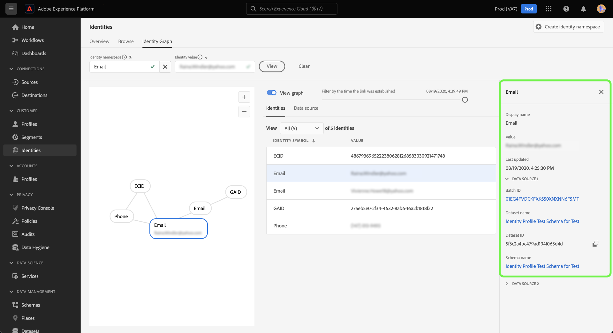

# Identitetsdiagramvisningsprogram

Ett identitetsdiagram är en karta över relationer mellan olika identiteter för en viss kund, vilket ger dig en visuell representation av hur kunden interagerar med varumärket i olika kanaler. Alla kundidentitetsdiagram hanteras och uppdateras gemensamt av Adobe Experience Platform Identity Service i nära realtid som svar på kundaktivitet.

Med identitetsdiagramvisningsprogrammet i Experience Platform användargränssnitt kan du visualisera och bättre förstå vilka kundidentiteter som sammanfogas och på vilka sätt. Med visningsprogrammet kan du dra och interagera med olika delar av diagrammet, vilket gör att du kan undersöka komplexa identitetsförhållanden, felsöka mer effektivt och dra nytta av ökad genomskinlighet när det gäller hur informationen används.

Följande dokument innehåller steg för hur du får åtkomst till och använder identitetsdiagramvisningsprogrammet i Experience Platform användargränssnitt.

## Självstudievideo

Följande video är avsedd att ge stöd för din förståelse av identitetsdiagramvisningsprogrammet.

>[!VIDEO](https://video.tv.adobe.com/v/331030/?quality=12&learn=on)

## Komma igång

Att arbeta med identitetsdiagramvisningsprogrammet kräver förståelse för de olika Adobe Experience Platform-tjänsterna. Innan du börjar arbeta med identitetsdiagramvisningsprogrammet bör du läsa dokumentationen för följande tjänster:

- [[!DNL Identity Service]](../home.md): Få en bättre bild av enskilda kunder och deras beteende genom att skapa en bro mellan identiteter på olika enheter och system.
- [Kundprofil i realtid](../../profile/home.md): Identitetsdiagram används av kundprofilen i realtid för att skapa en heltäckande och unik bild av kundens attribut och beteende.

### Terminologi

- **Identitet (nod):** En identitet eller en nod är data som är unika för en entitet, vanligtvis en person. En identitet består av ett id-namnutrymme och ett identitetsvärde. En fullständigt kvalificerad identitet kan till exempel bestå av ett identitetsnamnutrymme för **Email** kombinerat med identitetsvärdet **robin@email.com**.
- **Länk (kant):** En länk eller kant representerar anslutningen mellan identiteter. Identitetslänkarna innehåller egenskaper som första etablerade och senaste uppdaterade tidsstämplar. Den första etablerade tidsstämpeln definierar det datum och den tidpunkt då en ny identitet länkas till en befintlig identitet. Den senast uppdaterade tidsstämpeln definierar det datum och den tidpunkt då en befintlig identitetslänk senast uppdaterades.
- **Diagram (kluster):** Ett diagram eller ett kluster är en grupp identiteter och länkar som representerar en person.

## Åtkomst till identitetsdiagramvisningsprogrammet {#access-identity-graph-viewer}

I Experience Platform-gränssnittet väljer du **[!UICONTROL Identities]** i den vänstra navigeringen och sedan **[!UICONTROL Identity Graph]** i listan med flikar i sidhuvudet.

Om du vill visa ett identitetsdiagram anger du ett identitetsnamnutrymme och dess motsvarande värde och väljer sedan **[!UICONTROL View]**.

>[!TIP]
>
>Markera tabellikonen  om du vill visa en panel med en lista över alla identitetsnamnutrymmen som är tillgängliga i organisationen. Du kan använda valfritt identitetsnamnutrymme om du har ett giltigt identitetsvärde kopplat till dem. Mer information finns i [identitetsnamnutrymmesguiden](./namespaces.md).

## Identitetsdiagramvisningsprogrammets gränssnitt

Visningsgränssnittet för identitetsdiagrammet består av flera element som du kan använda för att interagera med och bättre förstå dina identitetsdata.

I identitetsdiagrammet visas alla identiteter som är länkade till identitetsnamnutrymmet och värdekombinationen som du angav. Varje nod består av ett identitetsnamnutrymme och dess motsvarande värde. Du kan markera, hålla ned och dra en nod för att interagera med diagrammet. Du kan också hovra över en nod för att se information om dess motsvarande identitetsvärde. Välj **[!UICONTROL View graph]** om du vill dölja eller visa diagrammet.

>[!IMPORTANT]
>
>Ett identitetsdiagram kräver minst två länkade identiteter som ska genereras och en giltig kombination av identitetsnamn och värde. Det maximala antalet identiteter som diagramvisningsprogrammet kan visa är 50. Mer information finns i avsnittet [Bilaga](#appendix) nedan.

Markera en länk i diagrammet om du vill visa den datauppsättning och det batch-ID som bidrar till länken. När du väljer en länk uppdateras även rätt spår för att ge mer information om datakälldetaljer samt egenskaper som första etablerade och senaste uppdaterade tidsstämplar.

Tabellen [!UICONTROL Identities] innehåller en annan vy av dina identitetsdata, som listar identitetsnamnutrymmet och kombinationen av identitetsvärde i ett tabellformat. Om du väljer en nod i diagrammet uppdateras det markerade linjeobjektet i tabellen [!UICONTROL Identities].

Använd listrutemenyn för att sortera diagramdata och markera information i ett specifikt identitetsnamnutrymme. Välj till exempel **[!UICONTROL Email]** på menyn om du vill visa data som är specifika för e-postidentitetens namnområde.

Den högra listen visar information om en vald identitet, inklusive dess senaste uppdaterade tidsstämpel. Den högra listen visar även information om den datakälla som motsvarar den valda identiteten, inklusive dess batch-ID, datauppsättningsnamn, datauppsättnings-ID och schemanamn.

Följande tabell innehåller ytterligare information om de egenskaper för datakälla som visas i den högra listen:

| Datakälla | Beskrivning |
| --- | --- | 
| Batch-ID | Den automatiskt genererade identifierare som motsvarar dina gruppdata. |
| Datauppsättnings-ID | Den automatiskt genererade identifierare som motsvarar datauppsättningen. |
| Namn på datauppsättning | Namnet på den datauppsättning som innehåller dina batchdata. |
| Schemanamn | Schemats namn. Schemat innehåller en uppsättning regler som representerar och validerar datastrukturen och dataformatet. |

Du kan också använda *[!UICONTROL Data source]* för att visa en lista över datakällor som bidrar till dina identiteter. Välj [!UICONTROL Data source] om du vill ha en tabellvy över dina datauppsättningar och batch-ID:n.

Använd skjutreglaget för att filtrera diagramdata efter den tidpunkt då identiteterna först etablerades. Som standard visar identitetsdiagramvisningsprogrammet alla identiteter som är länkade i diagrammet. Håll ned och dra i skjutreglaget för att justera tiden till den senaste tidsstämpeln där en ny identitet länkades till diagrammet. I exemplet nedan visar diagrammet att den senaste identitetslänken (GAID) upprättades på **[!UICONTROL 08/19/2020, 4:29:29 PM]**.

Justera skjutreglaget för att se att en annan identitetslänk (e-post) upprättades på **[!UICONTROL 08/19/2020, 4:25:30 PM]**.

Du kan också justera skjutreglaget för att se den tidigaste upprepningen av diagrammet. I exemplet nedan visar identitetsdiagramvisningsprogrammet att diagrammet först skapades på **[!UICONTROL 08/19/2020, 4:11:49 PM]**, med de första länkarna ECID, Email och Phone.

## Bilaga

Följande avsnitt innehåller ytterligare information om hur du arbetar med identitetsdiagramvisningsprogrammet.

### Om felmeddelanden

Fel kan inträffa vid åtkomst till identitetsdiagramvisningsprogrammet. Nedan följer en lista över krav och begränsningar som ska beaktas när du arbetar med identitetsdiagramvisningsprogrammet.

- Ett identitetsvärde måste finnas i det valda namnutrymmet.
- Identitetsdiagramvisningsprogrammet kräver minst två länkade identiteter för att kunna generera. Det är möjligt att det bara finns ett identitetsvärde och inga länkade identiteter, och i det här fallet finns värdet bara i [!DNL Profile]-visningsprogrammet.
- Identitetsdiagramvisningsprogrammet får inte överskrida det maximala antalet 50 identiteter.

### Få åtkomst till identitetsdiagramvisningsprogrammet från datauppsättningar

Du kan även komma åt identitetsdiagramvisningsprogrammet med hjälp av datauppsättningsgränssnittet. På sidan med datauppsättningar [!UICONTROL Browse] väljer du en datauppsättning som du vill interagera med och sedan **[!UICONTROL Preview dataset]**

I förhandsgranskningsfönstret väljer du en fingeravtrycksikon för att se vilka identiteter som visas i identitetsdiagramvisningsprogrammet.

>[!TIP]
>
>Fingeravtrycksikonen visas bara om datauppsättningen har två eller flera identiteter.

## Nästa steg

Genom att läsa det här dokumentet har du lärt dig att utforska dina kunders identitetsdiagram i Experience Platform användargränssnitt. Mer information om identiteter i Experience Platform finns i [Översikt över identitetstjänsten](../home.md)

## Changelog

| Datum | Åtgärd |
| ---- | ------ |
| 2021-01 | <ul><li>Stöd för direktuppspelning av inkapslade data och icke-produktionssandlåda har lagts till.</li><li>Mindre felkorrigeringar.</li></ul> |
| 2021-02 | <ul><li>Identitetsdiagramvisningsprogrammet är tillgängligt via förhandsgranskning av datauppsättning.</li><li>Mindre felkorrigeringar.</li><li>Identitetsdiagramvisningsprogrammet är allmänt tillgängligt.</li></ul> |
| 2023-01 | <ul><li>Gränssnittsuppdateringar.</li></ul> |
