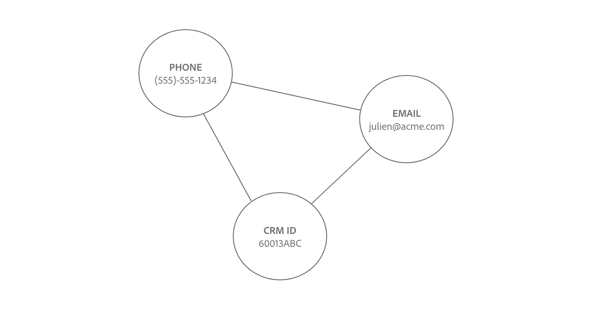

# Länkningslogik för identitetstjänst

En länk mellan två identiteter skapas när identitetsnamnutrymmet och identitetsvärdena matchar.

Det finns två typer av identiteter som länkas:

* **Profilposter**: Dessa identiteter kommer vanligtvis från CRM-system.
* **Upplevelsehändelser**: Dessa identiteter kommer vanligtvis från WebSDK-implementeringen eller Adobe Analytics-källan.

## Semantisk betydelse för att skapa länkar

En identitet representerar en verklighetstrogen enhet. Om det finns en länk mellan två identiteter betyder det att de två identiteterna är kopplade till varandra. Här följer några exempel som illustrerar detta koncept:

| Åtgärd | Länkar upprättade | Betydelse |
| --- | --- | --- |
| En slutanvändare loggar in med en dator. | CRMID och ECID är sammankopplade. | En person (CRMID) äger en enhet med en webbläsare (ECID). |
| En slutanvändare surfar anonymt med en iPhone. | IDFA är kopplat till ECID. | Apple maskinvaruenhet (IDFA), t.ex. en iPhone, är kopplad till webbläsaren (ECID). |
| Slutanvändaren loggar in med Google Chrome och sedan Firefox. | CRMID är länkat till två olika ECID. | En person (CRMID) är kopplad till två webbläsare (**Obs!**: Varje webbläsare har ett eget ECID). |
| En datatekniker importerar en CRM-post som innehåller två fält som är markerade som en identitet: CRMID och Email. | CRMID och Email är länkade. | En person (CRMID) är kopplad till e-postadressen. |

## Länkningslogik för identitetstjänsten

En identitet består av ett identitetsnamnutrymme och ett identitetsvärde.

* Ett identitetsnamnutrymme är kontexten för ett givet identitetsvärde. Vanliga exempel på identitetsnamnutrymmen är CRMID, Email och Phone.
* Ett identitetsvärde är den sträng som representerar en faktisk enhet. Till exempel:&quot;julien@acme.com&quot; kan vara ett identitetsvärde för ett e-postnamnområde och 555-555-1234 kan vara ett motsvarande identitetsvärde för ett Phone-namnområde.

>[!TIP]
>
>Identitetsnamnutrymmet är viktigt eftersom identitetsvärdet förlorar sitt sammanhang och inte har tillräckligt med information för att matcha identiteter.

Se följande diagram för en visuell representation av hur länkningslogiken i identitetstjänsten fungerar:

>[!BEGINTABS]

>[!TAB Befintligt diagram]

Anta att du har ett befintligt identitetsdiagram med tre länkade identiteter:

* PHONE:(555)-555-1234
* EMAIL:julien@acme.com
* CRMID:60013ABC

>[!TAB Inkommande data]

Ett par identiteter är inkapslade i diagrammet och det här paret innehåller:

* CRMID:60013ABC
* ECID:100066526

>[!TAB Uppdaterat diagram]

Identitetstjänsten känner igen att CRMID:60013ABC redan finns i diagrammet och länkar därför bara det nya ECID:t

>[!ENDTABS]

## Kundscenario

Du är datatekniker och du importerar följande CRM-datauppsättning (profilpost) till Experience Platform.

| CRMID** | Telefon* | E-post* | Förnamn | Efternamn |
| --- | --- | --- | --- | --- |
| 60013ABC | 555-555-1234 | julien@acme.com | Julien | Smith |
| 31260XYZ | 777-777-6890 | evan@acme.com | Evan | Smith |

>[!NOTE]
>
>* `**` - Anger fält som har markerats som primär identitet.
>* `*` - Anger fält som har markerats som sekundär identitet.
>
>Identitetstjänsten skiljer inte mellan primär och sekundär identitet. Så länge ett fält är markerat som en identitet, hämtas det till identitetstjänsten.

Du har också implementerat WebSDK och importerat en WebSDK-datauppsättning (Experience Event) med följande datatabeller:

| Tidsstämpel | Identiteter i evenemanget* | Händelse |
| --- | --- | --- |
| `t=1` | ECID:38652 | Visa hemsida |
| `t=2` | ECID:38652, CRMID:31260XYZ | Sök efter skor |
| `t=3` | ECID:44675 | Visa hemsida |
| `t=4` | ECID:44675, CRMID: 31260XYZ | Visa köphistorik |

Den primära identiteten för varje händelse bestäms utifrån [hur du konfigurerar dataelementtyper](../../tags/extensions/client/web-sdk/data-element-types.md).

>[!NOTE]
>
>* Om du väljer CRMID som primär kommer autentiserade händelser (händelser med identitetskarta som innehåller CRMID och ECID) att ha den primära identiteten CRMID. För oautentiserade händelser (händelser som bara innehåller ECID) har identitetskartan som primär ECID. Adobe rekommenderar det här alternativet.
>
>* Om du väljer ECID som primär, oavsett autentiseringsstatus, blir ECID den primära identiteten.

I detta exempel:

* `t=1` använde en stationär dator (ECID:38652) och för att visa hemsidan anonymt.
* `t=2` använde samma stationära dator, loggade in (CRMID:31260XYZ) och sökte sedan efter skor.
   * När en användare är inloggad skickar händelsen både ECID och CRMID till identitetstjänsten.
* `t=3`, använde en bärbar dator (ECID:44675) och bläddrade anonymt.
* `t=4`, använde samma bärbara dator, loggade in (CRMID: 31260XYZ) och visade sedan inköpshistoriken.

>[!BEGINTABS]

>[!TAB tidsstämpel=0]

På `timestamp=0` har du två identitetsdiagram för två olika kunder. Båda representeras av tre länkade identiteter.

| | CRMID | E-post | Telefon |
| --- | --- | --- | --- |
| Kund en | 60013ABC | julien@acme.com | 555-555-1234 |
| Kund två | 31260XYZ | evan@acme.com | 777-777-6890 |

>[!TAB timestamp=1]

På `timestamp=1` använder en kund en bärbar dator för att besöka din e-handelswebbplats, visa din hemsida och för att bläddra anonymt. Den här anonyma surfhändelsen identifieras som ECID:38652. Eftersom identitetstjänsten bara lagrar händelser med minst två identiteter lagras inte den här informationen.

>[!TAB timestamp=2]

På `timestamp=2` använder en kund samma bärbara dator för att besöka din e-handelswebbplats. De loggar in med kombinationen av användarnamn och lösenord och bläddrar efter skor. Identitetstjänsten identifierar kundens konto när de loggar in eftersom det motsvarar deras CRMID: 31260XYZ. Dessutom relaterar identitetstjänsten ECID:38562 till CRMID:31260XYZ eftersom båda använder samma webbläsare på samma enhet.

>[!TAB timestamp=3]

På `timestamp=3` använder en kund en surfplatta för att besöka din e-handelswebbplats och surfa anonymt. Den här anonyma surfhändelsen identifieras som ECID:44675. Eftersom identitetstjänsten bara lagrar händelser med minst två identiteter lagras inte den här informationen.

>[!TAB timestamp=4]

På `timestamp=4` använder en kund samma surfplatta, loggar in på sitt konto (CRMID:31260XYZ) och visar sin köphistorik. Den här händelsen länkar deras CRMID:31260XYZ till cookie-identifieraren som tilldelats anonym surfaktivitet, ECID:44675, och länkar ECID:44675 till kundens identitetsdiagram.

>[!ENDTABS]
