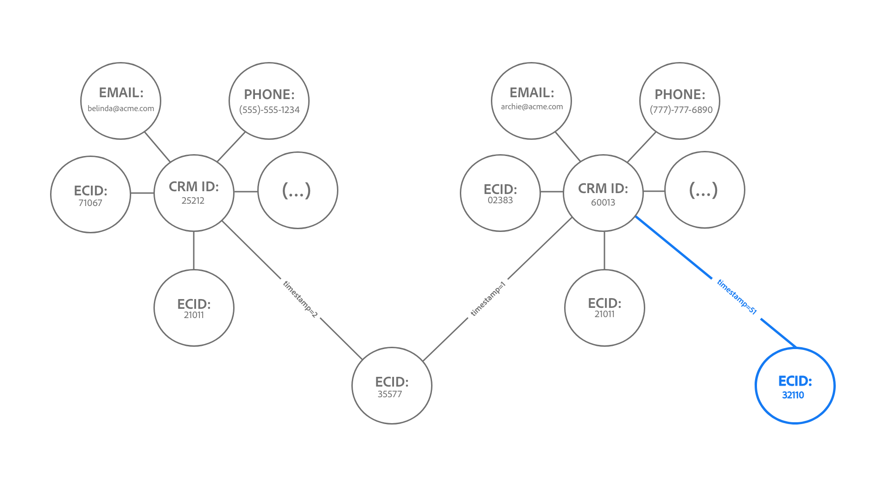
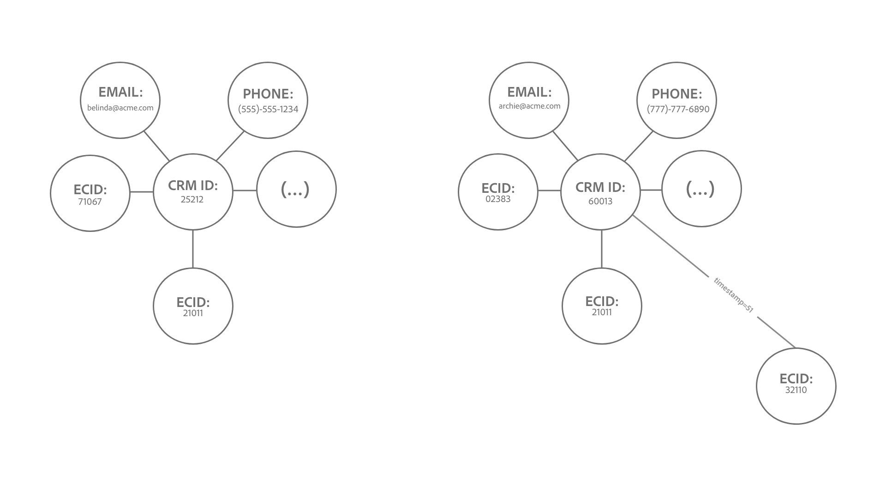

# Guardrutor för [!DNL Identity Service]-data

Det här dokumentet innehåller information om användning och hastighetsgränser för [!DNL Identity Service]-data som hjälper dig att optimera din användning av identitetsdiagrammet. När du granskar följande skyddsutkast förutsätts det att du har modellerat data korrekt. Om du har frågor om hur du modellerar data kan du kontakta kundtjänstrepresentanten.

>[!IMPORTANT]
>
>Kontrollera dina licensrättigheter i din försäljningsorder och motsvarande [produktbeskrivning](https://helpx.adobe.com/se/legal/product-descriptions.html) om faktiska användningsbegränsningar, utöver den här sidan med skyddsförslag.

## Kom igång

Följande Experience Platform-tjänster används för att modellera identitetsdata:

* [Identiteter](home.md): Bridge-identiteter från olika datakällor när de hämtas till Experience Platform.
* [[!DNL Real-Time Customer Profile]](../profile/home.md): Skapa enhetliga konsumentprofiler med data från flera källor.

## Begränsningar för datamodell

Tabellerna nedan innehåller riktlinjer för skyddsförslag för statiska gränser samt valideringsregler för identitetsnamnutrymmen.

### Statiska gränser

I följande tabell visas statiska gränser för identitetsdata.

| Guardrail | Gräns | Anteckningar |
| --- | --- | --- |
| Antal identiteter i ett diagram | 50 | När ett diagram med 50 länkade identiteter uppdateras kommer identitetstjänsten att tillämpa en&quot;första-in-ut-funktion&quot; och ta bort den äldsta identiteten för att skapa utrymme för den senaste identiteten för det här diagrammet (**Obs**: Kundprofilen i realtid påverkas inte). Borttagningen baseras på identitetstyp och tidsstämpel. Gränsen tillämpas på sandlådenivå. Mer information finns i avsnittet [om att förstå borttagningslogiken](#deletion-logic). |
| Antal länkar till en identitet för ett enskilt batchintag | 50 | En enda batch kan innehålla avvikande identiteter som orsakar oönskade diagramsammanfogningar. För att förhindra detta kommer identitetstjänsten inte att importera identiteter som redan är länkade till 50 eller fler identiteter. |
| Antal identiteter i en XDM-post | 20 | Det minsta antalet XDM-poster som krävs är två. |
| Antal anpassade namnutrymmen | Ingen | Det finns inga gränser för hur många anpassade namnutrymmen du kan skapa. |
| Antal tecken för ett namnområdes visningsnamn eller identitetssymbol | Ingen | Det finns inga gränser för hur många tecken ett namnområdes visningsnamn eller identitetssymbol får innehålla. |

{style="table-layout:auto"}

### Validering av identitetsvärde

Följande tabell visar befintliga regler som du måste följa för att identitetsvärdet ska kunna valideras korrekt.

| Namnutrymme | Valideringsregel | Systembeteende när regeln bryts |
| --- | --- | --- |
| ECID | <ul><li>Identitetsvärdet för ett ECID måste vara exakt 38 tecken.</li><li>Identitetsvärdet för ett ECID får endast bestå av siffror.</li></ul> | <ul><li>Om identitetsvärdet för ECID inte är exakt 38 tecken hoppas posten över.</li><li>Om identitetsvärdet för ECID innehåller icke-numeriska tecken hoppas posten över.</li></ul> |
| Ej ECID | <ul><li>Identitetsvärdet får inte vara längre än 1 024 tecken.</li><li>Identitetsvärden kan inte vara &quot;null&quot;, &quot;anonymous&quot;, &quot;invalid&quot; eller vara en tom sträng (t.ex. &quot;, &quot;&quot;, &quot;&quot;).</li></ul> | <ul><li>Om identitetsvärdet är längre än 1 024 tecken hoppas posten över.</li><li>Identiteten kommer att blockeras från att förtäras.</li></ul> |

{style="table-layout:auto"}

### Inläsning av namnområde för identitet

Från och med 31 mars 2023 blockerar identitetstjänsten intag av Adobe Analytics ID (AAID) för nya kunder. Den här identiteten importeras vanligtvis via [Adobe Analytics-källan](../sources/connectors/adobe-applications/analytics.md) och [Adobe Audience Manager-källan](../sources//connectors/adobe-applications/audience-manager.md) och är överflödig eftersom ECID representerar samma webbläsare. Om du vill ändra den här standardkonfigurationen kontaktar du ditt Adobe-kontoteam.

## Prestandaskydd {#performance-guardrails}

Identitetstjänsten övervakar kontinuerligt inkommande data för att säkerställa höga prestanda och tillförlitlighet i stor skala. Men ett inflöde av upplevelsehändelsedata under en kort period kan leda till prestandaförsämring och fördröjning. Adobe ansvarar inte för sådana prestandaförsämringar.

## Förstå borttagningslogiken när ett identitetsdiagram med kapacitet uppdateras {#deletion-logic}

När ett fullständigt identitetsdiagram uppdateras, tar identitetstjänsten bort den äldsta identiteten i diagrammet innan den senaste identiteten läggs till. Detta är för att identitetsdata ska vara korrekta och relevanta. Den här borttagningsprocessen följer två huvudregler:

### Borttagning av regel 1 prioriteras baserat på identitetstypen för ett namnutrymme

Borttagningsprioriteten är följande:

1. Cookie-ID
2. Enhets-ID
3. Enhets-ID, e-post och telefon

### Regel 2 Borttagning baseras på den tidsstämpel som finns lagrad i identiteten

Varje identitet som länkas i ett diagram har en egen motsvarande tidsstämpel. När ett fullständigt diagram uppdateras tar identitetstjänsten bort identiteten med den äldsta tidsstämpeln.

När ett fullständigt diagram uppdateras med en ny identitet, fungerar dessa två regler tillsammans för att ange vilken äldre identitet som ska tas bort. Identitetstjänsten tar först bort det äldsta cookie-ID:t, sedan det äldsta enhets-ID:t och slutligen det äldsta korsenhets-ID:t/e-postadressen/telefonen.

>[!NOTE]
>
>Om den identitet som ska tas bort är länkad till flera andra identiteter i diagrammet, tas även länkarna som förbinder den identiteten bort.

### Effekter på implementeringen

I följande avsnitt beskrivs hur borttagningslogiken påverkar identitetstjänsten, kundprofilen i realtid och WebSDK.

#### Identitetstjänst: Anpassade ändringar av identitetstyp för namnområde

Kontakta Adobe-kontoteamet om du vill ändra identitetstypen om din produktionssandlåda innehåller:

* Ett anpassat namnutrymme där personidentifierare (till exempel CRMID) är konfigurerade som cookie/enhetsidentitetstyp.
* Ett anpassat namnutrymme där cookie-/enhetsidentifierare har konfigurerats som identitetstyp för olika enheter.

När den här funktionen är tillgänglig kommer diagram som överskrider gränsen på 50 identiteter att minskas ned till 50 identiteter. För Real-Time CDP B2C Edition kan detta resultera i en minimal ökning av antalet profiler som kvalificerar för en målgrupp, eftersom dessa profiler tidigare ignorerades från segmentering och aktivering.

#### Kundprofil i realtid: påverkan på adresserbara målgrupper

Borttagning sker endast med data i identitetstjänsten och inte med kundprofilen i realtid.

* Detta beteende kan följaktligen skapa fler profiler med ett enda ECID, eftersom ECID inte längre är en del av identitetsdiagrammet.
* För att du ska kunna hålla dig inom dina adresserbara målgruppsberättigandenummer rekommenderar vi att du aktiverar [pseudonymt utgångsdatum](../profile/pseudonymous-profiles.md) för att ta bort dina gamla profiler.

#### Kundprofil och WebSDK i realtid: borttagning av primär identitet

Om du vill bevara dina autentiserade händelser mot CRMID rekommenderar vi att du ändrar dina primära ID:n från ECID till CRMID. Läs följande dokument för steg om hur du implementerar den här ändringen:

* [Konfigurera identitetskarta för Experience Platform-taggar](../tags/extensions/client/web-sdk/data-element-types.md#identity-map).
* [Identitetsdata i Experience Platform Web SDK](../web-sdk/identity/overview.md#using-identitymap)

### Exempel på scenarier

#### Exempel ett: typiskt stort diagram

*Diagramanteckningar:*

* `t` = tidsstämpel.
* Värdet för en tidsstämpel motsvarar nyheten för en viss identitet. `t1` representerar till exempel den första länkade identiteten (den äldsta) och `t51` den senaste länkade identiteten.

I det här exemplet tar identitetstjänsten först bort den befintliga identiteten med den äldsta tidsstämpeln innan diagrammet till vänster kan uppdateras med en ny identitet. Eftersom den äldsta identiteten är ett enhets-ID, hoppar identitetstjänsten över den identiteten tills den kommer till namnområdet med en typ som ligger högre i listan över borttagningsprioriteter, som i det här fallet är `ecid-3`. När den äldsta identiteten med en högre borttagningsprioritetstyp har tagits bort uppdateras diagrammet med en ny länk, `ecid-51`.

* Om det i sällsynta fall finns två identiteter med samma tidsstämpel och identitetstyp sorteras ID:n baserat på [XID](./api/list-native-id.md) och tas bort.

#### Exempel två: &quot;diagram split&quot;

>[!BEGINTABS]

>[!TAB Inkommande händelse]

*Diagramanteckningar:*

* I följande diagram antas att det finns 50 identiteter i identitetsdiagrammet vid `timestamp=50`.
* `(...)` betecknar de andra identiteter som redan är länkade i diagrammet.

I det här exemplet importeras ECID:32110 och länkas till ett stort diagram vid `timestamp=51`, vilket överskrider gränsen på 50 identiteter.

>[!TAB Borttagningsprocess]

Därför tar identitetstjänsten bort den äldsta identiteten baserat på tidsstämpel och identitetstyp. I det här fallet tas ECID:35577 bara bort från identitetsdiagrammet.

>[!TAB Diagramutdata]

Som ett resultat av att ECID:35577 togs bort kommer även kanterna som länkade CRMID:60013 och CRMID:25212 med det nu borttagna ECID:35577 att tas bort. Borttagningsprocessen gör att diagrammet delas upp i två mindre diagram.

>[!ENDTABS]

#### Exempel tre:&quot;nav-och-talade&quot;

>[!BEGINTABS]

>[!TAB Inkommande händelse]

*Diagramanteckningar:*

* I följande diagram antas att det finns 50 identiteter i identitetsdiagrammet vid `timestamp=50`.
* `(...)` betecknar de andra identiteter som redan är länkade i diagrammet.

På grund av borttagningslogiken kan vissa nav-identiteter också tas bort. Dessa navidentiteter refererar till noder som är länkade till flera individuella identiteter som annars skulle vara olänkade.

I exemplet nedan importeras ECID:21011 och länkas till diagrammet vid `timestamp=51`, vilket överskrider gränsen på 50 identiteter.

>[!TAB Borttagningsprocess]

Därför tar identitetstjänsten endast bort den äldsta identiteten från identitetsdiagrammet, som i det här fallet är ECID:35577. Borttagningen av ECID:35577 leder också till att följande tas bort:

* Länken mellan CRMID: 60013 och det nu borttagna ECID:35577, vilket resulterar i ett delat diagram.
* IDFA: 32110, IDFA: 02383 och de återstående identiteterna representerade av `(...)`. Dessa identiteter tas bort eftersom de inte är länkade till några andra identiteter separat och därför inte kan representeras i ett diagram.

>[!TAB Diagramutdata]

Slutligen ger borttagningsprocessen två mindre diagram.

>[!ENDTABS]

## Nästa steg

Mer information om [!DNL Identity Service] finns i följande dokumentation:

* [[!DNL Identity Service] översikt](home.md)
* [Identitetsdiagramvisningsprogram](features/identity-graph-viewer.md)

I följande dokumentation finns mer information om andra Experience Platform servicemarginaler, om total latenstid och licensieringsinformation från Real-Time CDP produktbeskrivningsdokument:

* [Real-Time CDP skyddsräcken](/help/rtcdp/guardrails/overview.md)
* [Avancerade latensdiagram](https://experienceleague.adobe.com/docs/blueprints-learn/architecture/architecture-overview/deployment/guardrails.html?lang=sv-SE#end-to-end-latency-diagrams) för olika Experience Platform-tjänster.
* [Real-Time Customer Data Platform (B2C Edition - Prime- och Ultimate-paket)](https://helpx.adobe.com/se/legal/product-descriptions/real-time-customer-data-platform-b2c-edition-prime-and-ultimate-packages.html)
* [Real-Time Customer Data Platform (B2P - Prime- och Ultimate-paket)](https://helpx.adobe.com/se/legal/product-descriptions/real-time-customer-data-platform-b2p-edition-prime-and-ultimate-packages.html)
* [Real-Time Customer Data Platform (B2B - Prime- och Ultimate-paket)](https://helpx.adobe.com/se/legal/product-descriptions/real-time-customer-data-platform-b2b-edition-prime-and-ultimate-packages.html)
