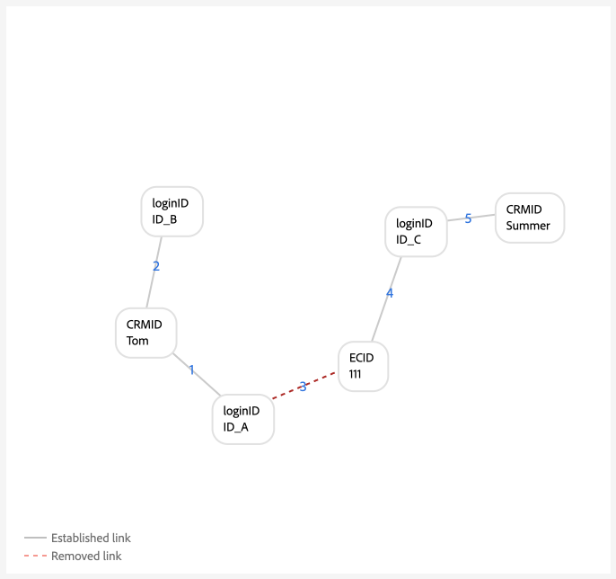

# Konfigurationsguide för länkning av identitetsdiagram

>[!AVAILABILITY]
>
>Länkningsregler för identitetsdiagram finns för närvarande i betaversionen. Kontakta ditt Adobe-kontoteam för att få information om deltagandekriterierna. Funktionen och dokumentationen kan komma att ändras.

Läs det här dokumentet för att få en stegvis handledning som du kan följa när du implementerar dina data med Adobe Experience Platform Identity Service.

Stegvisa dispositioner:

1. [Skapa nödvändiga identitetsnamnutrymmen](#namespace)
2. [Använd verktyget för diagramsimulering för att bekanta dig med algoritmen för identitetsoptimering](#graph-simulation)
3. [Använd identitetsinställningsverktyget för att ange unika namnutrymmen och konfigurera prioritetsklassificeringar för dina namnutrymmen](#identity-settings)
4. [Skapa ett XDM-schema (Experience Data Model)](#schema)
5. [Skapa en datauppsättning](#dataset)
6. [Importera data till Experience Platform](#ingest)

## Förutsättningar för implementering

Innan du kan komma igång måste du se till att autentiserade händelser i systemet alltid innehåller en personidentifierare.

## Ange behörigheter {#set-permissions}

Det första steget i implementeringsprocessen för identitetstjänsten är att se till att ditt Experience Platform-konto läggs till i en roll som har de behörigheter som krävs. Administratören kan konfigurera behörigheter för ditt konto genom att gå till behörighetsgränssnittet i Adobe Experience Cloud. Därifrån måste ditt konto läggas till i en roll med följande behörigheter:

* [!UICONTROL View Identity Settings]: använd den här behörigheten för att kunna visa unika namnutrymmen och namnområdesprioritet på ID-namnutrymmets bläddringssida.
* [!UICONTROL Edit Identity Settings]: använd den här behörigheten för att kunna redigera och spara dina identitetsinställningar.

Mer information om behörigheter finns i [behörighetshandboken](../../access-control/abac/ui/permissions.md).

## Skapa dina identitetsnamnutrymmen {#namespace}

Om dina data kräver det måste du först skapa lämpliga namnutrymmen för din organisation. Anvisningar om hur du skapar ett anpassat namnutrymme finns i handboken [Skapa ett anpassat namnutrymme i användargränssnittet](../features/namespaces.md#create-custom-namespaces).

## Använda diagramsimuleringsverktyget {#graph-simulation}

Gå sedan till [diagramsimuleringsverktyget](./graph-simulation.md) på arbetsytan för identitetstjänstens användargränssnitt. Du kan använda verktyget för diagramsimulering för att simulera identitetsdiagram, som har skapats med olika konfigurationer av unika namnutrymmes- och namnområdesprioriteter.

Genom att skapa olika konfigurationer kan du använda verktyget för diagramsimulering för att lära dig och förstå hur identitetsoptimeringsalgoritmen och vissa konfigurationer kan påverka hur diagrammet fungerar.

## Konfigurera identitetsinställningar {#identity-settings}

När du har fått en bättre uppfattning om hur du vill att diagrammet ska fungera går du till [identitetsinställningsverktyget](./identity-settings-ui.md) på arbetsytan för identitetstjänstens gränssnitt.

Använd verktyget för identitetsinställningar för att ange unika namnutrymmen och konfigurera namnutrymmen efter prioritetsordning. När du är klar med att använda inställningarna måste du vänta minst sex timmar innan du kan fortsätta att importera data, eftersom det tar minst sex timmar innan nya inställningar återspeglas i identitetstjänsten.

## Skapa ett XDM-schema {#schema}

När dina unika namnutrymmen och namnområdesprioriteter har fastställts kan du nu fortsätta med den nödvändiga konfigurationen för att kunna importera dina data. Först måste du skapa ett XDM-schema. Beroende på dina data kan du behöva skapa ett schema för både XDM Individual Profile och XDM ExperienceEvent.

Om du vill importera data till kundprofilen i realtid måste du se till att schemat innehåller minst ett fält som har angetts som primär identitet. Genom att ställa in en primär identitet kan du aktivera ett givet schema för profilinmatning.

Instruktioner om hur du skapar ett schema finns i guiden om att [skapa ett XDM-schema i användargränssnittet](../../xdm/tutorials/create-schema-ui.md).

## Skapa en datauppsättning {#dataset}

Skapa sedan en datauppsättning som ger en struktur för de data som du ska importera. En datauppsättning är en lagrings- och hanteringskonstruktion för en datamängd, vanligtvis en tabell, som innehåller ett schema (kolumner) och fält (rader). Datauppsättningar fungerar tillsammans med scheman, och om du vill importera data till kundprofilen i realtid måste datauppsättningen aktiveras för profilinmatning. För att din datauppsättning ska kunna aktiveras för profilen måste den referera till ett schema som är aktiverat för profilinmatning.

Instruktioner om hur du skapar en datauppsättning finns i [användargränssnittsguiden för datauppsättningar](../../catalog/datasets/user-guide.md).

## Infoga era data {#ingest}

>[!WARNING]
>
>* Under förimplementeringsprocessen måste du se till att de autentiserade händelser som skickas till Experience Platform alltid innehåller en personidentifierare, till exempel CRMID.
>* Under implementeringen måste du se till att det unika namnutrymmet med den högsta prioriteten alltid finns i alla profiler. I [bilagan](#appendix) finns exempel på diagramscenarier som löses genom att säkerställa att alla profiler innehåller det unika namnutrymmet med högsta prioritet.
>* Om du använder [Adobe Analytics-källkopplingen](../../sources/tutorials/ui/create/adobe-applications/analytics.md) för att importera data, måste du ge dina ECID högre prioritet än AID eftersom identitetstjänsten blockerar AAID. Genom att prioritera ECID kan du instruera identitetstjänsten att lagra oautentiserade händelser i ECID i stället för i AID.

Nu bör du ha följande:

* Nödvändiga behörigheter för att komma åt identitetstjänstens funktioner.
* Namnutrymmen för dina data.
* Utformade unika namnutrymmen och konfigurerade prioriteter för dina namnutrymmen.
* Minst ett XDM-schema. (Beroende på dina data och specifika användningsfall kan du behöva skapa både profil- och upplevelsehändelsescheman.)
* En datauppsättning som baseras på ditt schema.

När du har alla objekt som listas ovan kan du börja importera dina data till Experience Platform. Du kan utföra dataöverföring på flera olika sätt. Du kan använda följande tjänster för att skicka data till Experience Platform:

* [Inmatning av gruppbearbetning och direktuppspelning](../../ingestion/home.md)
* [Datainsamling i Experience Platform](../../collection/home.md)
* [Experience Platform Källor](../../sources/home.md)

>[!TIP]
>
>När data har importerats ändras inte nyttolasten för XDM-rådata. Du kan fortfarande se dina primära identitetskonfigurationer i användargränssnittet. Dessa konfigurationer åsidosätts dock av identitetsinställningarna.

Använd alternativet **[!UICONTROL Beta feedback]** på identitetstjänstens arbetsyta för att få feedback.

## Bilaga {#appendix}

I det här avsnittet finns mer information som du kan referera till när du implementerar dina identitetsinställningar och unika namnutrymmen.

### Scenario för delad enhet {#shared-device-scenario}

Du måste se till att ett enda namnutrymme används i alla profiler som representerar en person. Om du gör det kan identitetstjänsten identifiera rätt personidentifierare i ett visst diagram.

>[!BEGINTABS]

>[!TAB Utan ett namnutrymme för en identifierare]

Utan ett unikt namnutrymme som representerar dina personidentifierare kan det uppstå ett diagram som länkar till olika personidentifierare till samma ECID. I det här exemplet är både B2BCRM och B2CCRM kopplade till samma ECID samtidigt. I det här diagrammet visas att Tom med sitt B2C-inloggningskonto delade en enhet med sommaren med hjälp av sitt B2B-inloggningskonto. Systemet kommer dock att känna igen att detta är en profil (komprimering av diagram).

>[!TAB Med en identifierare för en person ]

Med ett unikt namnutrymme (i det här fallet ett CRMID i stället för två olika namnutrymmen) kan identitetstjänsten identifiera den personidentifierare som senast var associerad med ECID. I det här exemplet, eftersom det finns ett unikt CRMID, kan identitetstjänsten identifiera ett scenario med delade enheter, där två enheter delar samma enhet.

>[!ENDTABS]

### Inloggnings-ID-scenariot kraschar {#dangling-loginid-scenario}

I följande diagram simuleras ett &quot;farligt&quot; loginID-scenario. I det här exemplet är två olika loginID bundna till samma ECID. `{loginID: ID_C}` är dock inte länkad till CRMID. Det finns därför inget sätt för identitetstjänsten att upptäcka att dessa två loginID representerar två olika enheter.

>[!BEGINTABS]

>[!TAB Tvetydigt användar-ID]

I det här exemplet lämnas `{loginID: ID_C}` farligt och inte länkat till ett CRMID. Personentiteten som detta användar-ID ska kopplas till är därför tvetydig.

>[!TAB loginID är länkat till ett CRMID]

I det här exemplet är `{loginID: ID_C}` länkad till `{CRMID: Tom}`. Därför kan systemet identifiera att detta användar-ID är kopplat till Tom.

>[!TAB loginID är länkat till ett annat CRMID]

I det här exemplet är `{loginID: ID_C}` länkad till `{CRMID: Summer}`. Därför kan systemet identifiera att detta loginID är kopplat till en annan person, i det här fallet Sommar.

I det här exemplet visas även att Tom och Sommar ska skilja på personer som delar en enhet, vilket representeras av `{ECID: 111}`.

>[!ENDTABS]
