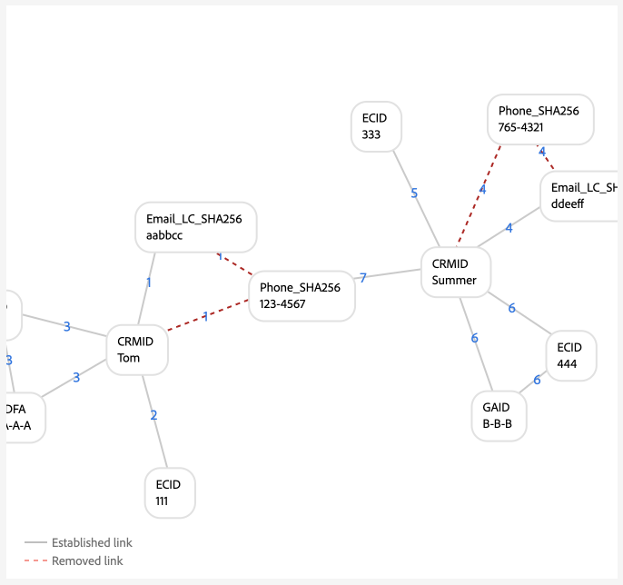
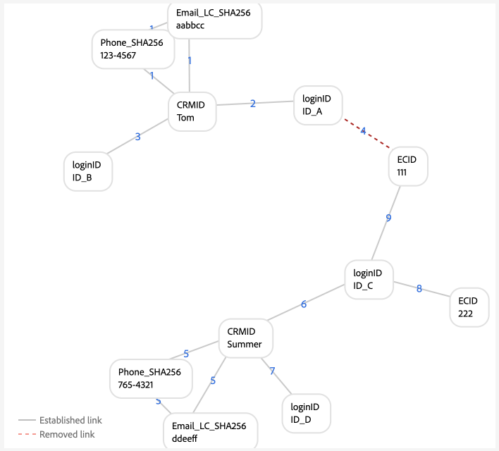

# Exempel på diagramkonfigurationer

>[!AVAILABILITY]
>
>Länkningsregler för identitetsdiagram finns för närvarande i betaversionen. Kontakta ditt Adobe-kontoteam för att få information om deltagandekriterierna. Funktionen och dokumentationen kan komma att ändras.

>[!NOTE]
>
>* &quot;CRMID&quot; och &quot;loginID&quot; är egna namnutrymmen. I det här dokumentet är &quot;CRMID&quot; en personidentifierare och &quot;loginID&quot; är en inloggningsidentifierare som är associerad med en viss person.
>* Om du vill simulera de exempeldiagramscenarier som beskrivs i det här dokumentet måste du först skapa två anpassade namnutrymmen, ett med identitetssymbolen &quot;CRMID&quot; och ett annat med identitetssymbolen &quot;loginID&quot;. Identitetssymboler är skiftlägeskänsliga.


Det här dokumentet innehåller exempel på diagramkonfigurationer av vanliga scenarier som du kan stöta på när du arbetar med länkningsregler för identitetsdiagram och identitetsdata.

## Endast CRMID

Detta är ett exempel på ett enkelt implementeringsscenario där online-händelser (CRMID och ECID) importeras och offline-händelser (profilposter) bara lagras mot CRMID.

**Implementering:**

| Använda namnutrymmen | Samlingsmetod för webbeteenden |
| --- | --- |
| CRMID, ECID | Webb-SDK |

**Händelser:**

Du kan skapa det här scenariot i diagramsimulering genom att kopiera följande händelser till textläge:

```shell
CRMID: Tom, ECID: 111
```

**Algoritmkonfiguration:**

Du kan skapa det här scenariot i diagramsimulering genom att konfigurera följande inställningar för algoritmkonfigurationen:

| Prioritet | Visningsnamn | Identitetstyp | Unikt per diagram |
| ---| --- | --- | --- |
| 1 | CRMID | CROSS_DEVICE | Ja |
| 2 | ECID | COOKIE | Nej |

**Val av primär identitet för kundprofil i realtid:**

I den här konfigurationen definieras den primära identiteten så här:

| Autentiseringsstatus | Namnutrymme i händelser | Primär identitet |
| --- | --- | --- |
| Autentiserad | CRMID, ECID | CRMID |
| Oautentiserad | ECID | ECID |

**Diagramexempel**

>[!BEGINTABS]

>[!TAB Idealiskt enpersonsdiagram]

Följande är ett exempel på ett idealiskt enpersonsdiagram, där CRMID är unikt och har högsta prioritet.


>[!TAB Flerpersonsdiagram]

Följande är ett exempel på ett flerpersonsdiagram. I det här exemplet visas ett scenario med delade enheter, där det finns två CRMID:n och där den med den äldre etablerade länken tas bort.


**Indata för diagramsimuleringshändelser**

```shell
CRMID: Tom, ECID: 111
CRMID: Summer, ECID: 111
```

>[!ENDTABS]

## CRMID med hash-kodad e-post

I det här scenariot är ett CRMID inkapslat och representerar både online- (upplevelsehändelse) och offlinedata (profilpost). Det här scenariot innebär även att ett hashade e-postmeddelande som representerar ett annat namnområde som skickas i CRM-postdatauppsättningen tillsammans med CRMID skickas.

>[!IMPORTANT]
>
>**Det är viktigt att CRMID alltid skickas för varje användare**. Om du inte gör det kan det resultera i ett&quot;farligt&quot; inloggnings-ID-scenario, där en enskild person antas dela en enhet med en annan person.

**Implementering:**

| Använda namnutrymmen | Samlingsmetod för webbeteenden |
| --- | --- |
| CRMID, Email_LC_SHA256, ECID | Webb-SDK |

**Händelser:**

Du kan skapa det här scenariot i diagramsimulering genom att kopiera följande händelser till textläge:

```shell
CRMID: Tom, Email_LC_SHA256: tom<span>@acme.com
CRMID: Tom, ECID: 111
CRMID: Summer, Email_LC_SHA256: summer<span>@acme.com
CRMID: Summer, ECID: 222
```

**Algoritmkonfiguration:**

Du kan skapa det här scenariot i diagramsimulering genom att konfigurera följande inställningar för algoritmkonfigurationen:

| Prioritet | Visningsnamn | Identitetstyp | Unikt per diagram |
| ---| --- | --- | --- |
| 1 | CRMID | CROSS_DEVICE | Ja |
| 2 | E-post (SHA256, nedsänkt) | E-post | Nej |
| 3 | ECID | COOKIE | Nej |

**Val av primär identitet för profil:**

I den här konfigurationen definieras den primära identiteten så här:

| Autentiseringsstatus | Namnutrymme i händelser | Primär identitet |
| --- | --- | --- |
| Autentiserad | CRMID, ECID | CRMID |
| Oautentiserad | ECID | ECID |

**Diagramexempel**

>[!BEGINTABS]

>[!TAB Idealiskt enpersonsdiagram]

Nedan följer exempel på ett par idealiska enpersonsdiagram, där varje CRMID är associerat med deras respektive hash-kodade e-postnamnutrymme och ECID.


>[!TAB Flerpersonsdiagram: delad enhet]

Följande är ett exempel på ett grafiscenario med flera personer där en enhet delas av två personer.


**Indata för diagramsimuleringshändelser**

```shell
CRMID: Tom, Email_LC_SHA256: aabbcc
CRMID: Tom, ECID: 111
CRMID: Summer, Email_LC_SHA256: ddeeff
CRMID: Summer, ECID: 222
CRMID: Summer, ECID: 111
```

>[!TAB Flerpersonsdiagram: icke-unik e-post]

Följande är ett exempel på ett grafscenario med flera personer där e-post inte är unikt och associeras med två olika CRMID:n.


**Indata för diagramsimuleringshändelser**

```shell
CRMID: Tom, Email_LC_SHA256: aabbcc
CRMID: Tom, ECID: 111
CRMID: Summer, Email_LC_SHA256: ddeeff
CRMID: Summer, ECID: 222
CRMID: Summer, Email_LC_SHA256: aabbcc
```

>[!ENDTABS]

## CRMID med hash-kodad e-post, hash-kodad telefon, GAID och IDFA

Detta scenario liknar det föregående. I det här scenariot markeras däremot hashad e-post och telefon som identiteter som ska användas i [[!DNL Segment Match]](../../segmentation/ui/segment-match/overview.md).

>[!IMPORTANT]
>
>**Det är viktigt att CRMID alltid skickas för varje användare**. Om du inte gör det kan det resultera i ett&quot;farligt&quot; inloggnings-ID-scenario, där en enskild person antas dela en enhet med en annan person.

**Implementering:**

| Använda namnutrymmen | Samlingsmetod för webbeteenden |
| --- | --- |
| CRMID, Email_LC_SHA256, Phone_SHA256, GAID, IDFA, ECID | Webb-SDK |

**Händelser:**

Du kan skapa det här scenariot i diagramsimulering genom att kopiera följande händelser till textläge:

```shell
CRMID: Tom, Email_LC_SHA256: aabbcc, Phone_SHA256: 123-4567
CRMID: Tom, ECID: 111
CRMID: Tom, ECID: 222, IDFA: A-A-A
CRMID: Summer, Email_LC_SHA256: ddeeff, Phone_SHA256: 765-4321
CRMID: Summer, ECID: 333
CRMID: Summer, ECID: 444, GAID:B-B-B
```

**Algoritmkonfiguration:**

Du kan skapa det här scenariot i diagramsimulering genom att konfigurera följande inställningar för algoritmkonfigurationen:

| Prioritet | Visningsnamn | Identitetstyp | Unikt per diagram |
| ---| --- | --- | --- |
| 1 | CRMID | CROSS_DEVICE | Ja |
| 2 | E-post (SHA256, nedsänkt) | E-post | Nej |
| 3 | Telefon (SHA256) | Telefon | Nej |
| 4 | Google Ad ID (GAID) | ENHET | Nej |
| 5 | Apple IDFA (ID för Apple) | ENHET | Nej |
| 6 | ECID | COOKIE | Nej |

**Val av primär identitet för profil:**

I den här konfigurationen definieras den primära identiteten så här:

| Autentiseringsstatus | Namnutrymme i händelser | Primär identitet |
| --- | --- | --- |
| Autentiserad | CRMID, IDFA, ECID | CRMID |
| Autentiserad | CRMID, GAID, ECID | CRMID |
| Autentiserad | CRMID, ECID | CRMID |
| Oautentiserad | GAID, ECID | GAID |
| Oautentiserad | IDFA, ECID | IDFA |
| Oautentiserad | ECID | ECID |

**Diagramexempel**

>[!BEGINTABS]

>[!TAB Idealiskt enpersonsdiagram]

Följande är ett idealiskt enpersonsdiagram där hash-kodad e-post och hash-kodad telefon är markerade som identiteter för användning i [!DNL Segment Match]. I det här scenariot delas diagrammen upp i två, som representerar olika personenheter.


>[!TAB Flerpersonsdiagram: delad enhet, delad dator]

Följande är ett flerpersonsdiagram där en enhet (dator) delas av två personer. I det här scenariot representeras den delade datorn av `{ECID: 111}` och är länkad till `{CRMID: Summer}` eftersom länken är den senast upprättade länken. `{CRMID: Tom}` har tagits bort eftersom länken mellan `{CRMID: Tom}` och `{ECID: 111}` är äldre och eftersom CRMID är det unika namnområdet i den här konfigurationen.


**Indata för diagramsimuleringshändelser**

```shell
CRMID: Tom, Email_LC_SHA256: aabbcc, Phone_SHA256: 123-4567
CRMID: Tom, ECID: 111
CRMID: Tom, ECID: 222, IDFA: A-A-A
CRMID: Summer, Email_LC_SHA256: ddeeff, Phone_SHA256: 765-4321
CRMID: Summer, ECID: 333
CRMID: Summer, ECID: 444, GAID:B-B-B
CRMID: Summer, ECID: 111
```

>[!TAB Flerpersonsdiagram: delad enhet, android-mobil enhet]

Följande är ett flerpersonsdiagram där en android-enhet delas av två personer. I det här scenariot är CRMID konfigurerat som ett unikt namnområde och därför ersätter den nyare länken för `{CRMID: Tom, GAID: B-B-B, ECID:444}` den äldre `{CRMID: Summer, GAID: B-B-B, ECID:444}`.


**Indata för diagramsimuleringshändelser**

```shell
CRMID: Tom, Email_LC_SHA256: aabbcc, Phone_SHA256: 123-4567
CRMID: Tom, ECID: 111
CRMID: Tom, ECID: 222, IDFA: A-A-A
CRMID: Summer, Email_LC_SHA256: ddeeff, Phone_SHA256: 765-4321
CRMID: Summer, ECID: 333
CRMID: Summer, ECID: 444, GAID: B-B-B
CRMID: Tom, ECID: 444, GAID: B-B-B
```

>[!TAB Flerpersonsdiagram: delad enhet, äppelmobil enhet, ingen ECID-återställning]

Följande är ett flerpersonsdiagram där en Apple-enhet delas av två personer. I det här scenariot delas IDFA, men ECID återställs inte.


**Indata för diagramsimuleringshändelser**

```shell
CRMID: Tom, Email_LC_SHA256: aabbcc, Phone_SHA256: 123-4567
CRMID: Tom, ECID: 111
CRMID: Tom, ECID: 222, IDFA: A-A-A
CRMID: Summer, Email_LC_SHA256: ddeeff, Phone_SHA256: 765-4321
CRMID: Summer, ECID: 333
CRMID: Summer, ECID: 444, GAID: B-B-B
CRMID: Summer, ECID: 222, IDFA: A-A-A
```

>[!TAB Flerpersonsdiagram: delad enhet, äpple, ECID-återställning]

Följande är ett flerpersonsdiagram där en Apple-enhet delas av två personer. I det här scenariot återställs ECID, men IDFA är fortfarande detsamma.


**Indata för diagramsimuleringshändelser**

```shell
CRMID: Tom, Email_LC_SHA256: aabbcc, Phone_SHA256: 123-4567
CRMID: Tom, ECID: 111
CRMID: Tom, ECID: 222, IDFA: A-A-A
CRMID: Summer, Email_LC_SHA256: ddeeff, Phone_SHA256: 765-4321
CRMID: Summer, ECID: 333
CRMID: Summer, ECID: 444, GAID: B-B-B
CRMID: Summer, ECID: 555, IDFA: A-A-A
```

>[!TAB Flerpersonsdiagram: Icke-unik telefon]

Följande är ett grafscenario med flera personer där samma telefonnummer delas av två personer.


**Indata för diagramsimuleringshändelser**

```shell
CRMID: Tom, Email_LC_SHA256: aabbcc, Phone_SHA256: 123-4567
CRMID: Tom, ECID: 111
CRMID: Tom, ECID: 222, IDFA: A-A-A
CRMID: Summer, Email_LC_SHA256: ddeeff, Phone_SHA256: 765-4321
CRMID: Summer, ECID: 333
CRMID: Summer, ECID: 444, GAID: B-B-B
CRMID: Summer, Phone_SHA256: 123-4567
```

I det här exemplet är `{Phone_SHA256}` också markerat som ett unikt namnutrymme. Därför kan ett diagram inte ha mer än en identitet med namnutrymmet `{Phone_SHA256}`. I det här scenariot är `{Phone_SHA256: 765-4321}` inte länkad från `{CRMID: Summer}` och `{Email_LC_SHA256: ddeeff}` eftersom det är den äldre länken,



>[!TAB Flerpersonsdiagram: Icke-unik e-post]

Följande är ett flerpersonsdiagram där e-post delas av två personer.


**Indata för diagramsimuleringshändelser**

```shell
CRMID: Tom, Email_LC_SHA256: aabbcc, Phone_SHA256: 123-4567
CRMID: Tom, ECID: 111
CRMID: Tom, ECID: 222, IDFA: A-A-A
CRMID: Summer, Email_LC_SHA256: ddeeff, Phone_SHA256: 765-4321
CRMID: Summer, ECID: 333
CRMID: Summer, ECID: 444, GAID: B-B-B
CRMID: Summer, Email_LC_SHA256: aabbcc
```

>[!ENDTABS]

## Ett CRMID med flera inloggnings-ID (enkel version)

I det här scenariot finns det ett enda CRMID som representerar en personenhet. En personenhet kan dock ha flera inloggningsidentifierare:

* En viss personenhet kan ha olika kontotyper (personlig kontra affärsverksamhet, konto per delstat, konto per varumärke osv.)
* En viss personenhet kan använda olika e-postadresser för valfritt antal konton.

>[!IMPORTANT]
>
>**Det är viktigt att CRMID alltid skickas för varje användare**. Om du inte gör det kan det resultera i ett&quot;farligt&quot; inloggnings-ID-scenario, där en enskild person antas dela en enhet med en annan person.

**Implementering:**

| Använda namnutrymmen | Samlingsmetod för webbeteenden |
| --- | --- |
| CRMID, loginID, ECID | Webb-SDK |

**Händelser:**

Du kan skapa det här scenariot i diagramsimulering genom att kopiera följande händelser till textläge:

```shell
CRMID: Tom, loginID: ID_A
CRMID: Tom, loginID: ID_B
loginID: ID_A, ECID: 111
CRMID: Summer, loginID: ID_C
CRMID: Summer, loginID: ID_D
loginID: ID_C, ECID: 222
```

**Algoritmkonfiguration:**

Du kan skapa det här scenariot i diagramsimulering genom att konfigurera följande inställningar för algoritmkonfigurationen:

| Prioritet | Visningsnamn | Identitetstyp | Unikt per diagram |
| ---| --- | --- | --- |
| 1 | CRMID | CROSS_DEVICE | Ja |
| 2 | loginID | CROSS_DEVICE | Nej |
| 3 | ECID | COOKIE | Nej |

**Val av primär identitet för profil:**

I den här konfigurationen definieras den primära identiteten så här:

| Autentiseringsstatus | Namnutrymme i händelser | Primär identitet |
| --- | --- | --- |
| Autentiserad | loginID, ECID | loginID |
| Autentiserad | loginID, ECID | loginID |
| Autentiserad | CRMID, loginID, ECID | CRMID |
| Autentiserad | CRMID, ECID | CRMID |
| Oautentiserad | ECID | ECID |

**Diagramexempel**

>[!BEGINTABS]

>[!TAB Idealiskt enpersonsscenario]

Följande är ett enpersonsdiagram med ett enda CRMID och flera inloggnings-ID:n.


>[!TAB Scenario med flera personer: delad enhet]

Följande är ett flerpersonsdiagram där en enhet delas av två personer. I det här scenariot är `{ECID:111}` länkad till både `{loginID:ID_A}` och `{loginID:ID_C}` och den äldre etablerade länken för `{ECID:111, loginID:ID_A}` tas bort.


**Indata för diagramsimuleringshändelser**

```shell
CRMID: Tom, loginID: ID_A
CRMID: Tom, loginID: ID_B
loginID: ID_A, ECID: 111
CRMID: Summer, loginID: ID_C
CRMID: Summer, loginID: ID_D
loginID: ID_C, ECID: 222
loginID: ID_C, ECID: 111
```

>[!TAB Scenario med flera personer: felaktiga data]

Följande är ett flerpersonsdiagram som innehåller felaktiga data. I det här scenariot är `{loginID:ID_D}` felaktigt länkad till två olika användare och länken med den äldre tidsstämpeln tas bort, till förmån för den senast upprättade länken.


**Indata för diagramsimuleringshändelser**

```shell
CRMID: Tom, loginID: ID_A
CRMID: Tom, loginID: ID_B
loginID: ID_A, ECID: 111
CRMID: Summer, loginID: ID_C
CRMID: Summer, loginID: ID_D
loginID: ID_C, ECID: 222
CRMID: Tom, loginID: ID_D
```

>[!TAB &#39;Dangling&#39; loginID ]

I följande diagram simuleras ett &quot;farligt&quot; loginID-scenario. I det här exemplet är två olika loginID bundna till samma ECID. `{loginID:ID_C}` är dock inte länkad till CRMID. Det finns därför inget sätt för identitetstjänsten att upptäcka att dessa två loginID representerar två olika enheter.


**Indata för diagramsimuleringshändelser**

```shell
CRMID: Tom, loginID: ID_A
CRMID: Tom, loginID: ID_B
loginID: ID_A, ECID: 111
loginID: ID_C, ECID: 111
```

>[!ENDTABS]

## Ett CRMID med flera inloggnings-ID (komplex version)

I det här scenariot finns det ett enda CRMID som representerar en personenhet. En personenhet kan dock ha flera inloggningsidentifierare:

* En viss personenhet kan ha olika kontotyper (personlig kontra affärsverksamhet, konto per delstat, konto per varumärke osv.)
* En viss personenhet kan använda olika e-postadresser för valfritt antal konton.

>[!IMPORTANT]
>
>**Det är viktigt att CRMID alltid skickas för varje användare**. Om du inte gör det kan det resultera i ett&quot;farligt&quot; inloggnings-ID-scenario, där en enskild person antas dela en enhet med en annan person.

**Implementering:**

| Använda namnutrymmen | Samlingsmetod för webbeteenden |
| --- | --- |
| CRMID, Email_LC_SHA256, Phone_SHA256, loginID, ECID | Adobe Analytics källanslutning. <br> **Obs!** Som standard blockeras AAID i identitetstjänsten, och du måste därför ange en högre prioritet för dina ECID:n än AAID:n när du använder Analytics-källan. Läs [implementeringsguiden](./implementation-guide.md#ingest-your-data) om du vill ha mer information.</br> |

**Händelser:**

Du kan skapa det här scenariot i diagramsimulering genom att kopiera följande händelser till textläge:

```shell
CRMID: Tom, Email_LC_SHA256: aabbcc, Phone_SHA256: 123-4567
CRMID: Tom, loginID: ID_A
CRMID: Tom, loginID: ID_B
loginID: ID_A, ECID: 111
CRMID: Summer, Email_LC_SHA256: ddeeff, Phone_SHA256: 765-4321
CRMID: Summer, loginID: ID_C
CRMID: Summer, loginID: ID_D
loginID: ID_C, ECID: 222
```

**Algoritmkonfiguration:**

Du kan skapa det här scenariot i diagramsimulering genom att konfigurera följande inställningar för algoritmkonfigurationen:

| Prioritet | Visningsnamn | Identitetstyp | Unikt per diagram |
| ---| --- | --- | --- | 
| 1 | CRMID | CROSS_DEVICE | Ja |
| 2 | Email_LC_SHA256 | E-post | Nej |
| 3 | Phone_SHA256 | Telefon | Nej |
| 4 | loginID | CROSS_DEVICE | Nej |
| 5 | ECID | COOKIE | Nej |
| 6 | STÖD | COOKIE | Nej |

**Val av primär identitet för profil:**

I den här konfigurationen definieras den primära identiteten så här:

| Autentiseringsstatus | Namnutrymme i händelser | Primär identitet |
| --- | --- | --- |
| Autentiserad | loginID, ECID | loginID |
| Autentiserad | loginID, ECID | loginID |
| Autentiserad | CRMID, loginID, ECID | CRMID |
| Autentiserad | CRMID, ECID | CRMID |
| Oautentiserad | ECID | ECID |

**Diagramexempel**

>[!BEGINTABS]

>[!TAB Idealiskt enpersonsdiagram]

Följande är ett exempel på två enpersonsdiagram som har ett CRMID och flera loginID:n.


>[!TAB Flerpersonsdiagram: delad enhet 1]

Följande är ett flerpersonsscenario för delade enheter där `{ECID:111}` är länkat till både `{loginID:ID_A}` och `{loginID:ID_C}`. I det här fallet tas de äldre etablerade länkarna bort till förmån för de senast etablerade länkarna.



**Indata för diagramsimuleringshändelser**

```shell
CRMID: Tom, Email_LC_SHA256: aabbcc, Phone_SHA256: 123-4567
CRMID: Tom, loginID: ID_A
CRMID: Tom, loginID: ID_B
loginID: ID_A, ECID: 111
CRMID: Summer, Email_LC_SHA256: ddeeff, Phone_SHA256: 765-4321
CRMID: Summer, loginID: ID_C
CRMID: Summer, loginID: ID_D
loginID: ID_C, ECID: 222
loginID: ID_C, ECID: 111
```

>[!TAB Flerpersonsdiagram: delad enhet 2]

I det här fallet skickas både loginID och CRMID som upplevelsehändelser i stället för att bara skicka in inloggnings-ID.


**Indata för diagramsimuleringshändelser**

```shell
CRMID: Tom, Email_LC_SHA256: aabbcc, Phone_SHA256: 123-4567
CRMID: Tom, loginID: ID_A
CRMID: Tom, loginID: ID_B
loginID: ID_A, ECID: 111
CRMID: Summer, Email_LC_SHA256: ddeeff, Phone_SHA256: 765-4321
CRMID: Summer, loginID: ID_C
CRMID: Summer, loginID: ID_D
loginID: ID_C, ECID: 222
CRMID: Summer, loginID: ID_C, ECID: 111
loginID: ID_A, ECID: 111
```

>[!TAB Flerpersonsdiagram: felaktiga loginID-data]

I det här scenariot är `{loginID:ID_C}` länkad till både `{CRMID:Tom}` och `{CRMID:Summer}` och anses därför vara felaktiga data eftersom idealiska diagramscenarier inte ska länka samma inloggnings-ID till två olika användare. I det här fallet tas de äldre etablerade länkarna bort till förmån för de länkar som upprättats nyligen.


**Indata för diagramsimuleringshändelser**

```shell
CRMID: Tom, Email_LC_SHA256: aabbcc, Phone_SHA256: 123-4567
CRMID: Tom, loginID: ID_A
CRMID: Tom, loginID: ID_B
loginID: ID_A, ECID: 111
CRMID: Summer, Email_LC_SHA256: ddeeff, Phone_SHA256: 765-4321
CRMID: Summer, loginID: ID_C
CRMID: Summer, loginID: ID_D
loginID: ID_C, ECID: 222
CRMID: Tom, loginID: ID_C
```

>[!TAB Flerpersonsdiagram: icke-unik e-post]

I det här scenariot länkas ett icke-unikt e-postmeddelande med två olika CRMID:n, och därför tas de äldre etablerade länkarna bort till förmån för de senast etablerade länkarna.


**Indata för diagramsimuleringshändelser**

```shell
CRMID: Tom, Email_LC_SHA256: aabbcc, Phone_SHA256: 123-4567
CRMID: Tom, loginID: ID_A
CRMID: Tom, loginID: ID_B
loginID: ID_A, ECID: 111
CRMID: Summer, Email_LC_SHA256: ddeeff, Phone_SHA256: 765-4321
CRMID: Summer, loginID: ID_C
CRMID: Summer, loginID: ID_D
loginID: ID_C, ECID: 222
CRMID: Summer, Email_LC_SHA256: aabbcc
```

>[!TAB Flerpersonsdiagram: icke-unik telefon]

I det här scenariot länkas ett icke-unikt telefonnummer med två olika CRMID, de äldre etablerade länkarna tas bort till förmån för de senast etablerade länkarna.


**Indata för diagramsimuleringshändelser**

```shell
CRMID: Tom, Email_LC_SHA256: aabbcc, Phone_SHA256: 123-4567
CRMID: Tom, loginID: ID_A
CRMID: Tom, loginID: ID_B
loginID: ID_A, ECID: 111
CRMID: Summer, Email_LC_SHA256: ddeeff, Phone_SHA256: 765-4321
CRMID: Summer, loginID: ID_C
CRMID: Summer, loginID: ID_D
loginID: ID_C, ECID: 222
CRMID: Tom, Phone_SHA256: 111-1111
CRMID: Summer, Phone_SHA256: 111-1111
```

>[!ENDTABS]

## Användning i andra Adobe Commerce

I diagramkonfigurationsexemplen i det här avsnittet beskrivs användningsexempel för Adobe Commerce. Exemplen nedan fokuserar på detaljhandelskunder med två användartyper:

* Registrerad användare (användare som skapade ett konto)
* Gästanvändare (användare som bara har en e-postadress)

>[!IMPORTANT]
>
>**Det är viktigt att CRMID alltid skickas för varje användare**. Om du inte gör det kan det resultera i ett&quot;farligt&quot; inloggnings-ID-scenario, där en enskild person antas dela en enhet med en annan person.

**Implementering:**

| Använda namnutrymmen | Samlingsmetod för webbeteenden |
| --- | --- |
| CRMID, Email, ECID | Webb-SDK |

**Händelser:**

Du kan skapa det här scenariot i diagramsimulering genom att kopiera följande händelser till textläge:

```shell
CRMID: Tom, Email: tom@acme.com
CRMID: Tom, ECID: 111
```

**Algoritmkonfiguration:**

Du kan skapa det här scenariot i diagramsimulering genom att konfigurera följande inställningar för algoritmkonfigurationen:

| Prioritet | Visningsnamn | Identitetstyp | Unikt per diagram |
| ---| --- | --- | --- | 
| 1 | CRMID | CROSS_DEVICE | Ja |
| 2 | E-post | E-post | Ja |
| 5 | ECID | COOKIE | Nej |

**Val av primär identitet för profil:**

I den här konfigurationen definieras den primära identiteten så här:

| Användaraktivitet | Namnutrymme i händelser | Primär identitet |
| --- | --- | --- |
| Autentiserad surfning | CRMID, ECID | CRMID |
| Kassa på gäst | E-post, ECID | E-post |
| Oautentiserad surfning | ECID | ECID |

>[!WARNING]
>
>Registrerade användare måste ha både CRMID och e-post i sina profiler för att följande diagramscenarier ska fungera.

**Diagramexempel**

>[!BEGINTABS]

>[!TAB Idealiskt enpersonsdiagram]

Följande är ett exempel på ett idealiskt enpersonsdiagram.


>[!TAB Flerpersonsdiagram]

Följande är ett exempel på ett flerpersonsdiagram där två registrerade användare surfar med samma enhet.


**Indata för diagramsimuleringshändelser**

```shell
CRMID: Tom, Email: tom@acme.com
CRMID: Summer, Email: summer@acme.com
CRMID: Tom, ECID: 111
CRMID: Summer, ECID: 111
```

I det här scenariot delar en registrerad användare och en gästanvändare samma enhet.


**Indata för diagramsimuleringshändelser**

```shell
CRMID: Tom, Email: tom@acme.com
CRMID: Tom, ECID: 111
Email: summer@acme.com, ECID: 111
```

I det här scenariot delar en registrerad användare och en gästanvändare en enhet. Ett implementeringsfel inträffar emellertid eftersom CRMID inte innehåller något motsvarande e-postnamnutrymme. I det här scenariot är Tom den registrerade användaren och Sommaren är gästanvändaren. Till skillnad från det föregående scenariot sammanfogas de två enheterna eftersom det inte finns några gemensamma e-postnamnutrymmen för de två personenheterna.


**Indata för diagramsimuleringshändelser**

```shell
CRMID: Tom, ECID: 111
Email: summer@acme.com, ECID: 111
```

I det här fallet delar två gästanvändare samma enhet.


**Indata för diagramsimuleringshändelser**

```shell
Email: tom@acme.com, ECID: 111
Email: summer@acme.com, ECID: 111
```

I det här scenariot checkar en gästanvändare ut ett objekt och registrerar sedan med samma enhet.


**Indata för diagramsimuleringshändelser**

```shell
Email: tom@acme.com, ECID: 111
Email: tom@acme.com, CRMID: Tom
CRMID: Tom, ECID: 111
```

>[!ENDTABS]

## Nästa steg

Mer information om regler för länkning av identitetsdiagram finns i följande dokumentation:

* [Översikt över regler för länkning av identitetsdiagram](./overview.md)
* [Identitetsoptimeringsalgoritm](./identity-optimization-algorithm.md)
* [Implementeringsguide](./implementation-guide.md)
* [Felsökning och vanliga frågor](./troubleshooting.md)
* [Namnområdesprioritet](./namespace-priority.md)
* [Gränssnitt för diagramsimulering](./graph-simulation.md)
* [Användargränssnitt för identitetsinställningar](./identity-settings-ui.md)