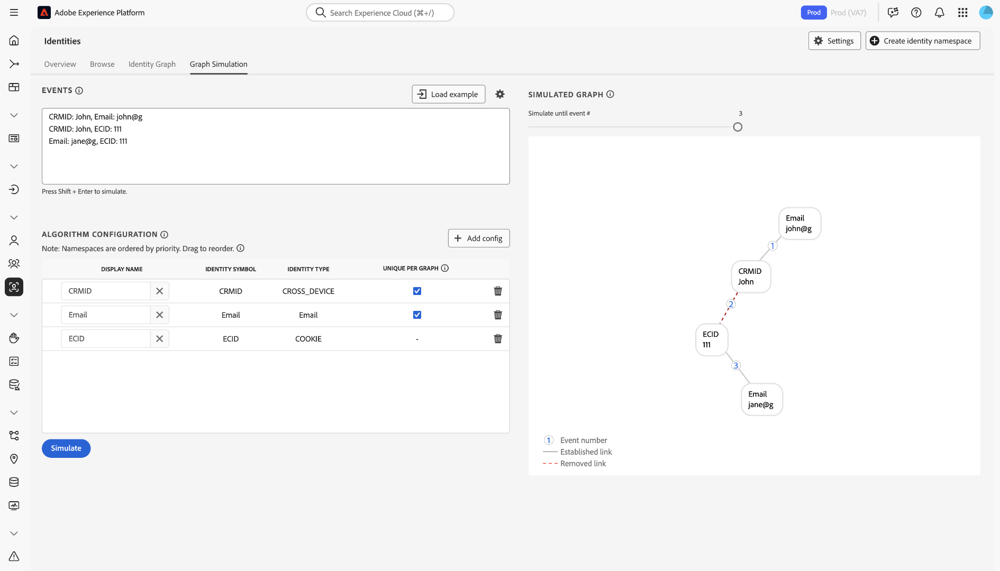

# Konfigurationsguide för [!DNL Identity Graph Linking Rules] {#configurations-guide}

>[!CONTEXTUALHELP]
>id="platform_identities_algorithmconfiguration"
>title="Algoritmkonfiguration"
>abstract="Konfigurera unik namnområdes- och namnområdesprioritet som är anpassad efter dina inkapslade identiteter."

Läs det här dokumentet om du vill veta mer om olika implementeringstyper som du kan konfigurera med [!DNL Identity Graph Linking Rules].

Scenarier med kunddiagram kan grupperas i tre olika kategorier.

* **Grundläggande**: [Grundläggande implementeringar](#basic-implementations) innehåller diagram som oftast innehåller enkla implementeringar. Dessa implementeringar tenderar att kretsa kring ett namnutrymme mellan olika enheter (till exempel CRMID). Grundläggande implementeringar är relativt okomplicerade, men diagramkomprimering kan ändå inträffa, ofta på grund av **delade enheter** -scenarier.
* **Mellanliggande**: [Mellanliggande implementeringar](#intermediate-implementations) innehåller flera variabler som **flera namnutrymmen mellan enheter**, **icke-unika identiteter** och **flera unika namnutrymmen**.
* **Avancerat**: [Avancerade implementeringar](#advanced-implementations) omfattar scenarier med komplexa och flerskiktade diagram. För avancerade implementeringar är det viktigt att fastställa rätt namnområdesprioritet för att säkerställa att rätt länkar tas bort, vilket förhindrar att diagrammet komprimeras.

## Kom igång

Innan du går in i följande dokument måste du bekanta dig med flera viktiga begrepp i identitetstjänsten och [!DNL Identity Graph Linking Rules].

* [Översikt över identitetstjänsten](../home.md)
* [[!DNL Identity Graph Linking Rules] översikt](../identity-graph-linking-rules/namespace-priority.md)
* [Namnområdesprioritet](namespace-priority.md)
* [Unikt namnutrymme](overview.md#unique-namespace)
* [Diagramsimulering](graph-simulation.md)

## Grundläggande implementeringar {#basic-implementations}

>[!NOTE]
>
>Om du vill slutföra implementeringarna nedan måste du skapa ett anpassat namnutrymme med identitetssymbolen (skiftlägeskänslig) för: `CRMID`.

Läs det här avsnittet för grundläggande implementeringar av [!DNL Identity Graph Linking Rules].

### Användningsfall: enkel implementering som använder ett namnutrymme mellan olika enheter

I allmänhet har Adobe-kunder ett enda namnutrymme som kan användas över alla deras egenskaper, inklusive webb, mobiler och program. Detta system är både branschmässigt och geografiskt agnostiskt eftersom kunder inom detaljhandel, telekom och finansiella tjänster använder denna typ av implementering.

Vanligtvis representeras en slutanvändare av ett namnutrymme mellan olika enheter (ofta ett CRMID), och därför bör CRMID klassificeras som ett unikt namnutrymme. En slutanvändare som äger en dator och en [!DNL iPhone] och inte delar sin enhet kan ha ett identitetsdiagram som följande.

Tänk dig att du är dataarkitekt på ett e-handelsföretag som heter **ACME**. John och Jane är era kunder. De är slutanvändare som bor tillsammans i San Jose i Kalifornien. De delar en stationär dator och använder den här datorn för att surfa på webbplatsen. John och Jane delar också en [!DNL iPad] och använder ibland denna [!DNL iPad] för att surfa på Internet, inklusive din webbplats.

**Textläge**

```json
CRMID: John, ECID: 123
CRMID: John, ECID: 999, IDFA: a-b-c
```

**Algoritmkonfiguration (identitetsinställningar)**

Konfigurera följande inställningar i diagramsimuleringsgränssnittet innan du simulerar diagrammet.

| Visningsnamn | Identitetssymbol | Identitetstyp | Unikt per diagram | Namnområdesprioritet |
| --- | --- | --- | --- | --- |
| CRMID | CRMID | CROSS_DEVICE | ✔️ | 1 |
| ECID | ECID | COOKIE | | 2 |
| IDFA | IDFA | ENHET | | 3 |

**Simulerat diagram**

I det här diagrammet representeras John (slutanvändaren) av CRMID. `{ECID: 123}` representerar den webbläsare som John använde på sin dator för att besöka din e-handelsplattform. `{ECID: 999}` representerar webbläsaren som han använde på sin [!DNL iPhone] och `{IDFA: a-b-c}` representerar sin [!DNL iPhone].


**Utövning**

Simulera följande konfiguration i Diagramsimulering. Du kan antingen skapa egna händelser eller kopiera och klistra in i textläge.

>[!BEGINTABS]

>[!TAB Delad enhet (PC)]

**Delad enhet (PC)**

**Textläge**

```json
CRMID: John, ECID: 111
CRMID: Jane, ECID: 111
```

**Simulerat diagram**

I det här diagrammet representeras John och Jane av sina egna respektive CRMID:

* `{CRMID: John}`
* `{CRMID: Jane}`

Webbläsaren på den stationära datorn som båda använder för att besöka din e-handelsplattform representeras av `{ECID: 111}`. I det här diagramscenariot är Jane den sista autentiserade slutanvändaren och därför tas länken mellan `{ECID: 111}` och `{CRMID: John}` bort.


>[!TAB Delad enhet (mobil)]

**Delad enhet (mobil)**

**Textläge**

```json
CRMID: John, ECID: 111, IDFA: a-b-c
CRMID: Jane, ECID: 111, IDFA: a-b-c
```

**Simulerat diagram**

I det här diagrammet representeras John och Jane av sina egna respektive CRMID:n. Webbläsaren som de använder representeras av `{ECID: 111}` och [!DNL iPad] som de delar representeras av `{IDFA: a-b-c}`. I det här diagramscenariot är Jane den sista autentiserade slutanvändaren och därför tas länkarna från `{ECID: 111}` och `{IDFA: a-b-c}` till `{CRMID: John}` bort.


>[!ENDTABS]

## Mellanliggande implementeringar {#intermediate-implementations}

>[!TIP]
>
>En **icke-unik identitet** är en identitet som är associerad med ett icke-unikt namnområde.

Läs det här avsnittet för mellanliggande implementeringar av [!DNL Identity Graph Linking Rules].

### Användningsfall: Dina data innehåller icke-unika identiteter

>[!NOTE]
>
>För att slutföra implementeringarna nedan måste du skapa följande anpassade namnutrymmen med identitetssymbolerna (skiftlägeskänsliga) för:
>
>* `CRMID`
>* `CChash` (Det här är ett anpassat namnutrymme som representerar ett hashade kreditkortsnummer.)

Tänk dig att du är en dataarkitekt som arbetar för en affärsbank som utfärdar kreditkort. Marknadsföringsteamet har angett att de vill inkludera historik för tidigare kreditkortstransaktioner i en profil. Det här identitetsdiagrammet kan se ut så här.

**Textläge**

```json
CRMID: John, CChash: 1111-2222 
CRMID: John, CChash: 3333-4444 
CRMID: John, ECID: 123 
CRMID: John, ECID: 999, IDFA: a-b-c
```

**Algoritmkonfiguration (identitetsinställningar)**

Konfigurera följande inställningar i diagramsimuleringsgränssnittet innan du simulerar diagrammet.

| Visningsnamn | Identitetssymbol | Identitetstyp | Unikt per diagram | Namnområdesprioritet |
| --- | --- | --- | --- | --- |
| CRMID | CRMID | CROSS_DEVICE | ✔️ | 1 |
| CChash | CChash | CROSS_DEVICE | | 2 |
| ECID | ECID | COOKIE | | 3 |
| IDFA | IDFA | ENHET | | 4 |

**Simulerat diagram**


Det finns inga garantier för att dessa kreditkortsnummer, eller andra icke-unika namnutrymmen, alltid kommer att kopplas till en enda slutanvändare. Två slutanvändare kan registrera med samma kreditkort. Det kan finnas icke-unika platshållarvärden som felaktigt har importerats. Kort och gott: det finns ingen garanti för att icke-unika namnutrymmen inte orsakar komprimering av diagram.

För att lösa det här problemet tar identitetstjänsten bort de äldsta länkarna och behåller de senaste länkarna. Detta garanterar att du bara har ett CRMID i ett diagram och förhindrar att diagrammet komprimeras.

**Utövning**

Simulera följande konfigurationer i Graph Simulation. Du kan antingen skapa egna händelser eller kopiera och klistra in i textläge.

>[!BEGINTABS]

>[!TAB Delad enhet]

**Textläge**

```json
CRMID: John, CChash: 1111-2222
CRMID: Jane, CChash: 3333-4444
CRMID: John, ECID: 123
CRMID: Jane, ECID:123
```

**Simulerat diagram**


>[!TAB Två slutanvändare med samma kreditkort]

Två olika slutanvändare registrerar sig för din e-handelswebbplats med samma kreditkort. Marknadsföringsteamet vill förhindra att diagram kollapsar genom att se till att kreditkortet bara är kopplat till en enda profil.

**Textläge**

```json
CRMID: John, CChash: 1111-2222
CRMID: Jane, CChash: 1111-2222
CRMID: John, ECID: 123
CRMID: Jane, ECID:456
```

**Simulerat diagram**


>[!TAB Ogiltigt kreditkortsnummer]

På grund av orena data hämtas ett ogiltigt kreditkortsnummer till Experience Platform.

**Textläge**

```json
CRMID: John, CChash: undefined
CRMID: Jane, CChash: undefined
CRMID: Jack, CChash: undefined
CRMID: Jill, CChash: undefined
```

**Simulerat diagram**


>[!ENDTABS]

### Användningsfall: Dina data innehåller både hash-kodade och ohashade CRMID:n

>[!NOTE]
>
>För att slutföra implementeringarna nedan måste du skapa anpassade namnutrymmen med identitetssymbolerna (skiftlägeskänsliga) för:
>
>* `CRMID`
>* `CRMIDhash`

Du infogar både ett ej hashas (offline) CRMID och ett hashas (online) CRMID. Förväntningarna är att det finns en direkt relation mellan både ohashed och hashed CRMID. När en slutanvändare bläddrar med ett autentiserat konto skickas det hashas-CRMID tillsammans med enhets-ID (representeras i identitetstjänsten som ett ECID).

**Algoritmkonfiguration (identitetsinställningar)**

Konfigurera följande inställningar i diagramsimuleringsgränssnittet innan du simulerar diagrammet.

| Visningsnamn | Identitetssymbol | Identitetstyp | Unikt per diagram | Namnområdesprioritet |
| --- | --- | --- | --- | --- | 
| CRMID | CRMID | CROSS_DEVICE | ✔️ | 1 |
| CRMIDhash | CRMIDhash | CROSS_DEVICE | ✔️ | 2 |
| ECID | ECID | COOKIE | | 3 |


**Utövning**

Simulera följande konfigurationer i Graph Simulation. Du kan antingen skapa egna händelser eller kopiera och klistra in i textläge.

>[!BEGINTABS]

>[!TAB Delad enhet]

John och Jane delar en enhet.

**Textläge**

```json
CRMID: John, CRMIDhash: John
CRMID: Jane, CRMIDhash: Jane
CRMIDhash: John, ECID: 111 
CRMIDhash: Jane, ECID: 111
```


>[!TAB Felaktiga data]

På grund av fel i hashprocessen genereras ett icke-unikt kraschat CRMID som skickas till identitetstjänsten.

**Textläge**

```json
CRMID: John, CRMIDhash: aaaa
CRMID: Jane, CRMIDhash: aaaa
```


>[!ENDTABS]
<!-- 
### Use case: You are using Real-Time CDP and Adobe Commerce

You have two types of end-users:

* **Members**: An end-user who is assigned a CRMID and has an email account registered to your system.
* **Guests**: An end-user who is not a member. They do not have an assigned CRMID and their email accounts are not registered to your system.

In this scenario, your customers are sending data from Adobe Commerce to Real-Time CDP.

**Exercise**

Simulate the following configurations in the graph simulation tool. You can either create your own events, or copy and paste using text mode.

>[!BEGINTABS]

>[!TAB Shared device between two members]

In this scenario, two members share the same device to browse an e-commerce website.

**Text mode**

```json
CRMID: John, Email: john@g
CRMID: Jane, Email: jane@g
CRMID: John, ECID: 111
CRMID: Jane, ECID: 111
```


>[!TAB Shared device between two guests]

In this scenario, two guests share the same device to browse an e-commerce website.

**Text mode**

```json
Email: john@g, ECID: 111
Email: jane@g, ECID: 111
```


>[!TAB Shared device between a member and a guest]

In this scenario, a member and a guest share the same device to browse an e-commerce website.

**Text mode**

```json
CRMID: John, Email: john@g
CRMID: John, ECID: 111
Email: jane@g, ECID: 111
```



>[!ENDTABS] -->

### Användningsfall: Dina data innehåller tre unika namnutrymmen

>[!NOTE]
>
>Om du vill slutföra implementeringarna nedan måste du skapa ett anpassat namnutrymme med identitetssymbolen (skiftlägeskänslig) för: `CRMID`.

Kunden definierar en enpersonsenhet enligt följande:

* En slutanvändare med ett tilldelat CRMID.
* En slutanvändare som är associerad med en hash-kodad e-postadress, så att profiler kan aktiveras för mål som stöder hash-kodad e-post (till exempel [!DNL Facebook]).
* En slutanvändare som är associerad med en e-postadress, så att supportpersonalen kan slå upp sin profil på Real-Time CDP med den e-postadressen.

| Visningsnamn | Identitetssymbol | Identitetstyp | Unikt per diagram | Namnområdesprioritet |
| --- | --- | --- | --- | --- |
| CRMID | CRMID | CROSS_DEVICE | ✔️ | 1 |
| E-post | E-post | E-post | ✔️ | 2 |
| Email_LC_SHA256 | Email_LC_SHA256 | E-post | ✔️ | 3 |
| ECID | ECID | COOKIE | | 4 |

Simulera följande konfigurationer i diagramsimuleringsverktyget. Du kan antingen skapa egna händelser eller kopiera och klistra in i textläge.

>[!BEGINTABS]

>[!TAB Delad enhet]

I det här scenariot loggar både John och Jane in på en e-handelswebbplats.

**Textläge**

```json
CRMID: John, Email: john@g, Email_LC_SHA256: john_hash 
CRMID: Jane, Email: jane@g, Email_LC_SHA256: jane_hash 
CRMID: John, ECID: 111 
CRMID: Jane, ECID: 111
```


>[!TAB En slutanvändare ändrar sin e-postadress]

**Textläge**

```json
CRMID: John, Email: john@g, Email_LC_SHA256: john_hash
CRMID: John, Email: john@y, Email_LC_SHA256: john_y_hash
```


>[!ENDTABS]

## Avancerade implementeringar {#advanced-implementations}

Avancerade implementeringar omfattar komplexa och flerskiktade diagramscenarier. De här typerna av implementeringar inkluderar användningen av **namnområdesprioritet** för att identifiera rätt länkar som måste tas bort för att diagrammet inte ska komprimeras.

**Namnområdesprioritet** är metadata som rangordnar namnutrymmen efter deras prioritet. Om ett diagram innehåller två identiteter, där vart och ett har olika unika namnutrymmen, använder identitetstjänsten namnområdesprioritet för att bestämma vilka länkar som ska tas bort. Mer information finns i [dokumentationen om namnområdesprioritet](../identity-graph-linking-rules/namespace-priority.md).

Namnområdesprioritet spelar en viktig roll i komplexa diagramscenarier. Diagram kan ha flera lager - en slutanvändare kan vara kopplad till flera inloggnings-ID:n och dessa inloggnings-ID:n kan hash-kodas. Dessutom kan olika ECID länkas till olika inloggnings-ID:n. För att säkerställa att rätt länk tas bort i rätt lager måste dina konfigurationer för namnområdesprioritet vara korrekta.

Läs det här avsnittet för mer avancerade implementeringar av [!DNL Identity Graph Linking Rules].

### Användningsfall: Du behöver support för flera rader företag

>[!NOTE]
>
>För att slutföra implementeringarna nedan måste du skapa anpassade namnutrymmen med identitetssymbolerna (skiftlägeskänsliga) för:
>* `CRMID`
>* `loginID`

Dina slutanvändare har två olika konton, ett personligt konto och ett företagskonto. Varje konto identifieras med ett annat ID. I det här scenariot skulle ett typiskt diagram se ut så här:

**Textläge**

```json
CRMID: John, loginID: JohnPersonal
CRMID: John, loginID: JohnBusiness
loginID: JohnPersonal, ECID: 111
loginID: JohnPersonal, ECID: 222
loginID: JohnBusiness, ECID: 222
```

**Algoritmkonfiguration (identitetsinställningar)**

Konfigurera följande inställningar i diagramsimuleringsgränssnittet innan du simulerar diagrammet.

| Visningsnamn | Identitetssymbol | Identitetstyp | Unikt per diagram | Namnområdesprioritet |
| --- | --- | --- | --- | --- |
| CRMID | CRMID | CROSS_DEVICE | ✔️ | 1 |
| loginID | loginID | CROSS_DEVICE | | 2 |
| ECID | ECID | COOKIE | | 3 |

**Simulerat diagram**


**Utövning**

Simulera följande konfiguration i Diagramsimulering. Du kan antingen skapa egna händelser eller kopiera och klistra in i textläge.

>[!BEGINTABS]

>[!TAB Delad enhet]

**Textläge**

```json
CRMID: John, loginID: JohnPersonal
CRMID: John, loginID: JohnBusiness
CRMID: Jane, loginID: JanePersonal
CRMID: Jane, loginID: JaneBusiness
loginID: JohnPersonal, ECID: 111
loginID: JanePersonal, ECID: 111
```


>[!TAB Felaktiga data skickas till Real-Time CDP]

**Textläge**

```json
CRMID: John, loginID: JohnPersonal
CRMID: John, loginID: error
CRMID: Jane, loginID: JanePersonal
CRMID: Jane, loginID: error
loginID: JohnPersonal, ECID: 111
loginID: JanePersonal, ECID: 222
```


>[!ENDTABS]

### Använd skiftläge: Du har komplexa implementeringar som kräver flera namnutrymmen

>[!NOTE]
>
>För att slutföra implementeringarna nedan måste du skapa anpassade namnutrymmen med identitetssymbolerna (skiftlägeskänsliga) för:
>
>* `CRMID`
>* `loyaltyID`
>* `thirdPartyID`
>* `orderID`

Du är ett medie- och underhållningsföretag och dina slutanvändare har följande:

* EN CRMID
* Ett lojalitets-ID

Dessutom kan slutanvändarna göra ett köp på e-handelswebbplatsen och dessa data är knutna till deras e-postadress. Användardata berikas också av en tredjeparts databasleverantör och skickas till Experience Platform i grupper.

**Textläge**

```json
CRMID: John, loyaltyID: John, Email: john@g
Email: john@g, orderID: aaa
CRMID: John, thirdPartyID: xyz
CRMID: John, ECID: 111
```

**Algoritmkonfiguration (identitetsinställningar)**

Konfigurera följande inställningar i diagramsimuleringsgränssnittet innan du simulerar diagrammet.

| Visningsnamn | Identitetssymbol | Identitetstyp | Unikt per diagram | Namnområdesprioritet |
| --- | --- | --- | --- | --- |
| CRMID | CRMID | CROSS_DEVICE | ✔️ | 1 |
| loyaltyID | loyaltyID | CROSS_DEVICE | ✔️ | 2 |
| E-post | E-post | E-post | ✔️ | 3 |
| thirdPartyID | thirdPartyID | CROSS_DEVICE | | 4 |
| orderID | orderID | CROSS_DEVICE | | 5 |
| ECID | ECID | COOKIE | | 6 |

**Utövning**

Simulera följande konfiguration i Diagramsimulering. Du kan antingen skapa egna händelser eller kopiera och klistra in i textläge.

>[!BEGINTABS]

>[!TAB Delad enhet]

**Textläge**

```json
CRMID: John, loyaltyID: John, Email: john@g
CRMID: Jane, loyaltyID: Jane, Email: jane@g
Email: john@g, orderID: aaa 
CRMID: John, thirdPartyID: xyz 
CRMID: John, ECID: 111
CRMID: Jane, ECID: 111
```


>[!TAB Slutanvändaren ändrar sin e-postadress]

**Textläge**

```json
CRMID: John, loyaltyID: John, Email: john@g
CRMID: John, loyaltyID: John, Email: john@y
```


>[!TAB Associationen thirdPartyID ändras]

**Textläge**

```json
CRMID: John, loyaltyID: John, Email: john@g
CRMID: Jane, loyaltyID: Jane, Email: jane@g
CRMID: John, thirdPartyID: xyz
CRMID: Jane, thirdPartyID: xyz
```


>[!TAB Icke-unikt orderID]

**Textläge**

```json
CRMID: John, loyaltyID: John, Email: john@g
CRMID: Jane, loyaltyID: Jane, Email: jane@g
Email: john@g, orderID: aaa
Email: jane@g, orderID: aaa
```


>[!TAB Fel lojalitets-ID]

**Textläge**

```json
CRMID: John, loyaltyID: aaa, Email: john@g
CRMID: Jane, loyaltyID: aaa, Email: jane@g
```


>[!ENDTABS]

## Nästa steg

Mer information om [!DNL Identity Graph Linking Rules] finns i följande dokumentation:

* [[!DNL Identity Graph Linking Rules] översikt](./overview.md)
* [Optimeringsalgoritm för identitet](./identity-optimization-algorithm.md)
* [Implementeringsguide](./implementation-guide.md)
* [Felsökning och vanliga frågor](./troubleshooting.md)
* [Namnområdesprioritet](./namespace-priority.md)
* [Gränssnitt för diagramsimulering](./graph-simulation.md)
* [Användargränssnitt för identitetsinställningar](./identity-settings-ui.md)