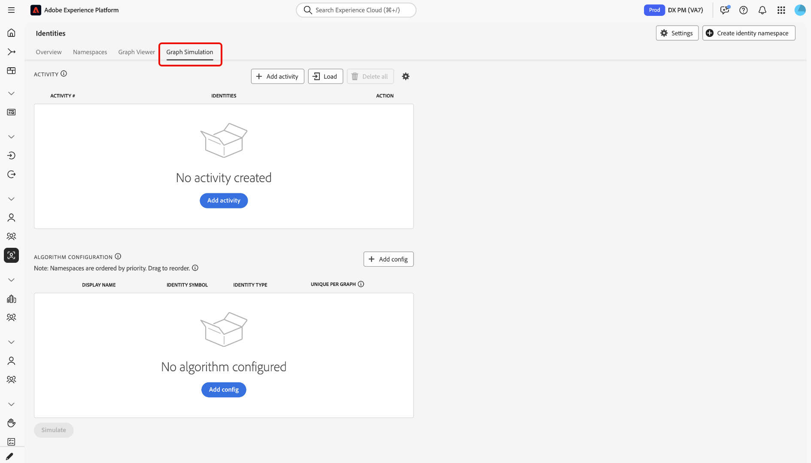
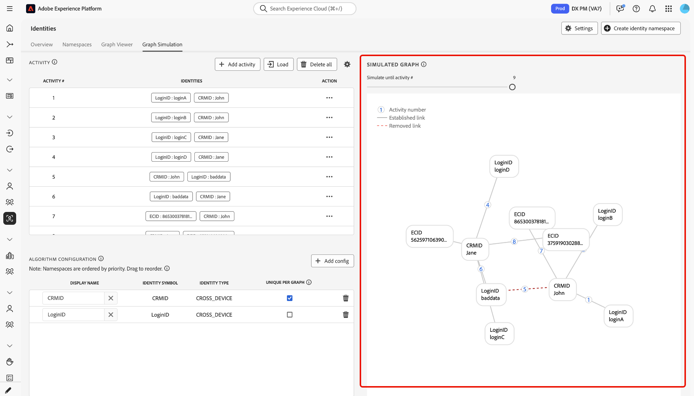
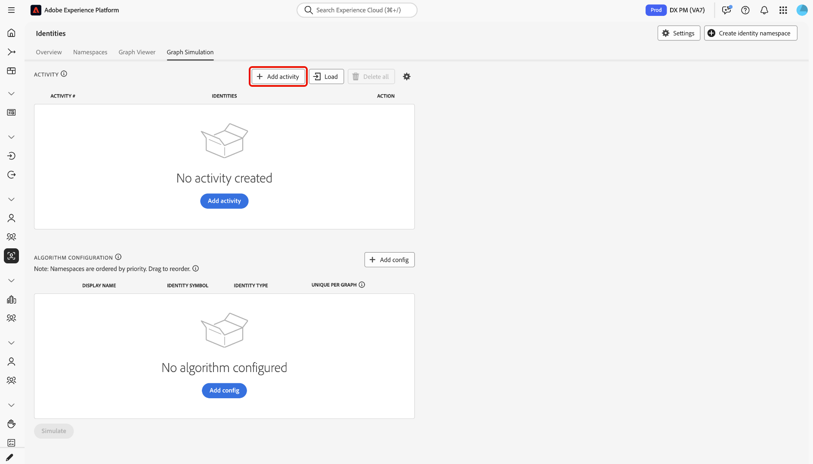
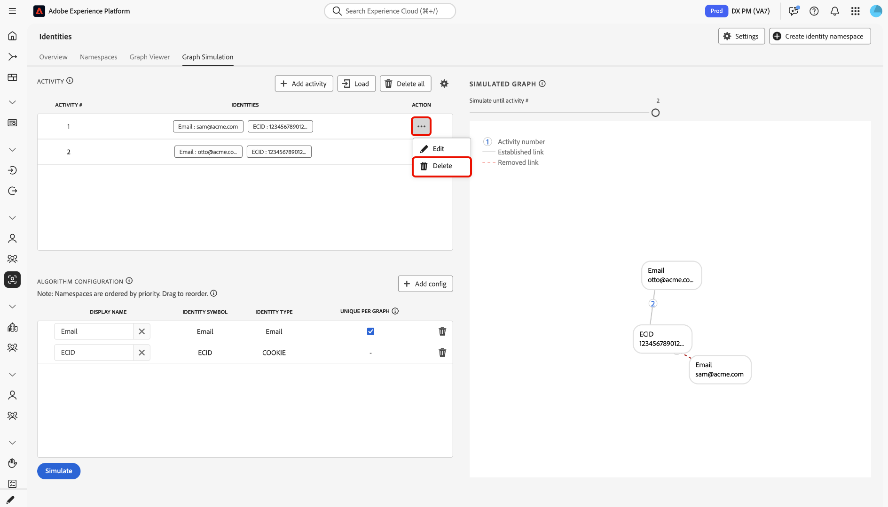

# Användargränssnittshandbok för [!DNL Graph Simulation] {#graph-simulation}

>[!CONTEXTUALHELP]
>id="platform_identities_graphsimulation"
>title="Diagramsimulering"
>abstract="Simulera diagram för att förstå hur identitetstjänsten länkar identiteter och hur algoritmen för identitetsoptimering fungerar."

[!DNL Graph Simulation] är ett verktyg i identitetstjänstens gränssnitt som du kan använda för att simulera hur ett identitetsdiagram fungerar baserat på de identiteter du anger och hur du konfigurerar [identitetsoptimeringsalgoritmen](./identity-optimization-algorithm.md).

Använd det för att testa diagrambeteendet innan du använder [!DNL Identity Graph Linking Rules] på produktionsdata. Genom att definiera exempelhändelser och konfigurera algoritmen för identitetsoptimering, inklusive namnområdesprioriteter och inställningar för&quot;unik per diagram&quot;, kan du se om identiteterna sammanfogas i ett diagram eller hålls åtskilda och sedan justera konfigurationen efter behov. Använd den här funktionen för att

* Förhindra komprimering av diagram (t.ex. när flera personer delar en enhet eller ett telefonnummer)
* Finjustera namnområdesprioriteter (t.ex. om EMAIL eller CRM_ID ska vara dominerande)
* Utvärdera hur identifierare av låg kvalitet eller återanvändning kan påverka sammanfogningen i din miljö.

Du kan också upprepa konfigurationsändringar och felsöka identitetsproblem som visas i program som körs längre fram i kedjan. Om målgruppsstorlekar eller sammanfogade profiler ser fel ut kan du återskapa de relevanta händelserna i [!DNL Graph Simulation] för att se hur de aktuella reglerna formar diagrammet och testa säkrare alternativ.

De inbyggda exempelscenarierna hjälper er att förklara identitetsbeteenden och risk för kollaps för intressenter och ge stöd för köp av datakvalitet och identitetsstyrning.

## Om gränssnittet [!DNL Graph Simulation]

Om du vill komma åt [!DNL Graph Simulation] går du till identitetstjänstens arbetsyta i Adobe Experience Platform användargränssnitt och väljer **[!UICONTROL Graph Simulation]**.

Gränssnittet är uppdelat i tre huvudavsnitt:

>[!BEGINTABS]

>[!TAB Aktivitet]

Använd panelen **[!UICONTROL Activity]** för att lägga till identiteter för att simulera ett diagram. Varje identitet behöver ett namnutrymme och ett värde. Du måste lägga till minst två identiteter för att köra en simulering. Du kan också välja **[!UICONTROL Load]** om du vill importera en förkonfigurerad händelse- och algoritminställning eller öppna ett befintligt diagram.

>[!TAB Algoritmkonfiguration]

Använd panelen **[!UICONTROL Algorithm configuration]** för att lägga till och konfigurera optimeringsalgoritmen för dina namnutrymmen. Dra och släpp namnutrymmesrader för att ändra prioritetsordningen. Du kan också markera **[!UICONTROL Unique Per Graph]** om ett namnutrymme måste vara unikt i diagrammet.

>[!TAB Simulerat diagram]

Använd **[!UICONTROL Simulated graph]**-skärmen för att granska diagrammet som skapats från dina aktiviteter och algoritminställningar. En heldragen linje mellan två identiteter innebär att länken behålls. En prickad linje innebär att algoritmen har tagit bort länken.

>[!ENDTABS]

## Arbetsflöde för [!DNL Graph Simulation]

### Lägg till aktiviteter

Välj **[!UICONTROL Add Activity]** om du vill börja simulera identitetsdiagram.

När popup-fönstret för [!UICONTROL Activity #1] visas väljer du ett identitetsnamnutrymme och anger dess värde. Du kan välja ett namnutrymme i listrutan eller skriva några bokstäver för att filtrera listan. När du har valt ett namnutrymme anger du det matchande identitetsvärdet.

>[!TIP]
>
>Du behöver inte använda verkliga identitetsvärden när du använder [!DNL Graph Simulation].

Gränssnittet [!UICONTROL Activity] uppdateras för att visa din första aktivitet.

Välj **[!UICONTROL Add Activity]** igen och slutför en andra aktivitet. Du behöver minst två fullständigt kvalificerade identiteter (namnutrymme plus värde) för att generera ett diagram.

### Konfigurera algoritm

>[!IMPORTANT]
>
>Algoritmen som du konfigurerar styr hur identitetstjänsten hanterar namnområdena i dina aktiviteter. Inget som du har konfigurerat i [!DNL Graph Simulation UI] sparas i identitetsinställningarna för identitetstjänsten.

När dina aktiviteter är på plats konfigurerar du algoritmen för simuleringen. Välj **[!UICONTROL Add config]**.

Lägg till varje namnutrymme som du vill att algoritmen ska ta hänsyn till. Använd listrutan för att söka eller skriv de första bokstäverna för att begränsa listan.

* **Namnområdesprioritet**: Du styr prioritetsordningen för varje namnutrymme i identitetsdiagrammet. Om ditt diagram till exempel använder CRMID, ECID, Email och Apple IDFA, kan du ange deras prioritet för att återspegla vilken prioritet som ska beaktas först när du länkar identiteter. Namnutrymmet högst upp i listan har högst prioritet.
* **Unikt namnutrymme**: När ett namnutrymme har markerats som unikt ser identitetstjänsten till att endast en identitet med det namnutrymmet visas i ett diagram. Om E-post till exempel anges som unik innehåller varje diagram bara en e-postidentitet. Om det finns flera identiteter med samma e-postadress kommer den äldsta anslutningen att tas bort för att bibehålla unikheten.

Dra namnutrymmesrader till prioritetsordning: den översta raden har högst prioritet och den nedersta är lägst. Om du vill behandla ett namnutrymme som unikt i diagrammet markerar du kryssrutan **[!UICONTROL Unique Per Graph]**.

Välj **[!UICONTROL Simulate]** när du är klar.

### Visa simulerat diagram

Avsnittet [!UICONTROL Simulated Graph] visar diagram som skapats från dina aktiviteter och algoritmkonfigurationen.

| Diagramikoner | Beskrivning |
| --- | --- |
| Heldragen linje | En heldragen linje representerar en etablerad länk mellan två identiteter. |
| Prickad linje | En prickad linje representerar en borttagen länk mellan två identiteter. |
| Nummer på rad | Ett nummer på en rad visar när länken skapades i förhållande till de andra. Den lägsta siffran (1) är den tidigaste länken. |

## Ytterligare funktioner

Du kan också redigera eller ta bort aktiviteter, ange aktiviteter i textläge, läsa in ett exempelscenario eller hämta in ett befintligt diagram från identitetstjänsten.

### Redigera aktivitet {#edit-activity}

Om du vill redigera en aktivitet markerar du ellipserna (`...`) bredvid en viss aktivitet och väljer sedan **[!UICONTROL Edit]**.

### Ta bort aktivitet {#delete-activity}

Om du vill ta bort en aktivitet markerar du ellipserna (`...`) bredvid en viss aktivitet och väljer sedan **[!UICONTROL Delete]**.

### Använda textläge {#use-text-mode}

Du kan använda textläge för att konfigurera dina aktiviteter. Om du vill använda textläget markerar du inställningsikonen och väljer sedan **[!UICONTROL Text (Advanced users)]**.

I textläge anger du varje identitet som `namespace:value`. Avgränsa flera identiteter i samma händelse med kommatecken (`,`). Starta en ny rad för varje händelse.

### Läs in exempel {#load-example}

Välj **[!UICONTROL Load example]** om du vill läsa in ett färdigt diagram med förinställda aktiviteter och algoritminställningar.

I en dialogruta visas de scenarier du kan öppna:

| Exempeldiagram | Beskrivning | Exempel |
| --- | --- | --- |
| Delad enhet | Två olika användare loggar in på samma enhet. | En man och fru delar en iPad för att surfa och e-handel. |
| Ogiltig (icke-unik) telefon | Två olika användare registrerar sig med samma telefonnummer. | En mor och dotter använder ett delat telefonnummer hemma för att registrera sig för e-handelskonton. |
| Felaktiga identitetsvärden | Implementeringsfel skickar dubblett- eller platshållar-ID:n (till exempel samma IDFA för många användare). | Web SDK skickar ett `user_null`-värde för varje aktivitet på grund av ett kodfel. |

Välj ett scenario att läsa in [!DNL Graph Simulation] med matchande aktiviteter och algoritminställningar. Du kan redigera resultatet på samma sätt som andra simuleringar.

### Läs in befintligt diagram {#load-existing-graph}

Du kan använda [!DNL Graph Simulation] för att läsa in ett befintligt diagram och visa dess aktiviteter, algoritmkonfiguration och diagram.

Välj **[!UICONTROL Load]** och sedan **[!UICONTROL Existing graph]**.

I dialogrutan anger du ett namnutrymme och identitetsvärde som tillhör diagrammet som du vill inspektera.

När inläsningen är klar visar [!DNL Graph Simulation] det diagram som innehåller den identiteten.

>[!TIP]
>
>När du har konfigurerat inställningarna på den första [identitetsinställningarna](./identity-settings-ui.md) -skärmen kan du använda alternativet **Läs in befintliga diagram** för att simulera diagrammet baserat på de exakta inställningarna. Simuleringen använder den konfiguration du har definierat.

## Nästa steg

Du kan använda [!DNL Graph Simulation] för att se hur identitetstjänsten länkar identiteter under olika regler innan du ändrar produktionsinställningarna. Mer information finns i följande dokumentation:

* [[!DNL Identity Graph Linking Rules] översikt](./overview.md)
* [Optimeringsalgoritm för identitet](./identity-optimization-algorithm.md)
* [Implementeringsguide](./implementation-guide.md)
* [Felsökning och vanliga frågor](./troubleshooting.md)
* [Exempel på diagramkonfigurationer](./example-configurations.md)
* [Namnområdesprioritet](./namespace-priority.md)
* [Användargränssnitt för identitetsinställningar](./identity-settings-ui.md)
