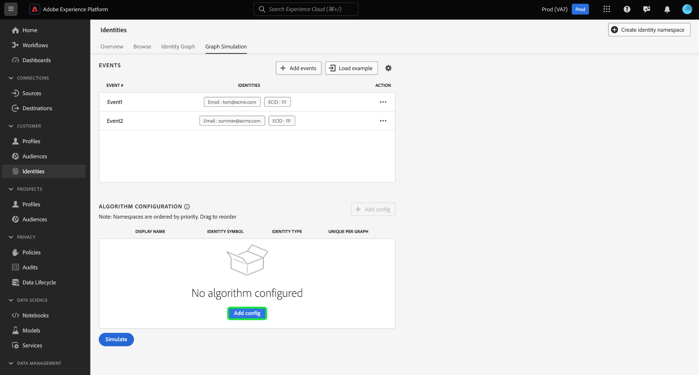

# Användargränssnittshandbok för [!DNL Graph Simulation]

>[!AVAILABILITY]
>
>Regler för länkning av identitetsdiagram är för närvarande begränsade. Kontakta ditt Adobe-kontoteam om du vill ha information om hur du kommer åt funktionen i utvecklingssandlådor.

[!DNL Graph Simulation] är ett verktyg i identitetstjänstens gränssnitt som du kan använda för att simulera hur ett identitetsdiagram beter sig när en viss kombination av identiteter anges och hur du konfigurerar [identitetsoptimeringsalgoritmen](./identity-optimization-algorithm.md).

Läs det här dokumentet om du vill veta mer om hur du kan använda [!DNL Graph Simulation] för att bättre förstå identitetsgrafens beteende och hur diagramalgoritmen fungerar.

## Lär känna gränssnittet [!DNL Graph Simulation] {#interface}

Du har åtkomst till [!DNL Graph Simulation] i Adobe Experience Platform-gränssnittet. Välj **[!UICONTROL Identities]** i den vänstra navigeringen och välj sedan **[!UICONTROL Graph Simulation]** i den övre rubriken.

Gränssnittet [!DNL Graph Simulation] kan delas in i tre avsnitt:

>[!BEGINTABS]

>[!TAB Händelser]

Händelser: Använd panelen **[!UICONTROL Events]** för att lägga till identiteter för att simulera ett diagram. En fullständigt kvalificerad identitet måste ha ett ID-namnutrymme och dess motsvarande identitetsvärde. Du måste lägga till minst två identiteter för att simulera ett diagram. Du kan också välja **[!UICONTROL Load Example]** om du vill ange en förkonfigurerad händelse- och algoritminställning.

>[!TAB Algoritmkonfiguration]

Algoritmkonfiguration: Använd panelen **[!UICONTROL Algorithm configuration]** för att lägga till och konfigurera optimeringsalgoritmen för dina namnutrymmen. Du kan dra och släppa ett namnutrymme för att ändra deras respektive prioritetsordning. Du kan också välja **[!UICONTROL Unique Per Graph]** för att avgöra om ett namnutrymme är unikt.

>[!TAB Simulerat diagramvisningsprogram]

Simulerat diagramvisningsprogram: Det simulerade diagramvisningsprogrammet visar det resulterande diagrammet baserat på händelser som du har lagt till och den algoritm som du har konfigurerat. En rak linje mellan två identiteter innebär att en länk upprättas. En prickad linje anger att en länk har tagits bort.

>[!ENDTABS]

## Lägg till händelser {#add-events}

>[!CONTEXTUALHELP]
>id="platform_identities_graphsimulation"
>title="Lägg till händelser"
>abstract="Simulera diagram för att förstå hur identitetstjänsten länkar identiteter och hur identitetsoptimeringsalgoritmen fungerar."

Börja genom att välja **[!UICONTROL Add events]**.

Ett popup-fönster visas för [!UICONTROL Event #1]. Ange din kombination av identitetsnamn och identitetsvärde härifrån. Du kan använda listrutan för att välja ett identitetsnamnutrymme. Du kan också skriva de första bokstäverna i ett namnutrymme och sedan välja alternativen i listrutan. När du har valt namnutrymmet anger du ett identitetsvärde som motsvarar namnutrymmet.

>[!TIP]
>
>Identitetsvärdet som du anger under [!DNL Graph Simulation]-övningar behöver inte vara verkliga identitetsvärden och kan vara enkla platshållare.

När din första identitet är klar väljer du ikonen Lägg till (**`+`**) för att lägga till en andra identitet.

Upprepa sedan samma steg och lägg till en andra identitet. Två fullständigt kvalificerade identiteter krävs för att skapa ett identitetsdiagram. I exemplet nedan läggs ett ECID till som ett namnutrymme och har värdet `111`. När du är klar väljer du **[!UICONTROL Save]**.

Gränssnittet [!UICONTROL Events] uppdateras för att visa din första händelse, som i det här fallet är: `{Email: tom@acme.com, ECID: 111}`.

Upprepa sedan samma steg för att lägga till en andra händelse. För händelse 2 lägger du till `{Email: summer@acme.com}` som din första identitet och lägger sedan till samma `{ECID: 111}` som den andra identiteten, vilket skapar en andra händelse: `{Email: summer@acme.com}, {ECID: 111}`. När du är klar bör du ha två händelser, en för `{Email: tom@acme.com, ECID: 111}` och en för `{Email: summer@acme.com}, {ECID: 111}`.

### Läs in exempel {#load-example}

Välj **[!UICONTROL Load example]** om du vill konfigurera ett exempeldiagram med en förinställd algoritm och händelsekonfiguration.

Ett popup-fönster visas med tillgängliga diagramscenarier som du kan välja mellan:

| Exempeldiagram | Beskrivning | Exempel |
| --- | --- | --- |
| Delad enhet | Delad enhet avser scenarier där två olika användare loggar in på samma enhet. | En man och fru delar en iPad för surfning och e-handel. |
| Ogiltig (icke-unik) telefon | Ogiltig eller icke-unik telefon hänvisar till scenarier där två olika användare använder samma telefonnummer för att skapa ett konto. | En mor och hennes dotter använder sitt delade hemtelefonnummer för att registrera sig för e-handelskonton. |
| Felaktiga identitetsvärden | &quot;Dåliga&quot; identitetsvärden hänvisar till scenarier där identitetstjänsten genererar icke-unika IDFA:er på grund av felaktig implementering. | WebSDK skickar felaktigt ett `user_null`-värde för varje händelse på grund av kodimplementeringsproblem. |

Välj något av alternativen för att läsa in [!DNL Graph Simulation] med förkonfigurerade händelser och algoritmer. Du kan fortfarande göra ytterligare konfigurationer av alla förinlästa diagramscenarioexempel.

När du är klar väljer du **[!UICONTROL Simulate]**.

### Använd textversion {#use-text-version}

Du kan också använda textläge för att konfigurera händelser. Om du vill använda textläget markerar du inställningsikonen och väljer sedan **[!UICONTROL Text (Advanced users)]**.

Du kan ange dina identiteter manuellt i textläge. Använd ett kolon (`:`) för att skilja det identitetsvärde som motsvarar det namnutrymme som du anger och använd sedan ett komma (`,`) för att separera dina identiteter. Om du vill skilja olika händelser från varandra använder du en ny rad för varje händelse.

### Redigera händelse {#edit-event}

Om du vill redigera en händelse markerar du ellipserna (`...`) bredvid en viss händelse och väljer sedan **[!UICONTROL Edit]**.

### Ta bort händelse {#delete-event}

Om du vill ta bort en händelse markerar du ellipserna (`...`) bredvid en viss händelse och väljer sedan **[!UICONTROL Delete]**.

## Konfigurera algoritm {#configure-algorithm}

>[!CONTEXTUALHELP]
>id="platform_identities_algorithmconfiguration"
>title="Algoritmkonfiguration"
>abstract="Konfigurera unik namnområdes- och namnområdesprioritet som är anpassad efter dina inkapslade identiteter."

>[!CONTEXTUALHELP]
>id="platform_identities_namespacepriority"
>title="Algoritmkonfiguration"
>abstract="Namnområdesprioriteten avgör hur länkar tas bort från identitetsdiagrammet."

>[!IMPORTANT]
>
>Den algoritm som du konfigurerar styr hur identitetstjänsten hanterar de namnutrymmen som du anger i dina händelser. Konfigurationer som du har satt ihop i [!DNL Graph Simulation UI] sparas inte i identitetsinställningarna.

När du har lagt till dina händelser kan du nu konfigurera algoritmen som ska användas för att simulera diagrammet. Börja genom att välja **[!UICONTROL Add config]**.

En tom konfigurationsrad visas. Börja med att ange samma namnutrymme som du använde för händelserna. I det här fallet börjar du med att skriva e-post. När du har angett namnutrymmet fylls kolumnerna för [!UICONTROL Identity Symbol] och [!UICONTROL Identity Type] i automatiskt.

Upprepa sedan samma steg och lägg till ditt andra namnutrymme, som i det här fallet är ECID. När alla namnutrymmen har angetts kan du börja konfigurera deras prioriteringar och unika utseende.

* **Namnområdesprioritet**: Namnutrymmets prioritet avgör dess relativa betydelse jämfört med andra namnutrymmen i ett givet identitetsdiagram. Om identitetsdiagrammet till exempel har fyra olika namnutrymmen: CRMID, ECID, Email och Apple IDFA, kan du konfigurera prioriteter för att fastställa prioritetsordningen för de fyra namnutrymmena.
* **Unikt namnområde**: Om ett namnområde har angetts som unikt, genererar identitetstjänsten diagram med kopian att det bara kan finnas en identitet med ett givet unikt namnområde. Om namnutrymmet E-post till exempel har angetts som ett unikt namnutrymme kan ett diagram bara ha en identitet med E-post. Om det finns mer än en identitet med e-postnamnutrymmet tas den äldsta länken bort.

Om du vill konfigurera namnutrymmesprioritet markerar du och drar namnutrymmesraderna till önskad prioritetsordning, där den översta raden representerar högre prioritet och den nedersta raden motsvarar lägre prioritet. Om du vill ange ett namnutrymme som unikt markerar du kryssrutan **[!UICONTROL Unique Per Graph]**.

När du är klar väljer du **[!UICONTROL Simulate]**.

## Visa simulerat diagram

Avsnittet [!UICONTROL Simulated Graph] visar identitetsdiagram som genererats baserat på händelser som du har lagt till och den algoritm som du har konfigurerat.

| Diagramikoner | Beskrivning |
| --- | --- |
| Heldragen linje | En heldragen linje representerar en etablerad länk mellan två identiteter. |
| Prickad linje | En prickad linje representerar en borttagen länk mellan två identiteter. |
| Nummer på rad | Ett nummer på en rad representerar tidsstämpeln som den angivna länken skapades för. Det lägsta talet (1) representerar den tidigaste etablerade länken. |

I exempeldiagrammet nedan finns det en prickad linje mellan `{Email: tom@acme.com}` och `{ECID: 111}` på grund av följande orsaker:

* E-postadressen angavs som unik under algoritmens konfigurationssteg. Därför kan det bara finnas en identitet med ett e-postnamnutrymme i ett diagram.
* Länken mellan `{Email: tom@acme.com}` och `{ECID: 111}` var den första etablerade identiteten (händelse nr 1). Det är den äldsta länken och tas därför bort.

## Nästa steg

Genom att läsa det här dokumentet vet du nu hur du använder verktyget [!DNL Graph Simulation] för att bättre förstå hur dina identitetsdata behandlas utifrån en viss uppsättning regler och konfigurationer. Mer information finns i följande dokument:

* [Översikt över regler för länkning av identitetsdiagram](./overview.md)
* [Identitetsoptimeringsalgoritm](./identity-optimization-algorithm.md)
* [Implementeringsguide](./implementation-guide.md)
* [Felsökning och vanliga frågor](./troubleshooting.md)
* [Exempel på diagramkonfigurationer](./example-configurations.md)
* [Namnområdesprioritet](./namespace-priority.md)
* [Användargränssnitt för identitetsinställningar](./identity-settings-ui.md)