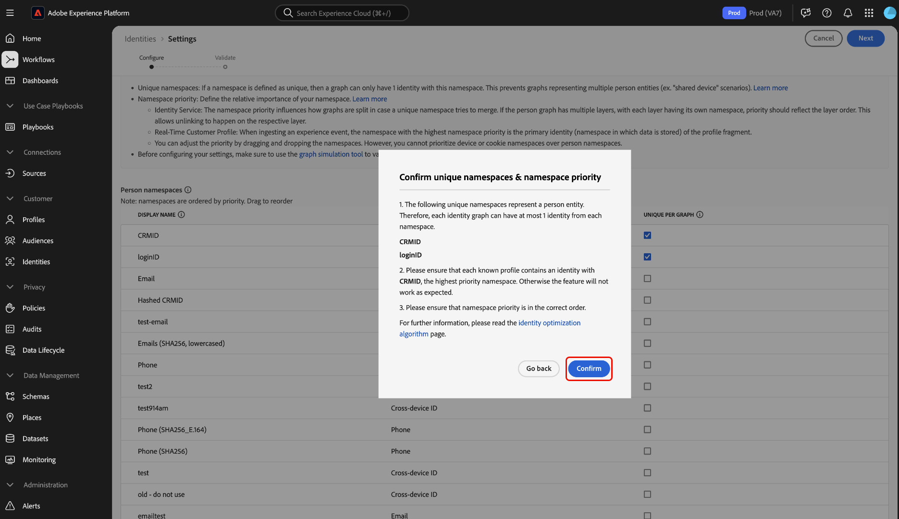

# Användargränssnitt för identitetsinställningar

>[!AVAILABILITY]
>
>Länkningsreglerna för identitetsdiagram är för närvarande begränsade. Kontakta ditt Adobe-kontoteam för information om hur du får tillgång till funktionen i utvecklingssandlådor.

Identitetsinställningar är en funktion i användargränssnittet för Adobe Experience Platform Identity Service som du kan använda för att ange unika namnutrymmen och konfigurera namnområdesprioritet.

Läs den här vägledningen när du vill lära dig hur du konfigurerar dina identitetsinställningar i användargränssnittet.

## Förhandskrav

Läs följande dokument innan du börjar arbeta med identitetsinställningar:

* [Länkningsregler för identitetsdiagram](./overview.md)
* [Identitetsoptimeringsalgoritm](./identity-optimization-algorithm.md)
* [Implementeringsguide](./implementation-guide.md)
* [Exempel på diagramkonfigurationer](./example-configurations.md)
* [Namnområdesprioritet](./namespace-priority.md)
* [Diagramsimulering](./graph-simulation.md)

### Ange behörigheter {#set-permissions}

Därefter måste du se till att ditt konto har följande behörigheter:

* **[!UICONTROL View Identity Settings]**: Använd den här behörigheten för att kunna visa unika namnutrymmen och namnområdesprioritet på ID-namnutrymmets bläddringssida.
* **[!UICONTROL Edit Identity Settings]**: Använd den här behörigheten för att kunna redigera och spara dina identitetsinställningar.

Kontakta administratören om du inte har dessa behörigheter. Mer information finns i [behörighetshandboken](../../access-control/abac/ui/permissions.md).

## Konfigurera dina identitetsinställningar

Om du vill komma åt identitetsinställningarna går du till identitetstjänstens arbetsyta i Adobe Experience Platform-gränssnittet och väljer **[!UICONTROL Settings]**.

Sidan med identitetsinställningar är uppdelad i två avsnitt: [!UICONTROL Person namespaces] och [!UICONTROL Device or cookie namespaces]. Personnamnutrymmen är identifierare för enskilda personer. De kan vara enhets-ID, e-postadresser och telefonnummer. Namnutrymmen för enheter och cookies är identifierare för enheter och webbläsare och kan inte ges en högre prioritet än namnutrymmen för personer. Du kan inte heller ange en enhets- eller cookie-namnrymd som ett unikt namnutrymme.

### Konfigurera namnområdesprioritet

Om du vill konfigurera namnområdesprioriteten väljer du ett namnutrymme på menyn för identitetsinställningar och drar och släpper sedan namnutrymmet i den ordning som du vill ha det. Placera ett namnutrymme högre upp i listan för att ge det högre prioritet och tvärtom placera ett namnutrymme längre ned i listan för att ge det lägre prioritet. Det namnutrymme som har högst prioritet bör också anges som ett unikt namnutrymme.

### Ange ditt unika namnutrymme

Om du vill ange ett unikt namnutrymme markerar du kryssrutan [!UICONTROL Unique per graph] som motsvarar det namnutrymmet. Du kan välja **upp till högst tre unika namnutrymmen** för konfigurationen av identitetsinställningarna.

När de unika namnutrymmena har skapats kan diagram inte längre ha flera identiteter som innehåller ett unikt namnutrymme. Om du till exempel har angett CRMID som ett unikt namnutrymme, kan ett diagram bara ha en identitet med CRMID-namnutrymmet. Mer information finns i översikten [för algoritmen för identitetsoptimering](./identity-optimization-algorithm.md#unique-namespace).

När du är klar med dina konfigurationer väljer du **[!UICONTROL Next]** för att fortsätta.

Här måste du bekräfta följande innan du fortsätter till det sista steget:

1. De markerade unika namnutrymmena.
2. Identiteten med det högsta prioriterade unika namnutrymmet i varje känd profil.
3. Ordningen för namnområdesprioriteten.

### Bekräfta inställningarna {#confirm-your-settings}

>[!IMPORTANT]
>
>* Det sista steget är ett annat bekräftelsemeddelande som anger att befintliga diagram bara påverkas av diagramalgoritmen **om diagrammen uppdateras efter att du har sparat dina inställningar** och att den primära identiteten för händelsefragment i kundprofilen i realtid inte uppdateras även efter att namnområdesprioriteten har ändrats.
>
>* Dessutom får du ett meddelande om att det tar upp till **sex timmar** innan de nya eller uppdaterade inställningarna börjar gälla. Bekräfta genom att ange namnet på din sandlåda och sedan välja **[!UICONTROL Confirm]**.

## Nästa steg

Mer information om regler för länkning av identitetsdiagram finns i följande dokumentation:

* [Översikt över regler för länkning av identitetsdiagram](./overview.md)
* [Identitetsoptimeringsalgoritm](./identity-optimization-algorithm.md)
* [Implementeringsguide](./implementation-guide.md)
* [Exempel på diagramkonfigurationer](./example-configurations.md)
* [Felsökning och vanliga frågor](./troubleshooting.md)
* [Namnområdesprioritet](./namespace-priority.md)
* [Gränssnitt för diagramsimulering](./graph-simulation.md)