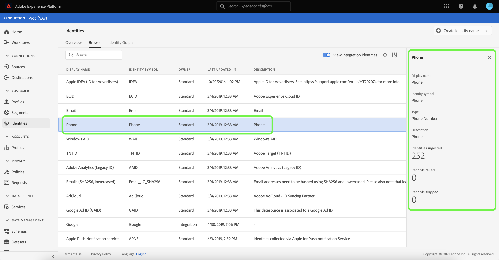

# Översikt över namnområde för identitet

Identitetsnamnutrymmen är en komponent i [[!DNL Identity Service]](./home.md) som fungerar som indikatorer för det sammanhang som en identitet hör till. De skiljer till exempel på värdet &quot;name&quot;@email.com som e-postadress eller 443522 som ett numeriskt CRM-ID.

## Komma igång

Att arbeta med identitetsnamnutrymmen kräver förståelse för de olika Adobe Experience Platform-tjänsterna. Innan du börjar arbeta med namnutrymmen bör du läsa dokumentationen för följande tjänster:

- [[!DNL Real-Time Customer Profile]](../profile/home.md): Ger en enhetlig kundprofil i realtid baserad på aggregerade data från flera källor.
- [[!DNL Identity Service]](./home.md): Få en bättre bild av enskilda kunder och deras beteende genom att skapa en bro mellan identiteter på olika enheter och system.
- [[!DNL Privacy Service]](../privacy-service/home.md): Identitetsnamnutrymmen används i förfrågningar om efterlevnad av juridiska sekretessbestämmelser som den allmänna dataskyddsförordningen (GDPR). Varje begäran om integritet görs i förhållande till ett namnutrymme för att identifiera vilka konsumentdata som ska påverkas.

## Identitetsnamnutrymmen

En fullständigt kvalificerad identitet innehåller ett ID-värde och ett namnutrymme. När postdata matchas mellan profilfragment, som när [!DNL Real-Time Customer Profile] sammanfogar profildata, både identitetsvärdet och namnutrymmet måste matcha.

Två profilfragment kan till exempel innehålla olika primära ID:n, men de delar samma värde för namnutrymmet&quot;E-post&quot;, vilket innebär att [!DNL Platform] kan se att dessa fragment faktiskt är samma individ och sammanför data i identitetsdiagrammet för den individens identitet.

### Identitetstyper {#identity-types}

>[!CONTEXTUALHELP]
>id="platform_identity_create_namespace"
>title="Ange identitetstyp"
>abstract="Identitetstypen styr om data lagras i identitetsdiagrammet eller inte. Identifierare som inte är personer kommer inte att lagras och alla andra identitetstyper kommer att lagras."
>text="Learn more in documentation"

Data kan identifieras av flera olika identitetstyper. Identitetstypen anges när identitetsnamnutrymmet skapas och kontrollerar om data bevaras i identitetsdiagrammet och eventuella specialinstruktioner för hur data ska hanteras. Alla identitetstyper utom **Identifierare för icke-personer** följer samma beteende som när du sammanfogar ett namnutrymme med dess motsvarande ID-värde till ett identitetsdiagramkluster. Data sammanfogas inte när du använder **Identifierare för icke-personer**.

Följande identitetstyper är tillgängliga i [!DNL Platform]:

| Identitetstyp | Beskrivning |
| --- | --- |
| Cookie-ID | Cookie-ID:n identifierar webbläsare. Dessa identiteter är viktiga för expansion och utgör huvuddelen av identitetsdiagrammet. Av naturen sjunker de dock snabbt och förlorar sitt värde över tiden. |
| Enhets-ID | Enhetsoberoende ID:n identifierar en individ och knyter vanligtvis samman andra ID:n. Exempel är inloggnings-ID, CRM-ID och lojalitets-ID. Detta är en indikation på [!DNL Identity Service] för att hantera värdet känsligt. |
| Enhets-ID | Enhets-ID:n identifierar maskinvaruenheter som IDFA (iPhone och iPad), GAID (Android) och RIDA (Roku) och kan delas av flera personer i hushåll. |
| E-postadress | E-postadresser är ofta kopplade till en person och kan därför användas för att identifiera den personen i olika kanaler. Identiteter av den här typen omfattar personligt identifierbar information (PII). Detta är en indikation på [!DNL Identity Service] för att hantera värdet känsligt. |
| Identifierare för icke-personer | ID:n som inte är personer används för att lagra identifierare som kräver namnutrymmen men som inte är anslutna till ett personkluster. Till exempel en produkt-SKU, data relaterade till produkter, organisationer eller butiker. |
| Partner-ID [!BADGE Beta]{type=Informative} | <ul><li>Partner-ID:n är identifierare som används av datapartners för att representera människor. Partners-ID:n är ofta pseudonyma så att de inte avslöjar en persons sanna identitet och kan vara sannolika. I Real-time Customer Data Platform används partner-ID:n i första hand för utökad målgruppsaktivering och dataredigering, och inte för att skapa länkar till identitetsdiagram.</li><li>Identitetsdiagram genereras inte vid inmatning av en identitet som innehåller ett identitetsnamnområde som har angetts som Partner ID-typ.</li><li>Om partnerdata inte importeras med identitetstypen för partner-ID kan det leda till systemdiagrambegränsningar för identitetstjänsten samt oönskad sammanslagning av profiler.</li><ul> |
| Telefonnummer | Telefonnummer är ofta associerade med en person och kan därför användas för att identifiera den personen i olika kanaler. Identiteter av den här typen är PII. Detta indikerar att [!DNL Identity Service] för att hantera värdet känsligt. |

{style="table-layout:auto"}

### Standardnamnutrymmen {#standard}

I Experience Platform finns flera identitetsnamnutrymmen som är tillgängliga för alla organisationer. Dessa kallas standardnamnutrymmen och visas med [!DNL Identity Service] API eller via plattformens användargränssnitt.

Följande standardnamnutrymmen kan användas av alla organisationer på plattformen:

| Visningsnamn | Beskrivning |
| ------------ | ----------- |
| AdCloud | Ett namnutrymme som representerar Adobe AdCloud. |
| Adobe Analytics (äldre ID) | Ett namnutrymme som representerar Adobe Analytics. Se följande dokument på [Adobe Analytics namnutrymmen](https://experienceleague.adobe.com/docs/analytics/admin/data-governance/gdpr-namespaces.html?lang=en#namespaces) för mer information. |
| Apple IDFA (ID för annonsörer) | Ett namnutrymme som representerar Apple ID för annonsörer. Se följande dokument på [räntebaserade annonser](https://support.apple.com/en-us/HT202074) för mer information. |
| Tjänsten Apple Push Notification | Ett namnutrymme som representerar identiteter som samlats in med tjänsten Apple Push Notification. Se följande dokument på [Tjänsten Apple Push Notification](https://developer.apple.com/library/archive/documentation/NetworkingInternet/Conceptual/RemoteNotificationsPG/APNSOverview.html#//apple_ref/doc/uid/TP40008194-CH8-SW1) för mer information. |
| CORE | Ett namnutrymme som representerar Adobe Audience Manager. Det här namnutrymmet kan även refereras till med det äldre namnet: &quot;Adobe AudienceManager&quot;. Se följande dokument på [Audience Manager-ID](https://experienceleague.adobe.com/docs/audience-manager/user-guide/overview/data-privacy/data-privacy-reference/data-privacy-ids.html?lang=en#aam-ids) för mer information. |
| ECID | Ett namnutrymme som representerar ECID. Detta namnutrymme kan även refereras till av följande alias: &quot;Adobe Marketing Cloud ID&quot;, &quot;Adobe Experience Cloud ID&quot;, &quot;Adobe Experience Platform ID&quot;. Se följande dokument på [ECID](./ecid.md) för mer information. |
| E-post | Ett namnutrymme som representerar en e-postadress. Den här typen av namnutrymme är ofta kopplad till en person och kan därför användas för att identifiera den personen i olika kanaler. |
| E-post (SHA256, nedsänkt) | Ett namnutrymme för förhasrad e-postadress. Värden som anges i det här namnutrymmet konverteras till gemener innan de hash-kodas med SHA256. Radavståndsavstånd måste trimmas innan en e-postadress normaliseras. Den här inställningen kan inte ändras retroaktivt. Se följande dokument på [Stöd för SHA256-hashning](https://experienceleague.adobe.com/docs/id-service/using/reference/hashing-support.html?lang=en#hashing-support) för mer information. |
| Firebase Cloud Messaging | Ett namnutrymme som representerar identiteter som samlats in med Google Firebase Cloud Messaging för push-meddelanden. Se följande dokument på [Google Firebase Cloud Messaging](https://firebase.google.com/docs/cloud-messaging) för mer information. |
| Google Ad ID (GAID) | Ett namnutrymme som representerar ett Google Advertising ID. Se följande dokument på [Google Advertising ID](https://support.google.com/googleplay/android-developer/answer/6048248?hl=en) för mer information. |
| Google Click ID | Ett namnutrymme som representerar ett Google Click-ID. Se följande dokument på [Klickspårning i Google Ads](https://developers.google.com/adwords/api/docs/guides/click-tracking) för mer information. |
| Telefon | Ett namnutrymme som representerar ett telefonnummer. Den här typen av namnutrymme är ofta kopplad till en person och kan därför användas för att identifiera den personen i olika kanaler. |
| Telefon (E.164) | Ett namnutrymme som representerar råa telefonnummer som behöver hashas i E.164-format. E.164-formatet innehåller ett plustecken (`+`), en internationell landskod, en lokal kod och ett telefonnummer. Exempel: `(+)(country code)(area code)(phone number)`. |
| Telefon (SHA256) | Ett namnutrymme som representerar telefonnummer som behöver hashas med SHA256. Du måste ta bort symboler, bokstäver och eventuella inledande nollor. Du måste också lägga till landskoden som prefix. |
| Telefon (SHA256_E.164) | Ett namnutrymme som representerar råa telefonnummer som behöver hashas med formaten SHA256 och E.164. |
| TNTID | Ett namnutrymme som representerar Adobe Target. Se följande dokument på [Mål](https://experienceleague.adobe.com/docs/target/using/target-home.html?lang=en) för mer information. |
| Windows AID | Ett namnutrymme som representerar ett Windows Advertising ID. Se följande dokument på [Windows Advertising ID](https://docs.microsoft.com/en-us/uwp/api/windows.system.userprofile.advertisingmanager.advertisingid?view=winrt-19041) för mer information. |

### Visa ID-namnutrymmen {#view-identity-namespaces}

>[!CONTEXTUALHELP]
>id="platform_identity_view_integration_identities"
>title="Visa integreringsidentiteter"
>abstract="Integreringsidentiteter är namnutrymmen som används för att ansluta till andra system och som inte används i identitetsupplösning eller för att sätta ihop identiteter.   Dessa identiteter är dolda som standard. Använd växlingsknappen för att visa integreringsnamnutrymmen."

Om du vill visa identitetsnamnutrymmen i användargränssnittet väljer du **[!UICONTROL Identities]** i den vänstra navigeringen och sedan väljer **[!UICONTROL Browse]**.

En lista med identitetsnamnutrymmen visas i sidans huvudgränssnitt med information om namn, identitetssymboler, senaste uppdateringsdatum och om de är en standard eller ett anpassat namnutrymme. Den högra listen innehåller information om [!UICONTROL Identity graph strength].

Plattformen har även namnutrymmen för integration. Dessa namnutrymmen döljs som standard eftersom de används för att ansluta till andra system och inte för att fästa identiteter. Om du vill visa namnutrymmen för integration väljer du **[!UICONTROL View integration identities]**.

Välj ett identitetsnamnutrymme i listan om du vill visa information om ett specifikt namnutrymme. Om du väljer ett identitetsnamnutrymme uppdateras visningen till höger så att metadata om det identitetsnamnutrymme som du har valt visas, inklusive antalet identiteter som har importerats och antalet poster som har misslyckats och hoppats över.

## Hantera anpassade namnutrymmen {#manage-namespaces}

Beroende på dina organisationsdata och användningsfall kan du behöva anpassade namnutrymmen. Du kan skapa egna namnutrymmen med [[!DNL Identity Service]](./api/create-custom-namespace.md) API eller via gränssnittet.

Navigera till **[!UICONTROL Identities]** arbetsyta, välja **[!UICONTROL Browse]** och sedan markera **[!UICONTROL Create identity namespace]**.

The **[!UICONTROL Create identity namespace]** visas. Ange en unik **[!UICONTROL Display name]** och **[!UICONTROL Identity symbol]** och välj sedan den identitetstyp som du vill skapa. Du kan också lägga till en valfri beskrivning för att lägga till ytterligare information om namnutrymmet. Alla identitetstyper utom **Identifierare för icke-personer** följer samma mönster som när du stjäl. Om du väljer **Identifierare för icke-personer** som identitetstyp när du skapar ett namnutrymme görs ingen sammanfogning. Specifik information om varje identitetstyp finns i tabellen på [identitetstyper](#identity-types).

När du är klar väljer du **[!UICONTROL Create]**.

>[!IMPORTANT]
>
>Namnutrymmen som du definierar är privata för din organisation och kräver en unik identitetssymbol för att de ska kunna skapas.

På samma sätt som vanliga namnutrymmen kan du välja ett anpassat namnutrymme i **[!UICONTROL Browse]** för att visa information. Men med ett anpassat namnutrymme kan du även redigera dess visningsnamn och beskrivning från informationsfältet.

>[!NOTE]
>
>När ett namnutrymme har skapats kan det inte tas bort och dess identitetssymbol och typ kan inte ändras.

## Namnutrymmen i identitetsdata

Om du anger namnutrymmet för en identitet beror på vilken metod du använder för att ange identitetsdata. Mer information om att tillhandahålla data om identitetsuppgifter finns i avsnittet om [tillhandahålla identitetsdata](./home.md#supplying-identity-data-to-identity-service) i [!DNL Identity Service] översikt.

## Nästa steg

Nu när du förstår de viktigaste begreppen för identitetsnamnutrymmen kan du börja lära dig hur du arbetar med identitetsdiagrammet med [visningsprogram för identitetsdiagram](./ui/identity-graph-viewer.md).
