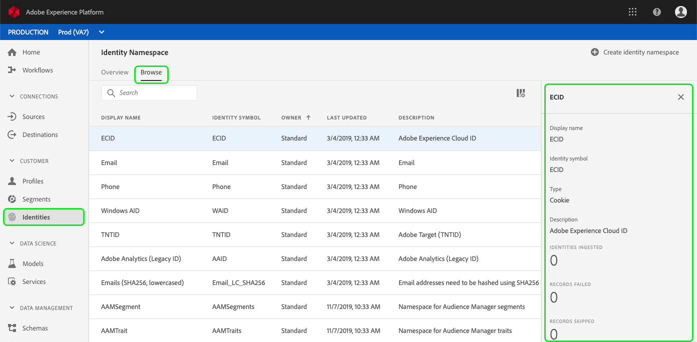

# Översikt över namnområde för identitet

Identitetsnamnutrymmen är en komponent i [!DNL Identity Service](./home.md) som fungerar som indikatorer för det sammanhang som en identitet relateras till. De skiljer till exempel på värdet&quot;name@email.com&quot; som e-postadress eller&quot;443522&quot; som ett numeriskt CRM-ID.

## Komma igång

Att arbeta med identitetsnamnutrymmen kräver förståelse för de olika Adobe Experience Platform-tjänsterna. Innan du börjar arbeta med namnutrymmen bör du läsa dokumentationen för följande tjänster:

- [!DNL Real-time Customer Profile](../profile/home.md): Ger en enhetlig kundprofil i realtid baserad på aggregerade data från flera källor.
- [!DNL Identity Service](./home.md): Få en bättre bild av enskilda kunder och deras beteende genom att skapa en bro mellan identiteter på olika enheter och system.
- [!DNL Privacy Service](../privacy-service/home.md): Identitetsnamnutrymmen används för att uppfylla den allmänna dataskyddsförordningen (GDPR), där GDPR-begäranden kan göras i förhållande till ett namnutrymme.

## Identitetsnamnutrymmen

En fullständigt kvalificerad identitet innehåller ett ID-värde och ett namnutrymme. När postdata matchas mellan profilfragment, som när profildata sammanfogas, måste både identitetsvärdet och namnutrymmet matcha. [!DNL Real-time Customer Profile]

Två profilfragment kan till exempel innehålla olika primära ID:n, men de delar samma värde för namnutrymmet&quot;E-post&quot;. Därför kan Platform se att dessa fragment faktiskt är samma individ och sammanför data i identitetsdiagrammet för den enskilda personen.

### Identitetstyper

Data kan identifieras av flera olika identitetstyper. Identitetstypen anges när identitetsnamnutrymmet skapas och kontrollerar om data bevaras i identitetsdiagrammet och eventuella specialinstruktioner för hur data ska hanteras.

Följande identitetstyper är tillgängliga i [!DNL Platform]:

| Identitetstyp | Beskrivning |
| --- | --- |
| Cookie | Dessa identiteter är viktiga för expansion och utgör huvuddelen av identitetsdiagrammet. Av naturen sjunker de dock snabbt och förlorar sitt värde över tiden. Borttagning av cookies hanteras särskilt i identitetsdiagrammet. |
| Flera enheter | Detta anger att [!DNL Identity Service] ska betrakta detta som en stark personidentifierare och därmed bevara den för alltid. Exempel är inloggnings-ID, CRM-ID, lojalitets-ID osv. |
| Enhet | Inkluderar IDFA, GAID och andra IOT ID:n. Dessa kan delas av människor i hushåll. |
| E-post | Identiteter av den här typen omfattar personligt identifierbar information (PII). Detta är en indikation på [!DNL Identity Service] att hantera värdet känsligt. |
| Mobil | Identiteter av den här typen är PII. Detta är en indikation på [!DNL Identity Service] att hantera värdet känsligt. |
| Icke-människor | Används för att lagra identifierare som behöver namnutrymmen, men som inte är kopplade till ett personkluster. Dessa identifierare filtreras sedan från identitetsdiagrammet. Möjliga användningsexempel är data om produkter, organisationer, butiker osv. (Till exempel en produkt-SKU.) |
| Telefon | Identiteter av den här typen är PII. Detta är en indikation på [!DNL Identity Service] att hantera värdet känsligt. |

### Standardnamnutrymmen

I Adobe Experience Platform finns flera identitetsnamnutrymmen som är tillgängliga för alla organisationer. Dessa kallas standardnamnutrymmen och visas med [!DNL Identity Service] API:t eller via [!DNL Platform] gränssnittet.

Om du vill visa standardnamnutrymmen i användargränssnittet klickar du **[!UICONTROL Identities]** i den vänstra listen och sedan på *[!UICONTROL Browse]* fliken. Alla identitetsnamnutrymmen som är tillgängliga för din organisation visas, men de med&quot;[!UICONTROL Standard]&quot; som&quot;[!UICONTROL Owner]&quot; är standardnamnutrymmena från Adobe.

Du kan sedan klicka på ett av namnutrymmena för att visa information.

## Hantera namnutrymmen för din organisation

Beroende på dina organisationsdata och användningsfall kan du behöva anpassade namnutrymmen.

De här är synliga i användargränssnittet som de namnutrymmen med&quot;[!UICONTROL Custom]&quot; som&quot;[!UICONTROL Owner]&quot;. Du kan skapa egna namnutrymmen med API:t eller med användargränssnittet [!DNL Identity Service] .

Om du vill skapa ett anpassat namnutrymme med användargränssnittet klickar du på **[!UICONTROL Create identity namespace]**, fyller i dialogrutan och klickar på **[!UICONTROL Create]**.

Namnutrymmen som du definierar är privata för din organisation och kräver ett unikt &quot;[!UICONTROL Identity Symbol]&quot; (eller &quot;kod&quot; om du använder API:t) för att kunna skapas.

På samma sätt som för standardnamnutrymmen kan du klicka på ett anpassat namnutrymme på fliken för att visa information om det, men med ett anpassat namnutrymme kan du även redigera dess visningsnamn och beskrivning i informationsområdet. *[!UICONTROL Browse]*

>[!NOTE]
>
>När ett namnutrymme har skapats kan det inte tas bort och dess&quot;identitetssymbol&quot; (eller&quot;kod&quot; i API) och&quot;typ&quot; kan inte ändras.

## Namnutrymmen i identitetsdata

Om du anger namnutrymmet för en identitet beror på vilken metod du använder för att ange identitetsdata. Mer information om att tillhandahålla data om identitetsuppgifter finns i avsnittet om [att tillhandahålla identitetsuppgifter](./home.md#supplying-identity-data-to-identity-service) i [!DNL Identity Service] översikten.
