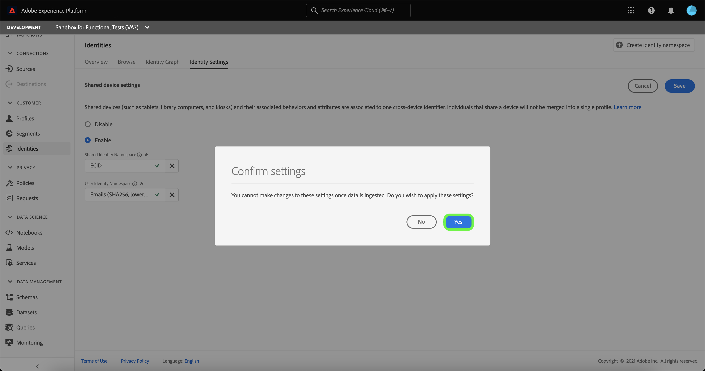

# Översikt över identifiering av delad enhet (beta)

>[!IMPORTANT]
>
>The [!DNL Shared Device Detection] funktionen är i betaversion. Dess funktioner och dokumentation kan komma att ändras.

Adobe Experience Platform [!DNL Identity Service] hjälper er att få en bättre bild av era kunder och deras beteende genom att skapa en bro mellan identiteter och enheter, så att ni kan leverera slagkraftiga, personliga digitala upplevelser i realtid.

[!DNL Shared Device] avser enheter som används av mer än en individ. Exempel på delade enheter är surfplattor, biblioteksdatorer och kioskdatorer. Via [!DNL Shared Device Detection] kan olika användare av samma enhet förhindras från att sammanfogas till en enda identitet, vilket ger en mer korrekt återgivning av en individ.

Med [!DNL Shared Device Detection] du kan:

* Skapa separata identitetsdiagram för olika användare av samma enhet,
* förhindra att data från olika personer blandas med samma enhet,
* Generera en renare och exaktare bild av era kunder.

>[!TIP]
>
>Konfigurationer för [!DNL Shared Device Detection] måste slutföras innan du aktiverar profil för datauppsättning eftersom du inte längre kan ändra inställningar när diagram genereras i [!DNL Identity Service].

## Kom igång med [!DNL Shared Device Detection]

Arbeta med [!DNL Shared Device Detection] kräver förståelse för de olika plattformstjänster som används. Innan du börjar arbeta med [!DNL Shared Device Detection], läs dokumentationen för följande tjänster:

* [[!DNL Identity Service]](./home.md): Få en bättre bild av enskilda kunder och deras beteende genom att skapa en bro mellan identiteter på olika enheter och system.
   * [Identitetsdiagramvisningsprogram](./features/identity-graph-viewer.md): Visualisera och interagera med identitetsdiagramvisningsprogrammet för att bättre förstå hur kundidentiteter sammanfogas, och på vilka sätt.
   * [Identitetsnamnutrymmen](./features/namespaces.md): Se komponenterna för en fullständigt kvalificerad identitet och hur identitetsnamnutrymmen gör att du kan skilja på sammanhang och typ för en identitet.

## Förstå [!DNL Shared Device Detection]

Det är viktigt att förstå följande terminologi när du arbetar med
[!DNL Shared Device Detection]. Se tabellen nedan för en lista över termer som är viktiga för att förstå [!DNL Shared Device Detection].

### Terminologi

| Villkor | Definition |
| --- | --- |
| Delad enhet | En delad enhet är en enhet som används av flera personer. Exempel på delade enheter är surfplattor, biblioteksdatorer och kioskdatorer. |
| [!DNL Shared Device Detection] | [!DNL Shared Device Detection] refererar till en konfigurationsinställning som tillåter att data från olika användare av samma enhet kan separeras från varandra. |
| Namnområde för delad identitet | Namnutrymmet för delad identitet representerar den enhet som kan användas av flera användare. Namnutrymmet för delad identitet är vanligtvis ECID, men kan anges till andra enhets-ID:n. |
| Namnområde för användaridentitet | Namnområdet för användaridentitet representerar den autentiserade (inloggade) användaren av en delad enhet. |
| Senaste autentiserade användare | Den senast autentiserade användaren representerar den användare som senast loggade in på en enhet, om en enhet loggas in med flera konton. |

{style="table-layout:auto"}

[!DNL Shared Device Detection] skapar två namnutrymmen: **Namnområde för delad identitet** och **Namnområde för användaridentitet**.

* Namnutrymmet för delad identitet representerar den enhet som kan användas av flera användare. Adobe rekommenderar att kunderna använder ECID som delad enhetsidentifierare.
* Namnområdet för användaridentitet mappas till det identitetsnamnområde som motsvarar användarens inloggnings-ID, det kan vara användarens CRM-ID, e-postadress, hashad e-post eller telefonnummer.

En delad enhet, som en surfplatta, har en enda **Namnområde för delad identitet**. Å andra sidan har varje användare av en delad enhet sin egen utsedda **Namnområde för användaridentitet** som motsvarar deras respektive inloggnings-ID. En surfplatta som Kevin och Nora delar för e-handel har till exempel ett eget ECID på `1234`, medan Kevin har sin egen User Identity Namespace som mappas till hans `kevin@email.com` kontot och Nora har sin egen namnrymd för användaridentitet mappad till henne `nora@email.com` konto.

[!DNL Shared Device Detection] kan göra distinktioner mellan flera användare av samma enhet genom att länka det delade ID-namnutrymmet (t.ex. ECID) med den senast autentiserade användarens namnområde för användaridentitet (inloggnings-ID).

### Hur identitetsdata skickas till ett identitetsdiagram

Titta på följande exempel för att få en bättre förståelse för hur [!DNL Shared Device Detection] fungerar:

>[!NOTE]
>
>I det här diagrammet är namnområdet för delad identitet konfigurerat till ECID och namnområdet för användaridentitet är konfigurerat till CRM-ID.

* Kevin och Nora delar en surfplatta för att besöka en e-handelswebbplats. De har dock båda sina egna oberoende konton som de använder för att surfa och handla online.
   * Som en delad enhet har surfplattan ett motsvarande ECID, som representerar webbläsarens cookie-ID.
* Anta att Kevin använder surfplattan och **loggar in** till sitt e-handelskonto för att hitta hörlurar innebär detta att Kevin&#39;s CRM ID (**Namnområde för användaridentitet**) är nu länkat till surfplattans ECID (**Namnområde för delad identitet**). Surfplattans surfdata är nu inbyggt i Kevins identitetsdiagram.
   * Om Kevin **loggar ut** och Nora använder surfplattan **loggar in** till sitt eget konto och köper en kamera, så är hennes CRM-ID nu länkat till surfplattans ECID. Därför är surfplattets surfdata nu inbyggt i Noras identitetsdiagram.
   * Om Nora **loggar inte ut** och Kevin använder surfplattan, men **loggar inte in** och surfplattans surfdata är fortfarande inbyggda i Nora eftersom hon fortfarande är den autentiserade användaren och hennes CRM-ID fortfarande är länkat till surfplattans ECID.
   * Om Nora **loggar ut** och Kevin använder surfplattan, men **loggar inte in**, så är surfplattets surfdata fortfarande inbyggda i Noras identitetsdiagram eftersom **senaste autentiserade användare**&#x200B;är hennes CRM-ID fortfarande kopplat till surfplattans ECID.
   * Om Kevin **loggar in** än en gång länkas hans CRM-ID till surfplatsens ECID, eftersom han nu är den sista autentiserade användaren och surfplattets surfdata nu ingår i identitetsdiagrammet.

### Hur [!DNL Profile Service] sammanfogar profilfragment med [!DNL Shared Device Detection] aktiverad

[!DNL Profile Service] tar hänsyn till profilfragment och sammanfogade profiler. Varje enskild kundprofil består av flera profilfragment som har sammanfogats till en enda vy av kunden. Om en kund till exempel interagerar med ert varumärke i flera kanaler kommer organisationen att ha flera profilfragment som är kopplade till den enskilda kunden som visas i flera datauppsättningar. När de här fragmenten hämtas till Platform sammanfogas de för att skapa en enda profil för kunden.

När [!DNL Shared Device Detection] är aktiverat, [!DNL Profile] definierar den primära identiteten för profilfragmentet baserat på om upplevelsehändelsen är autentiserad eller oautentiserad

An **händelse för autentiserad upplevelse** är en åtgärd som utförs av en användare när han/hon är inloggad på en enhet. För händelser för autentiserade upplevelser är den primära identiteten **Namnområde för användaridentitet** (Inloggnings-ID). An **oautentiserad upplevelsehändelse** är en åtgärd som utförs av en användare som inte är inloggad på en enhet. För oautentiserade upplevelsehändelser är den primära identiteten **Namnområde för delad identitet** (ECID)

Mer information finns i  [[!DNL Real-Time Customer Profile] översikt](../profile/home.md).

## Gränssnitt för delade enheter

Välj **[!UICONTROL Identities]** i den vänstra navigeringen och välj **[!UICONTROL Identity settings]**.

The [!UICONTROL Shared device settings] visas, där du får ett gränssnitt för att konfigurera delade enhetsinställningar för dina data. Delade enhetsinställningar är inaktiverade som standard.

När det här alternativet är aktiverat kan data från olika användare på samma enhet separeras från varandra. Den här konfigurationsinställningen ger en renare och exaktare representation av identitetsdiagram, där användaridentiteter för samma enhet inte kombineras.

Välj **[!UICONTROL Enable]** för att börja ändra inställningarna för den delade enheten.

The [!UICONTROL Shared Identity Namespace] och [!UICONTROL User Identity Namespace] konfigurationsalternativen visas så att du kan ändra de identitetsnamnutrymmen som du vill använda.

[!UICONTROL Shared Identity Namespace] representerar en enhet som används av flera olika användare. Namnutrymmet är alltid inställt på **[!UICONTROL ECID]** därför att alla plattformsanvändare använder **[!UICONTROL ECID]** som webbläsaridentifierare.

The [!UICONTROL User Identity Namespace] gör att du kan identifiera olika användare av samma enhet och förhindra att data kombineras till samma identitetsdiagram.

Välj **[!UICONTROL User Identity Namespace]** sökfältet och ange ett identitetsnamnutrymme eller välj ett identitetsnamnutrymme på den nedrullningsbara menyn.

>[!TIP]
>
>The [!UICONTROL User Identity Namespace] ska mappas till det identitetsnamnutrymme som motsvarar slutanvändarens inloggnings-ID. Alternativen är kund-ID, e-post och hashad e-post.

När du har konfigurerat [!UICONTROL Shared Device Settings], markera **[!UICONTROL Save]**.

Ett popup-fönster visas med en uppmaning om att bekräfta ditt val. Välj **[!UICONTROL Yes]** för att slutföra konfigurationsinställningen.

