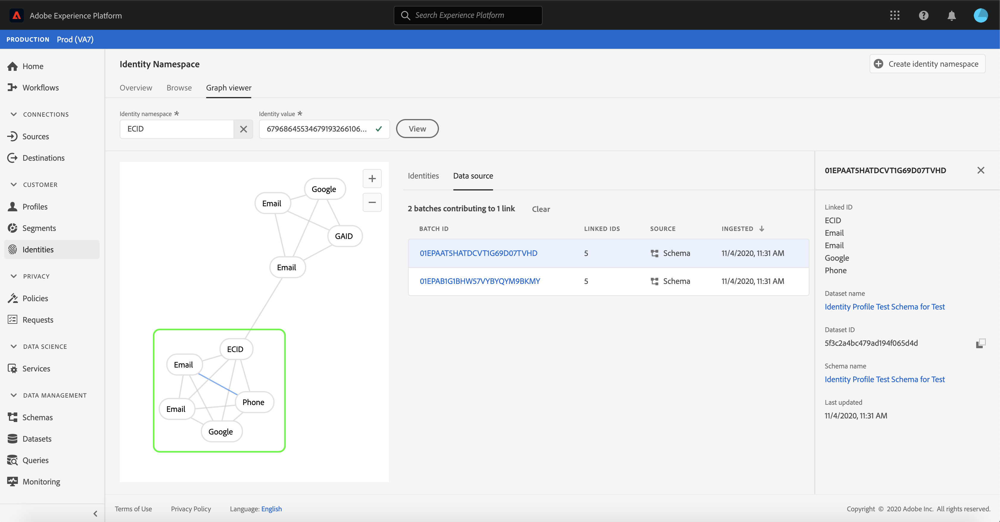

# (Beta) Identitetsdiagramvisningsprogram

>[!NOTE]
>
>Identitetsdiagramvisningsprogrammet är för närvarande i betaversion. Funktionerna kan komma att ändras.

Ett identitetsdiagram är en karta över relationer mellan olika identiteter för en viss kund, vilket ger dig en visuell representation av hur kunden interagerar med varumärket i olika kanaler. Alla kundidentitetsdiagram hanteras och uppdateras gemensamt av Adobe Experience Platform Identity Service i nära realtid som svar på kundaktivitet.

Med identitetsdiagramvisningsprogrammet i användargränssnittet för plattformen kan du visualisera och bättre förstå vilka kundidentiteter som sammanfogas och på vilka sätt. Med visningsprogrammet kan du dra och interagera med olika delar av diagrammet, vilket gör att du kan undersöka komplexa identitetsförhållanden, felsöka mer effektivt och dra nytta av ökad genomskinlighet när det gäller hur informationen används.

## Komma igång

Att arbeta med identitetsdiagramvisningsprogrammet kräver förståelse för de olika Adobe Experience Platform-tjänsterna. Innan du börjar arbeta med identitetsdiagramvisningsprogrammet bör du läsa dokumentationen för följande tjänster:

- [[!DNL Identity Service]](../home.md): Få en bättre bild av enskilda kunder och deras beteende genom att skapa en bro mellan identiteter på olika enheter och system.

### Terminologi

- **Identitet (nod):** En identitet eller en nod är data som är unika för en enhet, vanligtvis en person. En identitet består av ett namnutrymme och ett identitetsvärde.
- **Länk (kant):** En länk eller kant representerar kopplingen mellan identiteter.
- **Diagram (kluster):** Ett diagram eller kluster är en grupp identiteter och länkar som representerar en person.

## Åtkomst till identitetsdiagramvisningsprogrammet

Om du vill använda identitetsdiagramvisningsprogrammet i användargränssnittet väljer du **[!UICONTROL Identities]** i den vänstra navigeringen och sedan **[!UICONTROL Identity graph]** fliken. På **[!UICONTROL Identity Namespace]** skärmen klickar du på **[!UICONTROL Select identity namespace]** ikonen för att söka efter det namnutrymme som du vill använda.

Panelen **[!UICONTROL Select identity namespace]** visas. Den här skärmen innehåller en lista med namnutrymmen som är tillgängliga för din organisation, inklusive information om namnutrymmets **[!UICONTROL Display name]**, **[!UICONTROL Identity symbol]**, **[!UICONTROL Owner]**, **[!UICONTROL Last updated]** datum och **[!UICONTROL Description]**. Du kan använda vilket som helst av de angivna namnutrymmena om du har ett giltigt identitetsvärde kopplat till dem.

Markera det namnutrymme som du vill använda och klicka på **[!UICONTROL Select]** för att fortsätta.

När du har valt ett namnutrymme anger du dess motsvarande värde för en viss kund i textrutan och väljer **[!UICONTROL Identity value]** **[!UICONTROL View]**.

Identitetsdiagramvisningsprogrammet visas. Till vänster på skärmen finns identitetsdiagrammet som visar alla identiteter som är länkade till det namnutrymme som du har markerat och det identitetsvärde som du har angett. Varje identitetsnod består av ett namnutrymme och dess motsvarande ID-värde. Du kan markera och hålla kvar en identitet om du vill dra och interagera med diagrammet. Du kan också hovra över en identitet för att se information om dess ID-värde. Diagramresultatet visas också som en inskickad lista mitt på skärmen.

>[!IMPORTANT]
>
>Ett identitetsdiagram kräver minst två länkade identiteter att generera, samt ett giltigt namnutrymme och ID-par. Det maximala antalet identiteter som diagramvisningsprogrammet kan visa är 400. Mer information finns i avsnittet [Bilaga](#appendix) nedan.

Välj en identitet om du vill uppdatera den markerade raden i **[!UICONTROL Identities]** tabellen och uppdatera informationen som finns på den högra listen, som innehåller en identitets **[!UICONTROL Value]** och dess **[!UICONTROL Batch ID]****[!UICONTROL Last updated]** datum.

Du kan filtrera genom ett diagram och isolera ett specifikt namnutrymme med sorteringsalternativet högst upp i **[!UICONTROL Identities]** tabellen. Välj det namnutrymme som du vill markera i listrutan.

Diagramvisningsprogrammet returnerar och namnutrymmet som du markerade markeras. Filteralternativet uppdaterar också **[!UICONTROL Identities]** tabellen så att den returnerar information endast för det namnutrymme du har valt.

Den övre högra delen av diagramvisningsrutan innehåller alternativ för förstoring. Välj ikonen **(+)** om du vill zooma in i diagrammet eller ikonen **(-)** om du vill zooma ut.

Du kan visa mer information om grupper genom att välja **[!UICONTROL Data source]** i sidhuvudet. I **[!UICONTROL Data source]** tabellen visas en lista med **[!UICONTROL Batch IDs]** associerade diagram samt dess **[!UICONTROL Linked IDs]** källschema och datum för inmatning.

Du kan välja någon av länkarna i ett identitetsdiagram om du vill se alla källgrupper som har bidragit till länken.

Du kan också markera en grupp om du vill se alla länkar som den här gruppen har bidragit till.

Identitetsdiagram med större kluster av identiteter kan även nås via visningsprogrammet för identitetsdiagram.

## Bilaga

Diagramvisningsprogrammet returnerar ett fel om följande krav inte uppfylls:

- Identitetsvärdet finns inte i det valda namnutrymmet.
- Diagrammet har färre än två identiteter.
- Diagrammet överskrider maxgränsen på 400 identiteter.
- Du befinner dig i en icke-produktionssandlådemiljö.

## Nästa steg

Genom att läsa det här dokumentet har du lärt dig att utforska kundernas identitetsdiagram i användargränssnittet för plattformen. Mer information om identiteter i Platform finns i Översikt över [identitetstjänsten](../home.md)