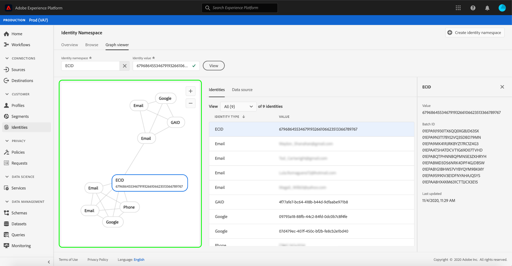

# Översikt över visningsprogrammet för identitetsdiagram

Ett identitetsdiagram är en karta över relationer mellan olika identiteter för en viss kund, vilket ger dig en visuell representation av hur kunden interagerar med varumärket i olika kanaler. Alla kundidentitetsdiagram hanteras och uppdateras gemensamt av Adobe Experience Platform Identity Service i nära realtid som svar på kundaktivitet.

Med identitetsdiagramvisningsprogrammet i användargränssnittet för plattformen kan du visualisera och bättre förstå vilka kundidentiteter som sammanfogas och på vilka sätt. Med visningsprogrammet kan du dra och interagera med olika delar av diagrammet, vilket gör att du kan undersöka komplexa identitetsförhållanden, felsöka mer effektivt och dra nytta av ökad genomskinlighet när det gäller hur informationen används.

## Videokurs

Följande video är avsedd att ge stöd för din förståelse av identitetsdiagramvisningsprogrammet.

>[!VIDEO](https://video.tv.adobe.com/v/331030/?quality=12&learn=on)

## Komma igång

Att arbeta med identitetsdiagramvisningsprogrammet kräver förståelse för de olika Adobe Experience Platform-tjänsterna. Innan du börjar arbeta med identitetsdiagramvisningsprogrammet bör du läsa dokumentationen för följande tjänster:

- [[!DNL Identity Service]](../home.md): Få en bättre bild av enskilda kunder och deras beteende genom att skapa en bro mellan identiteter på olika enheter och system.

### Terminologi

- **Identitet (nod):** En identitet eller en nod är data som är unika för en enhet, vanligtvis en person. En identitet består av ett namnutrymme och ett identitetsvärde.
- **Länk (kant):** En länk eller kant representerar kopplingen mellan identiteter.
- **Diagram (kluster):** Ett diagram eller kluster är en grupp identiteter och länkar som representerar en person.

## Åtkomst till identitetsdiagramvisningsprogrammet

Om du vill använda identitetsdiagramvisningsprogrammet i användargränssnittet väljer du **[!UICONTROL Identities]** i den vänstra navigeringen och välj sedan **[!UICONTROL Identity graph]** -fliken. Från **[!UICONTROL Identity Namespace]** klickar du på **[!UICONTROL Select identity namespace]** om du vill söka efter det namnutrymme som du tänker använda.

The **[!UICONTROL Select identity namespace]** visas. Den här skärmen innehåller en lista med namnutrymmen som är tillgängliga för din organisation, inklusive information om ett namnområdes **[!UICONTROL Display name]**, **[!UICONTROL Identity symbol]**, **[!UICONTROL Owner]**, **[!UICONTROL Last updated]** datum, och **[!UICONTROL Description]**. Du kan använda vilket som helst av de angivna namnutrymmena om du har ett giltigt identitetsvärde kopplat till dem.

Markera det namnutrymme som du vill använda och klicka på **[!UICONTROL Select]** för att fortsätta.

När du har valt ett namnutrymme anger du dess motsvarande värde för en viss kund i dialogrutan **[!UICONTROL Identity value]** textruta och markera **[!UICONTROL View]**.

### Få åtkomst till identitetsdiagramvisningsprogrammet från datauppsättningar

Du kan även komma åt identitetsdiagramvisningsprogrammet med hjälp av datauppsättningsgränssnittet. Från datauppsättningarna [!UICONTROL Browse] väljer du en datauppsättning som du vill interagera med och väljer sedan **[!UICONTROL Preview dataset]**

I förhandsgranskningsfönstret väljer du en fingeravtrycksikon för att se vilka identiteter som visas i identitetsdiagramvisningsprogrammet.

>[!TIP]
>
>Fingeravtrycksikonen visas bara om datauppsättningen har två eller flera identiteter.

Identitetsdiagramvisningsprogrammet visas. Till vänster på skärmen finns identitetsdiagrammet som visar alla identiteter som är länkade till det namnutrymme som du har markerat och det identitetsvärde som du har angett. Varje identitetsnod består av ett namnutrymme och dess motsvarande ID-värde. Du kan markera och hålla kvar en valfri identitet om du vill dra och interagera med diagrammet. Du kan också hovra över en identitet för att se information om dess ID-värde. Diagramresultatet visas också som en inskickad lista mitt på skärmen.

>[!IMPORTANT]
>
>Ett identitetsdiagram kräver minst två länkade identiteter att generera, samt ett giltigt namnutrymme och ID-par. Det maximala antalet identiteter som diagramvisningsprogrammet kan visa är 150. Se [appendix](#appendix) för mer information.

Välj en identitet för att uppdatera den markerade raden på **[!UICONTROL Identities]** tabellen och uppdatera informationen som finns på den högra listen, som innehåller en identitetsbeteckning **[!UICONTROL Value]**, **[!UICONTROL Batch ID]** och **[!UICONTROL Last updated]** datum.

Du kan filtrera genom ett diagram och isolera ett specifikt namnutrymme med sorteringsalternativet högst upp i **[!UICONTROL Identities]** tabell. Välj det namnutrymme som du vill markera i listrutan.

Diagramvisningsprogrammet returnerar och namnutrymmet som du markerade markeras. Filteralternativet uppdaterar även **[!UICONTROL Identities]** tabell för att returnera information enbart för det namnutrymme som du har valt.

Den övre högra delen av diagramvisningsrutan innehåller alternativ för förstoring. Välj **(+)** om du vill zooma in i diagrammet eller i **(-)** för att zooma ut.

Du kan visa mer information om grupper genom att välja **[!UICONTROL Data source]** från sidhuvudet. The **[!UICONTROL Data source]** tabellen visar en lista med **[!UICONTROL Batch IDs]** som är kopplade till diagram, samt dess **[!UICONTROL Linked IDs]**, källschema och datum för intag.

Du kan välja någon av länkarna i ett identitetsdiagram om du vill se alla källgrupper som har bidragit till länken.

Du kan också markera en grupp om du vill se alla länkar som den här gruppen har bidragit till.

Identitetsdiagram med större kluster av identiteter kan även nås via visningsprogrammet för identitetsdiagram.

## Bilaga

Följande avsnitt innehåller ytterligare information om hur du arbetar med identitetsdiagramvisningsprogrammet.

### Om felmeddelanden

Fel kan inträffa vid åtkomst till identitetsdiagramvisningsprogrammet. Nedan följer en lista över krav och begränsningar som ska beaktas när du arbetar med identitetsdiagramvisningsprogrammet.

- Ett identitetsvärde måste finnas i det valda namnutrymmet.
- Identitetsdiagramvisningsprogrammet kräver minst två länkade identiteter för att kunna generera. Det är möjligt att det bara finns ett identitetsvärde och inga länkade identiteter, och i det här fallet skulle värdet bara finnas i [!DNL Profile] visningsprogram.
- Identitetsdiagramvisningsprogrammet får inte överskrida det maximala antalet 150 identiteter.

## Nästa steg

Genom att läsa det här dokumentet har du lärt dig att utforska kundernas identitetsdiagram i användargränssnittet för plattformen. Mer information om identiteter i Platform finns i [Översikt över identitetstjänsten](../home.md)

## Changelog

| Datum | Åtgärd |
| ---- | ------ |
| 2021-01 | <ul><li>Stöd för direktuppspelning av inkapslade data och icke-produktionssandlåda har lagts till.</li><li>Mindre felkorrigeringar.</li></ul> |
| 2021-02 | <ul><li>Identitetsdiagramvisningsprogrammet är tillgängligt via förhandsgranskning av datauppsättning.</li><li>Mindre felkorrigeringar.</li><li>Identitetsdiagramvisningsprogrammet är allmänt tillgängligt.</li></ul> |
