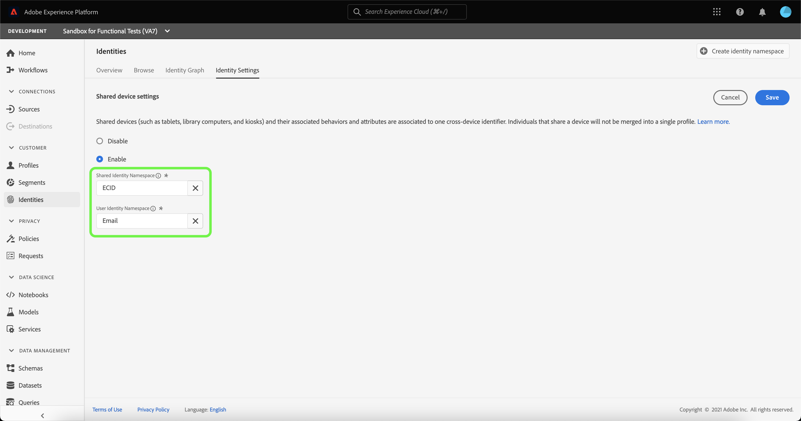

# Översikt över identifiering av delad enhet (beta)

>[!IMPORTANT]
>
>Funktionen [!DNL Shared Device Detection] är i betaversion. Dess funktioner och dokumentation kan komma att ändras.

Adobe Experience Platform [!DNL Identity Service] hjälper er att få en bättre bild av era kunder och deras beteende genom att skapa en bro mellan identiteter på olika enheter och system, så att ni kan leverera slagkraftiga, personliga digitala upplevelser i realtid.

[!DNL Shared Device] avser enheter som används av mer än en individ. Exempel på delade enheter är surfplattor, biblioteksdatorer och kioskdatorer. Genom funktionen [!DNL Shared Device Detection] kan olika användare av samma enhet förhindras från att sammanfogas till en enda identitet, vilket ger en mer korrekt representation av en individ.

Med [!DNL Shared Device Detection] kan du:

* Skapa separata identitetsdiagram för olika användare av samma enhet,
* förhindra att data från olika personer blandas med samma enhet,
* Generera en renare och exaktare bild av era kunder.

>[!TIP]
>
>Konfigurationer för [!DNL Shared Device Detection] måste slutföras innan du aktiverar profil för datauppsättning eftersom du inte längre kan ändra inställningar när diagram har genererats i [!DNL Identity Service].

## Komma igång

Att arbeta med [!DNL Shared Device Detection] kräver förståelse för de olika plattformstjänsterna. Innan du börjar arbeta med [!DNL Shared Device Detection] bör du läsa dokumentationen för följande tjänster:

* [[!DNL Identity Service]](../home.md): Få en bättre bild av enskilda kunder och deras beteende genom att skapa en bro mellan identiteter på olika enheter och system.
   * [Identitetsdiagramvisningsprogram](./identity-graph-viewer.md): Visualisera och interagera med identitetsdiagramvisningsprogrammet för att bättre förstå hur kundidentiteter sammanfogas, och på vilka sätt.
   * [Identitetsnamnutrymmen](../namespaces.md): Se komponenterna för en fullständigt kvalificerad identitet och hur du kan skilja på sammanhang och typ för en identitet med hjälp av identitetsnamn.

### Terminologi

Följande tabell innehåller en lista med termer som är viktiga för att förstå [!DNL Shared Device Detection]:

| Villkor | Definition |
| --- | --- |
| Delad enhet | En delad enhet är en enhet som används av flera personer. Exempel på delade enheter är surfplattor, biblioteksdatorer och kioskdatorer. |
| [!DNL Shared Device Detection] | [!DNL Shared Device Detection] refererar till en konfigurationsinställning som tillåter att data från olika användare av samma enhet kan separeras från varandra. |
| [!UICONTROL Shared Identity Namespace] | En [!UICONTROL Shared Identity Namespace] används för att representera en enskild enhet som delas av flera olika användare. |
| [!UICONTROL User Identity Namespace] | En [!UICONTROL User Identity Namespace] används för att representera den autentiserade, eller inloggade, användaren av en delad enhet. |

## Gränssnitt för delade enheter

Välj **[!UICONTROL Identities]** från vänster navigering i plattformsgränssnittet och välj sedan **[!UICONTROL Identity settings]**.

Sidan [!UICONTROL Shared device settings] visas med ett gränssnitt för att konfigurera inställningar för delade enheter för dina data. Delade enhetsinställningar är inaktiverade som standard.

När det här alternativet är aktiverat kan data från olika användare på samma enhet separeras från varandra. Den här konfigurationsinställningen ger en renare och exaktare representation av identitetsdiagram där användaridentiteter för samma enhet inte kombineras.

Välj **[!UICONTROL Enable]** om du vill börja ändra inställningarna för den delade enheten.

Konfigurationsalternativen [!UICONTROL Shared Identity Namespace] och [!UICONTROL User Identity Namespace] visas så att du kan ändra de identitetsnamnutrymmen som du vill använda.

[!UICONTROL Shared Identity Namespace] representerar en enhet som används av flera olika användare. Det här namnutrymmet är alltid inställt på **[!UICONTROL ECID]** eftersom alla plattformsanvändare använder **[!UICONTROL ECID]** som webbläsaridentifierare.

Med [!UICONTROL User Identity Namespace] kan du identifiera olika användare av samma enhet och förhindra att data kombineras till samma identitetsdiagram.

Markera **[!UICONTROL User Identity Namespace]**-sökfältet och ange antingen ett identitetsnamnutrymme eller välj ett identitetsnamnutrymme i listrutan.

>[!TIP]
>
>[!UICONTROL User Identity Namespace] ska mappas till det identitetsnamnutrymme som motsvarar slutanvändarens inloggnings-ID. Alternativen är kund-ID, e-post och hashad e-post.

När du har konfigurerat [!UICONTROL Shared Device Settings] väljer du **[!UICONTROL Save]**.

Ett popup-fönster visas med en uppmaning om att bekräfta ditt val. Välj **[!UICONTROL Yes]** för att slutföra konfigurationsinställningen.

