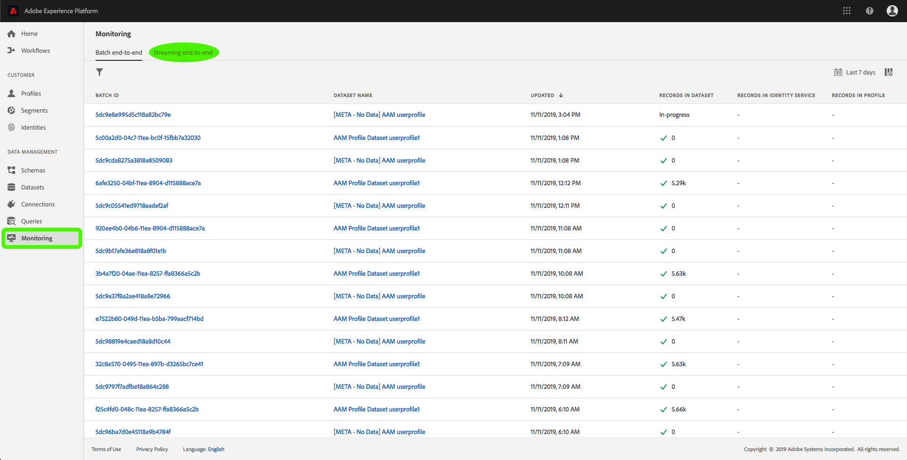
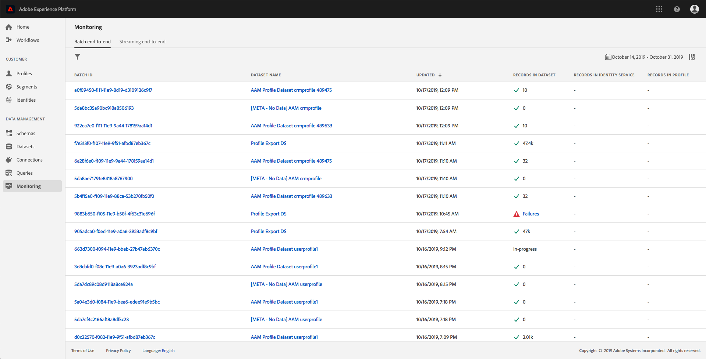

# Övervaka datainmatning

Genom dataöverföring kan ni importera data till Adobe Experience Platform. Du kan antingen använda gruppinmatning, vilket gör att du kan infoga data med olika filtyper (t.ex. CSV-filer), eller direktuppspelning, vilket gör att du kan importera data till Platform med direktuppspelningsslutpunkter i realtid.

I den här användarhandboken beskrivs hur du övervakar data i användargränssnittet i Adobe Experience Platform. Den här guiden kräver att du har ett Adobe ID och tillgång till Adobe Experience Platform.

## Övervaka direktuppspelning av data från början till slut

I användargränssnittet [för](https://platform.adobe.com)Experience Platform klickar du på **Övervakning** på den vänstra navigeringsmenyn och sedan på **Direktuppspelning från början till slut**.

Övervakningssidan för *direktuppspelning från början till slut* visas. Den här arbetsytan innehåller ett diagram som visar hur många direktuppspelade händelser som tas emot av Platform, ett diagram som visar hur många direktuppspelade händelser som har bearbetats av kundprofilen [i](../../profile/home.md)realtid samt en detaljerad lista över inkommande data.

Som standard visas i det övre diagrammet hur snabbt du har fått i sig något under de senaste sju dagarna. Du kan justera datumintervallet så att olika tidsperioder visas genom att klicka på den markerade knappen.

I det nedre diagrammet visas antalet lyckade bearbetade direktuppspelade händelser per profil under de senaste sju dagarna. Du kan justera datumintervallet så att olika tidsperioder visas genom att klicka på den markerade knappen.

>[!NOTE]
>
>För att data ska kunna visas i det här diagrammet måste data **uttryckligen** aktiveras för profilen. Läs användarhandboken för [datauppsättningar om du vill lära dig hur du aktiverar direktuppspelningsdata för profil](../../catalog/datasets/user-guide.md#enable-a-dataset-for-real-time-customer-profile).

Under diagrammen finns en lista med alla poster för direktuppspelning som motsvarar det datumintervall som visas ovan. Varje listad batch visar sitt ID, datauppsättningens namn, när den senast uppdaterades, antalet poster i gruppen samt antalet fel (om det finns några). Du kan klicka på en av posterna om du vill ha mer detaljerad information om posten.

### Visa direktuppspelningsposter

När du visar information om en post som har direktuppspelats, visas information som antal poster som har importerats, filstorlek samt start- och sluttider för importen.

Information om en misslyckad direktuppspelningspost visar samma information som en lyckad post.

Misslyckade poster innehåller dessutom information om de fel som uppstod när gruppen bearbetades. I exemplet nedan uppstod ett systemfel när dataId validerades från katalogen.

## Övervaka dataöverföring från slutpunkt till slutpunkt

Klicka på [Övervakning](https://platform.adobe.com)på den vänstra navigeringsmenyn i användargränssnittet **för** Experience Platform.

Övervakningssidan för hela **batchen** visas med en lista över tidigare inkapslade batchar. Du kan klicka på valfri grupp om du vill ha mer detaljerad information om den posten.

### Visa grupper

När du visar information om en slutförd grupp visas information som antal poster som importerats, filstorlek samt start- och sluttider för importen.

Detaljer för en misslyckad batch visar samma information som en slutförd batch, där antalet poster som misslyckades har lagts till.

Dessutom innehåller misslyckade batchar detaljerad information om de fel som uppstod när batchen bearbetades. I exemplet nedan uppstod ett fel med den inkapslade batchen eftersom ett okänt fält av `_experience`.

