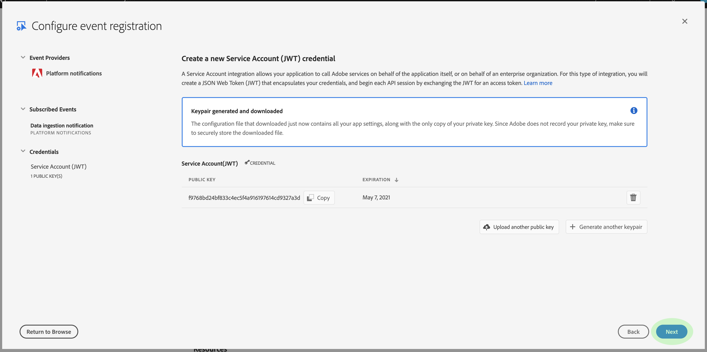

# Meddelanden om dataöverföring

Processen att samla in data i Adobe Experience Platform består av flera steg. När du har identifierat datafiler som behöver importeras till plattformen, börjar inmatningsprocessen och varje steg sker i följd tills data antingen har importerats eller misslyckats. Inmatningsprocessen kan initieras med [Adobe Experience Platforms API](https://www.adobe.io/apis/experienceplatform/home/api-reference.html#!acpdr/swagger-specs/ingest-api.yaml) för datainmatning eller med användargränssnittet för Experience Platform.

Data som läses in på Platform måste gå igenom flera steg för att nå sin destination, Data Lake eller i realtidskundprofilens datalager. Varje steg innebär att bearbeta data, validera data och sedan lagra data innan de skickas vidare till nästa steg. Beroende på mängden data som hämtas kan detta bli en tidskrävande process och det finns alltid en risk att processen misslyckas på grund av validerings-, semantik- eller bearbetningsfel. Om ett fel uppstår måste dataproblemen åtgärdas och sedan måste hela importen startas om med de korrigerade datafilerna.

Experience Platform gör det möjligt att prenumerera på en uppsättning händelser som publiceras i varje steg i processen, vilket gör det lättare att övervaka processen och meddela dig om statusen för inkapslade data och eventuella fel.

## Tillgängliga statusmeddelandehändelser

Nedan visas en lista över tillgängliga statusmeddelanden för dataöverföring som du kan prenumerera på.

>[!NOTE] Det finns bara ett händelseämne för alla meddelanden om dataöverföring. Händelsekoden kan användas för att skilja mellan olika statusvärden.

| Plattformstjänst | Status | Händelsebeskrivning | Händelsekod |
| ---------------- | ------ | ----------------- | ---------- |
| Datalager | framgång | Inmatning - batchen har slutförts | ing_load_success |
| Datalager | fel | Inmatning - batchen misslyckades | ing_load_error |
| Kundprofil i realtid | framgång | Profiltjänst - datainläsningsbatch lyckades | ps_load_success |
| Kundprofil i realtid | fel | Profiltjänst - Datainläsningsbatchen misslyckades | ps_load_error |
| Identitetsdiagram | framgång | Identitetsdiagram - datainläsningsbatchen har slutförts | ig_load_success |
| Identitetsdiagram | fel | Identitetsdiagram - datainläsningsbatchen misslyckades | ig_load_error |

## Meddelandenyttolastschema

Datainmatningsmeddelandets händelseschema är ett XDM-schema (Experience Data Model) som innehåller fält och värden som ger information om statusen för de data som hämtas. Besök den offentliga XDM GitHub-repon för att se det senaste [meddelandeschemat](https://github.com/adobe/xdm/blob/master/schemas/common/notifications/ingestion.schema.json).

## Prenumerera på statusmeddelanden för dataöverföring

Genom [Adobe I/O Events](https://www.adobe.io/apis/experienceplatform/events.html)kan du prenumerera på flera olika typer av meddelanden via webbhooks. Avsnitten nedan beskriver stegen för att prenumerera på plattformsmeddelanden för dataöverföringshändelser med Adobe Developer Console.

### Skapa ett nytt projekt i Adobe Developer Console

Gå till [Adobe Developer Console](https://www.adobe.com/go/devs_console_ui) och logga in med ditt Adobe ID. Följ sedan stegen som beskrivs i självstudiekursen om hur du [skapar ett tomt projekt](https://www.adobe.io/apis/experienceplatform/console/docs.html#!AdobeDocs/adobeio-console/master/projects-empty.md) i dokumentationen för Adobe Developer Console.

### Lägg till Experience Platform-händelser i projektet

När du har skapat ett nytt projekt går du till projektets översiktsskärm. Klicka här **[!UICONTROL Add event]**.

Dialogrutan _[!UICONTROL Add events]_visas. Klicka **[!UICONTROL Experience Platform]**för att filtrera listan med tillgängliga alternativ och klicka sedan **[!UICONTROL Platform notifications]**innan du klickar **[!UICONTROL Next]**.

På nästa skärm visas en lista med händelsetyper att prenumerera på. Markera **[!UICONTROL Data ingestion notification]** och klicka sedan på **[!UICONTROL Next]**.

Nästa skärm uppmanar dig att skapa en JSON Web Token (JWT). Du kan generera ett nyckelpar automatiskt eller överföra en egen offentlig nyckel som genererats i terminalen.

I den här självstudiekursen används det första alternativet. Klicka på alternativrutan för **[!UICONTROL Generate a key pair]** och klicka sedan på **[!UICONTROL Generate keypair]** knappen i det nedre högra hörnet.

När nyckelparet genereras hämtas det automatiskt av webbläsaren. Du måste lagra den här filen själv eftersom den inte sparas i Developer Console.

På nästa skärm kan du granska informationen om det nya nyckelparet. Klicka **[!UICONTROL Next]** för att fortsätta.

Ange ett namn och en beskrivning för händelseregistreringen på nästa skärm. Det bästa sättet är att skapa ett unikt, enkelt identifierbart namn som hjälper till att skilja den här evenemangsregistreringen från andra i samma projekt.

På samma skärm kan du välja att konfigurera hur händelser ska tas emot. **[!UICONTROL Webhook]** gör att du kan ange en anpassad webbkrosadress för att ta emot händelser, medan du **[!UICONTROL Runtime action]** kan göra samma sak med [Adobe I/O Runtime](https://www.adobe.io/apis/experienceplatform/runtime/docs.html).

I den här självstudien hoppas det här valfria konfigurationssteget över. När du är klar klickar du **[!UICONTROL Save configured events]** för att slutföra registreringen av evenemanget.

Informationssidan för den nyligen skapade händelseregistreringen visas, där du kan granska mottagna händelser, utföra felsökningsspårning och redigera konfigurationen.

## Nästa steg

När du har registrerat plattformsmeddelanden i ditt projekt kan du visa mottagna händelser från projektkontrollpanelen. Mer information om hur du spårar händelser finns i [hjälpguiden för Adobe I/O Events](https://www.adobe.io/apis/experienceplatform/events/docs.html#!adobedocs/adobeio-events/master/support/tracing.md) .
