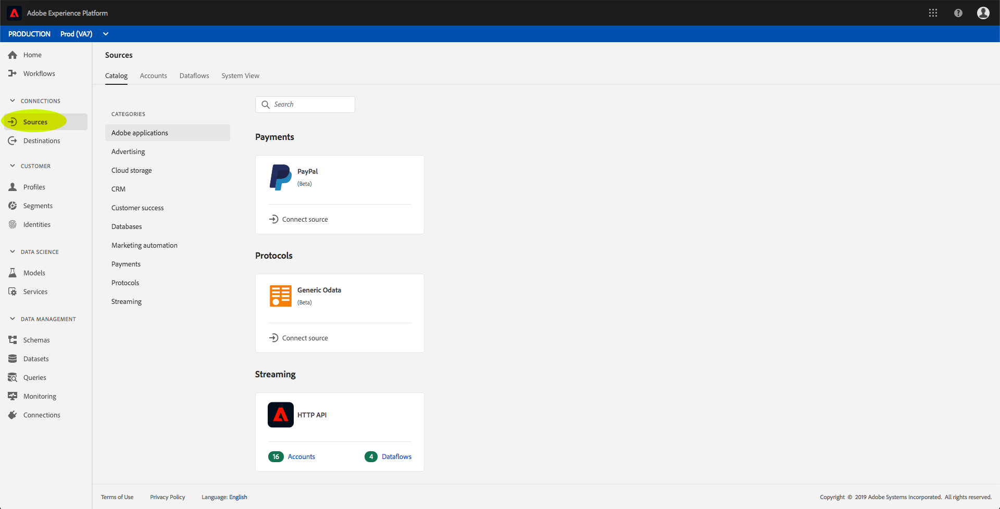

# Skapa en direktuppspelningsanslutning med användargränssnittet

Den här gränssnittshandboken hjälper dig att skapa en direktuppspelningsanslutning med Adobe Experience Platform.

## Komma igång

Om du vill börja direktuppspela data till [!DNL Experience Platform]måste du först skapa en direktuppspelad HTTP-anslutning. När du skapar en direktuppspelningsanslutning måste du ange nyckeldetaljer som till exempel källan för direktuppspelningsdata och om du tänker skicka data från en tillförlitlig (autentiserad) eller en otillförlitlig (ej autentiserad) källa eller inte.

När du har registrerat en direktuppspelningsanslutning får du en unik URL som du kan använda för att strömma data till [!DNL Platform].

Observera att du måste ha tillgång till Adobe Experience Platform för att kunna slutföra den här guiden. Om du inte har tillgång till [!DNL Platform]kontaktar du systemadministratören innan du fortsätter.

## Skapa en direktuppspelningsanslutning

När du har loggat in i [!DNL Experience Platform] användargränssnittet klickar du **[!UICONTROL Sources]** för att öppna **[!UICONTROL Catalog]** fliken. På den här sidan visas tillgängliga källtyper som enskilda kort, där varje kort innehåller en bubbla som visar antalet dataflöden som har skapats från direktuppspelningsanslutningar till datauppsättningar.

On the **[!UICONTROL Sources]** page, click **[!UICONTROL HTTP API]**, then **[!UICONTROL Connect source]**.

Skärmen visas **[!UICONTROL Connect to HTTP]** . Under **[!UICONTROL Service details]** anger du både **[!UICONTROL name]** och en **[!UICONTROL description]** för den nya direktuppspelningsanslutningen.

Under **[!UICONTROL Account Authentication]** väljer du följande konfigurationsegenskaper för din direktuppspelningsanslutning:

- **[!UICONTROL Authentication]:** Om direktuppspelningsanslutningen kräver autentisering eller inte. Autentisering säkerställer att data samlas in från betrodda källor. Vi rekommenderar att detta är aktiverat om det handlar om personligt identifierbar information (PII).
- **[!UICONTROL XDM Schema Compatibility]:** Anger om den här direktuppspelningsanslutningen ska skicka händelser som är kompatibla med XDM-scheman eller inte. Som standard är den här egenskapen **aktiverad**.

När du har valt konfigurationsegenskaperna klickar du på **[!UICONTROL Connect]**. Din HTTP-direktuppspelningsanslutning har skapats och kan nu visas på fliken **[!UICONTROL Browse]** på **[!UICONTROL Sources]** arbetsytan.

På fliken **[!UICONTROL Browse]** kan du klicka på din nyligen skapade Streaming HTTP Connection och visa information om anslutningen.

Genom att klicka på hyperlänken för anslutningsnamnet kan du välja vilka data som ska visas genom att konfigurera vilken datauppsättning som ska anslutas genom att klicka på **[!UICONTROL Select data]**.

Du kan antingen [skapa en ny datauppsättning](#create-a-new-dataset) eller [använda en befintlig datauppsättning](#use-an-existing-dataset).

### Skapa en ny datauppsättning

Om du vill skapa en ny datamängd anger du **[!UICONTROL Name]**, **[!UICONTROL Description]** samt målet **[!UICONTROL Schema]** för datauppsättningen.

När du infogar all information och klickar **[!UICONTROL Next]** kan du granska den angivna informationen innan du klickar för **[!UICONTROL Finish]** att ansluta datauppsättningen till din HTTP-direktuppspelningsanslutning.

### Använd en befintlig datauppsättning

Om du vill använda en befintlig datauppsättning väljer du **[!UICONTROL Output dataset name]**.

När du har klickat **[!UICONTROL Next]** kan du granska informationen innan du klickar **[!UICONTROL Finish]** för att ansluta den valda datauppsättningen till din HTTP-direktuppspelningsanslutning.

## Nästa steg

I den här självstudiekursen har du skapat en HTTP-anslutning för direktuppspelning, så att du kan använda slutpunkten för direktuppspelning för att få tillgång till en mängd olika API: [!DNL Data Ingestion] er. Instruktioner om hur du skapar en direktuppspelningsanslutning i API:t finns i självstudiekursen [Skapa en direktuppspelningsanslutning](../tutorials/create-streaming-connection.md).
