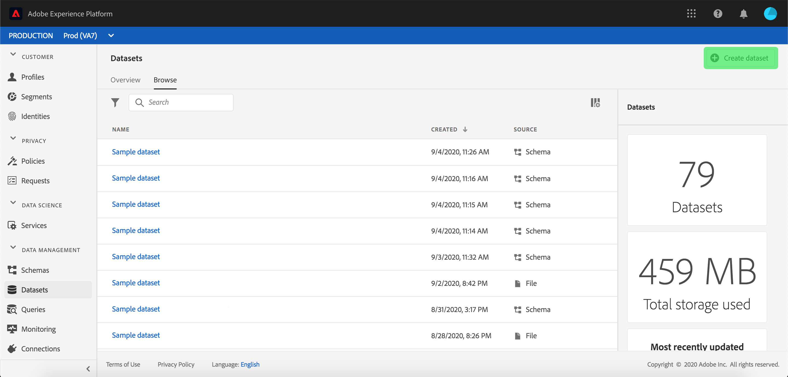
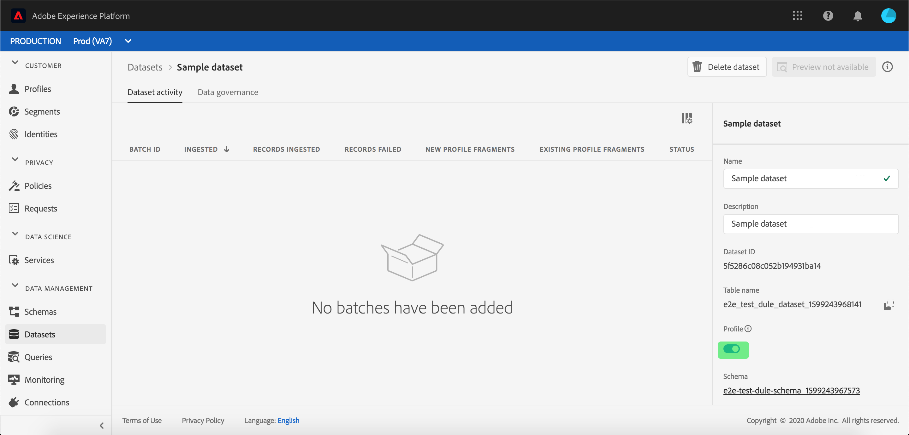

# Importera data till Adobe Experience Platform

Med Adobe Experience Platform kan du enkelt importera data till [!DNL Platform] som gruppfiler. Exempel på data som ska importeras kan vara profildata från en platt fil i ett CRM-system (till exempel en Parquet-fil) eller data som överensstämmer med ett känt [!DNL Experience Data Model]-schema (XDM) i schemaregistret.

## Komma igång

Du måste ha tillgång till [!DNL Experience Platform] för att kunna slutföra den här självstudiekursen. Om du inte har tillgång till en IMS-organisation i [!DNL Experience Platform], ska du tala med systemadministratören innan du fortsätter.

Om du föredrar att importera data med hjälp av API:er för datainmatning börjar du med att läsa [Utvecklarhandboken för gruppinmatning](../batch-ingestion/api-overview.md).

## Arbetsytan Datauppsättningar

Med arbetsytan Datauppsättningar i [!DNL Experience Platform] kan du visa och hantera alla datauppsättningar som din IMS-organisation har skapat, samt skapa nya.

Visa arbetsytan Datauppsättningar genom att klicka på **[!UICONTROL Datasets]** i den vänstra navigeringen. Arbetsytan Datauppsättningar innehåller en lista med datauppsättningar, inklusive kolumner som visar namn, skapade (datum och tid), källa, schema och senaste batchstatus samt datum och tid då datauppsättningen senast uppdaterades.

>[!NOTE]
>
>Klicka på filterikonen bredvid sökfältet för att använda filterfunktioner för att visa endast de datauppsättningar som är aktiverade för [!DNL Profile].

## Skapa en datauppsättning

Om du vill skapa en datauppsättning klickar du på **[!UICONTROL Create Dataset]** i det övre högra hörnet på arbetsytan Datauppsättningar.

På skärmen **[!UICONTROL Create Dataset]** väljer du om du vill &quot;[!UICONTROL Create Dataset from Schema]&quot; eller &quot;[!UICONTROL Create Dataset from CSV File]&quot;.

I den här självstudiekursen används ett schema för att skapa datauppsättningen. Klicka på **[!UICONTROL Create Dataset from Schema]** för att fortsätta.

## Välj dataschema

På skärmen **[!UICONTROL Select Schema]** väljer du ett schema genom att klicka på alternativknappen bredvid det schema du vill använda. För den här självstudiekursen görs datauppsättningen med hjälp av schemat Förmånsmedlemmar. Att använda sökfältet för att filtrera scheman är ett praktiskt sätt att hitta exakt det schema du söker.

När du har markerat alternativknappen bredvid schemat som du vill använda klickar du på **[!UICONTROL Next]**.

## Konfigurera datauppsättning

På skärmen **[!UICONTROL Configure Dataset]** måste du ge datauppsättningen ett namn och kan även ge en beskrivning av datauppsättningen.

**Kommentarer om datauppsättningsnamn:**

- Datauppsättningsnamnen ska vara korta och beskrivande så att datauppsättningen kan hittas i biblioteket senare.
- Datauppsättningsnamnen måste vara unika, vilket innebär att de också måste vara tillräckligt specifika för att de inte ska återanvändas i framtiden.
- Det är bäst att ge ytterligare information om datauppsättningen med hjälp av beskrivningsfältet, eftersom det kan hjälpa andra användare att skilja mellan datauppsättningar i framtiden.

När datauppsättningen har ett namn och en beskrivning klickar du på **[!UICONTROL Finish]**.

## Datauppsättningsaktivitet

En tom datauppsättning har nu skapats och du har returnerats till fliken **[!UICONTROL Dataset Activity]** på arbetsytan Datauppsättningar. Du bör se namnet på datauppsättningen i det övre vänstra hörnet av arbetsytan, tillsammans med ett meddelande om att&quot;Inga grupper har lagts till&quot;. Detta förväntas eftersom du inte har lagt till några batchar i den här datauppsättningen än.

Till höger på arbetsytan Datauppsättningar visas fliken **[!UICONTROL Info]** med information om din nya datauppsättning, till exempel datauppsättnings-ID, namn, beskrivning, tabellnamn, schema, direktuppspelning och källa. Fliken Info innehåller även information om när datauppsättningen skapades och om dess senaste ändringsdatum.

På fliken Info finns även en **[!UICONTROL Profile]**-växel som används för att aktivera datauppsättningen för användning med [!DNL Real-time Customer Profile]. Användning av den här växeln, och [!DNL Real-time Customer Profile], förklaras mer ingående i följande avsnitt.

## Aktivera datauppsättning för [!DNL Real-time Customer Profile]

Datauppsättningar används för att samla in data till [!DNL Experience Platform], och dessa data används i slutändan för att identifiera individer och sammanfoga information som kommer från flera källor. Den sammanfogade informationen kallas [!DNL Real-Time Customer Profile]. För att [!DNL Platform] ska veta vilken information som ska inkluderas i [!DNL Real-Time Profile] kan datauppsättningar markeras för inkludering med hjälp av alternativet **[!UICONTROL Profile]**.

Den här växlingen är som standard inaktiverad. Om du väljer att aktivera [!DNL Profile] kommer alla data som hämtas in till datauppsättningen att användas för att identifiera en individ och sammanfoga deras [!DNL Real-Time Profile].

Om du vill veta mer om [!DNL Real-time Customer Profile] och arbeta med identiteter kan du läsa dokumentationen för [identitetstjänsten](../../identity-service/home.md).

Om du vill aktivera datauppsättningen för [!DNL Real-time Customer Profile] klickar du på växlingsknappen **[!UICONTROL Profile]** på fliken **[!UICONTROL Info]**.

En dialogruta visas där du ombeds bekräfta att du vill aktivera datauppsättningen för [!DNL Real-time Customer Profile].

Klicka på **[!UICONTROL Enable]** och växlingsknappen blir blå, vilket anger att den är aktiverad.

## Lägg till data i datauppsättning

Data kan läggas till i en datauppsättning på flera olika sätt. Du kan välja att använda [!DNL Data Ingestion] API:er eller en ETL-partner som [!DNL Unifi] eller [!DNL Informatica]. För den här självstudiekursen läggs data till i datauppsättningen med hjälp av fliken **[!UICONTROL Add Data]** i användargränssnittet.

Klicka på fliken **[!UICONTROL Add Data]** för att börja lägga till data i datauppsättningen. Nu kan du dra och släppa filer eller bläddra på datorn efter de filer du vill lägga till.

>[!NOTE]
>
>Plattformen har stöd för två filtyper för dataöverföring, Parquet eller JSON. Du kan lägga till upp till fem filer i taget, där den maximala filstorleken för varje fil är 10 GB.

## Överföra en fil

När du drar och släpper (eller bläddrar och väljer) en Parquet- eller JSON-fil som du vill ladda upp, börjar [!DNL Platform] bearbeta filen omedelbart och en **[!UICONTROL Uploading]**-dialogruta visas på fliken **[!UICONTROL Add Data]** med förloppet för filöverföringen.

## Datauppsättningsmått

När filen har laddats upp visar inte fliken **[!UICONTROL Dataset Activity]** längre att inga grupper har lagts till. I stället visas datamängdsmått på fliken **[!UICONTROL Dataset Activity]**. Alla mätvärden visar &quot;0&quot; i det här skedet eftersom batchen ännu inte har lästs in.

Längst ned på fliken finns en lista som visar **[!UICONTROL Batch ID]** för de data som precis har importerats via processen [&quot;Lägg till data i datauppsättning&quot;](#add-data-to-dataset). Här finns även information om batchen, inklusive inkapslat datum, antal poster som importerats och aktuell batchstatus.

## Batchinformation

Klicka på **[!UICONTROL Batch ID]** för att visa en **[!UICONTROL Batch Overview]** som visar ytterligare information om gruppen. När batchen har lästs in uppdateras informationen om batchen så att antalet poster som har importerats och filstorleken visas. Statusen ändras också till Slutfört eller Misslyckat. Om batchen misslyckas innehåller avsnittet **[!UICONTROL Error Code]** information om eventuella fel under importen.

Mer information och vanliga frågor om batchförbrukning finns i [felsökningsguiden för batchförbrukning](../batch-ingestion/troubleshooting.md).

Om du vill gå tillbaka till skärmen **[!UICONTROL Dataset Activity]** klickar du på datauppsättningens namn (**[!UICONTROL Loyalty Details]**) i den synliga sökvägen.

## Förhandsgranska datauppsättning

När datauppsättningen är klar visas ett alternativ till **[!UICONTROL Preview Dataset]** högst upp på fliken **[!UICONTROL Dataset Activity]**.

Klicka på **[!UICONTROL Preview Dataset]** för att öppna en dialogruta med exempeldata i datauppsättningen. Om datauppsättningen skapades med ett schema visas information om datauppsättningsschemat till vänster i förhandsgranskningen. Du kan expandera schemat med hjälp av pilarna för att se schemastrukturen. Varje kolumnrubrik i förhandsvisningsdata representerar ett fält i datauppsättningen.

## Nästa steg och ytterligare resurser

Nu när du har skapat en datauppsättning och kapslat in data i [!DNL Experience Platform] kan du upprepa de här stegen för att skapa en ny datauppsättning eller importera fler data till den befintliga datauppsättningen.

Läs [översikten över gruppinmatning](../batch-ingestion/overview.md) om du vill veta mer om gruppinmatning och komplettera din inlärning genom att titta på videon nedan.

>[!WARNING]
>
>Användargränssnittet [!DNL Platform] som visas i följande video är inaktuellt. Läs dokumentationen ovan för de senaste skärmbilderna och funktionerna i användargränssnittet.

>[!VIDEO](https://video.tv.adobe.com/v/27269?quality=12&learn=on)