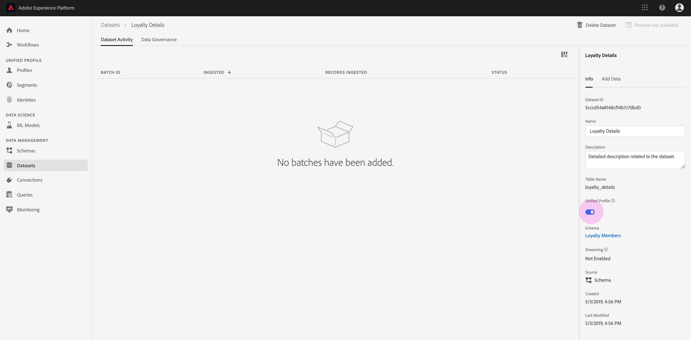
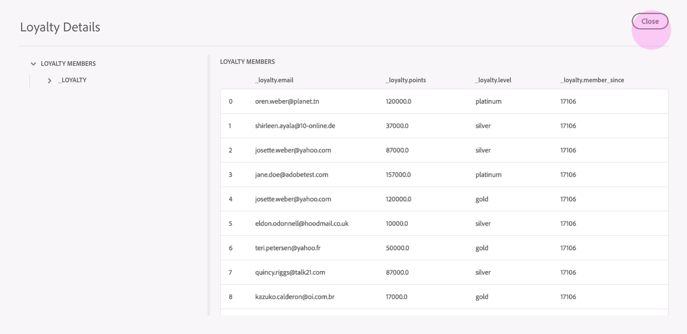

# Infoga data i Adobe Experience Platform

Med Adobe Experience Platform kan du enkelt importera data till [!DNL Platform] som gruppfiler. Exempel på data som ska importeras kan vara profildata från en platt fil i ett CRM-system (till exempel en parquet-fil) eller data som överensstämmer med ett känt [!DNL Experience Data Model] (XDM) schema i schemaregistret.

## Komma igång

Du måste ha tillgång till den här självstudiekursen för att kunna slutföra den [!DNL Experience Platform]. Om du inte har tillgång till en IMS-organisation i [!DNL Experience Platform]kontaktar du systemadministratören innan du fortsätter.

Om du föredrar att importera data med hjälp av API:er för datainmatning börjar du med att läsa [Utvecklarhandboken](../batch-ingestion/api-overview.md)för gruppinmatning.

## Arbetsytan Datauppsättningar

På arbetsytan Datauppsättningar i [!DNL Experience Platform] kan du visa och hantera alla datauppsättningar som din IMS-organisation har skapat, samt skapa nya.

Visa arbetsytan Datauppsättningar genom att klicka **[!UICONTROL Datasets]** i den vänstra navigeringen. Arbetsytan Datauppsättningar innehåller en lista med datauppsättningar, inklusive kolumner som visar _Namn_, _Skapad_ (datum och tid), _Källa_, _Schema_ och _Senaste gruppstatus___, samt datum och tid då datauppsättningen uppdaterades¥Last Updated¥.

>[!NOTE]
>
>Klicka på filterikonen bredvid sökfältet för att använda filterfunktioner för att visa endast de datauppsättningar som är aktiverade för [!DNL Profile].

## Skapa en datauppsättning

Om du vill skapa en datauppsättning klickar du **[!UICONTROL Create Dataset]** i det övre högra hörnet på arbetsytan Datauppsättningar.

På **[!UICONTROL Create Dataset]** skärmen väljer du om du vill &quot;[!UICONTROL Create Dataset from Schema]&quot; eller &quot;[!UICONTROL Create Dataset from CSV File]&quot;.

I den här självstudiekursen används ett schema för att skapa datauppsättningen. Klicka **[!UICONTROL Create Dataset from Schema]** för att fortsätta.

## Välj dataschema

Välj ett schema på **[!UICONTROL Select Schema]** skärmen genom att klicka på alternativknappen bredvid det schema du vill använda. För den här självstudiekursen görs datauppsättningen med hjälp av schemat Förmånsmedlemmar. Att använda sökfältet för att filtrera scheman är ett praktiskt sätt att hitta exakt det schema du söker.

När du har markerat alternativknappen bredvid det schema du vill använda klickar du på **[!UICONTROL Next]**.

## Konfigurera datauppsättning

På **[!UICONTROL Configure Dataset]** skärmen måste du ge datauppsättningen en **[!UICONTROL Name]** och kan även tillhandahålla en **[!UICONTROL Description]** av datauppsättningarna.

**Kommentarer om datauppsättningsnamn:**

- Datauppsättningsnamnen ska vara korta och beskrivande så att datauppsättningen kan hittas i biblioteket senare.
- Datauppsättningsnamnen måste vara unika, vilket innebär att de också måste vara tillräckligt specifika för att de inte ska återanvändas i framtiden.
- Det är bäst att ge ytterligare information om datauppsättningen med hjälp av beskrivningsfältet, eftersom det kan hjälpa andra användare att skilja mellan datauppsättningar i framtiden.

När datauppsättningen har ett namn och en beskrivning klickar du på **[!UICONTROL Finish]**.

## Datauppsättningsaktivitet

En tom datauppsättning har nu skapats och du har återgått till fliken **[!UICONTROL Dataset Activity]** i arbetsytan Datauppsättningar. Du bör se namnet på datauppsättningen i det övre vänstra hörnet av arbetsytan, tillsammans med ett meddelande om att&quot;Inga grupper har lagts till&quot;. Detta förväntas eftersom du inte har lagt till några batchar i den här datauppsättningen än.

Till höger på arbetsytan Datauppsättningar visas den **[!UICONTROL Info]** flik som innehåller information om din nya datauppsättning, t.ex. _Datauppsättnings-ID_, _Namn_, _Beskrivning_, _Tabellnamn_, ______ Schema,¥Streaming¥ ochSource¥. Fliken Info innehåller även information om när datauppsättningen _skapades_ och dess _senaste ändrade_ datum.

På fliken Info finns även en _profilväxel_ som används för att aktivera datauppsättningen för användning med [!DNL Real-time Customer Profile]. Användning av den här växeln, och [!DNL Real-time Customer Profile]den, förklaras mer ingående i det följande avsnittet.

## Aktivera datauppsättning för [!DNL Real-time Customer Profile]

Datauppsättningar används för inmatning av data i [!DNL Experience Platform]och dessa data används i slutändan för att identifiera enskilda personer och sammanfoga information från flera källor. Den sammanfogade informationen kallas en [!DNL Real-Time Customer Profile]. För [!DNL Platform] att veta vilken information som ska inkluderas i [!DNL Real-Time Profile]kan datauppsättningar markeras för inkludering med **[!UICONTROL Profile]** växlingsknappen.

Den här växlingen är som standard inaktiverad. Om du väljer att aktivera [!DNL Profile]kommer alla data som hämtas in till datauppsättningen att användas för att identifiera en individ och sammanfoga deras [!DNL Real-Time Profile].

Mer information om [!DNL Real-time Customer Profile] och hur du arbetar med identiteter finns i dokumentationen för [identitetstjänsten](../../identity-service/home.md) .

Om du vill aktivera datauppsättningen för [!DNL Real-time Customer Profile]klickar du på **[!UICONTROL Profile]** växlingsknappen på **[!UICONTROL Info]** fliken.

En dialogruta visas där du ombeds bekräfta att du vill aktivera datauppsättningen för kundprofil i realtid.

Klicka **[!UICONTROL Enable]** och växlingsknappen blir blå, vilket anger att den är aktiverad.

## Lägg till data i datauppsättning

Data kan läggas till i en datauppsättning på flera olika sätt. Du kan välja att använda API:er för datainmatning eller en ETL-partner som Unifi eller Informatica. För den här självstudiekursen läggs data till i datauppsättningen med hjälp av fliken **[!UICONTROL Add Data]** i användargränssnittet.

Klicka på **[!UICONTROL Add Data]** fliken för att börja lägga till data i datauppsättningen. Nu kan du dra och släppa filer eller bläddra på datorn efter de filer du vill lägga till.

>[!NOTE]
>
>[!DNL Platform] har stöd för två filtyper för dataöverföring, parquet eller JSON. Du kan lägga till upp till fem filer i taget, där den maximala filstorleken för varje fil är 10 GB.

## Överföra en fil

När du drar och släpper (eller bläddrar och väljer) en parquet eller JSON-fil som du vill ladda upp, [!DNL Platform] börjar bearbetningen omedelbart och en **[!UICONTROL Uploading]** dialogruta visas på **[!UICONTROL Add Data]** fliken med förloppet för filöverföringen.

## Datauppsättningsmått

När filen har laddats upp visas inte längre &quot;Inga batchar har lagts till&quot; på fliken **[!UICONTROL Dataset Activity]** . I stället visas datamängdsmått på fliken Datauppsättningsaktivitet. Alla mätvärden visar &quot;0&quot; i det här skedet eftersom batchen ännu inte har lästs in.

Längst ned på fliken finns en lista med _batch-ID_ för de data som precis har importerats via processen [&quot;Lägg till data i datauppsättning&quot;](#add-data-to-dataset) . Här finns även information som rör batchen, inklusive _inkapslat_ datum, antal _poster som har kapslats_ och aktuell _batchstatus_.

## Batchinformation

Klicka på _batch-ID_ för att visa en **[!UICONTROL Batch Overview]** gruppruta med ytterligare information om gruppen. När batchen har lästs in uppdateras informationen om batchen så att antalet _poster som har kapslats_ och _filstorleken_ visas. Status __ ändras också till Slutfört eller Misslyckat. Om batchen misslyckas innehåller avsnittet _Felkod_ detaljer om eventuella fel under importen.

Mer information och vanliga frågor om batchförbrukning finns i felsökningsguiden för [batchmatning](../batch-ingestion/troubleshooting.md).

Om du vill gå tillbaka till skärmen **Datauppsättningsaktivitet** klickar du på namnet på datauppsättningen (_bonusinformation_) i den synliga sökvägen.

## Förhandsgranska datauppsättning

När datauppsättningen är klar visas ett alternativ som **[!UICONTROL Preview Dataset]** visas högst upp på **[!UICONTROL Dataset Activity]** fliken.

Klicka **[!UICONTROL Preview Dataset]** för att öppna en dialogruta med exempeldata i datauppsättningen. Om datauppsättningen skapades med ett schema visas information om datauppsättningsschemat till vänster i förhandsgranskningen. Du kan expandera schemat med hjälp av pilarna för att se schemastrukturen. Varje kolumnrubrik i förhandsvisningsdata representerar ett fält i datauppsättningen.

## Nästa steg och ytterligare resurser

Nu när du har skapat en datauppsättning och kapslat in data i [!DNL Experience Platform]kan du upprepa de här stegen för att skapa en ny datauppsättning eller infoga fler data i den befintliga datauppsättningen.

Om du vill veta mer om batchförbrukning kan du läsa översikten över  batchintag och komplettera din inlärning genom att titta på videon nedan.

>[!WARNING]
>
> Gränssnittet [!DNL Platform] som visas i följande video är inaktuellt. Läs dokumentationen ovan för de senaste skärmbilderna och funktionerna i användargränssnittet.

>[!VIDEO](https://video.tv.adobe.com/v/27269?quality=12&learn=on)
