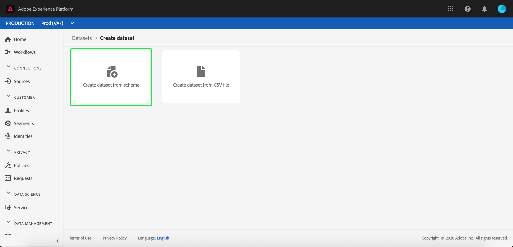

# Importera data till Adobe Experience Platform

Med Adobe Experience Platform kan du enkelt importera data till [!DNL Platform] som gruppfiler. Exempel på data som ska importeras kan vara profildata från en platt fil i ett CRM-system (t.ex. en Parquet-fil) eller data som överensstämmer med en känd [!DNL Experience Data Model] (XDM)-schema i schemaregistret.

## Komma igång

Du måste ha tillgång till [!DNL Experience Platform]. Om du inte har tillgång till en organisation i [!DNL Experience Platform]bör du kontakta systemadministratören innan du fortsätter.

Om du hellre vill importera data med API:er för datainmatning börjar du med att läsa [Utvecklarhandbok för batchintag](../batch-ingestion/api-overview.md).

## Arbetsytan Datauppsättningar

Arbetsytan Datauppsättningar i [!DNL Experience Platform] gör att du kan visa och hantera alla datauppsättningar som din organisation har skapat, samt skapa nya.

Visa arbetsytan Datauppsättningar genom att klicka **[!UICONTROL Datasets]** i den vänstra navigeringen. Arbetsytan Datauppsättningar innehåller en lista med datauppsättningar, inklusive kolumner som visar namn, skapade (datum och tid), källa, schema och senaste batchstatus samt datum och tid då datauppsättningen senast uppdaterades.

>[!NOTE]
>
>Klicka på filterikonen bredvid sökfältet för att använda filterfunktioner för att visa endast de datauppsättningar som är aktiverade för [!DNL Profile].

## Skapa en datauppsättning

Klicka på om du vill skapa en datauppsättning **[!UICONTROL Create Dataset]** i det övre högra hörnet av arbetsytan Datauppsättningar.

På **[!UICONTROL Create Dataset]** väljer du om du vill[!UICONTROL Create Dataset from Schema]&quot; eller &quot;[!UICONTROL Create Dataset from CSV File]&quot;.

I den här självstudiekursen används ett schema för att skapa datauppsättningen. Klicka **[!UICONTROL Create Dataset from Schema]** för att fortsätta.

## Välj dataschema

På **[!UICONTROL Select Schema]** väljer du ett schema genom att klicka på alternativknappen bredvid det schema du vill använda. För den här självstudiekursen görs datauppsättningen med hjälp av schemat Förmånsmedlemmar. Att använda sökfältet för att filtrera scheman är ett praktiskt sätt att hitta exakt det schema du söker.

När du har markerat alternativknappen bredvid det schema du vill använda klickar du på **[!UICONTROL Next]**.

## Konfigurera datauppsättning

På **[!UICONTROL Configure Dataset]** måste du ge datauppsättningen ett namn och kan även ge en beskrivning av datauppsättningen.

**Kommentarer om datauppsättningsnamn:**

- Datauppsättningsnamnen ska vara korta och beskrivande så att datauppsättningen kan hittas i biblioteket senare.
- Datauppsättningsnamnen måste vara unika, vilket innebär att de också måste vara tillräckligt specifika för att de inte ska återanvändas i framtiden.
- Det är bäst att ge ytterligare information om datauppsättningen med hjälp av beskrivningsfältet, eftersom det kan hjälpa andra användare att skilja mellan datauppsättningar i framtiden.

När datauppsättningen har ett namn och en beskrivning klickar du **[!UICONTROL Finish]**.

## Datauppsättningsaktivitet

En tom datauppsättning har skapats och du har returnerats till **[!UICONTROL Dataset Activity]** i arbetsytan Datauppsättningar. Du bör se namnet på datauppsättningen i det övre vänstra hörnet av arbetsytan, tillsammans med ett meddelande om att&quot;Inga grupper har lagts till&quot;. Detta förväntas eftersom du inte har lagt till några batchar i den här datauppsättningen än.

Till höger på arbetsytan Datauppsättningar ser du **[!UICONTROL Info]** som innehåller information om din nya datauppsättning, t.ex. datauppsättnings-ID, namn, beskrivning, tabellnamn, schema, direktuppspelning och källa. Fliken Info innehåller även information om när datauppsättningen skapades och om dess senaste ändringsdatum.

På fliken Info finns även en  **[!UICONTROL Profile]** växla som används för att aktivera datauppsättningen för användning med [!DNL Real-Time Customer Profile]. Användning av den här växlingsknappen och [!DNL Real-Time Customer Profile], förklaras mer ingående i det följande avsnittet.

## Aktivera datauppsättning för [!DNL Real-Time Customer Profile]

Datauppsättningar används för inmatning av data i [!DNL Experience Platform], och dessa data används i slutändan för att identifiera individer och sammanfoga information som kommer från olika källor. Den sammanfogade informationen kallas en [!DNL Real-Time Customer Profile]. För att [!DNL Platform] för att ta reda på vilken information som ska ingå i [!DNL Real-Time Profile]kan datauppsättningar markeras för inkludering med **[!UICONTROL Profile]** växla.

Den här växlingen är som standard inaktiverad. Om du vill aktivera [!DNL Profile]används alla data som matas in i datauppsättningen för att identifiera en individ och sammanfoga dem [!DNL Real-Time Profile].

Mer information om [!DNL Real-Time Customer Profile] och arbeta med identiteter kan du läsa [Identitetstjänst](../../identity-service/home.md) dokumentation.

Aktivera datauppsättningen för [!DNL Real-Time Customer Profile]klickar du på **[!UICONTROL Profile]** växla i **[!UICONTROL Info]** -fliken.

En dialogruta visas där du ombeds bekräfta att du vill aktivera datauppsättningen för [!DNL Real-Time Customer Profile].

Klicka **[!UICONTROL Enable]** och växlingsknappen blir blå, vilket anger att den är på.

## Lägg till data i datauppsättning

Data kan läggas till i en datauppsättning på flera olika sätt. Du kan välja att använda [!DNL Data Ingestion] API:er eller en ETL-partner som [!DNL Unifi] eller [!DNL Informatica]. För den här självstudiekursen läggs data till i datauppsättningen med hjälp av **[!UICONTROL Add Data]** i användargränssnittet.

Börja lägga till data i datauppsättningen genom att klicka på **[!UICONTROL Add Data]** -fliken. Nu kan du dra och släppa filer eller bläddra på datorn efter de filer du vill lägga till.

>[!NOTE]
>
>Plattformen har stöd för två filtyper för dataöverföring, Parquet eller JSON. Du kan lägga till upp till fem filer i taget, där den maximala filstorleken för varje fil är 1 GB.

## Överföra en fil {#upload-file}

När du har dragit och släppt (eller bläddrat och valt) en Parquet- eller JSON-fil som du vill överföra, [!DNL Platform] börjar bearbeta filen omedelbart och **[!UICONTROL Uploading]** visas på **[!UICONTROL Add Data]** som visar förloppet för filöverföringen.

## Datauppsättningsmått

När filen har laddats upp är **[!UICONTROL Dataset Activity]** visas inte längre att&quot;Inga batchar har lagts till&quot;. I stället **[!UICONTROL Dataset Activity]** -fliken visar nu datamängdsmått. Alla mätvärden visar &quot;0&quot; i det här skedet eftersom batchen ännu inte har lästs in.

Längst ned på fliken finns en lista med **[!UICONTROL Batch ID]** av de data som just har importerats via [&quot;Lägg till data i datauppsättning&quot;](#add-data-to-dataset) -processen. Här finns också information om batchen, inklusive inkapslat datum, antal poster som importerats och aktuell batchstatus.

## Batchinformation

Klicka på **[!UICONTROL Batch ID]** för att visa en **[!UICONTROL Batch Overview]**, med ytterligare information om batchen. När batchen har lästs in uppdateras informationen om batchen så att antalet poster som har importerats och filstorleken visas. Statusen ändras också till Slutfört eller Misslyckat. Om batchen misslyckas **[!UICONTROL Error Code]** -avsnittet kommer att innehålla information om eventuella fel under importen.

Mer information och vanliga frågor om batchanvändning finns i [Felsökningsguide för batchmatning](../batch-ingestion/troubleshooting.md).

Återgå till **[!UICONTROL Dataset Activity]** klickar du på datauppsättningens namn (**[!UICONTROL Loyalty Details]**) i väggen.

## Förhandsgranska datauppsättning

När datauppsättningen är klar kan du **[!UICONTROL Preview Dataset]** visas högst upp i **[!UICONTROL Dataset Activity]** -fliken.

Klicka **[!UICONTROL Preview Dataset]** för att öppna en dialogruta med exempeldata från datauppsättningen. Om datauppsättningen skapades med ett schema visas information om datauppsättningsschemat till vänster i förhandsgranskningen. Du kan expandera schemat med hjälp av pilarna för att se schemastrukturen. Varje kolumnrubrik i förhandsvisningsdata representerar ett fält i datauppsättningen.

## Nästa steg och ytterligare resurser

Nu när du har skapat en datauppsättning och har infogat data i [!DNL Experience Platform]kan du upprepa de här stegen för att skapa en ny datauppsättning eller lägga in fler data i den befintliga datauppsättningen.

Läs mer om batchmatning i [Översikt över batchintag](../batch-ingestion/overview.md) och komplettera din inlärning genom att titta på videon nedan.

>[!WARNING]
>
>The [!DNL Platform] Gränssnittet som visas i följande video är inaktuellt. Läs dokumentationen ovan för de senaste skärmbilderna och funktionerna i användargränssnittet.

>[!VIDEO](https://video.tv.adobe.com/v/27269?quality=12&learn=on)
