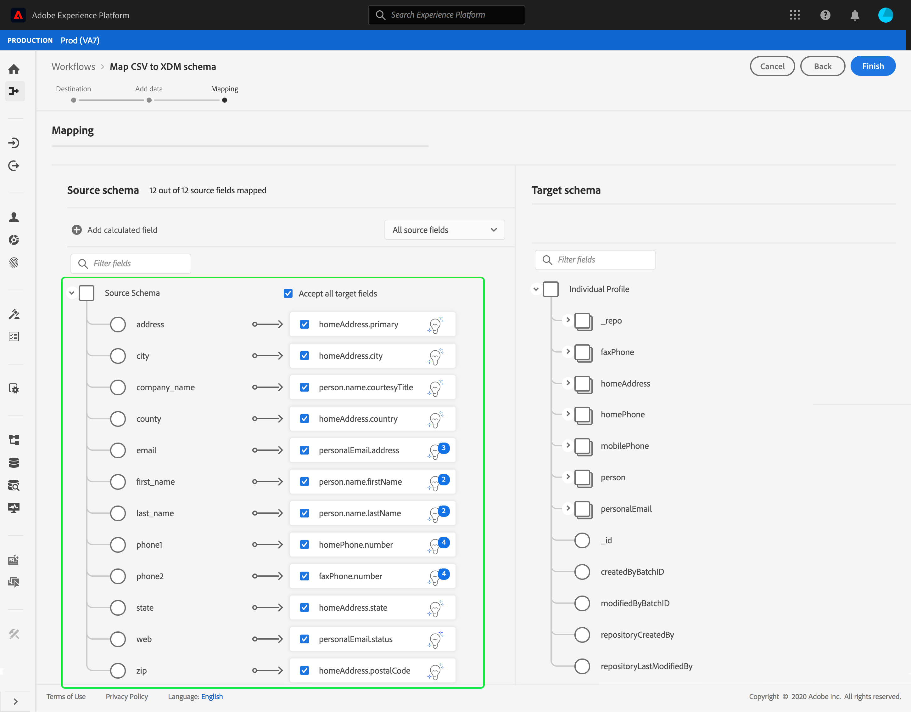

# Mappa en CSV-fil till ett XDM-schema

För att kunna importera CSV-data till [!DNL Adobe Experience Platform] måste data mappas till ett [!DNL Experience Data Model] (XDM)-schema. I den här självstudiekursen beskrivs hur du mappar en CSV-fil till ett XDM-schema med [!DNL Platform]-användargränssnittet.

I bilagan till den här självstudiekursen finns dessutom mer information om hur du använder [mappningsfunktioner](#mapping-functions).

## Komma igång

Den här självstudien kräver en fungerande förståelse av följande komponenter i [!DNL Platform]:

- [[!DNL Experience Data Model (XDM System)]](../../xdm/home.md): Det standardiserade ramverket som  [!DNL Platform] organiserar kundupplevelsedata.
- [[!DNL Batch ingestion]](../batch-ingestion/overview.md): Den metod som används för att  [!DNL Platform] importera data från användartillhandahållna datafiler.

Den här självstudien kräver också att du redan har skapat en datauppsättning att importera dina CSV-data till. Anvisningar om hur du skapar en datauppsättning i användargränssnittet finns i [självstudiekursen om dataimport](./ingest-batch-data.md).

## Välj ett mål

Logga in på [[!DNL Adobe Experience Platform]](https://platform.adobe.com) och välj **[!UICONTROL Workflows]** i det vänstra navigeringsfältet för att komma åt arbetsytan i **[!UICONTROL Workflows]**.

På skärmen **[!UICONTROL Workflows]** väljer du **[!UICONTROL Map CSV to XDM schema]** under avsnittet **[!UICONTROL Data ingestion]** och sedan **[!UICONTROL Launch]**.

Arbetsflödet **[!UICONTROL Map CSV to XDM schema]** visas med början i steget **[!UICONTROL Destination]**. Välj en datauppsättning för inkommande data som ska importeras till. Du kan antingen använda en befintlig datauppsättning eller skapa en ny.

**Använd en befintlig datauppsättning**

Om du vill importera dina CSV-data till en befintlig datauppsättning väljer du **[!UICONTROL Use existing dataset]**. Du kan antingen hämta en befintlig datauppsättning med sökfunktionen eller genom att bläddra igenom listan med befintliga datauppsättningar i panelen.

Om du vill importera dina CSV-data till en ny datauppsättning väljer du **[!UICONTROL Create new dataset]** och anger ett namn och en beskrivning för datauppsättningen i fälten. Välj ett schema med antingen sökfunktionen eller genom att bläddra igenom listan med scheman. Välj **[!UICONTROL Next]** för att fortsätta.

## Lägg till data

**[!UICONTROL Add data]**-steget visas. Dra och släpp CSV-filen i det tilldelade utrymmet eller välj **[!UICONTROL Choose files]** om du vill ange CSV-filen manuellt.

Avsnittet **[!UICONTROL Sample data]** visas när filen har överförts och de första tio raderna med data visas. När du har bekräftat att data har överförts som förväntat väljer du **[!UICONTROL Next]**.

## Mappa CSV-fält till XDM-schemafält

**[!UICONTROL Mapping]**-steget visas. Kolumnerna i CSV-filen listas under **[!UICONTROL Source Field]**, med motsvarande XDM-schemafält listade under **[!UICONTROL Target Field]**.

[!DNL Platform] ger automatiskt intelligenta rekommendationer för automatiskt mappade fält baserat på det målschema eller den datamängd som du har valt. Du kan justera mappningsreglerna manuellt så att de passar dina användningsfall.

Om du vill acceptera alla värden för automatisk generering av mappning markerar du kryssrutan [!UICONTROL Accept all target fields].

Ibland finns det mer än en rekommendation för källschemat. När detta inträffar visas den mest framträdande rekommendationen på mappningskortet, följt av en blå cirkel som innehåller antalet tillgängliga ytterligare rekommendationer. Om du väljer glödlampsikonen visas en lista med ytterligare rekommendationer. Du kan välja en av de alternativa rekommendationerna genom att markera kryssrutan bredvid den rekommendation du vill mappa till i stället.

Du kan också välja att manuellt mappa källschemat till målschemat. Håll pekaren över det källschema som du vill mappa och välj sedan plusikonen.

**[!UICONTROL Map source to target field]**-drivrutinen visas. Här kan du välja vilket fält som du vill mappa, följt av **[!UICONTROL Save]** för att lägga till din nya mappning.

Om du vill ta bort en av mappningarna för du pekaren över mappningen och väljer minusikonen.

### Lägg till beräknat fält

Beräknade fält tillåter att värden skapas baserat på attributen i indatabladet. Dessa värden kan sedan tilldelas attribut i målschemat och ges ett namn och en beskrivning som gör det enklare att referera till.

Klicka på knappen **[!UICONTROL Add calculated field]** för att fortsätta.

Panelen **[!UICONTROL Create calculated field]** visas. Den vänstra dialogrutan innehåller de fält, funktioner och operatorer som stöds i beräkningsfält. Välj en av flikarna för att börja lägga till funktioner, fält eller operatorer i uttrycksredigeraren.

| Tabb | Beskrivning |
| --------- | ----------- |
| Fält | Fliken Fält visar de fält och attribut som är tillgängliga i källschemat. |
| Funktioner | På fliken Funktioner visas de funktioner som är tillgängliga för att omforma data. Om du vill veta mer om de funktioner du kan använda i beräkningsfält kan du läsa guiden på [med hjälp av datapersonfunktioner (Mapper)](../../data-prep/functions.md). |
| Operatorer | På fliken Operatorer visas de operatorer som är tillgängliga för att omforma data. |

Du kan lägga till fält, funktioner och operatorer manuellt med uttrycksredigeraren i mitten. Välj redigeraren för att börja skapa ett uttryck.

Välj **[!UICONTROL Save]** för att fortsätta.

Mappningsskärmen visas igen med det nya källfältet. Tillämpa motsvarande målfält och välj **[!UICONTROL Finish]** för att slutföra mappningen.

## Övervaka datainmatning

När CSV-filen har mappats och skapats kan du övervaka de data som hämtas genom den. Mer information om övervakning av dataöverföring finns i självstudiekursen om [övervakning av dataöverföring](../../ingestion/quality/monitor-data-ingestion.md).

## Nästa steg

I den här självstudiekursen har du mappat en platt CSV-fil till ett XDM-schema och infogat den i [!DNL Platform]. Dessa data kan nu användas av underordnade [!DNL Platform]-tjänster som [!DNL Real-time Customer Profile]. Mer information finns i översikten för [[!DNL Real-time Customer Profile]](../../profile/home.md).
