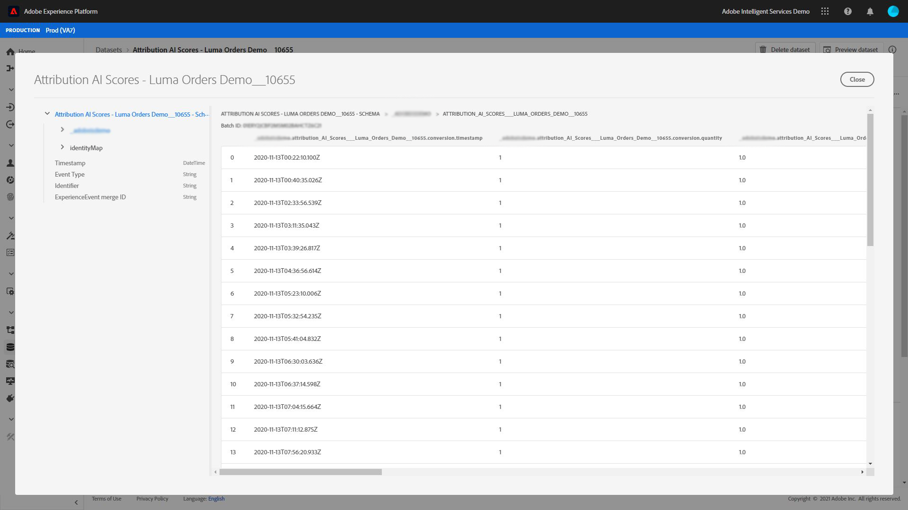

# Snabbstartguide för Adobe Experience Platform Query Service för analys av attribueringspoäng

Varje rad i data representerar en konvertering där information för relaterade kontaktytor lagras som en array med strukturer under kolumnen `touchpointsDetail`.

| Kontaktpunktsinformation | Kolumn |
| ---------------------- | ------ |
| Namn på kontaktpunkt | `touchpointsDetail. touchpointName` |
| Pekpunktskanal | `touchpointsDetail.touchPoint.mediaChannel` |
| AAI-algoritmisk poäng för kontaktyta | <li>`touchpointsDetail.scores.algorithmicSourced`</li> <li> `touchpointsDetail.scores.algorithmicInfluenced` </li> |

## Söka efter datasökvägar

I användargränssnittet för Adobe Experience Platform väljer du **[!UICONTROL Datasets]** i den vänstra navigeringen. Sidan **[!UICONTROL Datasets]** visas. Välj sedan fliken **[!UICONTROL Browse]** och leta reda på utdatamängden för dina Attribution AI.


Välj din utdatamängd. Sidan för datauppsättningsaktivitet visas.


På aktivitetssidan för datauppsättningen väljer du **[!UICONTROL Preview dataset]** i det övre högra hörnet för att förhandsgranska dina data och kontrollera att de har importerats som förväntat.



När du har förhandsgranskat dina data väljer du schemat i den högra listen. En pover visas med schemanamnet och beskrivningen. Markera hyperlänken för schemanamnet för att omdirigera till bedömningsschemat.


Med hjälp av poängschemat kan du välja eller söka efter ett värde. När du har valt alternativet **[!UICONTROL Field properties]** öppnas sidospåret så att du kan kopiera sökvägen och använda den för att skapa frågor.


## Access Query Service

Om du vill få åtkomst till frågetjänsten inifrån plattformsgränssnittet börjar du med att välja **[!UICONTROL Queries]** i den vänstra navigeringen och sedan väljer du fliken **[!UICONTROL Browse]**. En lista över tidigare sparade frågor läses in.


Välj sedan **[!UICONTROL Create query]** i det övre högra hörnet. Frågeredigeraren läses in. Med frågeredigeraren kan du börja skapa frågor med dina poängdata.


Mer information om Frågeredigeraren finns i [användarhandboken för Frågeredigeraren](../../query-service/ui/user-guide.md).

## Frågemallar för attribueringspoänganalys

Frågorna nedan kan användas som mall för olika poänganalyssessioner. Du måste ersätta `_tenantId` och `your_score_output_dataset` med rätt värden i ditt resultatschema.

>[!NOTE]
>
> Beroende på hur data har importerats kan värdena som används nedan, t.ex. `timestamp`, ha ett annat format.

### Exempel på validering

**Totalt antal konverteringar per konverteringshändelse (i ett konverteringsfönster)**

```sql
    SELECT conversionName,
           SUM(scores.firstTouch) as total_conversions,
           SUM(scores.algorithmicSourced) as total_attributed_conversions
    FROM
        (SELECT
                _tenantId.your_score_output_dataset.conversionName
                    as conversionName,
                inline(_tenantId.your_score_output_dataset.touchpointsDetail),
                timestamp as conversion_timestamp
         FROM
                your_score_output_dataset
        )
    WHERE
        conversion_timestamp >= '2020-07-16'
      AND
        conversion_timestamp <  '2020-10-14'
    GROUP BY
        conversionName
```

**Totalt antal konverteringshändelser (i ett konverteringsfönster)**

```sql
    SELECT
        _tenantId.your_score_output_dataset.conversionName as conversionName,
        COUNT(1) as convOnly_cnt
    FROM
        your_score_output_dataset
    WHERE
        _tenantId.your_score_output_dataset.touchpointsDetail.touchpointName[0] IS NULL AND
        timestamp >= '2020-07-16' AND
        timestamp <  '2020-10-14'
    GROUP BY
        conversionName
```

### Exempel på trendanalys

**Antal konverteringar per dag**

```sql
    SELECT conversionName,
           DATE(conversion_timestamp) as conversion_date,
           SUM(scores.firstTouch) as convertion_cnt
    FROM
        (SELECT
                _tenantId.your_score_output_dataset.conversionName as conversionName,
                inline(_tenantId.your_score_output_dataset.touchpointsDetail),
                timestamp as conversion_timestamp
         FROM
                your_score_output_dataset
        )
    GROUP BY
        conversionName, DATE(conversion_timestamp)
    ORDER BY
        conversionName, DATE(conversion_timestamp)
    LIMIT 20
```

### Exempel på distributionsanalyser

**Mängd kontaktytor på konverteringsbanor efter definierad typ (i ett konverteringsfönster)**

```sql
    SELECT conversionName,
           touchpointName,
           COUNT(1) as tp_count
    FROM
        (SELECT
                _tenantId.your_score_output_dataset.conversionName as conversionName,
                inline(_tenantId.your_score_output_dataset.touchpointsDetail),
                timestamp as conversion_timestamp
         FROM
                your_score_output_dataset
        )
    WHERE
        conversion_timestamp >= '2020-07-16' AND
        conversion_timestamp < '2020-10-14' AND
        touchpointName IS NOT NULL
    GROUP BY
        conversionName, touchpointName
    ORDER BY
        conversionName, tp_count DESC
```

### Exempel på framtagning av insikt

**Inkrementell enhetsuppdelning efter kontaktyta och konverteringsdatum (i ett konverteringsfönster)**

```sql
    SELECT conversionName,
           touchpointName,
           DATE(conversion_timestamp) as conversion_date,
           SUM(scores.algorithmicSourced) as incremental_units
    FROM
        (SELECT
                _tenantId.your_score_output_dataset.conversionName as conversionName,
                inline(_tenantId.your_score_output_dataset.touchpointsDetail),
                timestamp as conversion_timestamp
         FROM
                your_score_output_dataset
        )
    WHERE
        conversion_timestamp >= '2020-07-16' AND
        conversion_timestamp < '2020-10-14'  AND
        touchpointName IS NOT NULL
    GROUP BY
        conversionName, touchpointName, DATE(conversion_timestamp)
    ORDER BY
        conversionName, touchpointName, DATE(conversion_timestamp)
```

**Inkrementell enhetsuppdelning efter kontaktyta och kontaktpunktsdatum (i ett konverteringsfönster)**

```sql
    SELECT conversionName,
           touchpointName,
           DATE(touchpoint.timestamp) as touchpoint_date,
           SUM(scores.algorithmicSourced) as incremental_units
    FROM
        (SELECT
                _tenantId.your_score_output_dataset.conversionName as conversionName,
                inline(_tenantId.your_score_output_dataset.touchpointsDetail),
                timestamp as conversion_timestamp
         FROM
                your_score_output_dataset
        )
    WHERE
        conversion_timestamp >= '2020-07-16' AND
        conversion_timestamp < '2020-10-14'  AND
        touchpointName IS NOT NULL
    GROUP BY
        conversionName, touchpointName, DATE(touchpoint.timestamp)
    ORDER BY
        conversionName, touchpointName, DATE(touchpoint.timestamp)
    LIMIT 20
```

**Sammanlagda poäng för en viss typ av kontaktyta för alla poängmodeller (i ett konverteringsfönster)**

```sql
    SELECT
           conversionName,
           touchpointName,
           SUM(scores.algorithmicSourced) as total_incremental_units,
           SUM(scores.algorithmicInfluenced) as total_influenced_units,
           SUM(scores.uShape) as total_uShape_units,
           SUM(scores.decayUnits) as total_decay_units,
           SUM(scores.linear) as total_linear_units,
           SUM(scores.lastTouch) as total_lastTouch_units,
           SUM(scores.firstTouch) as total_firstTouch_units
    FROM
        (SELECT
                _tenantId.your_score_output_dataset.conversionName as conversionName,
                inline(_tenantId.your_score_output_dataset.touchpointsDetail),
                timestamp as conversion_timestamp
         FROM
                your_score_output_dataset
        )
    WHERE
        conversion_timestamp >= '2020-07-16' AND
        conversion_timestamp < '2020-10-14'  AND
        touchpointName = 'display'
    GROUP BY
        conversionName, touchpointName
    ORDER BY
        conversionName, touchpointName
```

**Avancerat - analys av sökvägslängd**

Hämta en sökväg för varje typ av konverteringshändelse:

```sql
    WITH agg_path AS (
          SELECT
            _tenantId.your_score_output_dataset.conversionName as conversionName,
            sum(size(_tenantId.your_score_output_dataset.touchpointsDetail)) as path_length
          FROM
            your_score_output_dataset
          WHERE
            _tenantId.your_score_output_dataset.touchpointsDetail.touchpointName[0] IS NOT NULL AND
            timestamp >= '2020-07-16' AND
            timestamp <  '2020-10-14'
          GROUP BY
            _tenantId.your_score_output_dataset.conversionName,
            eventMergeId
    )
    SELECT
        conversionName,
        path_length,
        count(1) as conversionPath_count
    FROM
        agg_path
    GROUP BY
        conversionName, path_length
    ORDER BY
        conversionName, path_length
```

**Avancerat - distinkt antal kontaktytor i analys av konverteringsvägar**

Hämta fördelningen för antalet distinkta kontaktytor på en konverteringsbana för varje konverteringshändelsetyp:

```sql
    WITH agg_path AS (
      SELECT
        _tenantId.your_score_output_dataset.conversionName as conversionName,
        size(array_distinct(flatten(collect_list(_tenantId.your_score_output_dataset.touchpointsDetail.touchpointName)))) as num_dist_tp
      FROM
        your_score_output_dataset
      WHERE
        _tenantId.your_score_output_dataset.touchpointsDetail.touchpointName[0] IS NOT NULL AND
        timestamp >= '2020-07-16' AND
        timestamp <  '2020-10-14'
      GROUP BY
        _tenantId.your_score_output_dataset.conversionName,
        eventMergeId
    )
    SELECT
        conversionName,
        num_dist_tp,
        count(1) as conversionPath_count
    FROM
     agg_path
    GROUP BY
        conversionName, num_dist_tp
    ORDER BY
        conversionName, num_dist_tp
```
